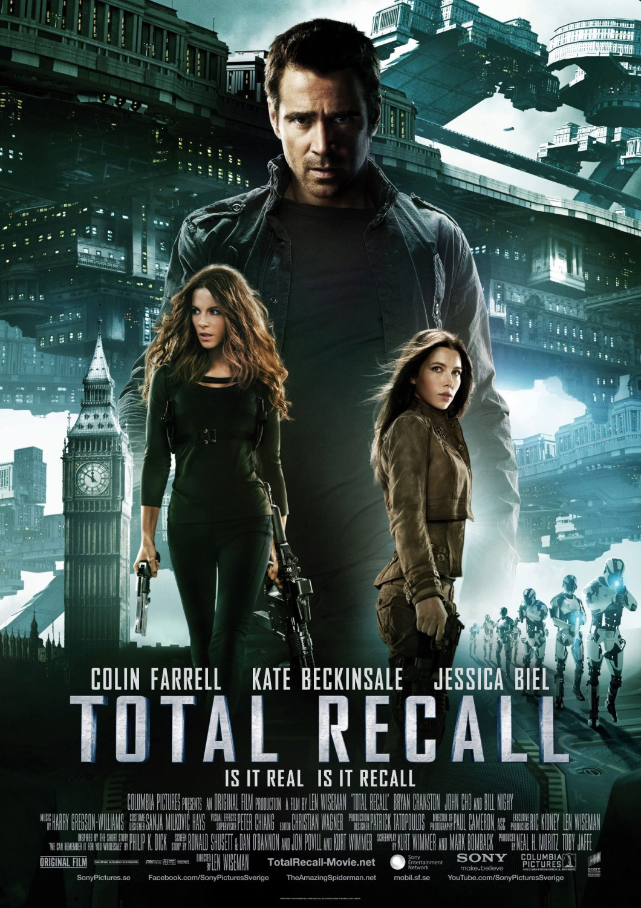
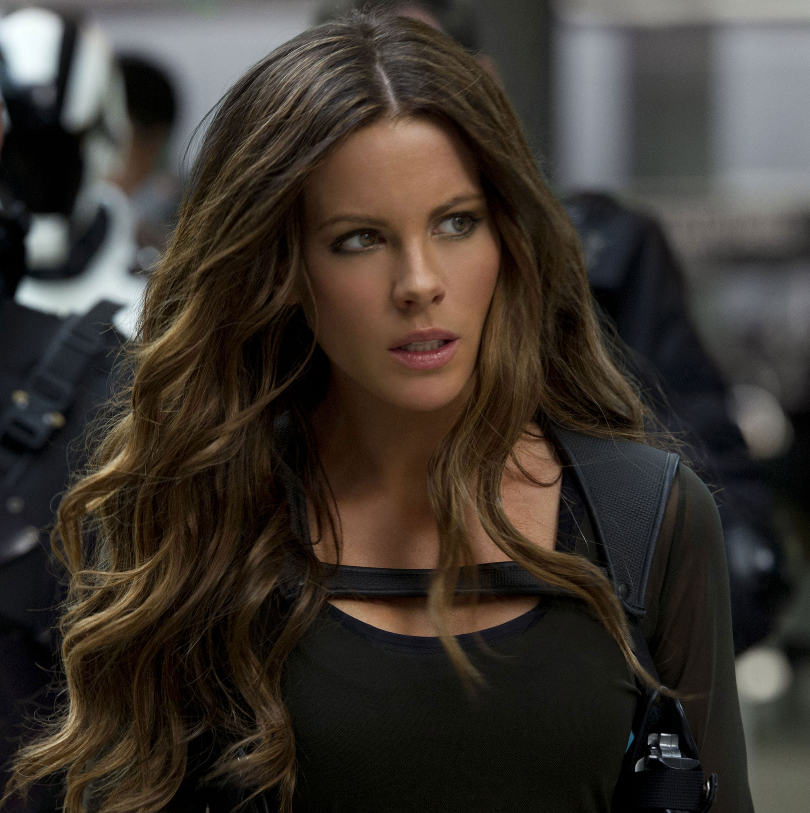
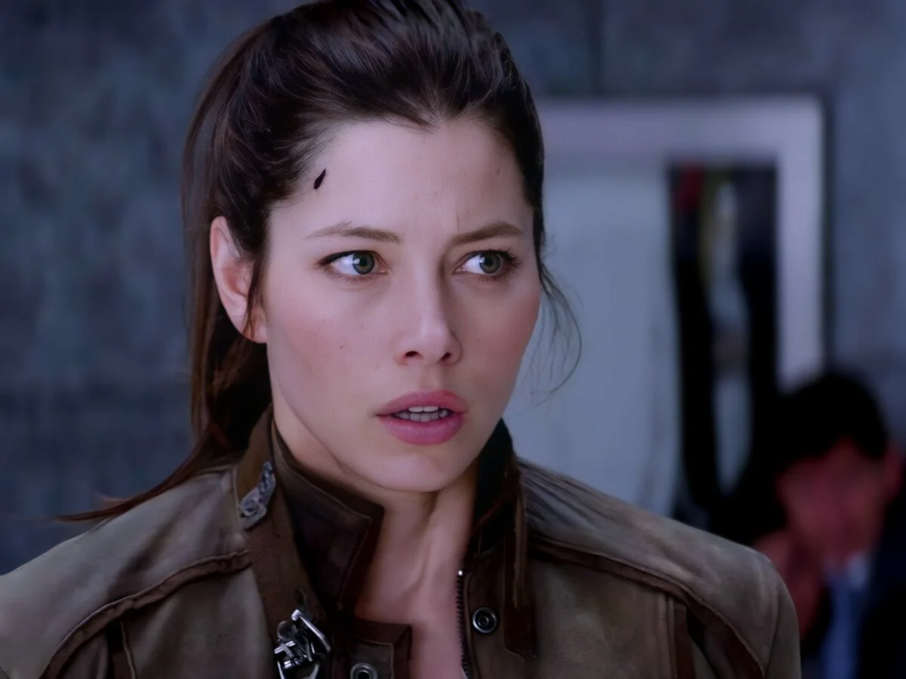

# 토탈 리콜(2012)이 말하는 진짜 메시지, 기억보다 중요한 선택

토탈 리콜(2012)은 꿈과 현실의 정답을 제시하는 영화가 아니라 **기억보다 선택이 인간의 정체성을 만든다는 철학적 메시지**를 중심에 둔 작품이다.  

많은 관객은 결말이 현실인지 리콜사의 가상현실인지에만 집중하지만, 영화는 그보다 훨씬 근본적인 질문을 던진다. "나는 과거의 기억으로 정의되는가, 아니면 지금 이 순간의 선택으로 정의되는가?"라는 질문이야말로 영화 전체를 관통하는 핵심 주제다.  

열린 결말 역시 정답을 숨기기 위한 장치가 아니라, 관객 스스로 인간의 정체성과 자유의지를 고민하도록 만들기 위한 연출이라고 볼 수 있다.

## 핵심 요약

* **토탈 리콜(2012)** 의 핵심은 꿈과 현실의 판별이 아니라 인간의 정체성에 대한 질문이다.
* 영화는 기억이 조작될 수 있다는 전제를 통해 인간을 정의하는 기준을 다시 묻는다.
* 주인공 퀘이드는 과거의 진실보다 현재 어떤 행동을 선택하는지가 더 중요하다는 결론에 도달한다.
* 열린 결말은 꿈과 현실 가운데 하나를 선택하라는 문제가 아니라 관객 스스로 현실의 의미를 생각하게 만드는 장치다.
* 리콜사는 단순한 SF 기술이 아니라 현대 사회가 소비하는 환상과 욕망을 상징하는 장치로 기능한다.
* 영화는 화려한 액션보다 자유의지와 정체성이라는 철학적 주제를 중심에 두고 전개된다.

## 1. 왜 토탈 리콜(2012)은 원작과 전혀 다른 분위기가 되었을까?

1990년 폴 버호벤 감독의 **토탈 리콜**은 화성을 배경으로 한 거대한 SF 액션과 정치 풍자가 중심이었다. 반면 2012년 렌 와이즈먼 감독은 화성을 완전히 삭제하고 하나의 황폐해진 지구만을 무대로 삼았다. 이 변화는 단순한 배경 수정이 아니라 작품이 말하고자 하는 주제를 바꾸기 위한 선택이었다.

영화 속 세계는 부유한 **UFB(United Federation of Britain)** 와 빈민들이 모여 사는 **콜로니(Colony)** 로 극단적으로 분리되어 있다. 사람들은 거대한 엘리베이터인 폴(Fall)을 통해 매일 출퇴근하며 노동력을 제공하고, 삶은 반복되는 일상과 계급 구조 속에 갇혀 있다. 이러한 설정은 우주 개척보다 현대 자본주의 사회의 계급 구조와 노동 시스템을 미래적으로 확장한 모습에 가깝다.

이처럼 현실 자체가 희망을 잃어버린 공간이 되었기 때문에 주인공 퀘이드는 현실을 바꾸기보다 잠시나마 다른 삶을 경험하기 위해 리콜사를 찾아간다. 바로 이 지점에서 영화는 액션 영화에서 철학 영화로 방향을 전환하기 시작한다.

## 2. 리콜사는 단순한 기억 판매 회사가 아니라 무엇을 상징하는가?

영화를 처음 보면 리콜사는 단순히 원하는 기억을 심어주는 첨단 기업처럼 보인다. 하지만 작품 전체를 살펴보면 **리콜사는 현대 사회가 상품으로 판매하는 '환상' 그 자체를 상징하는 장치**다. 현실이 만족스럽지 않을수록 사람들은 현실을 바꾸기보다 더 자극적이고 더 행복한 경험을 소비하려 한다. 감독은 이러한 현대인의 심리를 SF 기술이라는 형태로 시각화했다.

리콜사가 판매하는 것은 기억이 아니다. 엄밀히 말하면 **새로운 정체성을 체험하는 서비스**다. 고객은 단순히 여행을 가거나 휴식을 얻는 것이 아니라, 첩보원이나 영웅, 부자, 유명인처럼 평소에는 절대 될 수 없는 또 다른 자신을 경험한다. 현실에서는 노력과 시간이 필요한 삶을 돈으로 즉시 구매할 수 있다는 점에서, 리콜은 소비사회가 추구하는 즉각적인 만족을 극단적으로 표현한 결과물이라 할 수 있다.

현실을 견디기 어려울수록 리콜은 더욱 매력적인 상품이 된다. 퀘이드 역시 혁명을 꿈꾸거나 사회를 바꾸려는 사람이 아니었다. 그는 반복되는 공장 노동과 희망 없는 일상에서 잠시 벗어나고 싶었을 뿐이다. 감독은 이러한 설정을 통해 현대 사회에서 사람들이 현실을 바꾸기보다 오락과 소비를 통해 현실을 잊으려 하는 모습을 자연스럽게 떠올리게 만든다.

여기서 중요한 점은 영화가 리콜 자체를 악으로 규정하지 않는다는 것이다. 감독은 "환상은 나쁘다."라고 단정하지 않는다. 오히려 관객에게 질문을 던진다. **현실이 너무 고통스럽다면, 잠시라도 행복한 환상을 선택하는 것이 과연 잘못인가?** 작품은 이 질문에 명확한 답을 내리지 않는다. 대신 환상이 현실을 완전히 대체하는 순간 어떤 문제가 발생하는지를 이야기 속에서 보여준다.

이러한 구조는 현대 사회의 다양한 문화와도 연결된다.

* 게임 속 또 다른 자아
* SNS에서 연출된 이상적인 삶
* VR과 메타버스
* AI가 만들어 주는 이상적인 경험
* 숏폼 콘텐츠가 제공하는 끊임없는 자극

이들은 모두 현실 자체를 없애는 기술은 아니지만, 현실보다 더 강한 만족감을 제공한다는 공통점을 가진다. 감독은 리콜이라는 설정을 통해 기술이 발전할수록 인간은 현실보다 만족스러운 경험을 구매하게 될 가능성을 은유적으로 보여준다.

## 3. 영화가 끝까지 꿈과 현실을 확정하지 않는 이유는 무엇일까?

토탈 리콜(2012)을 둘러싼 가장 유명한 논쟁은 역시 마지막 결말이다. 세상을 구한 퀘이드가 팔을 바라보는 순간 리콜사에서 찍었던 스탬프가 사라져 있고, 이어서 거대한 리콜 광고가 등장하면서 영화는 막을 내린다. 이 장면 때문에 많은 관객은 "결국 모든 것이 리콜사의 프로그램이었다."라는 해석을 내놓는다.

하지만 영화는 동시에 반대 근거도 충분히 남겨 둔다.

* 격렬한 전투 과정에서 스탬프가 자연스럽게 지워졌을 가능성
* 퀘이드가 리콜 이전에는 알 수 없었던 인물과 사건들이 존재한다는 점
* 이야기 전체가 하나의 환상으로 보기에는 설명하기 어려운 요소들이 남아 있다는 점

즉 감독은 어느 한쪽 해석만이 정답이라고 말하지 않는다.

이러한 열린 결말은 단순히 관객을 혼란스럽게 만들기 위한 장치가 아니다. 오히려 영화의 핵심 질문과 직접 연결된다. 만약 감독이 "전부 꿈이었다." 또는 "모두 현실이었다."라고 확정해 버린다면 관객의 관심은 현실과 꿈을 맞히는 퍼즐에만 머물게 된다. 그러나 결말을 모호하게 남겨 두는 순간 질문은 완전히 달라진다.

**설령 그것이 꿈이었다고 해도, 퀘이드가 마지막에 내린 선택은 거짓이 되는가?**

바로 이 질문이 영화의 중심축이다.

감독은 현실과 환상의 경계를 일부러 흐리면서, 기억의 진위보다 **행동과 선택이 인간을 정의하는가**를 관객 스스로 고민하도록 만든다. 그래서 토탈 리콜(2012)의 열린 결말은 추리 문제가 아니라 철학적 질문이라고 이해하는 편이 작품의 구조를 가장 자연스럽게 설명한다.

## 4. 기억보다 선택이 중요한 이유는 무엇인가?

영화는 시작부터 끝까지 퀘이드의 과거를 추적하는 이야기처럼 보인다. 그는 자신이 평범한 공장 노동자인지, 과거 최고의 요원이었던 하우저(Hauser)인지 끊임없이 혼란을 겪는다. 기억을 잃어버린 주인공이 자신의 정체를 찾아가는 구조는 SF 장르에서 흔히 볼 수 있는 전개다. 그러나 토탈 리콜(2012)은 마지막에 이 구조를 의도적으로 뒤집는다.

영화가 정말 말하고 싶은 것은 "과거에 누구였는가?"가 아니라 **지금 누구로 살아가기를 선택하는가**이기 때문이다.

이를 가장 잘 보여주는 인물이 바로 하우저다. 하우저는 과거 코하겐을 위해 일했던 뛰어난 요원이었지만, 영화 속 퀘이드는 그와 전혀 다른 선택을 한다. 흥미로운 점은 두 사람이 같은 육체를 공유할 수도 있다는 사실이다. 기억이 같든 다르든, 같은 사람일 수도 있고 아닐 수도 있지만, 영화는 이러한 설정보다 **선택의 차이**를 더 중요하게 다룬다.

이를 정리하면 다음과 같다.

| 구분 | 하우저 | 퀘이드 |
| --- | --- | --- |
| 정체성 | 코하겐의 최고 요원 | 평범한 노동자로 살아감 |
| 가치관 | 체제 유지 | 자유와 해방 선택 |
| 행동 | 권력에 협력 | 사람들을 구하기 위해 행동 |
| 인간상 | 과거의 자신 | 현재 스스로 만든 자신 |

결국 영화는 같은 사람이라도 **선택이 달라지면 전혀 다른 인간이 될 수 있다**는 점을 강조한다.

이러한 관점은 현대 철학에서도 자주 등장한다. 인간은 과거의 기억만으로 정의되지 않으며, **현재 반복해서 내리는 선택과 행동을 통해 자신의 정체성을 형성**한다는 입장이다. 기억은 얼마든지 조작되거나 왜곡될 수 있지만, 지금 이 순간 어떤 행동을 하는가는 자신의 의지가 가장 직접적으로 드러나는 영역이다.

영화 후반부에서 퀘이드는 더 이상 과거의 진실에 집착하지 않는다. 자신이 하우저였는지, 아니면 처음부터 퀘이드였는지는 중요하지 않게 된다. 대신 지금 눈앞의 사람들을 구할 것인지, 독재 체제를 끝낼 것인지 스스로 결정한다. 이 순간부터 영화의 중심은 기억이 아니라 **자유의지와 선택**으로 이동한다.

따라서 영화 제목인 '토탈 리콜(Total Recall)'조차 역설적인 의미를 갖는다. 작품은 기억을 완벽하게 되찾는 이야기가 아니라, **기억이 완벽하지 않아도 인간은 자신의 선택으로 새로운 삶을 만들어 갈 수 있다는 사실**을 보여준다.

## 5. 감독이 관객에게 던진 진짜 질문은 무엇인가?

많은 관객은 영화가 끝난 뒤 "결국 꿈인가 현실인가?"를 두고 토론한다. 하지만 감독 입장에서 보면 이 질문은 오히려 부차적인 문제일 가능성이 크다. 열린 결말은 어느 한쪽 해석을 정답으로 만들기 위한 장치가 아니라, 관객의 시선을 더 본질적인 질문으로 옮기기 위한 장치이기 때문이다.

영화가 관객에게 던지는 질문은 크게 네 가지로 정리할 수 있다.

* 기억이 조작될 수 있다면 인간의 정체성은 무엇으로 결정되는가?
* 현실보다 행복한 환상이 존재한다면 우리는 그것을 거부할 수 있는가?
* 자유의지는 기억보다 더 중요한 가치인가?
* 행복한 거짓과 불편한 진실 가운데 무엇을 선택할 것인가?

이 질문들은 영화 속 이야기만을 위한 것이 아니다. 현대 사회에서도 충분히 적용할 수 있는 문제들이다. 오늘날 사람들은 SNS, 게임, 가상현실, 인공지능 등 다양한 기술을 통해 현실보다 더 매력적인 경험을 소비한다. 이러한 기술은 삶을 풍요롭게 만들기도 하지만, 동시에 현실을 외면하게 만드는 도피처가 될 가능성도 함께 가진다.

바로 이 지점에서 리콜사는 단순한 SF 설정을 넘어 현대 사회의 은유가 된다. 감독은 기술 자체를 비난하지 않는다. 또한 환상을 무조건 악으로 규정하지도 않는다. 대신 인간이 **환상을 소비하는 이유**와, 그 과정에서 무엇을 잃을 수 있는지를 조용히 질문한다.

그래서 토탈 리콜(2012)은 화려한 총격전과 추격전으로 기억되는 액션 영화이면서도, 그 이면에는 인간의 정체성과 자유의지, 현실과 환상의 관계를 탐구하는 철학적 작품으로 평가받는다. 영화가 끝난 뒤에도 오랫동안 결말을 두고 토론이 이어지는 이유 역시 바로 여기에 있다. 감독은 답을 제시하는 대신, 관객 각자가 자신의 삶을 기준으로 답을 찾기를 원했기 때문이다.

## 6. 현대 사회에서 토탈 리콜은 왜 여전히 유효한 질문을 던지는가?

1990년 작품이 냉전 시대와 기업 권력을 풍자했다면, 2012년 작품은 디지털 시대를 살아가는 현대인에게 더욱 가까운 질문을 던진다. 개봉 당시만 해도 영화 속 리콜은 먼 미래의 기술처럼 보였지만, 오늘날에는 생성형 AI, 가상현실(VR), 증강현실(AR), 메타버스, 초개인화 콘텐츠가 빠르게 발전하면서 영화가 상상했던 세계가 조금씩 현실에 가까워지고 있다.

물론 현재의 기술은 기억을 직접 주입하거나 새로운 인격을 만드는 수준에는 도달하지 못했다. 그러나 기술이 제공하는 경험의 방향은 분명히 비슷하다. 현실보다 더 강한 자극, 더 큰 만족감, 더 이상적인 자아를 끊임없이 소비하도록 만든다는 점에서 리콜사의 개념과 일정 부분 닮아 있다.

이를 비교하면 다음과 같다.

| 영화 속 리콜 | 현대 사회의 기술 |
| --- | --- |
| 원하는 삶을 기억으로 체험 | VR·AR을 통한 몰입형 경험 |
| 새로운 정체성을 구매 | 게임 아바타, 메타버스, 디지털 페르소나 |
| 즉각적인 만족감 | 숏폼 콘텐츠와 알고리즘 추천 |
| 현실보다 매력적인 경험 | AI가 생성하는 개인 맞춤형 콘텐츠 |
| 돈으로 환상을 소비 | 구독 서비스와 디지털 경험 경제 |

감독이 우려한 것은 기술 자체가 아니다. 인간은 오래전부터 현실보다 즐거운 경험을 만들어 왔고, 영화·소설·게임 역시 현실을 잠시 잊게 만드는 문화였다. 문제는 **환상이 현실을 보완하는 수준을 넘어 현실을 대체하기 시작할 때** 발생한다.

예를 들어 현실에서 이루기 어려운 성취를 모두 가상공간에서 경험할 수 있다면 현실의 노력은 점차 의미를 잃을 수도 있다. 인간관계 역시 현실보다 훨씬 만족스러운 가상 관계가 제공된다면 실제 관계를 유지하려는 동기는 약해질 수 있다. 이러한 변화는 단순히 개인의 취향 문제가 아니라 노동, 공동체, 가족, 사회 구조 전체에 영향을 미칠 가능성이 있다.

바로 이런 이유 때문에 토탈 리콜은 단순한 SF 액션 영화를 넘어 기술 발전이 인간의 삶을 어떻게 변화시킬 것인지에 대한 철학적 질문을 던지는 작품으로 계속 재평가되고 있다.

## 결론

토탈 리콜(2012)을 둘러싼 논쟁은 대부분 "결국 현실인가, 꿈인가?"라는 질문에서 출발한다. 하지만 영화 전체를 다시 살펴보면 감독이 정말 중요하게 생각한 것은 결말의 정답이 아니라 **그 질문 자체를 관객에게 남기는 과정**이었다.

기억은 얼마든지 조작될 수 있다. 기술은 인간이 경험하는 현실을 바꿀 수도 있다. 심지어 행복조차 상품처럼 판매되는 시대가 올지도 모른다. 그러나 영화는 이러한 변화 속에서도 인간을 끝까지 인간답게 만드는 요소가 무엇인지를 묻는다.

그 답으로 작품이 제시하는 것은 기억도, 출신도, 과거도 아니다. **지금 어떤 선택을 하는가**, 그리고 **그 선택에 어떤 책임을 지는가**가 인간의 정체성을 만든다는 점이다. 퀘이드가 누구였는지는 마지막에 더 이상 중요하지 않다. 중요한 것은 **그가 어떤 사람이 되기로 결정**했느냐다.

그래서 열린 결말 역시 현실과 환상 가운데 하나를 맞히기 위한 퍼즐이 아니다. 설령 모든 모험이 리콜사의 프로그램이었다고 가정하더라도, 퀘이드가 보여 준 용기와 희생, 그리고 타인을 위해 행동하려는 의지까지 모두 거짓이 되는 것은 아니다. 반대로 모든 일이 현실이었다고 해도 영화의 핵심 주제는 달라지지 않는다.

결국 **토탈 리콜(2012)** 은 관객에게 하나의 정답을 주는 작품이 아니라, 기술이 인간의 기억과 경험까지 바꿀 수 있는 시대에도 인간을 인간답게 만드는 마지막 기준은 무엇인지 스스로 생각하게 만드는 영화다. 바로 그 점 때문에 이 작품은 단순한 리메이크를 넘어, 현대 사회를 향한 철학적 질문으로 지금까지도 의미를 유지하고 있다.

## 자주 묻는 질문(FAQ)

### 토탈 리콜(2012)의 결말은 결국 꿈일까, 현실일까?

영화는 어느 한쪽을 정답으로 확정하지 않는다. 팔의 스탬프가 사라진 장면과 리콜 광고는 꿈이라는 해석을 가능하게 하지만, 반대로 현실이었다고 볼 수 있는 근거도 함께 남겨 둔다. 감독은 결말의 정답보다 **관객이 스스로 판단하도록 만드는 열린 결말**을 의도한 것으로 이해하는 것이 자연스럽다.

### 토탈 리콜(1990)과 2012년 리메이크의 가장 큰 차이점은 무엇인가?

1990년 작품은 화성을 배경으로 한 정치 풍자와 폭력적인 액션이 중심이다. 반면 2012년 작품은 화성을 삭제하고 하나의 지구를 무대로 삼아 계급 사회와 감시 체제, 그리고 인간의 정체성과 자유의지라는 철학적 질문을 더욱 강조한다. 같은 원작을 바탕으로 했지만 주제 의식은 상당히 다르다.

### 리콜사는 단순한 기억 주입 장치로만 봐야 할까?

영화 속에서는 기억을 심어주는 기업이지만, 상징적으로는 **돈으로 구매하는 환상과 욕망**을 의미한다. 현실보다 더 만족스러운 삶을 즉시 제공하는 기술이라는 점에서 **현대 사회의 디지털 콘텐츠와 경험 소비를 비판적**으로 비추는 장치로도 해석할 수 있다.

### 영화가 말하는 '기억보다 선택이 중요하다'는 의미는 무엇인가?

과거의 기억은 조작되거나 사라질 수 있지만, 현재 어떤 행동을 선택하는지는 자신의 의지에서 나온다. 영화는 인간의 정체성이 과거의 이력보다 **현재 반복하는 선택과 행동**을 통해 만들어진다는 점을 이야기한다. 그래서 퀘이드의 진짜 과거보다 마지막에 어떤 사람이 되기로 선택했는지가 더 중요하게 다뤄진다.

### 토탈 리콜(2012)은 기술 발전을 부정하는 영화인가?

그렇지는 않다. 영화는 기술 자체를 악으로 묘사하지 않는다. 오히려 기술이 인간에게 새로운 가능성을 제공하는 동시에, 현실을 외면하게 만들 위험성도 함께 가질 수 있음을 보여준다. 작품의 관심은 기술의 선악보다 **기술을 사용하는 인간의 선택과 책임**에 있다.