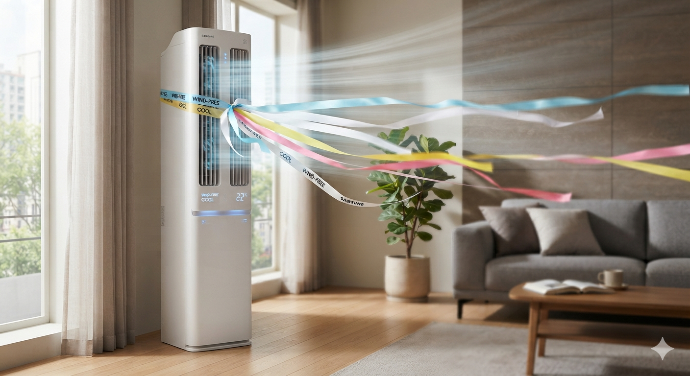

# 인버터 에어컨 전기세 절약하는 가장 효율적인 사용법

인버터 에어컨은 **목표 온도에 빠르게 도달한 뒤 낮은 출력으로 계속 유지하는 방식**이 가장 전기요금을 절약하는 운전 방법이다. 많은 사람들이 아직도 정속형 에어컨의 사용 습관대로 껐다 켰다를 반복하거나 제습 모드가 무조건 절전이라고 생각하지만, 실제 인버터 에어컨의 제어 방식은 이와 다르다. 전기요금을 결정하는 핵심은 작동 시간이 아니라 **실외기 컴프레서가 얼마나 강한 출력으로 얼마나 오래 동작하느냐**이며, 이 원리를 이해하면 냉방·제습·절전·취침 모드를 상황에 맞게 가장 효율적으로 사용할 수 있다.

## 핵심 요약

* **인버터 에어컨은 목표 온도에 도달해도 꺼지지 않고 저출력으로 유지 운전한다.**
* 전기요금은 실내기 바람보다 **실외기 컴프레서 출력**이 대부분 결정한다.
* 처음에는 **낮은 설정 온도와 강풍**으로 빠르게 냉방한 뒤 유지 온도로 올리는 것이 가장 효율적이다.
* 집이 이미 시원한 상태에서는 **계속 켜두는 편이 껐다 켜는 것보다 유리한 경우가 많다.**
* 제습 모드는 절전 기능이 아니라 **습도 제거 기능**이며 항상 전기요금이 적게 나오는 것은 아니다.
* 절전모드와 취침모드는 목적이 서로 다르므로 상황에 맞게 선택해야 한다.

## 1. 왜 아직도 에어컨 사용법이 헷갈릴까?

에어컨 사용법에 대한 정보는 인터넷에도 매우 많지만 서로 다른 설명이 동시에 존재한다. 가장 큰 이유는 **정속형 에어컨과 인버터 에어컨의 작동 원리를 혼동하기 때문**이다.

과거 정속형 에어컨은 설정 온도에 도달하면 실외기가 완전히 멈췄다가 다시 온도가 올라가면 최고 출력으로 재가동하는 구조였다. 그래서 일정 시간이 지나면 전원을 끄거나, 자주 껐다 켰다 하는 방법이 어느 정도 합리적인 선택이 되기도 했다.

하지만 현재 판매되는 대부분의 가정용 에어컨은 **인버터 방식**이다. 인버터는 컴프레서 회전수를 자유롭게 조절할 수 있기 때문에 목표 온도에 가까워질수록 출력을 점차 줄여 최소한의 전력만 사용하며 실내 온도를 유지한다.

즉, 지금의 인버터 에어컨은 "켜짐과 꺼짐"이 아니라 **출력의 크기**를 제어하는 기계라고 이해하는 것이 맞다.

## 2. 인버터 에어컨은 목표 온도에 도달하면 어떻게 작동할까?

가장 많이 하는 오해는 설정 온도에 도달하면 실외기가 완전히 멈춘다고 생각하는 것이다.

실제로는 그렇지 않다.

실외기는 목표 온도에 가까워질수록 컴프레서 회전수를 크게 낮춘다. 외부에서 창문, 벽, 천장 등을 통해 계속 유입되는 열을 상쇄하기 위해 필요한 만큼만 냉매를 순환시키며 **유지 운전**을 수행한다.

여기서 중요한 점은 다음과 같다.

* 실외기는 대부분 계속 작동한다.
* 하지만 최대 출력이 아니라 최소 출력으로 운전한다.
* 유지 단계에서는 소비전력이 초기 냉방보다 크게 감소한다.
* 인버터의 장점은 이 저출력 운전에 있다.

예를 들어 한여름 외부 기온이 35℃인 상황에서도 실내를 27℃로 유지한다면 실외기는 완전히 쉬는 것이 아니라 필요한 만큼만 압축기를 천천히 돌리며 열 유입을 계속 상쇄한다.

따라서 **실외기가 계속 돌아간다는 사실 자체만으로 전기를 많이 소비한다고 판단해서는 안 된다.**

## 3. 전기요금은 '켜져 있는 시간'보다 컴프레서 출력이 결정한다

많은 사람들이 전기요금은 켜져 있는 시간에 비례한다고 생각한다.

하지만 인버터 에어컨에서는 **컴프레서 출력**이 훨씬 더 중요하다.

냉방에 사용되는 전력 대부분은 실외기 안의 컴프레서가 소비하며, 실내기의 송풍팬은 선풍기와 비슷한 수준의 전력만 사용한다.

다음 표를 보면 이해하기 쉽다.

| 항목       | 전기요금 영향 | 설명                           |
| -------- | ------: | ---------------------------- |
| 실외기 컴프레서 |    매우 큼 | 냉매를 압축하며 대부분의 전력을 소비         |
| 실내기 송풍팬  |   매우 작음 | 풍량 변화에 따른 전력 차이는 크지 않음       |
| 설정 온도    |    매우 큼 | 목표 온도가 낮을수록 고출력 운전 시간이 길어짐   |
| 풍량       |      작음 | 냉방 속도에는 영향을 주지만 소비전력 차이는 제한적 |

자동차로 비유하면 이해하기 쉽다.

* 최고 출력으로 계속 가속하는 차량은 연료를 많이 사용한다.
* 일정한 속도로 정속 주행하는 차량은 연료 소비가 크게 줄어든다.

인버터 에어컨도 동일한 원리다.

처음에는 강하게 냉방하더라도 가능한 한 빨리 목표 온도에 도달한 뒤 **저출력 유지 운전**으로 전환되는 것이 전체 전력 소비를 줄이는 핵심이다.

다음 편에서는 이 원리를 바탕으로 **처음 에어컨을 켤 때 가장 효율적인 온도와 풍량 설정**, 그리고 왜 **강풍이 오히려 전기요금을 절약하는지**를 구체적인 근거와 함께 살펴본다.

## 4. 처음에는 왜 낮은 온도와 강풍으로 시작해야 할까?

인버터 에어컨을 가장 효율적으로 사용하는 방법은 **실내를 가능한 한 빨리 목표 온도까지 냉각시키는 것**이다. 이 과정에서 가장 효과적인 설정은 처음 20분 정도를 **22℃ 에서 24℃ 강풍**으로 운전하는 것이다.

많은 사람들이 전기요금을 걱정해 처음부터 26~27℃로 설정하거나 약풍으로 운전하지만, 오히려 이런 방식은 실내 온도가 천천히 내려가면서 실외기가 중간 이상의 출력을 오랫동안 유지하게 만든다.

반대로 처음에는 충분한 출력으로 실내의 열을 빠르게 제거한 뒤, 시원해졌다고 느껴지는 순간 **26~27℃의 유지 온도**로 변경하면 인버터 제어가 빠르게 저출력 구간으로 진입한다.

결국 중요한 것은 처음 사용하는 전력이 아니라 **고출력으로 운전하는 총시간을 얼마나 줄이느냐**이다.

다음 표는 두 가지 운전 방식을 비교한 것이다.

| 운전 방법                | 초기 냉방 속도 | 고출력 운전 시간 | 전체 효율 |
| -------------------- | -------: | --------: | ----: |
| 23℃ + 강풍 → 26~27℃ 유지 |    매우 빠름 |        짧음 | ★★★★★ |
| 처음부터 26℃ + 약풍        |       느림 |       길어짐 | ★★★☆☆ |
| 처음부터 절전모드            |    매우 느림 |   길어질 가능성 | ★★☆☆☆ |

즉, **처음에는 강하게, 이후에는 약하게**가 인버터 에어컨의 가장 기본적인 절전 원리다.

## 5. 풍량을 강하게 하면 전기요금이 많이 나올까?

결론부터 말하면 **거의 그렇지 않다.**

에어컨 소비전력의 대부분은 실외기의 컴프레서가 사용한다. 반면 실내기의 송풍팬은 일반적인 선풍기와 비슷한 수준의 전력만 사용한다.

즉,

* 강풍으로 바꾼다고 실외기 출력이 크게 증가하는 것은 아니다.
* 풍량을 낮춘다고 전기요금이 눈에 띄게 감소하지도 않는다.
* 오히려 강풍은 냉기를 집안 전체로 빠르게 순환시켜 실외기의 고출력 운전 시간을 줄이는 효과가 있다.

다음 표를 보면 이해하기 쉽다.

| 항목 | 전력 영향 | 냉방 효율 |
| -- | ----: | ----: |
| 강풍 | 매우 작음 | 매우 높음 |
| 중풍 | 매우 작음 |    높음 |
| 약풍 | 매우 작음 |    낮음 |

따라서 **냉방 초기에는 강풍을 사용하는 것이 훨씬 효율적**이다.

다만 집이 이미 충분히 시원해진 **유지 단계**에서는 이야기가 조금 달라진다.

## 6. 집이 시원해진 후에는 풍량을 줄여도 될까?

그렇다.

이미 설정 온도에 도달하여 인버터가 저출력 유지 운전에 들어갔다면 풍량을 약풍이나 중풍으로 변경해도 큰 문제가 없다.

이 시점에서는 실내 전체가 이미 냉각되어 있기 때문에 강풍이 반드시 필요한 상황이 아니다.

유지 단계에서는 다음과 같이 사용하는 것이 일반적으로 가장 효율적이다.

* 설정 온도 26~27℃
* 풍량 중풍 또는 약풍
* 선풍기 또는 서큘레이터 병행

풍량을 줄인다고 전기요금이 크게 절약되는 것은 아니지만 실내기 팬의 소비전력이 약간 감소하고 소음도 줄어든다.

따라서 **초기 냉방 단계와 유지 단계는 서로 다른 운전 전략**을 사용하는 것이 좋다.

| 단계    |       권장 온도 |    권장 풍량 | 목적          |
| ----- | ----------: | -------: | ----------- |
| 초기 냉방 |      22~24℃ |       강풍 | 빠른 목표 온도 도달 |
| 유지 운전 |      26~27℃ | 약풍 또는 중풍 | 저출력 유지 운전   |
| 취침    | 26℃ 또는 취침모드 |       미풍 | 소음 감소 및 절전  |

## 7. 설정 온도를 1℃만 올려도 전기요금이 줄어드는 이유

설정 온도가 낮아질수록 에어컨은 목표 온도에 도달하기 위해 더 오랜 시간 높은 출력을 유지한다.

예를 들어 외부 기온이 35℃인 상황에서 실내를 22℃까지 유지하려면 실외기는 끊임없이 유입되는 열을 제거해야 한다.

반면 27℃는 외부와의 온도 차이가 작기 때문에 목표 온도에 훨씬 쉽게 도달하며, 인버터는 곧바로 **최소 출력 유지 운전**으로 전환할 수 있다.

그래서 제조사와 정부의 에너지 절약 안내에서도 일반적으로 **설정 온도를 1℃ 높이면 냉방 에너지를 약 7~10% 절감할 수 있다**고 안내한다.

물론 정확한 절감률은 다음 조건에 따라 달라진다.

* 외부 기온
* 단열 성능
* 실내 면적
* 에어컨 용량
* 운전 시간

따라서 **7~10%는 평균적인 안내 수치**로 이해하는 것이 적절하다.

다음 편에서는 **26℃로 계속 켜두는 것이 정말 껐다 켰다 하는 것보다 유리한지**, **90분 이상 외출 시 전원을 끄는 것이 왜 권장되는지**, 그리고 **제습 모드가 절전이라는 대표적인 오해**까지 실제 작동 원리를 중심으로 자세히 살펴본다.

## 8. 집이 시원해졌다면 계속 켜두는 것이 유리할까?

인버터 에어컨이라면 대부분의 경우 **계속 켜두는 편이 유리하다.**

이 말은 하루 종일 무조건 켜라는 뜻이 아니라, **이미 설정 온도에 도달한 상태에서 짧은 외출이나 잠시 덥지 않은 상황이라면 굳이 전원을 끌 필요가 없다는 의미**다.

그 이유는 인버터 제어 방식 때문이다.

설정 온도에 도달한 이후에는 실외기가 최소 출력으로 온도만 유지한다. 이 상태에서는 소비전력이 크게 감소한다.

하지만 전원을 끄면 실내는 다시 외부 열을 흡수하기 시작한다.

* 벽
* 바닥
* 천장
* 창문
* 가구

이 모든 것이 다시 뜨거워지고, 재가동 시에는 에어컨이 처음과 같은 고출력 냉방을 반복해야 한다.

즉, 인버터 에어컨은 **낮은 출력으로 오래 유지하는 것보다 높은 출력으로 여러 번 재가동하는 것이 더 비효율적**인 경우가 많다.

다음 표를 보면 이해하기 쉽다.

| 사용 방법       | 실외기 상태    |  전기효율 |
| ----------- | --------- | ----: |
| 설정 온도 유지    | 저출력 유지 운전 | ★★★★★ |
| 자주 껐다 켜기    | 최고 출력 반복  | ★★☆☆☆ |
| 더워질 때마다 재가동 | 최고 출력 반복  | ★☆☆☆☆ |

따라서 인버터 에어컨에서는 **유지 운전 자체를 두려워할 필요가 없다.**

## 9. 그렇다면 언제는 전원을 끄는 것이 좋을까?

계속 켜두는 것이 항상 정답은 아니다.

실내 온도가 충분히 유지될 만큼 짧은 외출이라면 그대로 두는 것이 유리하지만, 외출 시간이 길어질 경우에는 이야기가 달라진다.

국내 제조사의 실험과 안내에서는 일반적으로 **약 90분 이상 외출하는 경우에는 전원을 끄는 것이 유리할 수 있다**고 설명한다.

이 기준이 절대적인 것은 아니다.

다음 조건에 따라 결과는 달라질 수 있다.

* 외부 기온
* 단열 성능
* 실내 크기
* 에어컨 용량
* 일사량
* 귀가 시점

즉, **90분은 절대적인 기준이 아니라 실험에서 제시하는 일반적인 판단 기준**으로 이해하는 것이 맞다.

현재까지 공개된 제조사 자료는 "90분 정도를 경계로 끄는 것이 유리한 경우가 많다"는 수준의 안내이며,

> **'12시간 연속 운전 중 90분 외출 시 계속 켜두는 경우와 완전히 끄는 경우를 비교한 객관적인 통합 데이터'는 공개되어 있지 않다.**

따라서 이를 절대 법칙처럼 적용하는 것은 적절하지 않다.

실제로는 다음처럼 이해하는 것이 가장 현실적이다.

| 외출 시간  | 권장 방법        |
| ------ | ------------ |
| 30분 이내 | 계속 운전        |
| 30~90분 | 상황에 따라 유지 가능 |
| 90분 이상 | 전원 OFF 권장    |
| 반나절 이상 | 반드시 OFF      |

이처럼 **외출 시간이 길어질수록 실내 전체가 다시 가열되기 때문에 재냉방보다 전원을 끄는 편이 유리해질 가능성이 높다.**

## 10. 제습 모드가 전기요금을 가장 아낀다는 말은 사실일까?

가장 많이 알려진 에어컨 상식 가운데 하나가 **제습 모드가 냉방보다 전기요금이 적게 나온다**는 이야기다.

그러나 이는 일반화하기 어려운 내용이다.

제습 역시 냉방과 동일하게 **컴프레서를 이용하여 냉각핀을 차갑게 만드는 과정**이 필요하다.

실내 공기의 수분은 차가운 냉각핀에 응축되어 물이 되고, 이 물이 배수관으로 빠져나가는 것이 제습의 기본 원리다.

즉,

* 냉방도 컴프레서를 사용한다.
* 제습도 컴프레서를 사용한다.
* 따라서 **제습이라고 해서 무조건 소비전력이 적어지는 것은 아니다.**

## 11. 제습이 오히려 전기를 더 사용할 수도 있는 이유

제습 모드는 제조사마다 제어 방식이 다르다.

일부 제품은 냉방과 거의 동일하게 운전하지만,

일부 제품은 습도를 우선적으로 낮추기 위해 실내 온도와 관계없이 컴프레서를 오래 운전하기도 한다.

또한 제습 모드는 송풍량을 약하게 제한하는 경우가 많다.

바람이 약하면 냉기가 집안 전체로 퍼지는 속도가 느려지고,

결국 실외기가 높은 출력으로 운전하는 시간이 길어질 수도 있다.

다음 표는 두 모드의 차이를 정리한 것이다.

| 항목      | 일반 냉방   | 제습              |
| ------- | ------- | --------------- |
| 목적      | 온도 낮춤   | 습도 제거           |
| 컴프레서 사용 | O       | O               |
| 냉각핀 사용  | O       | O               |
| 송풍량     | 자유롭게 조절 | 약풍으로 제한되는 경우 존재 |
| 절전 보장   | X       | X               |

즉, **제습은 절전 모드가 아니라 습도 관리 모드**라고 이해하는 것이 맞다.

비가 많이 오는 장마철처럼 습도가 매우 높을 때는 제습이 쾌적함을 크게 높여주지만, 폭염 속에서 단순히 전기요금을 줄이기 위해 제습만 사용하는 것은 반드시 효율적이라고 말하기 어렵다.

다음 편에서는 **절전 모드와 취침(열대야) 모드의 실제 차이**, **제습기를 함께 사용할 때 가장 효율적인 방법**, 그리고 **시간대별 최적 운전 루틴**을 표와 함께 종합적으로 정리한다.

## 12. 절전 모드와 취침(열대야) 모드는 무엇이 다를까?

절전 모드와 취침(열대야) 모드는 모두 전력 소비를 줄이기 위한 기능처럼 보이지만, **작동 방식과 목적은 서로 다르다.**

절전 모드는 에어컨이 사용할 수 있는 **최대 냉방 출력 자체를 제한**하는 기능에 가깝다. 반면 취침(열대야) 모드는 사람이 잠드는 동안 체온 변화에 맞춰 **설정 온도와 풍량을 자동으로 조절**하는 기능이다.

따라서 두 기능은 서로 경쟁 관계가 아니라 사용하는 시간이 다르다.

| 구분    | 절전 모드    | 취침(열대야) 모드    |
| ----- | -------- | ------------- |
| 목적    | 전력 피크 억제 | 숙면과 절전        |
| 출력 제어 | 최대 출력 제한 | 자동 온도 조절      |
| 설정 온도 | 사용자가 유지  | 시간이 지나며 자동 상승 |
| 풍량    | 일반 또는 자동 | 미풍·무풍 위주      |
| 추천 시간 | 낮·저녁     | 취침 시간         |

## 13. 절전 모드는 언제 사용하는 것이 가장 효율적일까?

절전 모드는 처음부터 사용하는 것보다 **이미 실내가 충분히 시원해진 이후** 사용하는 편이 효율적이다.

그 이유는 절전 모드가 실외기 출력을 제한하기 때문이다.

예를 들어 한낮 폭염에 처음부터 절전 모드를 켜면 실외기가 충분한 냉방 능력을 사용하지 못해 목표 온도까지 도달하는 시간이 길어진다.

결국

* 냉방 시간은 길어지고
* 쾌적함은 늦게 찾아오며
* 중간 출력 운전 시간이 늘어날 수 있다.

반대로 이미 26℃ 정도까지 냉방이 완료된 상태라면 절전 모드는 불필요한 순간 최대 출력을 억제하면서 안정적으로 온도를 유지하는 데 도움이 된다.

따라서 일반적인 사용 순서는 다음과 같다.

1. 일반 냉방
2. 낮은 설정 온도 + 강풍
3. 목표 온도 도달
4. 26~27℃ 유지
5. 필요하면 절전 모드 사용

이 순서가 인버터 제어 방식과 가장 잘 맞는다.

## 14. 취침(열대야) 모드는 왜 밤에 가장 효율적일까?

취침 모드는 절전 모드와 달리 **사람의 수면 패턴**을 고려하여 설계된 기능이다.

사람은 잠이 들면 활동량과 대사량이 감소하면서 체온도 서서히 내려간다.

반면 밤이 깊어질수록 외부 기온도 함께 낮아진다.

취침 모드는 이러한 변화를 고려하여

* 처음에는 설정 온도를 유지하고
* 시간이 지나면서 목표 온도를 1~2℃ 정도 높이며
* 풍량도 점차 줄여 나간다.

즉,

사람이 추위를 느끼기 쉬운 새벽에는 냉방 강도를 자연스럽게 줄여 **쾌적함과 절전을 동시에 달성**하도록 설계되어 있다.

다만 중요한 점도 있다.

취침 모드의 세부 알고리즘은 제조사마다 다르다.

일부 제품은

* 자동 종료

기능을 제공하고,

일부는

* 송풍으로 전환

하기도 하며,

또 다른 제품은

* 계속 운전하면서 온도만 변경

하기도 한다.

따라서 **세부 동작은 반드시 해당 제조사의 사용설명서를 기준으로 확인해야 한다.**

## 15. 제습기가 있다면 에어컨과 어떻게 함께 사용하는 것이 좋을까?

제습기와 에어컨은 경쟁하는 제품이 아니라 서로 보완하는 제품이다.

다만 같은 공간에서 동시에 사용하는 것은 효율이 떨어질 수 있다.

제습기는 실내의 수분을 제거하는 과정에서 응축 열을 방출하기 때문에 **주변 공기를 약간 따뜻하게 만든다.**

따라서 거실에서 에어컨을 사용하는 동안 같은 공간에서 제습기를 계속 가동하면 에어컨이 그 열까지 다시 제거해야 한다.

보다 효율적인 방법은 다음과 같다.

* 드레스룸
* 빨래 건조실
* 욕실 앞
* 습기가 많은 작은 방

처럼 습기가 집중되는 공간에서 제습기를 운전하는 것이다.

이렇게 하면 집 전체의 평균 습도가 낮아지고, 거실 에어컨은 온도 유지에만 집중할 수 있어 전체적인 쾌적성이 향상된다.

다음 표는 가장 효율적인 조합을 정리한 것이다.

| 상황           | 권장 방법              |
| ------------ | ------------------ |
| 거실 냉방        | 에어컨 + 선풍기 또는 서큘레이터 |
| 장마철 빨래       | 제습기 단독             |
| 드레스룸         | 제습기                |
| 외출 중 장마철     | 제습기 예약 운전          |
| 거실과 옷방 동시 관리 | 거실 에어컨 + 다른 방 제습기  |

## 16. 시간대별 가장 효율적인 운전 루틴은 무엇일까?

지금까지 설명한 원리를 종합하면 인버터 에어컨은 하루 동안 다음과 같이 운전하는 것이 가장 효율적이다.

| 시간대       | 권장 설정              | 목적            |
| --------- | ------------------ | ------------- |
| 오전 10~11시 | 일반 냉방 23℃ + 강풍     | 실내 열기 신속 제거   |
| 오전~저녁     | 일반 냉방 26~27℃ + 선풍기 | 저출력 유지 운전     |
| 짧은 외출     | 계속 운전              | 재냉방 방지        |
| 90분 이상 외출 | 전원 OFF             | 불필요한 유지 운전 방지 |
| 저녁        | 필요 시 절전 모드         | 순간 고출력 억제     |
| 취침        | 취침(열대야) 모드         | 자동 절전 및 숙면    |

이 운전 순서는 **인버터 에어컨의 제어 원리**와 가장 잘 맞는다.

처음에는 빠르게 냉방하고, 이후에는 유지 운전으로 전환하며, 밤에는 취침 모드를 활용하는 것이 전체 전력 소비를 줄이면서도 쾌적함을 유지하는 가장 합리적인 방법이다.

다음 편에서는 지금까지의 내용을 모두 종합하여 **상황별 최종 사용 가이드**, **핵심 비교표**, **결론**, **FAQ**를 정리한다.

## 결론

**인버터 에어컨은 가능한 한 빨리 목표 온도에 도달한 뒤, 낮은 출력으로 계속 유지하도록 설계된 제품이다.** 따라서 전기요금을 줄이는 핵심은 운전 시간을 무조건 줄이는 것이 아니라 **컴프레서가 최고 출력으로 운전하는 시간을 얼마나 줄이느냐**에 있다.

가장 효율적인 방법은 처음에는 **22~24℃와 강풍**으로 실내의 축적된 열을 빠르게 제거하고, 충분히 시원해지면 **26~27℃**로 설정 온도를 올려 유지 운전에 들어가는 것이다. 이때 선풍기나 서큘레이터를 함께 사용하면 체감온도는 더욱 낮아지며, 에어컨은 더 낮은 출력으로도 같은 쾌적함을 유지할 수 있다.

**짧은 외출이라면 전원을 끄기보다 유지 운전을 지속하는 편이 유리한 경우가 많다.** 반대로 장시간 외출에서는 유지 운전에 사용되는 전력보다 재냉방에 필요한 전력이 더 적어질 수 있으므로 전원을 끄는 것이 합리적이다. 다만 흔히 알려진 **90분 기준은 제조사 실험에서 제시하는 일반적인 기준일 뿐 절대적인 기준은 아니며**, 주택 단열 성능, 외기 온도, 실내 면적, 일사량 등에 따라 결과는 달라질 수 있다.

또한 **제습 모드는 절전 모드가 아니다.** 냉방과 동일하게 컴프레서를 사용하는 만큼 항상 전기요금이 적게 나오는 것은 아니며, 습도가 매우 높은 환경에서 쾌적함을 높이기 위한 기능으로 이해하는 것이 맞다. 제습기가 있다면 같은 공간보다 **다른 방에서 병행 운전**하는 것이 전체적인 냉방 효율을 높인다.

절전 모드와 취침(열대야) 모드는 목적도 다르다. 절전 모드는 **최대 출력을 제한**하여 순간적인 전력 소비를 억제하는 기능이고, 취침 모드는 **수면 중 체온 변화에 맞추어 온도와 풍량을 자동으로 조절**하는 기능이다. 따라서 낮에는 일반 냉방 또는 필요 시 절전 모드, 밤에는 취침 모드를 사용하는 것이 각각의 기능을 가장 효율적으로 활용하는 방법이다.

## 상황별 최종 사용 가이드

| 상황               | 가장 권장되는 설정       | 이유                               |
| ---------------- | ---------------- | -------------------------------- |
| 처음 에어컨을 켤 때      | **22~24℃ + 강풍**  | 실내 열기를 가장 빠르게 제거하여 고출력 운전 시간을 단축 |
| 충분히 시원해진 후       | **26~27℃ 유지**    | 인버터 저출력 유지 운전 진입                 |
| 유지 단계            | **중풍 또는 약풍**     | 소음 감소, 충분한 공기 순환                 |
| 체감온도를 더 낮추고 싶을 때 | **선풍기·서큘레이터 병행** | 동일한 설정 온도로도 더욱 시원하게 체감           |
| 30~90분 이내 짧은 외출  | 계속 운전 고려         | 재냉방보다 유지 운전이 유리한 경우가 많음          |
| 90분 이상 장시간 외출    | 전원 OFF 권장        | 유지 운전보다 재가동이 유리해질 가능성 증가         |
| 장마철              | 필요 시 제습 모드       | 절전이 아닌 습도 관리 목적                  |
| 밤 취침             | 취침(열대야) 모드       | 자동 온도 상승으로 숙면과 절전 동시 달성          |

## 에어컨 기능별 추천 사용법

| 기능         | 추천 상황      |  전기효율 |
| ---------- | ---------- | ----: |
| 일반 냉방      | 대부분의 상황    | ★★★★★ |
| 절전 모드      | 이미 시원해진 이후 | ★★★★☆ |
| 취침(열대야) 모드 | 수면 시간      | ★★★★★ |
| 제습 모드      | 장마철, 높은 습도 | ★★★☆☆ |
| 강풍         | 초기 냉방      | ★★★★★ |
| 약풍         | 유지 운전      | ★★★★☆ |

## 가장 효율적인 하루 운전 루틴

| 시간         | 권장 설정           |
| ---------- | --------------- |
| 오전 10~11시  | 일반 냉방 23℃ + 강풍  |
| 실내가 시원해진 후 | 일반 냉방 26~27℃    |
| 오후~저녁      | 26~27℃ 유지 + 선풍기 |
| 저녁 이후      | 필요 시 절전 모드      |
| 취침 직전      | 취침(열대야) 모드      |

## 전기요금을 줄이는 핵심 원칙

* **에어컨은 바람의 온도가 아니라 설정 온도를 기준으로 제어한다.**
* **전기요금은 실외기 컴프레서 출력이 대부분 결정한다.**
* **처음에는 강하게, 이후에는 약하게 운전하는 것이 가장 효율적이다.**
* **설정 온도를 1℃ 높이면 평균적으로 냉방 에너지를 약 7~10% 절감할 수 있다.**
* **풍량은 전기요금보다 냉방 속도에 더 큰 영향을 준다.**
* **짧은 외출에서는 유지 운전이 유리할 수 있지만, 장시간 외출에서는 전원을 끄는 편이 좋다.**
* **제습 모드는 절전 기능이 아니라 습도 관리 기능이다.**
* **제습기가 있다면 에어컨과 같은 공간보다 다른 공간에서 사용하는 것이 효율적이다.**
* **절전 모드는 낮, 취침 모드는 밤에 사용하는 것이 각각의 목적에 가장 잘 맞는다.**

## 자주 묻는 질문(FAQ)

### 처음부터 26~27℃로 켜는 것이 더 절전 아닌가?

그렇지 않다. 처음에는 실내의 축적된 열을 빠르게 제거하는 것이 중요하다. 낮은 설정 온도와 강풍으로 목표 온도에 빨리 도달한 뒤 26~27℃로 변경하는 편이 고출력 운전 시간을 줄여 전체 효율이 높아지는 경우가 많다.

### 풍량을 강풍으로 하면 전기요금이 많이 증가하지 않을까?

거의 그렇지 않다. 소비전력 대부분은 실외기의 컴프레서가 사용하며, 실내기 송풍팬의 소비전력은 상대적으로 매우 작다. 초기 냉방에서는 강풍이 오히려 효율적이다.

### 제습 모드가 냉방보다 항상 전기요금이 적게 나오나?

아니다. 제습도 컴프레서를 사용하며 제조사마다 제어 방식이 다르다. 따라서 제습이 항상 냉방보다 절전이라고 일반화할 수는 없다.

### 절전 모드를 하루 종일 사용하는 것이 가장 좋을까?

권장하기 어렵다. 절전 모드는 이미 시원해진 상태에서 사용하는 것이 효과적이며, 처음부터 사용하면 목표 온도까지 도달하는 시간이 길어질 수 있다.

### 인버터 에어컨을 가장 효율적으로 사용하는 한 문장으로 정리하면?

**처음에는 강하게 냉방하고, 목표 온도에 도달하면 26~27℃에서 저출력 유지 운전을 계속하는 것이 인버터 에어컨의 특성을 가장 잘 활용하는 방법이다.**
