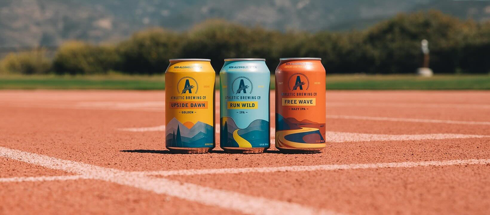
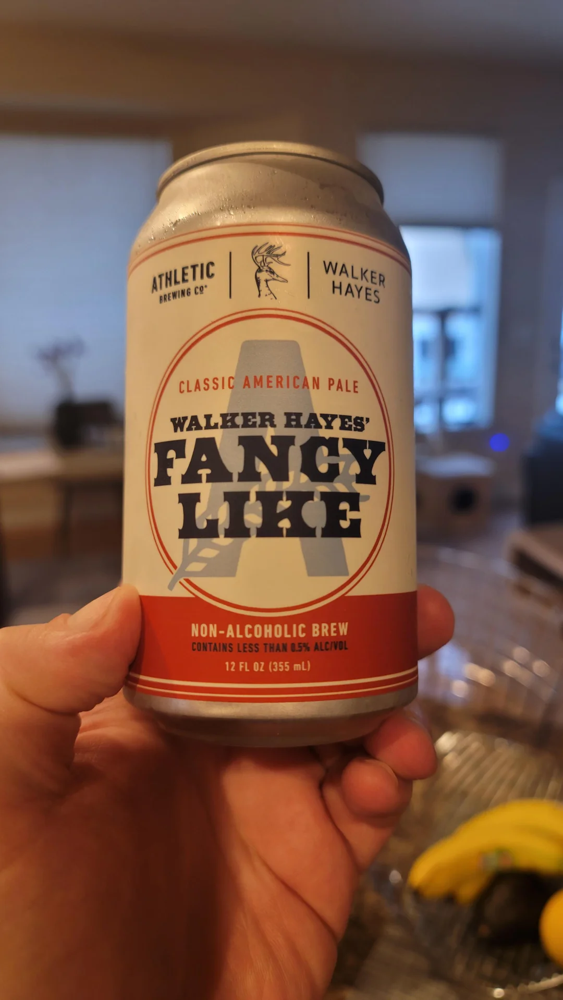
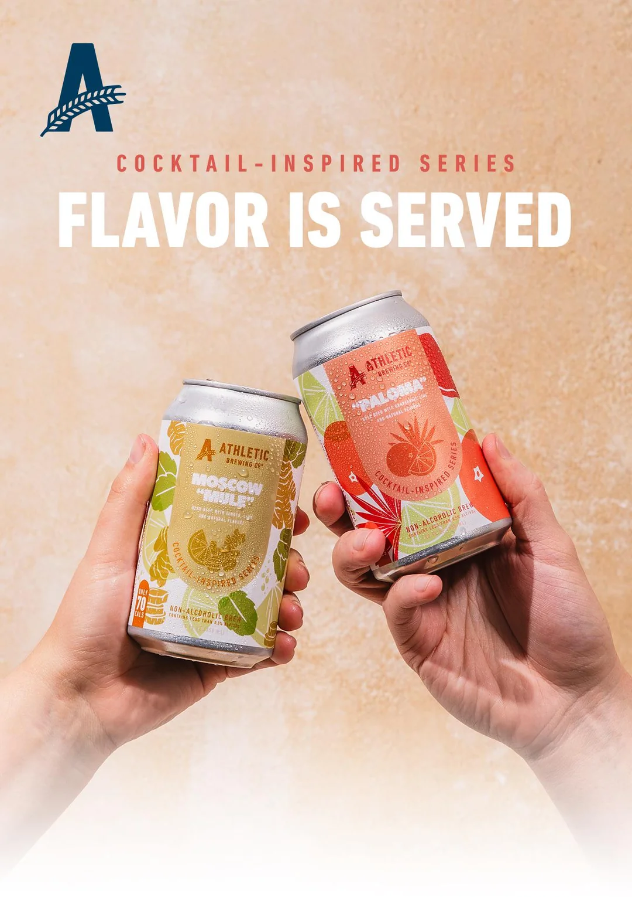

# 애슬레틱 브루잉 무알코올 맥주의 성공 전략과 시장 혁신 분석

애슬레틱 브루잉은 기술 혁신과 라이프스타일 브랜딩을 결합해 무알코올 맥주를 새로운 시장 카테고리로 성장시키며 미국 맥주 시장의 판도를 바꾼 브랜드다. 단순히 술을 마시지 않는 사람을 위한 대체품을 만든 것이 아니라, **'맛있는 맥주를 마시면서도 건강한 삶을 유지할 수 있다'**는 새로운 소비 경험을 제안했다. 그 결과 미국 식료품점 채널에서 전통적인 대형 맥주 브랜드를 뛰어넘는 판매 성과를 기록했고, 무알코올 시장 전체의 성장을 이끄는 대표 브랜드로 자리 잡았다.

## 핵심 요약

* **애슬레틱 브루잉**은 2024년 기준 약 8억 달러의 기업 가치를 인정받으며 글로벌 무알코올 맥주 시장의 대표 브랜드로 성장했다.
* 기존 무알코올 맥주의 가장 큰 약점이었던 **맛의 한계**를 발효 단계부터 알코올 생성을 제어하는 독자적인 양조 기술로 해결했다.
* 브랜드는 운동과 건강을 즐기는 **24~44세 액티브 라이프스타일 소비자**를 명확하게 겨냥해 차별화된 시장을 구축했다.
* 스포츠 현장 체험, 인플루언서 협업, 대학 운동선수 파트너십 등 경험 중심의 마케팅을 통해 브랜드 충성도를 높였다.
* 무알코올 맥주를 건강상의 이유로 마시는 대체재가 아니라 **하나의 라이프스타일 음료**로 재정의한 것이 가장 큰 성공 요인이었다.



## 1. 애슬레틱 브루잉은 어떻게 새로운 시장을 만들었는가?

애슬레틱 브루잉(Athletic Brewing)은 기존 맥주 시장에서 경쟁하기보다 아예 새로운 소비 기준을 만들었다. 대부분의 주류 브랜드가 알코올 함량과 브랜드 역사, 대규모 광고 경쟁에 집중하던 시기에 애슬레틱 브루잉은 **"술을 마시지 않아도 맥주의 즐거움을 누릴 수 있다."**는 전혀 다른 가치 제안을 내세웠다.

2024년 7월 기준 기업 가치는 약 **8억 달러**로 평가되었으며 미국 주요 식료품점 유통 채널에서는 버드와이저와 하이네켄을 넘어 가장 많이 판매된 맥주 브랜드 가운데 하나로 성장했다. 이는 무알코올 맥주가 틈새시장이라는 기존 인식을 뒤집는 상징적인 사건이었다.

| 항목 | 내용 |
| :--- | :--- |
| 브랜드 | Athletic Brewing |
| 설립 목적 | 맛있는 무알코올 맥주 개발 |
| 기업 가치 | 약 8억 달러(2024년 기준) |
| 대표 창업자 | Bill Shufelt, John Walker |
| 핵심 고객 | 24~44세 건강한 라이프스타일 소비자 |
| 대표 경쟁력 | 독자적인 발효 제어 양조 기술 |

애슬레틱 브루잉이 판매한 것은 단순한 음료가 아니었다. **운동과 사회생활을 동시에 즐길 수 있는 새로운 라이프스타일**이었다.

## 2. 창업자는 어떤 문제를 해결하려 했는가?

브랜드의 출발점은 거대한 시장 분석이 아니라 창업자의 개인적인 경험이었다.

CEO인 **빌 슈펠트(Bill Shufelt)**는 헤지펀드 업계에서 근무하면서 매일 운동을 생활화했다. 새벽 운동을 통해 건강을 관리했지만, 업무상 이어지는 술자리는 회복 속도를 떨어뜨렸고 운동 성과에도 부정적인 영향을 주었다.

그는 두 가지를 동시에 포기하고 싶지 않았다.

* 사회생활
* 건강한 생활 습관

즉, 술을 마시지 않아도 사람들과 함께 어울릴 수 있고, 다음 날 운동에도 영향을 주지 않는 맥주가 필요했다.

이 문제는 개인의 고민처럼 보였지만 사실은 당시 젊은 직장인과 운동을 즐기는 소비자들이 공통적으로 느끼던 불편함이었다.

빌 슈펠트는 이를 다음과 같은 문제로 정리했다.

* **맥주는 좋아한다.**
* 알코올은 원하지 않는다.
* 하지만 무알코올 맥주는 맛이 없다.

이 마지막 문제가 시장 전체를 바꾸는 출발점이 되었다.



## 3. 왜 기존 무알코올 맥주는 실패했는가?

애슬레틱 브루잉이 등장하기 전까지 무알코올 맥주는 건강 때문에 어쩔 수 없이 선택하는 제품이라는 이미지가 강했다.

가장 큰 이유는 **제조 방식**이었다.

기존 대형 맥주 회사들은 일반 맥주를 먼저 완성한 뒤 알코올만 제거하는 방식을 사용했다.

제조 과정은 다음과 같았다.

```text
일반 맥주 양조
        │
        ▼
알코올 제거(가열 또는 필터링)
        │
        ▼
향과 풍미 손실
        │
        ▼
탄산 재주입
        │
        ▼
밋밋한 무알코올 맥주
```

이 과정에서는 여러 문제가 발생했다.

* **홉 향이 크게 감소한다.**
* 맥아 특유의 고소한 풍미가 사라진다.
* 열처리 과정에서 향 성분이 손실된다.
* 인공적으로 탄산을 다시 넣어 자연스러운 질감이 줄어든다.

결국 소비자는 "맥주를 마시는 느낌"보다 "맥주 흉내를 낸 음료"를 마시는 경험을 하게 되었다.

당시 시장에는 이런 인식이 널리 퍼져 있었다.

> "맛없는 무알코올 맥주를 왜 돈을 주고 사 마시는가?"

이 부정적인 인식이 시장 성장을 가로막는 가장 큰 장벽이었다.

## 4. 애슬레틱 브루잉은 기술적으로 무엇이 달랐는가?

애슬레틱 브루잉은 기존 제조 방식을 그대로 개선하지 않았다.

아예 접근법 자체를 바꾸었다.

핵심 아이디어는 매우 단순했다.

**알코올을 제거하지 말고 처음부터 거의 만들어지지 않게 하자.**

이를 위해 발효 단계 자체를 제어하는 독자적인 양조 방식을 개발했다.

```text
맥아와 홉 설계
        │
        ▼
발효 과정 제어
        │
        ▼
알코올 생성 최소화
        │
        ▼
풍미 그대로 유지
        │
        ▼
고품질 무알코올 맥주
```

기존 방식과의 차이는 매우 명확하다.

| 비교 항목 | 기존 방식 | 애슬레틱 브루잉 |
| :--- | :--- | :--- |
| 접근 방식 | 알코올 제거 | 알코올 생성 최소화 |
| 풍미 보존 | 낮음 | 매우 높음 |
| 열처리 | 필요 | 거의 없음 |
| 홉 향 유지 | 손실 발생 | 대부분 유지 |
| 맥아 풍미 | 감소 | 자연스럽게 유지 |

이 기술은 단순히 제조 공정을 바꾼 것이 아니라 **무알코올 맥주의 정의 자체를 바꾸었다.**

무알코올 맥주는 맛을 포기해야 한다는 기존 상식을 깨뜨린 것이다.

## 5. 기술 혁신은 어떻게 시장의 인식을 바꾸었는가?

기술은 소비자가 체감하지 못하면 의미가 없다. 애슬레틱 브루잉은 제품 자체가 경쟁력을 증명하도록 만들었다.

가장 상징적인 사례는 일반 맥주와 함께 경쟁하는 각종 맥주 품평회였다.

애슬레틱 브루잉은 무알코올 부문만 참가한 것이 아니라 **일반 알코올 맥주들과 동일한 조건에서 경쟁**했고, 여러 대회에서 높은 평가와 수상을 기록했다.

이는 두 가지 의미를 가진다.

* **무알코올이라는 이유만으로 품질이 떨어지는 것은 아니라는 점**
* 소비자가 '대체품'이 아니라 '좋은 맥주'로 인식하기 시작했다는 점

이러한 품질 혁신은 브랜드가 이후 라이프스타일 전략을 펼칠 수 있는 가장 중요한 기반이 되었다. 아무리 뛰어난 마케팅을 진행하더라도 제품 자체가 만족스럽지 않았다면 현재와 같은 시장 지위를 확보하기는 어려웠다.

## 6. 무알코올 시장은 왜 폭발적으로 성장하고 있는가?

애슬레틱 브루잉의 성공은 뛰어난 제품력만으로 설명하기 어렵다. 브랜드가 성장할 수 있었던 배경에는 **주류 시장 전체의 소비 패턴 변화**가 자리 잡고 있었다. 과거에는 무알코올 맥주가 건강상의 이유로 술을 마실 수 없는 사람을 위한 대체품이라는 인식이 강했다면, 최근에는 건강한 생활을 적극적으로 선택하는 소비자들이 스스로 찾는 음료로 자리 잡고 있다.

2023년 미국 시장은 이러한 변화를 수치로 보여준다.

| 구분 | 성장률 및 시장 규모 |
| :--- | :--- |
| 전체 증류주 시장 성장률 | **3.3%** |
| 무알코올 증류주 시장 성장률 | **95.1%** |
| 미국 무알코올 시장 규모 | 약 **3억 8,300만 달러** |

전체 주류 시장은 성장세가 둔화되는 반면, 무알코올 시장은 거의 두 배 가까운 성장률을 기록하며 새로운 성장 동력으로 자리 잡았다.

이 변화는 소비자 연령층에서도 확인된다. 갤럽(Gallup)이 발표한 조사에 따르면 2021~2023년 기준 **18~34세 성인의 정기 음주 비율은 62%**였으며, 이는 약 20년 전보다 **10%포인트 감소**한 수치다.

과거와 현재의 시장은 다음과 같이 달라졌다.

| 비교 항목 | 과거 무알코올 시장 | 현재 무알코올 시장 |
| :--- | :--- | :--- |
| 주요 소비층 | 45세 이상 장년층 | 20~30대 중심 |
| 선택 이유 | 건강 문제로 인한 대체 | 건강과 라이프스타일 |
| 브랜드 이미지 | 어쩔 수 없는 선택 | 적극적인 선택 |
| 제품 경쟁력 | 맛이 부족한 대체재 | 일반 맥주와 경쟁 가능한 품질 |

즉, **절주 문화의 확산**과 **웰니스(Wellness)**, 생산성, 운동 중심의 라이프스타일이 하나의 소비 트렌드로 자리 잡으면서 애슬레틱 브루잉은 가장 적절한 시점에 시장에 등장한 브랜드가 되었다.



## 7. 애슬레틱 브루잉 사례가 보여주는 전략적 시사점은 무엇인가?

애슬레틱 브루잉은 단순히 성공한 무알코올 맥주 브랜드가 아니다. 기존 산업이 가진 고정관념을 어떻게 바꿀 수 있는지를 보여주는 대표적인 사례다.

첫 번째 시사점은 **제품의 본질적 경쟁력**이다.

많은 기업이 브랜딩이나 광고를 먼저 생각하지만, 애슬레틱 브루잉은 가장 먼저 맛을 해결했다. 소비자가 반복 구매를 결정하는 기준은 결국 제품 자체였으며, 발효 단계부터 알코올 생성을 제어하는 독자적인 양조 기술은 브랜드 성장의 가장 중요한 기반이 되었다.

두 번째는 **소비 맥락(Context)의 변화**다.

기존 맥주는 저녁 술자리와 유흥을 중심으로 소비되었다. 반면 애슬레틱 브루잉은 운동 직후, 점심 식사, 야외 활동, 운전 전후 등 기존 맥주가 진입하지 못했던 새로운 소비 상황을 만들었다.

이를 구조로 정리하면 다음과 같다.

```text
기존 맥주
유흥 → 음주 → 숙취

        ↓

애슬레틱 브루잉
운동 → 회복 → 사회생활 → 생산성 유지
```

세 번째는 **라이프스타일 브랜딩**이다.

애슬레틱 브루잉은 맥주를 판매하지 않았다. 운동을 즐기고, 자기관리를 실천하며, 사회생활도 포기하지 않는 현대인의 삶을 하나의 브랜드 경험으로 제안했다.

이러한 접근은 경쟁 브랜드와의 가격 경쟁이나 점유율 경쟁을 피하면서도 새로운 시장을 창출하는 결과로 이어졌다.

## 8. 애슬레틱 브루잉은 왜 전통 맥주 기업을 넘어설 수 있었는가?

애슬레틱 브루잉은 버드와이저나 하이네켄과 같은 거대 맥주 기업보다 규모가 작은 스타트업이었다. 그럼에도 미국 식료품점 채널에서 높은 판매량을 기록할 수 있었던 이유는 **기존 시장을 빼앗은 것이 아니라 새로운 수요를 만든 것**에 있다.

전통적인 맥주 브랜드는 오랫동안 동일한 소비 문화를 기반으로 성장했다. 그러나 건강을 중시하는 젊은 세대가 증가하면서 음주 자체보다 상황에 맞는 선택을 중요하게 생각하는 소비자가 늘어났다.

애슬레틱 브루잉은 이러한 변화를 가장 먼저 읽고 다음과 같은 구조를 구축했다.

* **제품 혁신**으로 맛에 대한 편견을 제거했다.
* **운동과 건강**이라는 새로운 소비 상황을 만들었다.
* **스포츠 현장 경험**을 통해 자연스러운 입소문을 형성했다.
* **브랜드와 잘 맞는 인플루언서**를 활용해 신뢰를 구축했다.
* **오프라인 프로모션**으로 유통망을 빠르게 확대했다.

이 다섯 가지 요소는 각각 독립적으로 작동한 것이 아니라 하나의 전략으로 연결되었다. 그 결과 애슬레틱 브루잉은 단순한 무알코올 맥주 브랜드를 넘어, 현대적인 라이프스타일을 상징하는 브랜드로 성장할 수 있었다.

## 결론

애슬레틱 브루잉의 성공은 **무알코올 맥주 시장의 성장**만을 의미하지 않는다. 이 사례는 성숙기에 접어든 산업에서도 소비자의 새로운 문제를 발견하고 이를 해결할 수 있다면 충분히 시장의 판도를 바꿀 수 있다는 점을 보여준다.

특히 이 브랜드는 기술과 마케팅 가운데 어느 하나만으로 성장한 것이 아니다. **발효 단계부터 알코올 생성을 제어하는 양조 기술**, 운동과 건강을 중심으로 한 **라이프스타일 브랜딩**, 그리고 스포츠 현장 체험과 브랜드 핏 중심의 **정교한 마케팅 전략**이 유기적으로 결합되면서 강력한 경쟁력을 확보했다.

오늘날 무알코올 맥주는 더 이상 술을 마시지 못하는 사람만을 위한 음료가 아니다. 상황에 따라 건강과 생산성, 운동을 우선하는 소비자가 적극적으로 선택하는 하나의 카테고리로 자리 잡고 있다. 애슬레틱 브루잉은 이러한 변화를 가장 먼저 포착하고 새로운 소비 문화를 만들어 낸 대표적인 사례로 평가할 수 있다.

## 자주 묻는 질문(FAQ)

### 애슬레틱 브루잉은 일반 무알코올 맥주와 무엇이 가장 다른가?

기존 제품처럼 완성된 맥주에서 알코올을 제거하는 방식이 아니라, 발효 단계부터 알코올 생성을 최소화해 맥아와 홉의 풍미를 최대한 유지하는 독자적인 양조 기술을 사용한다.

### 왜 스포츠 마케팅을 핵심 전략으로 선택했는가?

운동 직후에는 시원한 맥주를 마시고 싶지만 알코올은 부담스러운 상황이 많다. 애슬레틱 브루잉은 이러한 소비 상황을 가장 먼저 공략해 제품의 장점을 직접 경험하도록 만들었다.

### 애슬레틱 브루잉의 주요 고객층은 누구인가?

24~44세의 성인 가운데 운동과 건강한 라이프스타일을 즐기며, 사회생활과 자기관리를 모두 중요하게 생각하는 소비자가 핵심 고객이다.

### 무알코올 맥주 시장은 앞으로도 성장할 가능성이 있는가?

젊은 세대의 절주 문화와 웰니스 트렌드가 지속되는 한 성장 가능성은 높다. 다만 시장 확대에 따라 기존 대형 주류 기업들의 경쟁도 더욱 치열해질 것으로 예상된다.

### 애슬레틱 브루잉 사례가 다른 산업에도 시사하는 점은 무엇인가?

기존 제품을 단순히 개선하는 것이 아니라 소비자의 생활 방식과 소비 맥락 자체를 새롭게 정의하면 성숙한 시장에서도 새로운 수요를 창출할 수 있다는 점을 보여준다.