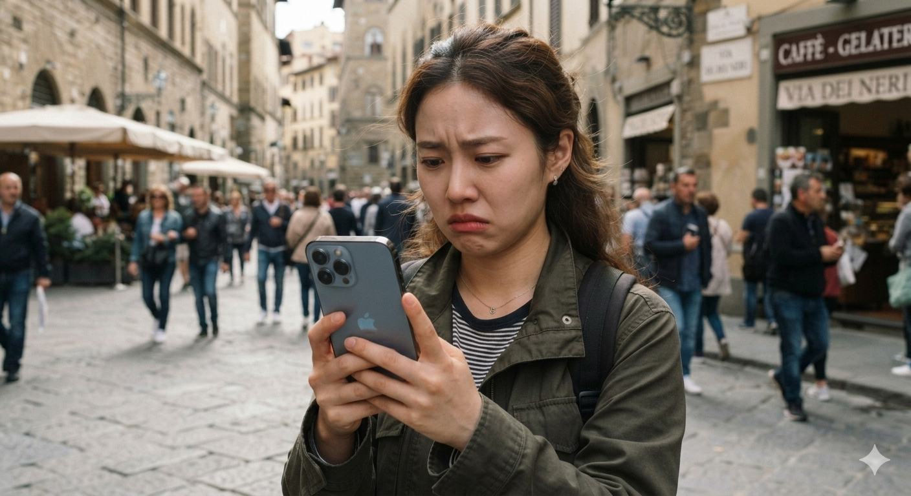

# 아이폰 배터리는 어떻게 관리하는 것이 가장 오래 사용할 수 있을까? 20~80% 충전 습관을 분석해본 결론

아이폰 배터리를 오래 사용하려면 평소에는 **20~80% 구간**에서 충전하고, 필요한 날에만 100%까지 충전하는 방식이 배터리 수명과 실사용 편의성을 가장 균형 있게 만족시키는 방법이다.

최근 아이폰 17을 새로 구매하면서 오랫동안 사용했던 아이폰 13 mini를 판매하게 되었다. 당근마켓에 판매글을 올리자 가장 많이 받은 질문은 예상외로 "배터리 효율이 몇 퍼센트인가?"였다. 스마트폰을 구매할 때 배터리 효율이 중요한 판단 기준이 된다는 사실을 다시 한번 체감했고, 이를 계기로 리튬 이온 배터리의 특성과 아이폰의 충전 방식에 대해 자료를 찾아보고 정리하게 되었다.

처음에는 단순히 "80%까지만 충전하면 좋다" 정도로 알고 있었지만, 실제 원리를 이해하고 나니 애플이 왜 이런 기능을 만들었는지, 그리고 어떤 방식으로 사용하는 것이 가장 현실적인 관리법인지 자연스럽게 결론에 도달할 수 있었다.

## 핵심 요약

* **저전력 모드**는 하루 사용 시간을 늘려주는 기능이며, 배터리 화학적 수명을 직접 늘리는 기능은 아니다.
* 리튬 이온 배터리는 **20~80% 구간**에서 사용할 때 가장 낮은 스트레스를 받는다.
* 배터리 사이클은 충전 횟수가 아니라 **누적 사용량**으로 계산되므로 수시 충전이 불리하지 않다.
* 아이폰의 최적화된 배터리 충전 역시 80%를 기준으로 배터리를 보호하기 위한 기능이다.
* 아이폰 15 이후 모델은 공식적으로 **1,000사이클**까지 80% 용량 유지를 목표로 설계되었다.
* 평소에는 80% 충전 제한을 사용하고, 장거리 이동이나 여행처럼 필요한 날에만 100% 충전하는 것이 가장 현실적인 방법이다.

## 1. 왜 배터리 효율이 중요한 시대가 되었을까?

예전에는 스마트폰을 중고로 판매할 때 외관 상태가 가장 중요한 요소였다. 하지만 최근에는 배터리 효율이 거의 첫 번째 질문이 되었다.

그 이유는 **배터리 효율**이 스마트폰의 체감 성능과 직결되기 때문이다.

배터리 효율이 80% 이하로 떨어지면 사용 시간 감소뿐 아니라, 순간적으로 높은 전력이 필요한 상황에서 성능 제한이 발생하거나 예기치 않게 전원이 꺼질 가능성도 커진다. 애플 역시 배터리 성능이 크게 저하된 경우 배터리 교체를 권장한다.

결국 스마트폰의 수명을 결정하는 가장 중요한 부품 가운데 하나가 배터리가 된 것이다.

## 2. 저전력 모드는 배터리 수명을 늘려줄까?

처음에는 저전력 모드를 항상 켜두면 배터리 수명도 길어질 것이라고 생각했다.

하지만 **저전력 모드**의 목적은 장기적인 수명 관리가 아니라 하루 동안 사용할 수 있는 시간을 늘리는 데 있다.

저전력 모드는 화면 밝기를 낮추고, 백그라운드 작업을 줄이며, 일부 성능을 제한해 배터리 소모를 줄여준다.

배터리가 천천히 소모되기 때문에 충전 주기가 다소 길어질 수는 있지만, 리튬 이온 배터리의 화학적 노화를 직접 막아주는 기능은 아니다.

즉, 저전력 모드는 **사용 시간 연장 기능**이고, 충전 제한은 **배터리 건강 관리 기능**이라고 이해하는 것이 맞다.

## 3. 왜 20~80% 구간이 가장 좋은가?

리튬 이온 배터리는 항상 일정한 부담을 받는 것이 아니다.

가장 스트레스를 많이 받는 구간은 다음 두 가지다.

* **0%에 가까운 방전 상태**
* **100%에 가까운 완충 상태**

특히 80%를 넘어가면 배터리 내부 전압이 높아지고 발열도 증가하기 때문에 충전 속도가 자연스럽게 느려진다.

이 때문에 아이폰뿐 아니라 대부분의 스마트폰과 전기차는 80% 이후부터 충전 방식을 바꾸는 구조를 사용한다.

평소에는 20~80% 범위에서 사용하는 것이 배터리 입장에서 가장 편안한 환경이라고 알려져 있다.

## 4. 아이폰은 왜 80% 이후부터 충전 방식을 바꿀까?

처음에는 단순히 충전 속도를 늦추는 기능이라고 생각했다.

하지만 애플의 **최적화된 배터리 충전**은 다른 목적을 가지고 있었다.

예를 들어 밤 11시에 충전기를 연결하고 아침 7시에 일어난다면, 일반적인 충전 방식이라면 새벽에 이미 100%가 되어 높은 전압 상태로 몇 시간 동안 유지된다.

애플은 이를 피하기 위해 먼저 약 **80%까지 빠르게 충전**한 뒤, 사용자의 생활 패턴을 학습하여 기상 시간 직전에 천천히 100%를 완성한다.

즉, 목표는 충전 속도가 아니라 **100% 상태로 머무는 시간을 최소화하는 것**이다.

반대로 충전 한도를 80%로 설정하면 이 기능 자체가 필요 없어지므로 80%에서 충전이 종료된다.

## 5. 배터리 사이클은 어떻게 계산될까?

처음에는 자주 충전하면 사이클도 빨리 늘어날 것이라고 생각했다. 하지만 실제 계산 방식은 전혀 달랐다.

배터리 사이클은 충전기를 꽂은 횟수가 아니라 **배터리 전체 용량을 누적해서 얼마나 사용했는지**를 기준으로 계산한다.

예를 들어,

* 100%를 한 번 사용하면 1사이클
* 50%를 두 번 사용해도 1사이클
* 25%를 네 번 사용해도 1사이클

결과는 모두 동일하다.

즉, 수시 충전이 사이클을 손해 보게 만드는 것은 아니다. 중요한 것은 **같은 1사이클이라도 어떤 환경에서 사용했는가**이다. 20~80% 구간은 전압과 발열이 낮기 때문에 동일한 사이클이라도 배터리 열화가 훨씬 적게 발생한다.

## 6. 아이폰 15 이후 배터리는 얼마나 오래 사용할 수 있을까?

애플은 아이폰 15 이후 모델부터 배터리 내구성을 크게 향상시켰다.

공식 기준으로는 **1,000회의 완전 충전 사이클 이후에도 원래 용량의 약 80%를 유지**하도록 설계되었다.

이는 이전 세대의 500사이클 기준보다 크게 개선된 수치다. 물론 이 수치는 최소 보장 기준이며, 실제 사용 환경에 따라 달라질 수 있다. 여기에 20~80% 충전 습관과 발열 관리까지 더한다면 배터리 열화 속도를 더욱 늦출 가능성이 높다.

다만 한 가지는 반드시 구분해야 한다. 리튬 이온 배터리는 충전 사이클뿐 아니라 **시간 자체에 의해서도 자연스럽게 노화(Calendar Aging)**된다. 따라서 사이클 관리만 잘했다고 해서 영구적으로 사용할 수 있는 것은 아니다.

## 결론

이번에 자료를 찾아보고 여러 내용을 정리하면서 내린 결론은 의외로 단순했다.

배터리는 **무조건 100%까지 충전하는 것이 정답도 아니고**, 무조건 80%만 고집하는 것도 현실적인 정답은 아니다.

평소에는 **80% 충전 한도**를 설정해 20~80% 구간에서 사용하는 것이 배터리 건강을 가장 잘 유지하는 방법이다. 반면 여행이나 장거리 이동처럼 하루 종일 충전하기 어려운 날에는 일시적으로 100%까지 충전해 사용하는 것이 훨씬 합리적이다.

결국 중요한 것은 배터리를 아끼기 위해 사용성을 희생하는 것이 아니라, **배터리 수명과 실제 편의성 사이에서 균형을 찾는 것**이다.

나 역시 이번 아이폰 17은 특별한 일이 없는 한 평소에는 80% 충전 한도를 유지하고, 필요한 날에만 100%를 활용하는 방식으로 사용하려고 한다. 현재까지 확인한 리튬 이온 배터리의 특성과 애플의 충전 설계를 고려하면, 이 방법이 가장 현실적이고 지속 가능한 관리법이라는 결론에 도달했다.

## 자주 묻는 질문(FAQ)

### 아이폰은 항상 80%까지만 충전하는 것이 좋을까?

평소에는 그렇다. 다만 장거리 이동이나 여행처럼 하루 동안 충전이 어려운 상황이라면 일시적으로 100%까지 충전하는 것이 더 실용적이다.

### 저전력 모드를 항상 켜두면 배터리 수명이 늘어날까?

직접적인 효과는 없다. 저전력 모드는 사용 시간을 늘리는 기능이며, 충전 횟수를 줄이는 간접적인 효과만 기대할 수 있다.

### 자주 충전하면 배터리 사이클이 더 빨리 늘어날까?

아니다. **배터리 사이클**은 충전 횟수가 아니라 누적 사용량으로 계산되므로 여러 번 나누어 충전해도 불리하지 않다.

### 아이폰 15 이후 모델은 정말 1,000사이클까지 사용할 수 있을까?

애플은 1,000회의 완전 충전 사이클 이후에도 원래 용량의 약 80%를 유지하도록 설계했다고 안내한다. 실제 결과는 사용 환경과 발열 관리 등에 따라 달라질 수 있다.

### 배터리를 오래 쓰는 데 가장 중요한 요소는 무엇일까?

**높은 전압과 발열을 줄이는 것**이다. 20~80% 충전 습관과 과도한 발열을 피하는 사용 습관이 장기적인 배터리 건강 유지에 가장 큰 도움이 된다.