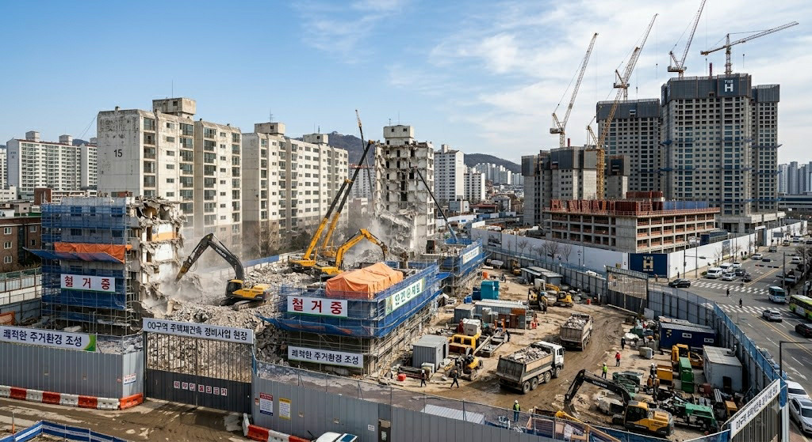

# 아파트 재건축 30년 연한과 안전진단 경제학의 변천

아파트 **30년 연한은 건축물의 물리적 수명이 30년이라는 뜻이 아니다.** 한국의 재건축 제도는 노후 주택 정비라는 본래 목적과 부동산 시장의 안정, 도심 주택 공급이라는 정책 목표가 서로 충돌하면서 기준을 바꿔 왔다.

1987년 재건축 제도가 법적으로 허용될 당시에는 **건축 후 20년 이상 된 주택** 등이 재건축 대상의 기준으로 설정됐다. 이후 2000년대에는 재건축 과열을 억제하기 위해 안전진단과 사업 절차를 강화했고, 지자체 조례에 따라 재건축 연한이 길어진 지역도 나타났다. 2014년에는 다시 연한 상한을 30년으로 낮추고 안전진단 기준을 주거환경 중심으로 완화하는 방향을 추진했다. ([Codil])

여기에 안전진단의 평가 비중도 정책에 따라 달라졌다. 2015년 적용된 완화 기준에서는 구조안전성 비중이 20%로 낮아졌지만, 2018년에는 다시 50%로 높아졌다. 2023년에는 구조안전성 비중을 30%로 낮추면서 주거환경과 설비 노후도를 보다 크게 반영하는 방향으로 바뀌었다. ([Korea])

2024년에는 한 단계 더 나아가 **30년 이상 공동주택이 재건축진단을 받기 전에 정비사업을 착수할 수 있도록 하는 제도 개편**을 추진했고, 관련 법률은 2024년 12월 개정됐다. 2025년부터 시행된 현행 제도에서는 재건축진단을 사업시행계획인가 전까지 실시하도록 시점을 뒤로 옮겼다. ([국토교통부])

따라서 같은 30년 된 아파트라도 어느 시기에 어떤 연한과 안전진단 기준을 적용받느냐에 따라 재건축 사업의 가능성과 경제적 가치가 달라질 수 있다.

## 핵심 요약

* **재건축 연한**은 1987년 제도 도입 당시 건축 후 20년 이상을 기준으로 출발했다.
* 이후 재건축 과열과 투기 문제가 부각되면서 **안전진단과 사업 절차가 강화**됐고, 일부 지자체에서는 조례를 통해 연한을 더 길게 설정하기도 했다.
* 2014년 9·1 대책은 재건축 연한 상한을 **최장 30년**으로 낮추고 안전진단 기준도 주거환경을 보다 중시하는 방향으로 완화했다. ([국토교통부])
* 2018년에는 구조안전성 비중을 **20%에서 50%로 상향**해 재건축 진입 문턱을 높였다. ([국토교통부])
* 2023년에는 구조안전성 비중을 **50%에서 30%로 낮추고** 주거환경과 설비 노후도의 반영 비중을 높였다. ([국토교통부])
* 2024년 법 개정으로 안전진단은 **재건축진단**으로 명칭이 바뀌었고, 30년 이상 공동주택은 진단 전에도 정비사업을 착수할 수 있도록 절차를 개편했다. 현행 제도에서는 재건축진단을 사업시행계획인가 전까지 실시하도록 하고 있다. ([국토교통부])
* 따라서 재건축 제도를 이해하려면 **30년이라는 연한뿐 아니라 안전진단의 평가기준과 사업 절차가 어느 시기에 어떻게 설계됐는지** 함께 봐야 한다.

## 1. 재건축 연한은 왜 20년에서 시작했고 다시 30년이 되었을까?

1987년 주택건설촉진법 개정을 통해 공동주택 재건축의 법적 근거가 마련됐다. 당시 재건축 대상은 **안전사고의 우려가 큰 건물과 건축 후 20년 이상 된 주택** 등을 중심으로 설정됐다. 즉, 초기 제도부터 20년은 건축물의 물리적 수명을 의미하는 절대적인 숫자라기보다 재건축을 검토할 수 있는 제도적 기준이었다. ([Codil])

초기 재건축 제도에서는 재고주택을 무분별하게 철거하는 것을 막는 것도 중요한 정책 목표였다. 당시에는 주택 부족 문제가 컸기 때문에 기존 주택을 철거하면 오히려 주택 재고가 감소할 수 있다는 우려도 있었다. ([Codil])

그럼에도 일부 초기 아파트는 재건축을 통해 경제적 가치가 크게 증가할 수 있었다. 특히 강남권의 일부 저층 아파트는 상대적으로 낮은 용적률로 건설됐기 때문에 재건축을 통해 더 높은 밀도로 개발할 여지가 있었다.

당시 재건축 제도의 배경을 압축하면 다음과 같다.

| 배경         | 재건축과의 관계                     |
| ---------- | -------------------------- |
| 노후 공동주택 증가 | 기존 주택을 새 주택으로 정비할 필요성 확대   |
| 낮은 초기 용적률  | 재건축 후 세대수 증가를 통한 사업성 확보 가능 |
| 배관·설비 노후화  | 기존 건물의 유지·보수 부담 증가         |
| 신축 주택 수요   | 재건축 이후 주거가치와 자산가치 상승 기대    |

따라서 **20년이라는 숫자를 아파트의 물리적 수명으로 해석하면 제도의 출발점을 놓치게 된다.** 당시의 주택 공급 구조와 노후화 수준, 도시개발 방식, 재고주택 관리정책이 함께 반영된 제도적 기준이었다.

재건축 제도는 1990년대 이후 완화와 강화가 반복됐다.

1987년 제도 도입 당시에는 20년 이상 주택이 주요 기준이었지만, 1993년에는 일정한 조건을 충족하면 20년 미만 공동주택도 재건축할 수 있도록 기준을 완화했다. 이후 재건축이 주택 공급뿐 아니라 토지의 개발가치를 실현하는 수단으로 인식되면서 무분별한 재건축을 억제하기 위한 제도적 장치도 강화됐다. ([Codil])

2003년 도시 및 주거환경정비법이 제정된 이후에는 재건축 관련 규정을 통합했고, 지자체 조례를 통해 재건축 연한을 구체화하는 구조를 운영했다. 2014년 개정 당시 국토교통부는 당시 일부 시·도의 조례가 **준공 후 20년 이상의 범위에서 연한을 정하도록 하면서 일부 지역에서는 최장 40년까지 운영되고 있었다**고 설명했다. ([국토교통부])

2014년 9·1 대책은 이러한 흐름을 다시 전환했다. 정부는 당시 재건축 연한을 **최장 30년으로 단축**하고 안전진단 기준도 주거환경을 보다 중시하는 방향으로 개편하겠다고 발표했다. ([국토교통부])

이를 주요 제도 변화로 정리하면 다음과 같다.

| 시기         | 주요 제도 변화                               | 정책적 배경             | 시장에 미친 방향   |
| ---------- | -------------------------------------- | ------------------ | ----------- |
| 1987~1988년 | 재건축 법적 근거 마련, 건축 후 20년 이상 주택 등을 대상에 포함 | 노후 공동주택 정비 필요      | 재건축 제도 출범   |
| 1993년      | 일정 조건에서 20년 미만 공동주택도 재건축 가능            | 안전·노후 문제 대응        | 사업 가능 범위 확대 |
| 1997년 이후   | 안전진단 등 재건축 관련 규제 강화                     | 무분별한 재건축 방지        | 사업 진입 억제    |
| 2003년 이후   | 도시정비법으로 제도 통합, 지자체 조례를 통한 연한 운영        | 정비사업 체계화 및 규제      | 지역별 차이 확대   |
| 2014~2015년 | 재건축 연한 상한을 최장 30년으로 단축, 안전진단 완화        | 주택시장 활력 및 정비사업 활성화 | 사업 진입 완화    |
| 2018년      | 구조안전성 중심으로 안전진단 강화                     | 재건축 과열 및 자원 낭비 방지  | 사업 진입 억제    |
| 2023년      | 구조안전성 비중 완화                           | 정비사업 활성화 및 공급 확대   | 사업 진입 완화    |
| 2024~2025년 | 안전진단을 재건축진단으로 개편하고 사업 후단으로 이동          | 정비사업 초기 진입장벽 완화    | 사업 착수 속도 개선 |

**30년이라는 숫자만 고정해서 보면 안 된다.** 같은 30년 된 아파트라도 적용되는 안전진단 기준과 정비사업 절차에 따라 실제 사업 가능성은 달라졌다.

## 2. 안전진단은 어떻게 시장 조절 장치가 되었을까?

재건축의 경제적 구조를 보면 안전진단이 왜 중요한 정책 수단인지 이해할 수 있다.

노후 아파트의 현재 가격에는 단순한 주거가치만 들어 있지 않다. 재건축을 통해 새 아파트로 바뀔 것이라는 **미래 개발 기대**가 가격에 반영될 수 있다.

재건축 아파트의 경제적 가치를 구성하는 요소는 다음과 같이 정리할 수 있다.

| 가치 요소   | 의미                    |
| ------- | -------------------- |
| 현재 주거가치 | 현재 건물과 입지가 제공하는 사용가치 |
| 재건축 기대  | 향후 정비사업이 진행될 가능성     |
| 신축 가치   | 재건축 이후 새 아파트가 제공할 가치 |
| 추가 분담금  | 사업 추진 과정에서 발생하는 비용   |
| 사업기간    | 재건축 완료까지 기다려야 하는 시간  |
| 규제 불확실성 | 진단·인가 등 절차가 좌우하는 위험  |

재건축 가능성이 높아지면 현재 건물의 가치뿐 아니라 **미래에 확보할 수 있는 개발가치**가 가격에 반영될 가능성이 커진다.

반대로 재건축이 장기간 지연되면 주민은 낡은 주거환경을 계속 감수해야 하고, 향후 신축 주택으로 전환할 수 있는 시점도 늦어진다. 이 과정에서 사업기간과 금융비용, 추가 분담금, 정책 불확실성이 함께 작용한다.

따라서 재건축 아파트의 가격은 단순한 노후 주택 가격과 다르다. **현재 주거가치와 미래 개발가치의 합에서 사업비용과 시간비용을 차감하는 구조**로 이해하는 것이 적절하다.

안전진단은 이러한 미래 개발가치의 실현 가능성을 좌우하는 중요한 제도적 변수였다. 과열기에는 재건축 기대를 억제하는 방향으로 제도를 강화할 수 있고, 공급 확대가 필요한 시기에는 연한과 평가기준, 사업절차를 완화하는 방식으로 정비사업을 촉진할 수 있다.

주요 정책 방향을 경제적 관점에서 정리하면 다음과 같다.

| 시장 상황    | 규제 방향 | 주요 수단                  | 기대되는 경제적 효과       |
| -------- | ----- | --------------------- | ----------------- |
| 부동산 과열   | 강화    | 구조안전성 비중 확대, 사업 진입 억제 | 재건축 기대 및 투기 수요 억제 |
| 부동산 침체   | 완화    | 연한 단축, 평가기준 완화, 절차 단축 | 정비사업 및 건설투자 활성화   |
| 공급 부족 우려 | 완화    | 재건축 진입장벽 완화            | 중장기 도심 주택 공급 확대   |
| 시장 불안 확대 | 속도 조절 | 사업 시기 및 인허가 관리         | 공급과 수요의 충격 완화     |

다만 **안전진단 자체가 부동산 가격을 직접 통제하는 장치라고 단정해서는 안 된다.** 재건축 가격은 금리, 공사비, 예상 분담금, 용적률, 일반분양가, 사업기간, 입지, 정책 기대 등 여러 변수의 영향을 받는다.

따라서 안전진단은 가격을 직접 결정하는 장치라기보다 **재건축 사업의 실현 가능성과 시점을 좌우하는 제도적 변수**로 보는 것이 적절하다.

## 3. 안전진단의 구조안전성 비중은 어떻게 달라졌을까?

안전진단에서 가장 큰 변화 중 하나는 **평가항목별 가중치**였다.

2014년 규제완화 이전에는 구조안전성 비중이 40%였지만, 2014년 9·1 대책 이후 2015년부터 적용된 기준에서는 20%로 낮아졌다. 반대로 주거환경 비중은 15%에서 40%로 높아졌다. ([연합뉴스])

2018년에는 이 방향이 다시 반대로 바뀌었다. 구조안전성 비중을 50%까지 높이고 조건부 재건축 판정에 대한 적정성 검토를 의무화하면서 재건축 진입 문턱을 높였다. ([국토교통부])

2023년에는 다시 구조안전성 비중을 30%로 낮추고 주거환경과 설비 노후도의 비중을 각각 30%로 조정했다. ([국토교통부])

주요 개편을 비교하면 다음과 같다.

| 제도 시기       | 구조안전성 | 주거환경 | 설비 노후도 | 비용분석 | 정책 방향          |
| ----------- | ----: | ---: | -----: | ---: | -------------- |
| 2014년 이전 기준 |   40% |  15% |    30% |  15% | 상대적으로 구조안전성 중시 |
| 2015년 완화 기준 |   20% |  40% |    30% |  10% | 재건축 진입 완화      |
| 2018년 강화 기준 |   50% |  15% |    25% |  10% | 재건축 진입 강화      |
| 2023년 완화 기준 |   30% |  30% |    30% |  10% | 재건축 진입 완화      |

이 변화가 중요한 이유는 **같은 아파트의 동일한 물리적 상태라도 평가기준에 따라 재건축 가능성이 달라질 수 있기 때문**이다.

2015년 기준에서는 주차난이나 층간소음, 설비 노후화 등 생활상의 불편이 재건축 판단에 상대적으로 큰 영향을 미쳤다. 반대로 2018년에는 구조안전성이 50%까지 높아지면서 건물 자체의 구조적 안전성이 재건축 여부를 결정하는 데 훨씬 큰 비중을 차지했다. ([Korea])

**어떤 문제를 얼마나 중요하게 평가하느냐가 재건축 진입 문턱을 결정하는 중요한 정책변수**가 됐다.

## 4. 재건축 사업은 왜 안전진단 통과만으로 끝나지 않고, 재건축진단은 왜 뒤로 이동했을까?

안전진단을 통과했다고 해서 곧바로 새 아파트가 들어서는 것은 아니다.

재건축은 정비계획 수립과 정비구역 지정, 추진위원회 구성, 조합설립인가, 사업시행계획인가, 관리처분계획인가, 이주와 철거, 착공 등의 여러 단계를 거치는 장기 사업이다.

현재 제도를 단순화하면 다음과 같은 구조로 이해할 수 있다.

| 단계           | 핵심 의미                      |
| ----------- | -------------------------- |
| 정비계획·정비구역   | 사업 대상과 도시계획의 틀 확정          |
| 추진위원회·조합 설립 | 주민이 사업 주체를 구성              |
| 사업시행계획인가    | 구체적인 사업계획 승인               |
| 재건축진단       | 주거환경·구조안전성·설비 노후도 등을 종합 평가 |
| 관리처분        | 권리관계와 분담 구조 확정             |
| 이주·철거       | 기존 주택을 비우고 철거              |
| 착공·준공       | 신축 아파트 건설 및 입주             |

과거에는 안전진단이 사업 초기의 중요한 진입관문이었지만, 2024년 1월 정부는 **30년 이상 아파트가 안전진단을 받기 전에도 재건축 절차를 시작할 수 있도록** 제도를 개편하겠다고 발표했다. 정부가 제시한 패스트트랙의 핵심은 안전진단을 사업 초기의 필수 관문에서 뒤로 이동시키는 것이었다. ([국토교통부])

당시 정부가 제시한 구조에서는 안전진단을 통과하지 않아도 정비사업 착수가 가능하고, 안전진단은 **사업시행인가 전까지** 통과하도록 하는 방식이었다. ([국토교통부])

이후 2024년 12월 도시 및 주거환경정비법이 개정되면서 제도를 법률에 반영했다. 2025년 시행된 개정법에서는 안전진단이라는 명칭을 **재건축진단**으로 변경하고, 시장·군수 등이 정비계획 수립 시기부터 사업시행계획인가 전까지 재건축진단을 실시하도록 규정했다. ([법제처])

기존과 현재의 차이를 비교하면 다음과 같다.

| 구분     | 기존 구조                | 현재 제도                  |
| ------ | -------------------- | ---------------------- |
| 진단 명칭  | 안전진단                 | 재건축진단                  |
| 사업 착수  | 진단 통과가 초기 진입의 중요한 관문 | 진단 전에도 정비사업 절차 추진 가능   |
| 진단 시점  | 사업 초기                | 사업시행계획인가 전까지           |
| 정책 목적  | 초기 단계에서 사업 필요성 검증    | 초기 진입장벽 완화 및 사업속도 개선   |
| 새로운 위험 | 초기 단계에서 사업 좌절        | 사업 추진 후 진단 결과에 따른 불확실성 |

따라서 현재는 단순히 "안전진단을 통과해야 재건축을 시작할 수 있다"고 설명하면 정확하지 않다. **사업을 먼저 추진하면서 재건축진단을 사업시행계획인가 전까지 완료하는 구조**로 바뀌었기 때문이다.

2024년 개편을 **"안전진단 폐지"라고 표현하는 것도 정확하지 않다.** 정확한 표현은 **안전진단을 재건축진단으로 개편하고 그 실시 시점을 사업 후단으로 이동시킨 것**이다. 현재 법률에서도 재건축진단은 사업시행계획인가 전에 실시하도록 규정하고 있다. ([법제처])

## 5. 재건축 완화에는 공급 확대와 자원 낭비라는 두 논리가 충돌한다

재건축을 쉽게 허용하면 새로운 주택이 들어설 가능성이 높아진다. 특히 이미 도로·학교·상하수도 등 도시 기반시설이 갖춰진 지역에서 기존 주택을 고밀도로 재편할 수 있다는 점에서 **도심 주택 공급 확대**라는 장점이 있다.

반면 기존 건축물을 철거하고 새 건물을 짓는 과정에서는 상당한 건설자재와 에너지가 투입된다. 철거 과정에서 발생하는 건설폐기물과 신축 과정의 자원 사용 역시 사회적 비용으로 고려할 수 있다.

두 논리를 비교하면 다음과 같다.

| 관점    | 재건축 완화                    | 재건축 억제        |
| ----- | ------------------------ | ------------- |
| 주택 공급 | 신규 주택 공급 확대 가능            | 기존 주택의 계속 사용  |
| 주거환경  | 주차·배관·층간소음 등 개선 가능       | 기존 불편 지속 가능   |
| 건설경기  | 정비사업과 건설투자 활성화 가능         | 과잉 투자 억제 가능   |
| 자원 사용 | 철거·신축에 많은 자원 투입            | 기존 건물 활용      |
| 환경비용  | 폐기물·탄소배출 증가 가능            | 철거 관련 환경비용 감소 |
| 자산시장  | 재건축 기대가 가격 상승 요인으로 작용 가능 | 투기적 기대 억제 가능  |

다만 재건축 완화가 곧바로 공급 증가로 이어지는 것은 아니다. 정비사업은 장기간 진행되며, 사업성이 부족하거나 주민 동의가 충분하지 않으면 실제 착공으로 이어지지 않을 수 있다.

재건축 정책은 단순히 **"오래됐으니 부수자"와 "튼튼하니 계속 쓰자"의 문제가 아니다.**

**기존 건물을 계속 사용하는 편익과 철거 후 새로 공급하는 편익을 어느 시점에서 비교할 것인가**가 핵심이다.

## 결론

대한민국의 재건축 30년 연한은 아파트가 30년이면 물리적 수명을 다한다는 의미에서 출발한 기준이 아니다.

1987년 재건축 제도가 법적으로 허용될 당시에는 **건축 후 20년 이상 된 주택** 등이 주요 대상 기준으로 설정됐다. 이후 1990년대의 규제 완화와 2000년대의 제도 정비 및 규제 강화를 거쳐, 일부 지역에서는 재건축 연한이 최장 40년까지 운영되기도 했다. 2014년에는 다시 연한 상한을 30년으로 낮추는 방향으로 전환됐다. ([Codil])

안전진단의 역사도 같은 흐름을 보여준다.

2015년 적용된 완화 기준에서는 구조안전성 비중이 **20%** 까지 낮아졌고 주거환경 비중은 40%까지 높아졌다. 2018년에는 구조안전성 비중이 **50%**로 다시 높아졌으며, 2023년에는 다시 **30%** 로 낮아졌다. ([Korea])

2024년에는 안전진단 제도 자체의 위치가 다시 바뀌었다. 정부의 정책 발표 이후 도시정비법 개정이 이루어졌고, 2025년부터는 안전진단이라는 명칭이 **재건축진단**으로 변경됐다. 현재 제도에서는 30년 이상 공동주택이 진단을 받기 전에 정비사업 절차를 추진할 수 있으며, 재건축진단은 **사업시행계획인가 전까지** 실시하도록 되어 있다. ([국토교통부])

따라서 재건축 제도의 역사를 관통하는 질문은 **"30년이면 집이 낡았는가?"가 아니다.**

보다 중요한 질문은 **정부와 사회가 어느 시점에 기존 주택을 계속 사용하는 편익보다 새로운 주택으로 교체하는 편익을 더 크게 평가하는가**이다.

재건축 연한은 그 판단의 시간적 기준이고, 안전진단 또는 현재의 재건축진단은 그 판단을 사업 절차에 연결하는 제도적 장치였다.

재건축의 경제학은 **노후도와 안전성만의 문제가 아니라 토지의 잠재적 이용가치, 주택 공급, 건설비용, 주민의 주거편익, 자산가격, 정책 위험을 동시에 비교하는 문제**라고 볼 수 있다.

## 자주 묻는 질문(FAQ)

### 아파트는 준공 후 30년이 지나면 무조건 재건축할 수 있는가?

아니다.

30년은 재건축 사업을 추진할 수 있는 중요한 제도적 기준이지만, **30년이 됐다는 사실만으로 재건축이 자동 승인되는 것은 아니다.**

현재는 정비계획과 정비구역, 추진위원회와 조합 설립, 사업시행계획인가 등의 절차를 거쳐야 하며, 재건축진단 역시 사업시행계획인가 전까지 완료해야 한다. ([법제처])

### 30년은 아파트의 물리적인 수명을 의미하는가?

아니다.

재건축 연한은 건축물의 물리적 수명과 다른 **법적·행정적 기준**이다.

1987년 제도 도입 당시에도 건축 후 20년 이상 된 주택 등이 재건축 대상의 기준으로 설정됐지만, 이것이 모든 아파트의 물리적 수명이 20년이라는 의미는 아니었다. ([Codil])

### 안전진단에서 구조안전성이 중요한 이유는 무엇인가?

구조안전성은 건축물의 구조적 안전 여부를 평가하는 핵심 항목이기 때문이다.

다만 정책에 따라 구조안전성의 가중치는 크게 달라졌다. 2015년 기준에서는 20%였지만 2018년에는 50%까지 높아졌고, 2023년에는 다시 30%로 낮아졌다. ([Korea])

### 현재도 안전진단을 반드시 먼저 받아야 하는가?

아니다.

현재 법률상 명칭은 **재건축진단**이며, 30년 이상 공동주택은 재건축진단 전에 정비사업 절차를 추진할 수 있다.

재건축진단은 원칙적으로 **정비계획 수립 시기가 도래한 때부터 사업시행계획인가 전까지** 실시하도록 되어 있다. ([법제처])

### 안전진단 기준이 완화되면 아파트 가격은 반드시 오르는가?

반드시 그렇지는 않다.

재건축 가능성이 높아지면 미래 개발가치가 가격에 반영될 가능성이 커지지만, **공사비와 금리, 추가 분담금, 사업기간, 용적률, 일반분양가와 시장 상황** 등이 동시에 가격에 영향을 미친다.

따라서 규제 완화만으로 사업성이 자동으로 확보되는 것은 아니다.

### 재건축 규제를 완화하면 주택 공급이 바로 늘어나는가?

아니다.

규제 완화는 정비사업을 시작하거나 추진할 수 있는 단지를 늘리는 효과를 낼 수 있지만, 실제 입주 물량이 시장에 공급되기까지는 정비계획, 조합 설립, 사업시행계획인가, 관리처분, 이주·철거, 착공과 준공 등의 절차가 필요하다.

따라서 재건축 규제 완화는 **즉각적인 입주 물량 증가보다는 중장기적인 공급 기반 확대**로 이해하는 것이 정확하다.