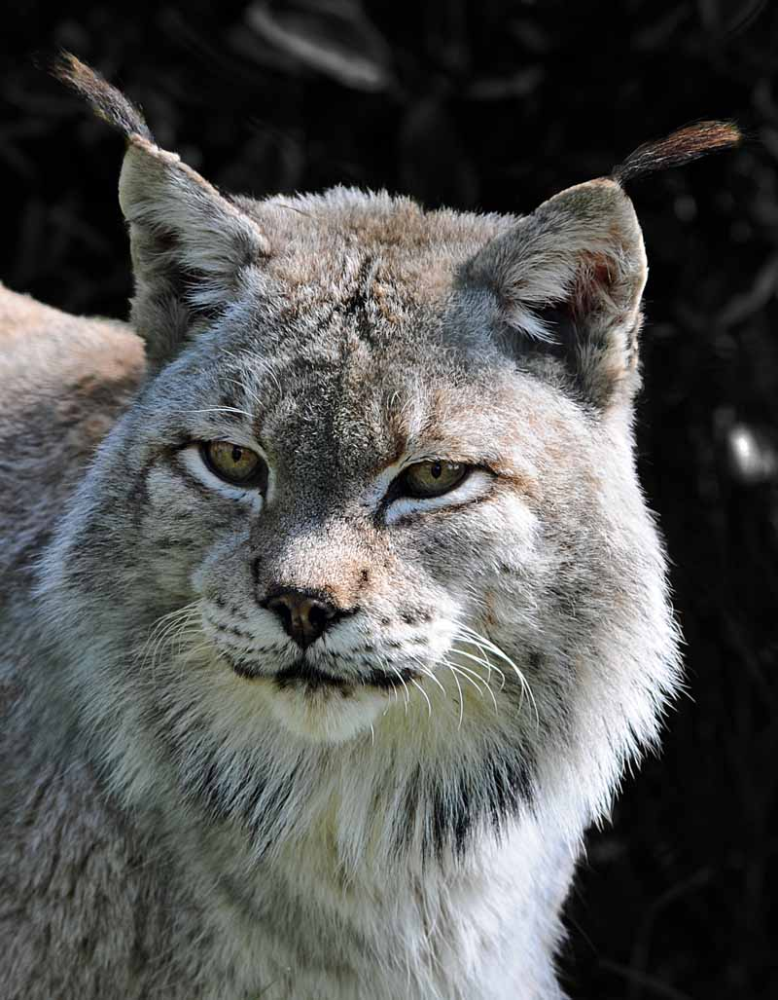
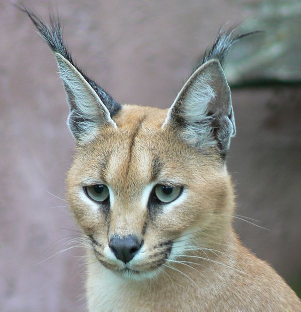
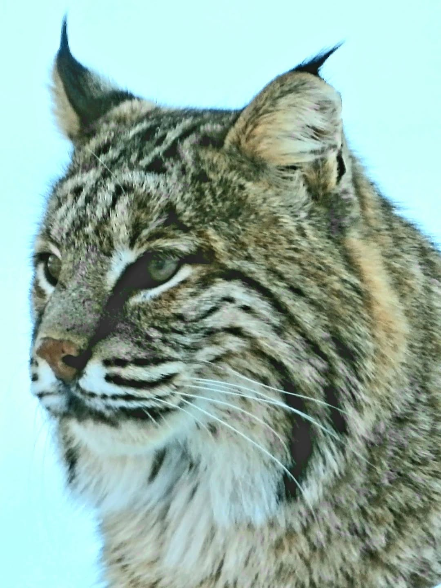
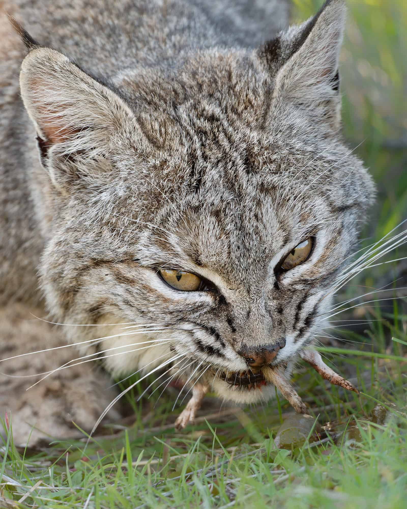

# 고양이과 최강 스라소니 퓨마 표범 전투력 순위 정리

중형 고양이과에서는 유라시아스라소니가 가장 강력한 전투력을 가진다. 체급과 골격, 야생성, 사냥 방식까지 비교해 TOP10과 퓨마·표범의 차이까지 함께 정리한다.

## 핵심 요약

* 전투력은 체급보다 골격과 근육 구조, 야생성까지 함께 고려해야 한다.
* 유라시아스라소니는 중형 고양이과 가운데 가장 강력한 체급과 완력을 갖춘 종이다.
* 카라칼은 작은 체구에도 불구하고 매우 높은 공격성과 치악력을 보유한다.
* 캐나다스라소니와 보브캣은 서로 다른 생태적 특화를 가진 순수 야생종이다.
* 블링스는 캐나다스라소니와 보브캣 사이에서 자연적으로 나타나는 하이브리드다.
* 카라캣과 사바나캣은 야생 혈통을 이어받았지만 집고양이 유전자의 영향도 함께 받는다.
* 서벌은 뛰어난 사냥 능력을 가졌지만 정면 육탄전에는 특화된 종이 아니다.
* 삵은 체급은 작지만 야생성이 매우 강한 소형 포식자다.
* 뱅갈고양이는 일반 반려묘보다 야생성이 강하지만 순수 야생종과는 차이가 있다.
* 퓨마는 포효하지 못하지만 체급은 대형 맹수 수준이며, 표범과 자주 비교되는 이유가 있다.

## 전투력 순위는 어떤 기준으로 비교했을까?

야생동물의 전투력을 정확하게 수치화하는 공식은 존재하지 않는다. 실제 자연에서는 체급, 경험, 성별, 나이, 건강 상태, 지형 등 수많은 변수가 작용하기 때문이다.

이번 순위는 동일한 조건에서 성체 수컷끼리 정면으로 충돌한다고 가정했을 때의 종합적인 전투력을 기준으로 정리했다.

비교 요소는 다음과 같다.

* 평균 체중과 최대 체중
* 골격과 근육 밀도
* 앞발과 뒷다리의 완력
* 치악력과 목 제압 능력
* 야생성 및 공격성
* 실제 사냥 방식
* 생존 경쟁에서 축적된 전투 경험

단순히 몸무게만 큰 동물이 아니라 실제 육탄전에서 얼마나 강한지를 중심으로 순위를 선정했다.

## 고양이과 전투력 TOP 10

| 순위 | 종 | 평균 체중 | 특징 |
| --- | --- | --- | --- |
| 1 | 유라시아스라소니 | 18~30kg | 중형 고양이과 최강의 체급과 완력 |
| 2 | 카라칼 | 10~18kg | 높은 공격성과 치악력 |
| 3 | 캐나다스라소니 | 8~18kg | 긴 다리와 거대한 발을 가진 설원 특화형 |
| 4 | 블링스 | 10~15kg | 캐나다스라소니와 보브캣의 자연 교배종 |
| 5 | 보브캣 | 7~15kg | 매우 호전적인 북미 야생종 |
| 6 | 카라캣(F1) | 11~15kg | 카라칼과 집고양이의 교배종 |
| 7 | 사바나캣(F1) | 8~15kg | 서벌과 집고양이의 교배종 |
| 8 | 서벌 | 9~18kg | 긴 다리와 뛰어난 사냥 능력 |
| 9 | 삵 | 3~7kg | 작은 체급의 순수 야생 포식자 |
| 10 | 뱅갈고양이(F1) | 5~8kg | 삵 혈통을 이어받은 하이브리드 |

## 1위 유라시아스라소니 vs 2위 카라칼

### 체급과 골격

유라시아스라소니는 평균 체중부터 카라칼보다 한 체급 위에 위치한다.  
특히 혹한 환경에서 살아남기 위해 진화한 두꺼운 골격과 넓은 흉곽은 정면 충돌에서 큰 장점이 된다.

반면 카라칼은 몸집은 작지만 근육 밀도가 매우 높으며, 폭발적인 순발력과 점프 능력을 갖춘 전형적인 공격형 체형이다.

### 전투 양상

초반은 카라칼이 빠른 움직임으로 공격을 시도할 가능성이 높다.  
그러나 시간이 지날수록 몸을 밀착시키는 근접전에서는 유라시아스라소니의 체중과 완력이 크게 작용한다.  
앞발의 압박과 체중을 이용한 제압이 시작되면 카라칼은 움직임이 제한되고, 결국 목을 제압당할 가능성이 높다.

### 종합 평가

순발력은 카라칼이 우세하지만, 체급과 골격의 차이를 뒤집기는 어렵다.  
유라시아스라소니가 안정적으로 우세하다.

## 2위 카라칼 vs 3위 캐나다스라소니

### 체급과 신체 구조

두 종은 평균 체급이 상당히 비슷하다. 

캐나다스라소니는 긴 다리와 매우 큰 발을 이용해 깊은 눈에서도 자유롭게 움직인다.  
카라칼은 상대적으로 짧고 단단한 몸체에 근육이 집중되어 있으며 순간 폭발력이 매우 뛰어나다.

### 전투 양상

캐나다스라소니는 리치를 살려 거리를 유지하려고 할 가능성이 높다.  

반면 카라칼은 빠르게 안쪽으로 파고들어 몸을 붙이는 전투를 선호할 가능성이 크다.  
체급은 비슷하지만 공격성이 높은 카라칼이 초반 주도권을 가져갈 가능성이 높으며, 근접전에서도 치악력과 근육 밀도가 강점으로 작용한다.

### 종합 평가

큰 차이는 아니지만 카라칼이 조금 더 우세한 것으로 평가할 수 있다.

## 3위 캐나다스라소니 vs 4위 블링스

### 체급과 혈통

블링스는 캐나다스라소니와 보브캣이 자연적으로 교배하면서 나타나는 하이브리드다.

보브캣의 공격성과 캐나다스라소니의 체형을 함께 물려받았지만, 전체적인 체격은 순수 캐나다스라소니가 조금 더 안정적이다.

### 전투 양상

블링스는 적극적으로 압박하는 전투를 펼칠 가능성이 높다.

하지만 캐나다스라소니 역시 완전한 야생 포식자이며, 긴 다리와 넓은 앞발을 이용한 견제가 뛰어나다.  
체급이 비슷할 경우 긴 리치가 조금 더 유리하게 작용할 가능성이 있다.

### 종합 평가

치열한 승부가 예상되지만 캐나다스라소니가 근소하게 앞선다.

## 4위 블링스 vs 5위 보브캣

### 체급과 골격

두 종 모두 매우 공격적인 성향을 가지고 있다.

다만 블링스는 캐나다스라소니의 혈통을 이어받아 평균 체격과 다리 길이가 조금 더 크다.  
보브캣은 몸집은 작지만 매우 단단하고 끈질긴 전투 성향을 보인다.

### 전투 양상

양쪽 모두 쉽게 물러서지 않는 난타전이 될 가능성이 높다.  
하지만 동일한 공격성을 가진 상황이라면 조금 더 긴 리치와 큰 체격이 우위를 만든다.

### 종합 평가

블링스가 체격의 우세를 살려 승리할 가능성이 높다.

*고양이과 보브캣*

## 5위 보브캣 vs 6위 카라캣(F1)

### 체급과 야생성

카라캣은 카라칼의 혈통을 이어받아 외형적으로 상당히 강인해 보인다.  
하지만 집고양이 혈통이 함께 포함되어 있으며, 순수 야생 환경에서 살아온 보브캣과는 생활 방식 자체가 다르다.  
보브캣은 야생에서 사냥과 생존 경쟁을 반복하며 축적된 경험을 가진 순수 포식자다.

### 전투 양상

초반에는 체급 차이가 거의 없기 때문에 팽팽한 승부가 이어질 수 있다.  
그러나 전투가 길어질수록 보브캣의 경험과 지속적인 압박 능력이 강점으로 작용할 가능성이 높다.

### 종합 평가

카라캣 역시 매우 강력한 하이브리드지만, 순수 야생 포식자인 보브캣이 조금 더 우세한 것으로 볼 수 있다.

## 6위 카라캣(F1) vs 7위 사바나캣(F1)

### 체급과 골격

두 종 모두 집고양이와 야생 고양이의 혈통을 함께 가진 하이브리드다.  
평균 체중은 비슷하지만 체형은 상당히 다르다.

카라캣은 카라칼의 영향을 받아 몸통이 두껍고 근육 밀도가 높은 편이다.  
반면 사바나캣은 서벌의 영향을 받아 다리가 매우 길고 전체적으로 날씬한 체형을 가진다.

### 전투 양상

사바나캣은 긴 다리와 리치를 이용해 거리를 유지하려고 한다.

하지만 근접전으로 전환되면 카라캣의 단단한 몸통과 높은 근육 밀도가 유리하게 작용할 가능성이 크다.  
특히 몸을 밀착시키는 상황에서는 카라칼 혈통에서 이어진 앞발의 힘과 턱 힘이 강점이 된다.

### 종합 평가

사바나캣은 뛰어난 운동 능력을 갖췄지만 정면 육탄전에서는 카라캣이 조금 더 안정적인 우위를 가진다.

## 7위 사바나캣(F1) vs 8위 서벌

### 체급과 신체 구조

사바나캣은 서벌을 기반으로 만들어진 하이브리드다.  
외형은 매우 비슷하지만 집고양이 혈통이 더해지면서 몸통이 조금 더 두꺼워지고 근육량도 증가하는 경우가 많다.

서벌은 긴 다리와 긴 목을 가진 대표적인 속도형 포식자다.

### 전투 양상

서벌은 야생에서 작은 포유류와 새를 사냥하는 데 특화되어 있으며 불필요한 정면 충돌을 피하는 성향이 강하다.

반면 사바나캣은 반려 환경에서 자라더라도 영역 방어 성향을 보이는 개체가 적지 않다.  
순수한 생존 경쟁에서는 서벌의 경험이 앞설 수 있지만, 동일 조건에서 육탄전만 가정하면 조금 더 두꺼운 체형의 사바나캣이 유리할 가능성이 있다.

### 종합 평가

큰 차이는 아니지만 정면 승부에서는 사바나캣이 근소하게 우세하다.

## 8위 서벌 vs 9위 삵

### 체급과 체형

서벌은 평균 체중과 신장에서 삵보다 확실히 크다.  
특히 다리 길이와 앞발의 타점은 삵보다 훨씬 유리하다.  
삵은 몸집은 작지만 단단한 골격과 높은 야생성을 가진 소형 포식자다.

### 전투 양상

삵은 끝까지 저항하는 성향이 강하지만 체급 차이를 극복하기는 쉽지 않다.  
서벌은 긴 다리를 이용해 거리를 유지하면서 공격할 수 있으며, 삵은 접근 자체가 쉽지 않다.  
접근에 성공하더라도 체중 차이가 그대로 작용한다.

### 종합 평가

삵의 투지는 인정할 수 있지만 체급 차이가 승패를 좌우한다.

서벌이 우세하다.

## 9위 삵 vs 10위 뱅갈고양이(F1)

### 체급과 혈통

뱅갈고양이는 삵의 혈통을 이어받았지만 집고양이의 유전자가 함께 포함되어 있다.  
체중은 비슷하거나 일부 개체는 뱅갈고양이가 조금 더 무거울 수도 있다.  
그러나 야생 환경에서 살아가는 방식은 전혀 다르다.

### 전투 양상

삵은 매일 사냥과 생존 경쟁을 반복하는 순수 야생 포식자다.

반면 뱅갈고양이는 야생성을 상당 부분 유지하고 있지만 반려묘로 개량된 품종이다.  
같은 체급이라면 실제 사냥 경험과 공격 기술에서 삵이 우위를 점할 가능성이 높다.

### 종합 평가

삵이 보다 안정적으로 우세한 결과를 만들 가능성이 크다.

## 빅 캣(Big Cat)과 중형 고양이과는 무엇이 다를까?

많은 사람이 퓨마나 스라소니도 빅 캣이라고 생각하지만, 생물학적 분류는 조금 다르다.

### 포효 구조가 다르다

사자, 호랑이, 표범, 재규어는 표범아과(Pantherinae)에 속하며 포효가 가능하다.

반면 스라소니, 카라칼, 서벌, 삵, 퓨마는 고양이아과(Felinae)에 속한다.  
이들은 포효 대신 다양한 울음소리와 그르렁거림(Purring)을 낼 수 있다.

즉, 포효 여부는 강함이 아니라 발성 기관의 구조 차이다.

### 사냥 방식이 다르다

표범아과는 큰 먹잇감을 힘으로 제압하는 능력이 뛰어나다.

반면 고양이아과는 민첩성과 점프력, 기습 능력이 더욱 발달했다.  
특히 카라칼과 서벌은 공중으로 뛰어올라 새를 사냥할 정도의 운동 능력을 가진다.

### 동공도 다르다

호랑이와 사자, 표범은 둥근 동공을 가진다.

삵이나 카라칼 등 대부분의 중소형 고양이과는 세로 동공을 가진다.   
다만 스라소니처럼 예외적인 종도 존재한다.

## 퓨마는 왜 표범과 자주 비교될까?

퓨마는 분류학적으로는 고양이아과에 속한다.

하지만 체급은 일반적인 중형 고양이과를 훨씬 넘어서는 대형 포식자다.  
성체 수컷은 지역에 따라 100kg 이상까지 성장하는 개체도 보고된다.

이 때문에 실제 체급에서는 표범과 자주 비교된다.  
다만 두 종 가운데 어느 쪽이 절대적으로 강하다고 단정하기는 어렵다.  
평균 체급은 퓨마가 조금 더 큰 경우가 많다.  
반면 표범은 앞다리 근력과 나무를 오르며 먹이를 운반하는 능력이 매우 뛰어나다.

두 종 모두 최상위 포식자이며, 개체 크기와 환경에 따라 결과는 달라질 수 있다.

## 결론

고양이과의 전투력은 단순히 몸무게만으로 결정되지 않는다.

골격과 근육의 밀도, 사냥 방식, 야생 환경에서 축적한 경험까지 모두 영향을 준다.  
중형 고양이과에서는 유라시아스라소니가 가장 뛰어난 체급과 완력을 갖춘 종으로 평가할 수 있으며, 카라칼과 캐나다스라소니, 보브캣도 각자의 환경에 특화된 뛰어난 포식자다.

또한 퓨마는 고양이아과에 속해 포효하지 못하지만, 체급은 대형 맹수 수준까지 성장하는 예외적인 종이다. 반대로 표범은 표범아과에 속하는 전형적인 빅 캣이다. 따라서 두 종은 분류학적으로는 다르지만 체급이 비슷해 자주 비교되며, 포효 여부와 실제 전투력은 서로 다른 기준이라는 점을 구분해서 이해하는 것이 중요하다.

## 자주 묻는 질문(FAQ)

### 퓨마는 빅 캣인가?

아니다. 퓨마는 고양이아과(Felinae)에 속하며 표범아과(Pantherinae)가 아니다.

### 퓨마는 왜 포효하지 못할까?

발성 기관인 설골 구조가 사자나 호랑이와 다르기 때문이다. 대신 다양한 울음소리와 그르렁거림을 낼 수 있다.

### 퓨마가 표범보다 강한가?

평균 체급은 퓨마가 조금 더 큰 편이다. 하지만 표범 역시 매우 강력한 포식자이므로 어느 한쪽이 항상 우세하다고 단정하기는 어렵다.

### 표범은 왜 빅 캣으로 분류되나?

표범은 표범아과에 속하며 포효가 가능한 구조를 가지고 있기 때문이다.

### 유라시아스라소니는 정말 중형 고양이과 최강인가?

평균 체급과 골격, 완력을 종합하면 현존하는 중형 고양이과 가운데 가장 강력한 축에 속한다.

### 카라칼은 왜 체급보다 강하게 평가받을까?

매우 높은 근육 밀도와 공격성, 폭발적인 점프력, 뛰어난 치악력을 동시에 갖추고 있기 때문이다.

### 카라캣과 사바나캣은 야생동물인가?

야생 혈통을 가지고 있지만 인간이 만든 하이브리드 품종이다.  
순수 야생종과는 생태적 특성이 다르다.