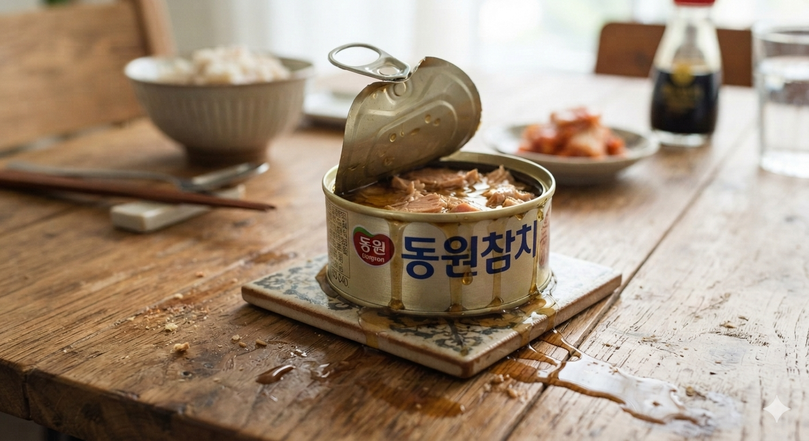

# 참치캔 기름은 버려야 할까? 영양 가치와 활용법 및 폐기 방법

참치캔 기름은 방부제가 아닌 식용 유지이며, 제조 과정과 영양 성분을 이해하면 섭취 여부와 활용 방법을 합리적으로 선택할 수 있다. 참치 통조림은 오랜 시간 동안 가정에서 활용된 대표적인 저장식품으로, 높은 단백질 함량과 편리한 조리성을 동시에 갖춘 식재료다. 하지만 캔을 개봉했을 때 보이는 노란색 액체를 두고 "버려야 하는 기름", "몸에 좋지 않은 첨가물", "참치 가공 과정에서 나온 불순물"이라고 생각하는 경우가 많다.

그러나 참치캔 속 기름은 제조 과정에서 의도적으로 사용되는 식용 유지다. 이 기름은 참치 살코기의 식감을 유지하고 풍미를 보존하는 역할을 하며, 경우에 따라 참치에서 나온 지방 성분과 지용성 영양소도 포함할 수 있다. 다만 지방은 높은 열량을 가진 영양소이기 때문에 모든 사람에게 같은 방식으로 적합한 것은 아니다.

체중 감량이나 지방 섭취 제한이 목표라면 기름을 제거하는 것이 합리적일 수 있다. 반대로 음식의 풍미, 지방 섭취, 조리 활용성을 고려한다면 기름을 버리지 않고 활용하는 방법도 가치가 있다. 따라서 참치캔 기름에 대한 올바른 판단은 "좋다" 또는 "나쁘다"의 문제가 아니라 **섭취 목적과 영양 관리 기준에 따른 선택**으로 접근해야 한다.

## 핵심 요약

* 참치캔 속 기름은 **화학 방부제가 아니라 식용 식물성 유지**이며, 통조림 보존은 살균 공정을 통해 이루어진다.
* 기름은 참치 살코기의 건조를 막고 부드러운 식감과 풍미를 유지하기 위해 사용된다.
* 기름을 포함하면 열량과 지방 섭취량은 증가하지만, 참치에서 나온 일부 불포화지방산과 풍미 성분을 함께 섭취할 수 있다.
* 기름을 제거하면 단백질 함량은 크게 변하지 않으면서 전체 열량을 약 40~50% 줄일 수 있다.
* 참치캔 원료로 주로 사용되는 가다랑어는 대형 참치보다 메틸수은 축적 위험이 낮은 어종이다.
* 참치 기름은 하수구에 버리면 환경 문제와 배관 막힘을 유발할 수 있으므로 올바른 폐기 방법이 필요하다.

## 1. 참치캔 기름에 대한 대표적인 오해는 무엇일까?

참치캔을 개봉하면 살코기 주변에 노란색 기름이 보인다. 많은 소비자는 이 액체를 장기간 보관하기 위한 화학 방부제나 가공 과정에서 생긴 불필요한 부산물로 생각한다. 그러나 이러한 인식은 통조림 제조 원리를 이해하면 달라진다.

통조림 식품은 기본적으로 **밀봉과 살균**을 통해 보존성을 확보한다. 참치캔 역시 참치 살코기, 식물성 유지, 조미액 등을 금속 캔에 담은 뒤 고온·고압 환경에서 살균하는 레토르트 공정을 거친다.

레토르트 공정은 밀봉된 상태에서 열을 가해 식품 내부의 미생물을 제거하는 방식이다. 이 과정에서는 부패를 일으키는 일반 세균뿐 아니라 식품 안전과 관련된 주요 미생물도 관리된다. 따라서 정상적으로 제조된 참치캔은 별도의 화학 방부제를 첨가하지 않아도 장기간 보관이 가능하다.

즉, 캔 속 기름은 보존제를 대신하는 물질이 아니다. 제조사가 식품 품질을 유지하기 위해 선택한 **하나의 식품 구성 요소**다.

이러한 오해가 생긴 이유는 가공식품에 대한 소비자의 불안과 기름 자체에 대한 부정적인 이미지가 결합했기 때문이다. 지방은 과거부터 비만과 성인병의 원인으로 단순하게 인식되는 경우가 많았지만, 현대 영양학에서는 지방 역시 신체 유지에 필요한 필수 영양소로 분류한다.

중요한 것은 지방의 존재 자체가 아니라 어떤 지방인지, 얼마나 섭취하는지, 그리고 개인의 식단에서 어떤 역할을 하는지다.

## 2. 참치캔 제조 과정에서 기름은 어떤 역할을 할까?

참치 살코기는 단백질 함량이 높은 식품이지만, 고온 살균 과정에서 식감 변화가 발생할 수 있다. 단백질은 열을 받으면 구조가 변하고 수분이 빠져나가면서 건조하고 단단한 식감을 만들 수 있다.

이때 캔 내부의 기름은 여러 역할을 수행한다.

* 살코기 조직 사이에 위치해 수분 손실로 인한 퍽퍽함을 줄인다.
* 지방 성분이 풍미를 전달해 참치 특유의 고소한 맛을 유지한다.
* 조리 과정에서 별도의 기름 사용을 줄일 수 있는 재료가 된다.

참치캔 제조에서 기름을 사용하는 목적은 단순히 제품의 양을 늘리는 것이 아니다. 장기간 저장되는 식품의 품질을 유지하고 소비자가 섭취할 때 만족도를 높이기 위한 기술적 선택이다.

사용되는 기름의 종류도 시대에 따라 변화했다. 과거에는 가격 경쟁력이 높은 대두유가 많이 활용되었지만, 최근에는 소비자의 건강 관심과 제품 다양화에 따라 카놀라유, 올리브유, 포도씨유 등 다양한 식물성 유지가 사용된다.

각 유지마다 지방산 구성과 풍미 특성이 다르기 때문에 제품 선택 시에는 단순히 "기름참치"라는 분류보다 어떤 유지가 사용되었는지를 확인하는 것이 도움이 된다.

## 3. 참치캔 기름 포함 여부에 따른 열량 차이는 얼마나 될까?

참치캔 기름 섭취 여부에서 가장 현실적인 기준은 **칼로리와 지방 함량**이다. 지방은 1g당 약 9kcal의 에너지를 제공하기 때문에 소량 차이도 전체 열량에 영향을 준다.

일반적인 참치 제품은 기름 포함 여부에 따라 다음과 같은 차이를 보인다.

| 구분       | 기름참치(기름 포함)   | 기름 제거 참치      | 물참치         |
| -------- | ------------- | ------------- | ----------- |
| 100g당 열량 | 약 200~210kcal | 약 108~120kcal | 약 70~90kcal |
| 지방 함량    | 약 12~15g 이상   | 약 1~3g        | 약 1~3g      |
| 특징       | 풍미와 지방 섭취 가능  | 칼로리 감소        | 지방 제한에 적합   |

150g 용량의 참치캔을 기준으로 하면 기름 포함 섭취 시 약 270~315kcal 수준이 될 수 있다. 반면 기름을 충분히 제거하면 약 160~180kcal 수준으로 감소한다.

단백질 함량은 크게 변하지 않는다. 즉, 기름 제거는 단백질 손실을 최소화하면서 지방과 열량을 줄이는 방법이다.

이 때문에 체중 감량이나 체지방 조절이 중요한 사람에게는 기름 제거 또는 물참치 선택이 유리하다. 반면 운동량이 많거나 하루 식단에서 적절한 지방 섭취가 필요한 사람이라면 기름을 활용하는 방식도 충분히 고려할 수 있다.

## 4. 참치캔 기름을 버리면 오메가-3도 함께 줄어들까?

참치캔 기름을 버릴지 결정할 때 많은 사람이 고민하는 부분은 **오메가-3 지방산과 같은 유용한 영양 성분이 함께 사라지는가**이다. 참치는 대표적인 생선 단백질 공급원일 뿐 아니라 EPA(Eicosapentaenoic Acid)와 DHA(Docosahexaenoic Acid) 같은 불포화지방산을 포함하고 있다.

오메가-3 지방산은 물에 녹는 성분이 아니라 지방에 잘 녹는 **지용성 성분**이다. 따라서 참치 통조림 제조 과정에서 열처리와 저장 과정이 진행되면 참치 살코기 내부에 있던 일부 지방 성분이 주변의 기름층으로 이동할 수 있다.

이 과정 때문에 참치캔 기름을 모두 따라 버리면 단순히 추가된 기름만 제거되는 것이 아니라, 참치 원물에서 나온 일부 지방 성분까지 함께 버려질 가능성이 있다.

그러나 여기서 주의해야 할 점은 "기름을 버리면 오메가-3가 모두 사라진다"는 식의 해석은 정확하지 않다는 것이다. 참치 살코기 자체에도 영양 성분은 남아 있으며, 오메가-3 섭취 목적이라면 참치캔만이 아니라 고등어, 연어 등 다양한 생선을 통해 보충할 수 있다.

따라서 기름 제거 여부는 영양 손실과 열량 감소 사이의 균형 문제로 판단해야 한다.

* **체중 감량이 목표인 경우:** 지방과 열량 감소 효과가 크기 때문에 기름 제거가 유리하다.
* **풍미와 지방 섭취가 중요한 경우:** 기름을 활용하는 것이 효율적이다.
* **균형 잡힌 식단을 유지하는 경우:** 전체 하루 지방 섭취량 안에서 조절하면 된다.

참치캔 기름을 가장 효율적으로 활용하는 방법은 별도로 섭취하는 것이 아니라 기존 조리에 사용하는 것이다. 예를 들어 김치찌개, 볶음밥, 파스타, 채소 볶음 등에 참치캔 기름을 사용하면 추가 기름 사용을 줄이면서 참치 특유의 풍미를 살릴 수 있다.

즉, 참치캔 기름은 버려야 하는 잉여물이 아니라 상황에 따라 조리용 지방으로 활용 가능한 식재료다.

## 5. 참치캔 기름과 나트륨 섭취에 대한 오해

참치캔 기름을 버리는 또 다른 이유는 나트륨 섭취를 줄이기 위해서라는 생각이다. 하지만 실제 참치 통조림의 나트륨 구조를 보면 이러한 방법은 제한적인 효과만 가진다.

참치캔의 나트륨은 대부분 기름이 아니라 **참치 살코기와 제조 과정에서 첨가된 염분**에 포함되어 있다. 참치 통조림은 장기간 보관과 맛 유지를 위해 원료 손질, 염지, 조미 과정을 거치며, 이 과정에서 소금 성분이 살코기 조직 내부에도 남는다.

따라서 기름을 따라낸다고 해서 참치 전체의 나트륨이 크게 줄어드는 것은 아니다.

예를 들어 150g 용량의 참치캔을 기준으로 보면 제품에 따라 차이는 있지만 전체 나트륨 함량은 약 500mg 전후 수준이다. 기름 제거를 통해 일부 나트륨 감소 효과가 발생할 수 있지만, 감소량은 제한적이며 살코기 내부에 존재하는 염분까지 제거하지는 못한다.

나트륨 섭취를 관리해야 하는 사람이라면 단순히 기름을 버리는 것보다 다음과 같은 방법이 더욱 효과적이다.

* 저염 참치 제품을 선택한다.
* 참치 살코기를 체에 받쳐 액체 성분을 충분히 제거한다.
* 필요한 경우 짧게 데쳐 염분을 일부 감소시킨다.
* 참치캔 외 다른 식품에서 섭취하는 나트륨까지 함께 관리한다.

특히 고혈압, 심혈관 질환, 만성 콩팥병 등으로 나트륨 제한이 필요한 경우에는 특정 식품 하나의 처리 방식보다 하루 전체 식단 관리가 중요하다.

참치캔 기름을 버리는 것이 나트륨 관리의 핵심이라고 생각하는 것은 정확하지 않다. 나트륨 조절은 제품 선택과 전체 섭취 패턴을 함께 고려해야 한다.

## 6. 참치캔 섭취 시 수은 위험은 어떻게 봐야 할까?

참치와 관련된 대표적인 건강 우려 가운데 하나는 **메틸수은(Methylmercury)** 축적 문제다. 수은은 해양 생태계에서 먹이사슬을 따라 축적되는 특성이 있기 때문에, 일반적으로 크기가 크고 오래 사는 포식성 어류일수록 체내 농도가 높아질 가능성이 있다.

하지만 모든 참치가 같은 수준의 위험성을 가지는 것은 아니다. 참치캔에 주로 사용되는 원료 어종과 회·초밥용으로 소비되는 대형 참치는 생태적 특징이 다르다.

| 구분        | 가다랑어(Skipjack Tuna) | 참다랑어·눈다랑어 등 대형 참치 |
| --------- | ------------------- | ----------------- |
| 주요 용도     | 참치 통조림              | 고급 회, 초밥          |
| 크기        | 비교적 작은 어종           | 대형 어종             |
| 성장 기간     | 짧은 편                | 긴 편               |
| 수은 축적 가능성 | 상대적으로 낮음            | 상대적으로 높음          |

참치캔의 주요 원료인 가다랑어는 성장 속도가 빠르고 수명이 짧은 어종이다. 반면 참다랑어나 눈다랑어 같은 대형 참치는 오랜 기간 해양 생태계 상위 단계에서 생활하기 때문에 상대적으로 더 많은 중금속이 축적될 가능성이 있다.

따라서 "참치는 수은 때문에 위험하다"라는 표현은 지나치게 단순화된 것이다. 어떤 어종인지, 얼마나 자주 먹는지, 대상자가 누구인지에 따라 평가가 달라진다.

일반 성인은 권장 섭취 기준 안에서 참치캔을 섭취하면 대부분 안전한 수준으로 관리할 수 있다. 다만 임산부, 영유아, 어린이는 메틸수은 영향에 상대적으로 민감할 수 있기 때문에 섭취량 관리가 필요하다.

대상별 관리 기준은 다음과 같다.

| 대상        | 섭취 관리 기준            |
| --------- | ------------------- |
| 일반 성인     | 주당 약 250~400g 수준 관리 |
| 임산부·수유부   | 주당 권장량을 준수하며 분할 섭취  |
| 1~2세 유아   | 소량 섭취 권장            |
| 3~6세 어린이  | 연령과 체중 고려           |
| 7~10세 어린이 | 성인 기준보다 낮게 관리       |

참치캔은 편리하고 영양 가치가 높은 식품이지만, 어떤 식품이든 과도한 반복 섭취보다는 다양한 식재료와 함께 균형 있게 섭취하는 것이 중요하다.

## 7. 참치캔 제품 유형별 선택 기준

최근 참치캔 시장은 소비자의 다양한 요구에 맞춰 여러 형태로 세분화되고 있다. 과거에는 단순히 기름참치와 물참치 정도로 구분되었지만, 현재는 사용된 유지 종류와 첨가 재료에 따라 선택 폭이 넓어졌다.

| 제품 유형        | 특징                 | 적합한 대상           |
| ------------ | ------------------ | ---------------- |
| 대두유 참치       | 전통적인 형태, 가격 경쟁력 우수 | 가성비 중심 소비자       |
| 올리브유·포도씨유 참치 | 풍미와 유지 품질 중시       | 샐러드, 파스타 등 활용 목적 |
| 물참치          | 지방과 열량 최소화         | 다이어트, 지방 제한 식단   |
| 양념 참치        | 별도 조리 없이 섭취 가능     | 간편식 선호자          |

물참치는 지방 함량과 열량을 줄이는 데 초점이 맞춰진 제품이다. 따라서 체중 관리나 운동 목적의 식단에서는 활용도가 높다.

반면 올리브유나 포도씨유 참치는 단순한 단백질 공급을 넘어 음식의 풍미를 높이는 용도로 활용하기 좋다. 특히 조리 과정에서 별도의 기름 사용을 줄일 수 있다는 장점이 있다.

결국 어떤 참치캔이 가장 좋은지는 제품 자체의 우열보다 소비 목적에 따라 결정된다. 단백질만 필요한지, 칼로리를 관리하는지, 요리 재료로 활용하는지에 따라 선택 기준이 달라진다.

## 8. 참치캔 기름의 올바른 폐기 방법과 환경 영향

참치캔 기름은 식용으로 활용할 수 있지만, 모든 상황에서 먹어야 하는 것은 아니다. 사용하지 않고 버리기로 결정했다면 가장 중요한 원칙은 **하수구에 직접 흘려보내지 않는 것**이다.

많은 사람이 소량의 기름는 물과 함께 흘려보내도 문제가 없다고 생각하지만, 기름은 물과 쉽게 섞이지 않는 성질을 가지고 있다. 하수관 내부로 들어간 기름은 낮은 온도의 환경에서 점차 굳을 수 있으며, 다른 음식물 찌꺼기와 결합하면서 배관 막힘의 원인이 된다.

특히 여러 가정과 업소에서 반복적으로 배출되는 기름은 하수 시스템 전체에 부담을 줄 수 있다. 해외에서는 하수관 내부에 축적된 거대한 기름 덩어리를 **패트버그(Fatberg)**라고 부르며, 이는 하수 처리 비용 증가와 환경 문제의 원인으로 지적된다.

참치캔 하나에 들어 있는 기름의 양은 많지 않지만, 수많은 가정에서 동일한 방식으로 배출하면 누적 영향은 커진다. 따라서 올바른 폐기 방법을 알고 실천하는 것이 필요하다.

참치캔 기름을 버릴 때는 다음과 같은 방법이 적절하다.

* 키친타월, 신문지, 폐종이 등에 기름을 충분히 흡수시킨다.
* 흡수된 종이는 일반쓰레기 종량제 봉투에 배출한다.
* 기름 양이 많은 경우에는 시중의 기름 응고제를 활용한다.

기름을 흡수시키는 이유는 액체 상태로 흘러나가는 것을 막기 위해서다. 폐기 과정에서 중요한 것은 기름을 완전히 제거하는 것이 아니라, 환경으로 직접 유출되지 않는 상태로 만드는 것이다.

## 9. 참치캔 용기의 올바른 분리배출 방법

참치캔은 재활용 가치가 높은 금속 자원이다. 하지만 캔 내부에 참치 찌꺼기나 기름이 남아 있는 상태로 배출하면 재활용 과정에서 문제가 발생할 수 있다.

올바른 분리배출은 단순히 캔을 버리는 것이 아니라 내용물을 제거하고 재활용 가능한 상태로 만드는 과정까지 포함한다.

참치캔 배출 과정은 다음과 같다.

1. 캔 내부의 참치 살코기와 남은 기름을 완전히 비운다.
2. 주방 세제와 물을 이용해 내부 유분을 제거한다.
3. 물기를 말린 뒤 캔류 또는 금속류 수거함에 배출한다.

특히 원터치 캔은 뚜껑 부분이 날카로울 수 있으므로 손을 다치지 않도록 주의해야 한다. 뚜껑을 안쪽으로 접거나 안전하게 처리한 뒤 배출하는 것이 좋다.

재활용에서 중요한 것은 단순히 분리하는 것이 아니라 **오염을 최소화하는 것**이다. 깨끗하게 처리된 캔은 다시 금속 자원으로 활용될 수 있지만, 음식물과 기름이 심하게 남아 있으면 재활용 효율이 떨어진다.

참치캔 기름을 어떻게 처리하는지는 작은 생활 습관처럼 보이지만, 식품 소비 이후 발생하는 환경 부담까지 고려한다는 점에서 의미가 있다.

## 10. 참치캔 기름을 활용하는 가장 효율적인 방법

참치캔 기름은 단순히 먹거나 버리는 두 가지 선택지만 있는 것이 아니다. 가장 효율적인 활용법은 기존 요리 과정에서 사용하는 **조리용 기름으로 대체하는 것**이다.

참치캔 기름에는 참치 특유의 향과 감칠맛 성분이 포함되어 있기 때문에 음식의 풍미를 높이는 데 활용할 수 있다.

대표적인 활용 방법은 다음과 같다.

* 김치찌개를 끓일 때 냄비에 먼저 사용한다.
* 참치 볶음밥 조리 시 별도의 기름 대신 활용한다.
* 파스타나 채소 볶음의 향미유로 사용한다.
* 마요네즈 기반 샐러드 재료와 함께 활용한다.

이 방식의 장점은 두 가지다.

첫째, 별도의 기름 추가를 줄일 수 있다. 일반적으로 요리를 할 때 참치캔 기름을 버리고 새로운 기름를 넣으면 지방 섭취가 이중으로 발생한다. 반면 참치 기름을 그대로 활용하면 추가 지방 투입을 줄일 수 있다.

둘째, 참치에서 나온 풍미 성분을 음식 전체에 전달할 수 있다. 단순히 버려지는 액체가 아니라 하나의 조리 재료로 활용하는 것이다.

다만 기름 자체의 열량은 유지되기 때문에 무조건 많이 사용하는 것은 적절하지 않다. 하루 전체 지방 섭취량과 요리 목적을 고려해 필요한 만큼 사용하는 것이 중요하다.

## 11. 참치캔을 선택할 때 고려해야 할 기준

참치캔은 모두 같은 제품이 아니다. 소비자는 가격뿐 아니라 자신의 식단 목적과 활용 방식을 기준으로 제품을 선택할 필요가 있다.

### 체중 관리가 목적이라면

체중 감량이나 체지방 감소가 목표라면 물참치 또는 기름 제거 방식이 적합하다. 같은 양의 단백질을 섭취하면서 지방과 열량을 줄일 수 있기 때문이다.

특히 운동을 하면서 단백질 섭취량을 관리하는 사람에게는 물참치가 편리한 선택이 될 수 있다.

### 풍미와 요리 활용이 중요하다면

요리 재료로 사용할 목적이라면 기름참치가 더 적합할 수 있다. 참치 기름은 음식에 고소한 맛을 더하고, 별도의 조리용 기름 사용을 줄이는 역할을 한다.

올리브유, 포도씨유 등 다양한 유지가 사용된 제품은 샐러드나 파스타 같은 요리에 활용하기 좋다.

### 간편한 식사를 원한다면

양념 참치 제품은 별도의 조리 없이 바로 먹을 수 있다는 장점이 있다. 다만 양념이 추가된 만큼 나트륨과 열량을 확인하는 것이 필요하다.

결국 좋은 참치캔은 하나로 정해져 있지 않다. **개인의 건강 목표와 사용 목적에 맞는 제품을 선택하는 것이 가장 합리적인 기준**이다.

## 12. 지속가능한 참치 소비와 앞으로의 변화

최근 식품 산업에서는 단순히 맛과 가격뿐 아니라 환경과 지속가능성을 고려하는 소비가 중요해지고 있다. 참치 산업 역시 이러한 변화에서 예외가 아니다.

참치는 해양 자원을 이용하는 식품이기 때문에 어획 방식과 수산 자원 관리가 중요한 문제로 다뤄진다. 이에 따라 지속가능한 어업 방식으로 생산된 제품을 인증하는 제도도 확대되고 있다.

대표적인 예가 **MSC(Marine Stewardship Council) 인증**이다. MSC 인증은 지속가능한 어업과 해양 생태계 보호를 목표로 하는 국제 인증 체계다.

앞으로 참치캔 소비는 단순히 "어떤 제품이 더 맛있는가"를 넘어 다음과 같은 요소까지 고려하는 방향으로 변화할 가능성이 높다.

* 영양 성분과 건강 효과
* 원료 어종과 안전성
* 생산 과정의 환경 영향
* 포장과 폐기 방식

소비자는 이제 제품을 구매하는 순간부터 폐기하는 과정까지 하나의 소비 과정으로 바라볼 필요가 있다.

## 결론

참치캔 기름에 대한 논란은 결국 기름 자체가 좋은지 나쁜지의 문제가 아니다. 중요한 것은 **성분의 특성을 이해하고 목적에 맞게 활용하는 것**이다.

참치캔 기름은 방부제나 불필요한 부산물이 아니라 제조 과정에서 사용되는 식용 유지다. 살코기의 식감을 유지하고 풍미를 높이며, 일부 지방 성분을 포함할 수 있다는 점에서 분명한 활용 가치가 있다.

하지만 지방은 높은 열량을 가진 영양소이므로 체중 관리가 필요한 경우에는 제거하는 것이 더 적합할 수 있다. 반대로 요리 활용성과 영양 균형을 고려한다면 참치 기름을 조리유로 사용하는 방식이 효율적이다.

수은 문제 역시 모든 참치를 동일하게 보는 것은 정확하지 않다. 참치캔의 주요 원료인 가다랑어와 대형 참치는 생태적 특성이 다르며, 권장 섭취 기준 안에서 관리한다면 일반적인 소비자는 안전하게 이용할 수 있다.

결국 참치캔을 현명하게 활용하는 방법은 하나의 정답을 따르는 것이 아니다. **자신의 건강 목표, 식단 구성, 환경 영향을 함께 고려하는 선택**이 필요하다.

참치캔은 저렴하고 편리한 식품이지만, 그 안에 담긴 기름의 의미까지 이해한다면 단순한 저장식품을 넘어 영양과 자원 활용 측면에서 더욱 가치 있는 식재료로 활용할 수 있다.

## 자주 묻는 질문(FAQ)

### 참치캔 기름은 무조건 버려야 하나?

아니다. 참치캔 기름은 식용 유지이며, 체중 관리가 목적이 아니라면 조리용으로 활용할 수 있다.

### 참치캔 기름을 먹으면 살이 찌는가?

기름은 지방이므로 열량이 높다. 하지만 전체 섭취 열량 안에서 관리한다면 반드시 체중 증가로 이어지는 것은 아니다.

### 참치캔 기름을 버리면 오메가-3가 모두 없어지는가?

아니다. 일부 지방 성분이 함께 제거될 수 있지만, 참치 살코기에도 영양 성분은 남아 있다.

### 참치캔 기름을 싱크대에 버리면 왜 안 되는가?

기름이 하수관 내부에서 굳거나 다른 오염물과 결합해 배관 막힘과 환경 문제를 일으킬 수 있기 때문이다.

### 참치캔은 어떤 제품을 선택하는 것이 좋은가?

목적에 따라 다르다. 다이어트에는 물참치, 요리 활용에는 기름참치, 간편 섭취에는 양념 제품이 적합할 수 있다.

