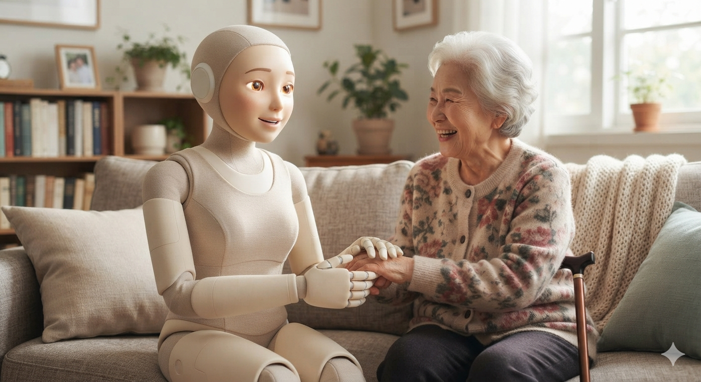

# 돌봄로봇은 고령사회의 삶을 어떻게 바꾸는가?

돌봄로봇은 배설·이동·재활 같은 신체 부담을 줄이고 돌봄 데이터를 활용해 고령자의 안전과 자립, 요양 인력의 지속가능성을 높이는 방향으로 발전하고 있다. 단순히 사람의 일을 대신하는 기계라고 보기에는 역할이 이미 넓어졌다. 배설과 위생 관리부터 보행, 가사, 마사지, 정서적 교감까지 돌봄의 여러 단계에 기술이 들어오면서 돌봄 자체의 운영 방식도 달라지고 있다.

핵심은 로봇이 사람을 모두 대신하는 데 있지 않다. 오히려 사람이 맡아야 할 **정서적 돌봄과 관계 형성**에 집중할 수 있도록 반복적이고 신체 부담이 큰 업무를 분리하는 데 의미가 있다.

## 핵심 요약

* **배설·위생 관리 로봇**은 배뇨와 배변 감지, 흡입, 세척, 건조, 살균을 자동화해 환자의 사생활 보호와 간병 부담 감소를 동시에 겨냥한다.
* **보행·이승 보조 로봇**은 환자의 움직임을 돕고 요양보호사의 허리 부담을 낮춰 고령 인력의 현업 지속을 지원한다.
* **가사·재활·마사지 로봇**은 돌봄의 범위를 생활 지원과 치료 영역으로 넓히며 고령자의 자립적인 생활을 돕는다.
* **반려 로봇과 HRI 기술**은 돌봄의 기능적 측면을 넘어 고독과 정서적 소외에 대응하는 역할까지 확대되고 있다.
* **센서와 데이터 기술**은 돌봄 과정을 수치화해 환자 상태를 기록하고 시설 운영과 품질 관리의 기준을 바꾸고 있다.
* **도입률이 낮은 현실적 이유**는 비용만이 아니라 운영 인력, 디지털 역량, 안전 책임, 수가와 제도 연계 같은 구조적 문제에 있다.

## 1. 왜 돌봄로봇이 필요해졌는가?

한국의 돌봄 환경은 수요와 공급이 동시에 악화되는 구조에 들어섰다. 65세 이상 인구 비율이 빠르게 높아지는 가운데 노인장기요양보험 수급자도 2008년 약 22만 명에서 2024년 116만 명 이상으로 증가했다.

문제는 돌봄을 담당할 인력이 같은 속도로 늘어나지 않는다는 데 있다. 전국 장기요양시설 종사자 가운데 요양보호사 비중이 매우 높고, 낮은 임금과 높은 노동 강도는 새로운 인력의 유입을 막는 요인으로 작용한다. 단순히 사람을 더 채용하는 방식만으로는 구조적인 공급 부족을 해결하기 어렵다.

현장에서 특히 부담이 큰 업무는 분명하다.

* 이승과 이동 보조
* 입욕과 배설 보조
* 반복적인 신체 부축
* 야간 배설 관리
* 재활 과정의 반복적인 동작 지원

이런 업무는 돌봄에서 빠질 수 없지만, 체력 소모가 크고 반복성이 높다. 그래서 돌봄로봇의 초기 활용도 이 영역에 집중된다.

## 2. 배설과 위생 관리부터 로봇이 들어오는 이유는 무엇인가?

배설 관리는 돌봄 가운데서도 가장 반복적이고 부담이 큰 업무에 속한다. 쭤웨이테크의 스마트 배설 케어 로봇은 센서를 이용해 배뇨와 배변을 감지한 뒤 흡입하고, 온수 세척과 온풍 건조, 살균까지 자동으로 수행하는 방식으로 설계됐다.

이 기술의 의미는 단순한 편의성에 그치지 않는다. 배설 과정에서 타인의 직접적인 개입을 줄이면 **사생활과 존엄성**을 지키는 데 도움이 된다. 기저귀 교체가 반복되는 환경에서는 피부와 배설물의 접촉도 중요한 문제인데, 자동 처리는 이런 접촉 시간을 줄이는 방향으로 작동한다.

간병인에게도 변화가 크다. 반복적인 기저귀 교체와 야간 간병 부담을 줄이면 같은 인력으로 더 많은 시간과 주의를 다른 돌봄 업무에 배분할 수 있다.

## 3. 보행과 이승 보조는 누구를 위한 기술인가?

재활 분야에서는 환자의 움직임을 직접 보조하는 외골격 로봇이 활용된다. 마일봇의 BEAR-H1은 고관절, 무릎, 발목의 움직임을 지원하면서 환자의 상태에 따라 동작을 유도하거나 능동적인 보행 참여를 끌어내는 방식으로 사용된다.

치료 과정에서 중요한 것은 단순히 걷게 만드는 데 있지 않다. 터치스크린을 통해 동작 데이터를 확인할 수 있어 물리치료사와 보호자가 환자의 움직임을 함께 관찰할 수 있다는 점이 핵심이다. **재활과 데이터**가 하나의 과정으로 묶이는 셈이다.

요양보호사를 위한 외골격 기술도 같은 맥락에 있다. ULS로보틱스의 FIT-HV PRO는 노인을 부축하거나 옮기는 과정에서 허리에 가해지는 하중을 최대 30kg까지 보조하고, 신체 부담을 약 60% 줄이는 효과를 제시한다.

## 4. 돌봄로봇은 일상생활까지 어디까지 들어오는가?

돌봄의 범위가 병실과 요양시설 안에서만 끝나는 것은 아니다. 고령자의 주거생활을 지원하려면 물건을 옮기고, 간단한 집안일을 하고, 생활 동작을 보조하는 기능도 필요하다.

애스트리봇의 S1은 각 팔당 10kg의 중량을 지탱할 수 있으며 음료 따르기, 옷 개기, 요리 보조 같은 동작을 수행한다. 이런 기능은 복잡한 치료보다 오히려 **생활의 자립성**과 직접 연결된다.

텐센트 로보틱스 엑스 랩의 더 파이브는 물건 운반뿐 아니라 침대에서 일어나는 과정을 보조하는 기능을 포함한다. 특히 고령자에게 치명적인 낙상 위험을 생각하면, 단순한 운반 기능도 안전 관리와 연결된다.

가사 지원과 이동 지원의 경계가 점점 흐려진다. 하나의 기능이 생활 편의와 안전이라는 두 가지 목적을 동시에 갖게 된다.

## 5. 마사지와 반려 로봇은 돌봄의 의미를 어떻게 넓히는가?

리얼맨 로보틱스의 마사지 로봇은 AI 기반 터치 감도와 적응 제어 기술을 활용해 사용자의 상태에 맞춰 마사지 강도와 속도를 조절한다. 음악 재생까지 결합해 치료 과정 전체를 하나의 서비스로 구성한다.

반려 로봇에서는 접근 방식이 다르다. 엘리펀트 로보틱스의 메타캣은 실제 고양이와 비슷한 외형에 울음소리, 골골거리는 소리, 시선 맞추기 같은 상호작용 기능을 더했다. 기능적 필요보다 **정서적 교감**을 중심에 놓은 설계다.

여기서 인간-로봇 상호작용(HRI)이 중요해진다. 로봇이 단순한 기계로 인식되면 기능만 소비하지만, 친숙한 외형과 행동을 갖추면 사용자는 다른 방식으로 반응한다. 돌봄의 대상이 기술과 관계를 형성하도록 설계하는 것이다.

다만 정서적 효과를 치료 효과와 동일하게 볼 수는 없다. 반려 로봇은 정서적 돌봄을 보조하는 수단이지 인간의 관계를 그대로 대체하는 장치는 아니다.

## 6. 돌봄의 품질은 어떻게 데이터로 바뀌는가?

돌봄로봇의 중요한 변화는 움직임보다 **기록**에 있다. 외골격 로봇과 마사지 로봇에 장착된 센서는 관절 움직임, 보행 패턴, 마사지 반응과 같은 정보를 수집한다.

기존 돌봄에서는 환자의 상태를 관찰자의 경험과 주관적인 판단에 의존하는 경우가 많았다. 데이터가 축적되면 동일한 환자의 상태 변화를 시간에 따라 비교할 수 있고, 의료진은 그 기록을 토대로 치료 계획을 조정할 수 있다.

시설 운영에서도 의미가 커진다. 배변 기록이나 이동성 데이터가 중앙 관리 시스템과 연결되면 환자별 상태를 하나의 화면에서 관리하고 인력 배분에도 활용할 수 있다.

이 단계에 들어서면 로봇은 단순한 장비가 아니다. **운영 데이터가 쌓이는 인프라**가 된다.

## 7. 일본의 사례는 무엇을 보여주는가?

일본은 2012년부터 개호 분야의 로봇 활용을 체계적으로 추진해 왔다. 후생노동성과 경제산업성이 개발, 실증, 보급, 제도화를 연결하는 정책 구조를 운영했고, 2024년에는 기존의 '개호 로봇'이라는 범위를 '개호 테크놀로지'로 확대했다.

이 변화는 의미가 분명하다. 개호 현장에서 필요한 기술은 로봇 하드웨어 하나로 끝나지 않기 때문이다. ICT, IoT, 데이터 솔루션까지 묶어야 실제 운영 체계를 만들 수 있다.

한국도 같은 문제를 안고 있다. 실제 현장에서 로봇을 사용하려면 장비만 지급해서는 부족하다. 사용법을 교육하고, 고장에 대응하고, 데이터를 관리하고, 사고가 발생했을 때 책임을 나누는 운영 체계가 필요하다.

## 8. 왜 돌봄로봇은 필요성을 인정받으면서도 도입이 느린가?

한국의 장기요양시설은 소규모 기관 비중이 높고 수익성이 낮다. 평균 영업이익률이 0.45%이고 총비용에서 인건비가 68.9%를 차지하는 구조에서는 새로운 장비의 가격뿐 아니라 유지보수와 교육비도 부담이 된다.

실태조사에서도 돌봄로봇 인지도는 83.6%에 달하지만 실제 도입률은 7.6%에 그친다. 알고 있는 것과 실제 사용하는 것 사이의 간격이 매우 크다.

원인은 여러 층으로 이어진다.

* 장비 구입과 유지보수 비용
* 고령 종사자의 디지털 활용 역량
* 현장 관리 인력 부족
* 오작동과 사고에 대한 책임 문제
* 기존 업무 절차와 새로운 기술의 충돌
* 장기요양 수가와 기술 비용의 연계 부족

핵심 문제는 로봇 자체가 아니다. **운영 모델의 부재**다.

## 9. 돌봄산업의 경쟁력은 인력 수보다 운영 능력으로 이동하는가?

돌봄산업이 기술을 받아들이면 단순한 인력 배치 능력만으로 경쟁력을 설명하기 어려워진다. 장비를 제대로 운영하고 데이터를 기록하며 사고에 대응하고 서비스 품질을 관리하는 능력이 새로운 경쟁 요소가 된다.

특히 아웃소싱 시장에서는 변화가 뚜렷하다. 기존에는 인력 배치와 근무 시간 관리가 중요했다면 앞으로는 장비 가동률, 데이터 정확성, 사고 대응 시간, 디지털 교육 이수율 같은 **기술 기반 운영 지표**가 중요해진다.

서비스수준협약(SLA)의 기준도 달라질 수밖에 없다. 돌봄 기업이 단순한 노동력 공급자가 아니라 돌봄 기술 운영자와 품질 관리자의 역할까지 수행해야 하는 이유다.

이 과정에서 돌봄 아웃소싱은 시설 위탁, 방문요양, 안전관리, 품질관리, 기술 운영이 결합된 형태로 확장된다.

## 10. 돌봄로봇 시대에 반드시 필요한 운영 조건은 무엇인가?

기술을 실제 현장에 정착시키려면 장비 보급만으로는 부족하다. 운영 과정에서 발생하는 다양한 문제를 함께 설계해야 한다.

필요한 조건은 명확하다.

* 성능과 안전성에 대한 표준
* 현장 실증을 거친 활용 매뉴얼
* 고령 종사자를 위한 디지털 역량 교육
* 장기요양 수가와 기술 비용의 연계
* 개인정보 보호 기준
* 장비 고장과 사고에 대한 대응 프로토콜
* 보험 가입 범위와 책임 분담 기준
* 사고 발생 시 데이터 기록과 관리 체계

특히 사고 책임은 중요한 문제다. 하드웨어 결함인지, 네트워크 오류인지, 사용자의 실수인지 구분하지 못하면 기술이 들어온 순간 새로운 분쟁 구조가 생긴다.

돌봄 기술은 의료기기처럼 정확하기만 하면 끝나는 분야가 아니다. **사람·장비·기관·제도**가 함께 움직여야 한다.

## 11. 돌봄의 중심에는 사람이 남는가?

돌봄로봇의 가장 현실적인 역할은 사람을 없애는 것이 아니라 사람이 해야 할 일의 범위를 바꾸는 데 있다. 신체적으로 힘든 반복 업무는 기술이 보조하고, 사람은 관계 형성과 관찰, 위로와 공감처럼 자동화하기 어려운 영역에 더 집중하는 방식이다.

그래서 현실적인 변화는 전면적인 **노동 대체**보다 직무 재설계에 가깝다. 로봇이 힘든 업무를 덜어주면 요양보호사는 환자의 상태를 살피고 대화하며 정서적으로 지원하는 데 더 많은 시간을 사용할 수 있다.

고령 요양보호사가 많은 한국의 구조에서는 이 차이가 더 중요하다. 기술을 이용해 노동 강도를 낮추면 숙련된 인력이 더 오래 현업에 남을 여지가 생긴다.

돌봄의 미래는 로봇과 사람의 경쟁 구도로만 설명하기 어렵다. **로봇이 육체적 부담을 덜고 사람이 관계를 담당하는 구조**가 만들어질 때 기술 도입의 의미가 가장 커진다.

초고령사회에서 중요한 것은 단순히 얼마나 많은 로봇을 보급했는지가 아니다. 고령자가 더 안전하게 생활하고, 돌봄 인력이 덜 소모되며, 시설이 안정적으로 서비스를 운영할 수 있는 구조를 만들었는지가 더 중요하다.

## 결론

돌봄로봇은 배설과 이동처럼 신체 부담이 큰 업무에서 출발해 재활, 가사, 마사지, 정서적 교감까지 활용 범위를 넓히고 있다. 여기에 센서와 데이터 기술이 결합하면서 돌봄은 사람의 경험에 의존하는 서비스에서 상태를 기록하고 관리하는 운영 체계로 변하고 있다.

다만 기술의 필요성과 실제 도입 사이에는 큰 간격이 존재한다. 비용, 인력, 디지털 역량, 사고 책임, 제도와 수가 문제를 해결하지 못하면 좋은 로봇이 현장에 들어와도 제대로 활용하기 어렵다. 돌봄로봇의 성패는 기계의 성능보다 **사람이 기술을 지속적으로 사용할 수 있는 운영 구조**를 만드는 데 달려 있다.

## 자주 묻는 질문(FAQ)

### 돌봄로봇은 요양보호사를 완전히 대체할 수 있는가?

현재 제시된 활용 사례에서는 전면적인 대체보다 신체 부담이 큰 반복 업무를 보조하는 역할이 중심이다. 대화, 관찰, 위로, 공감처럼 인간의 관계 형성이 중요한 영역은 사람의 역할이 남는다.

### 돌봄로봇이 가장 먼저 활용되는 업무는 무엇인가?

배설 관리, 이승 보조, 이동 지원처럼 반복성과 신체 부담이 큰 업무가 대표적이다. 재활과 모니터링도 주요 활용 영역으로 제시된다.

### 돌봄로봇 도입률이 낮은 가장 큰 이유는 무엇인가?

장비 가격만의 문제가 아니다. 유지보수, 교육, 관리 인력, 오작동과 사고에 대한 책임, 기존 업무 프로세스와의 충돌, 수가 체계 등이 함께 작용한다.

### 돌봄로봇은 노인의 정서적 외로움도 해결할 수 있는가?

반려 로봇처럼 상호작용을 중심으로 설계된 기술은 정서적 돌봄을 보조할 수 있다. 다만 이를 인간관계의 완전한 대체나 우울증·치매 치료 효과와 동일하게 볼 수는 없다.

### 돌봄산업에서 로봇 도입이 사업자의 역할도 바꾸는가?

그렇다. 인력 배치 중심의 운영에서 벗어나 장비 운영, 데이터 관리, 사고 대응, 품질 관리까지 담당하는 기술 운영자로 역할이 확대된다.