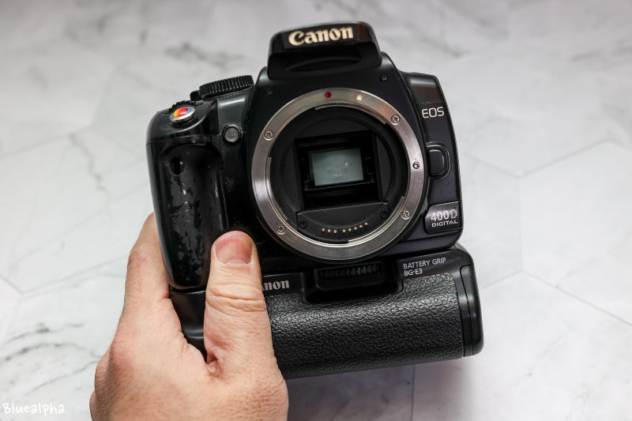
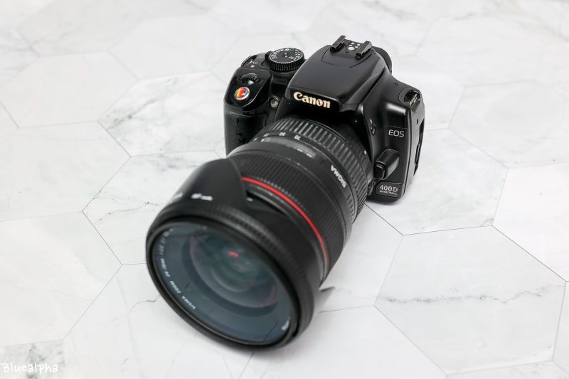
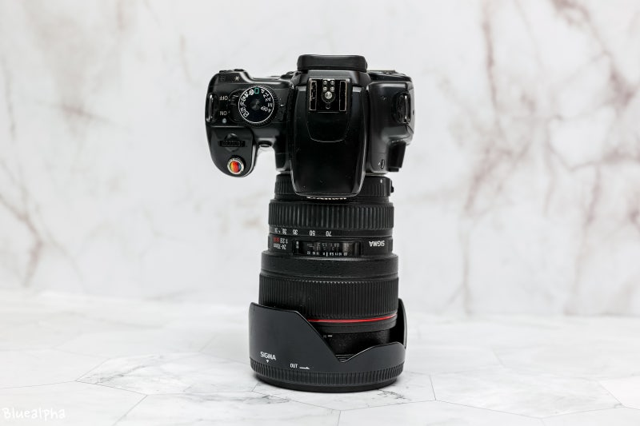

# 캐논 EOS 400D는 추억 보정? 성능과 현재 활용 가치 분석

캐논 EOS 400D는 단순한 추억의 DSLR이 아니라, **센서 크기와 광학 구조가 만들어내는 물리적 특성 덕분에 오늘날에도 일부 촬영 환경에서는 경쟁력을 유지하는 카메라**다. 반면 자동 초점, 고감도 성능, 연산 사진, 동영상 등 현대 카메라 기술에서는 명확하게 뒤처진다. 결국 400D에 대한 평가는 감성만으로 설명할 수도, 반대로 시대에 뒤처진 구형 장비라고 단정할 수도 없다. 이 문서는 400D가 왜 명기로 평가받는지, 그리고 현재 기준에서도 실제 우위가 존재하는지를 기술적 관점에서 분석한다.

## 핵심 요약

* **EOS 400D는 2006년 DSLR 대중화를 이끈 대표적인 보급형 DSLR이다.**
* **APS-C 센서와 렌즈가 만드는 광학적 심도 표현은 현재 스마트폰보다 여전히 자연스럽다.**
* 최신 스마트폰과 비교하면 자동 보정·야간 촬영·편의성에서는 크게 뒤처진다.
* 최신 미러리스와 비교하면 대부분의 성능에서 열세지만 사진의 기본 원리는 동일하다.
* 현재 400D의 가치는 성능 경쟁보다 **광학적 표현력과 사진 학습 도구**라는 의미가 더 크다.

## 1. EOS 400D는 왜 '명기'라는 평가를 받았을까?

2006년 출시된 **캐논 EOS 400D(Rebel XTi)**는 DSLR 시장의 흐름을 크게 바꾼 제품 가운데 하나다. 이전에도 보급형 DSLR은 존재했지만, 400D는 가격과 성능의 균형을 크게 개선하면서 일반 소비자가 DSLR을 현실적으로 구매할 수 있는 수준까지 진입 장벽을 낮췄다.

당시 대부분의 소비자는 컴팩트 디지털카메라나 피처폰 카메라를 사용했다. 작은 센서와 제한적인 렌즈 구조 때문에 사진 표현에는 분명한 한계가 있었으며, 배경 흐림이나 풍부한 계조 표현은 사실상 전문가 장비의 영역으로 여겨졌다.

EOS 400D는 이러한 환경에서 DSLR이 가진 장점을 대중에게 처음으로 체감하게 만든 제품이었다.

주요 특징은 다음과 같다.

* **1,010만 화소 APS-C CMOS 센서**
* **DIGIC II 이미지 프로세서**
* **9포인트 AF 시스템**
* **초당 약 3매 연사**
* **EOS Integrated Cleaning System(센서 먼지 제거 기능) 최초 적용**
* EF 및 EF-S 렌즈군 지원

특히 당시 보급기 최초로 적용된 **센서 클리닝 시스템**은 DSLR 사용자의 가장 큰 불편이었던 센서 먼지 문제를 크게 개선하며 높은 평가를 받았다.

또한 캐논이 오랫동안 구축해 온 EF 렌즈 생태계를 그대로 사용할 수 있다는 점 역시 큰 장점이었다. 바디를 교체해도 렌즈 자산을 유지할 수 있었기 때문에 입문자 입장에서는 장기적인 투자 가치가 높았다.

## 2. EOS 400D의 핵심 경쟁력은 화소가 아니라 APS-C 센서였다

현재 기준에서 1,010만 화소는 매우 낮은 해상도처럼 보인다. 그러나 실제 사진 품질은 화소 하나만으로 결정되지 않는다.

사진에서 가장 중요한 요소 가운데 하나는 **센서의 물리적 크기**다.

EOS 400D는 약 **22.2×14.8mm APS-C CMOS 센서**를 사용한다.

반면 최신 스마트폰 대부분은

* 약 1/1.3인치
* 1인치 이하

크기의 센서를 사용한다.

센서 면적 자체가 수 배 이상 차이 나기 때문에 동일한 조건이라면 DSLR이 훨씬 많은 빛을 받아들일 수 있다.

센서가 크면 다음과 같은 장점이 생긴다.

* **풍부한 계조 표현**
* 자연스러운 색 변화
* 높은 후보정 관용도(RAW)
* 부드러운 입체감
* 심도 표현의 자유

즉 화소는 낮더라도 사진 자체가 가지는 깊이감은 여전히 높은 수준을 유지할 수 있다.

오늘날 스마트폰이 수천만 화소에서 2억 화소까지 경쟁하는 이유도 작은 센서의 약점을 보완하기 위한 전략에 가깝다. 실제 광학 정보량 자체는 센서 크기의 영향을 크게 받기 때문이다.

## 3. 400D가 지금도 스마트폰보다 자연스러운 사진을 만드는 이유

많은 사람이 "요즘 스마트폰이 DSLR보다 화질이 더 좋다."고 생각한다.

일상 촬영에서는 상당 부분 맞는 이야기다.

그러나 이는 **최종 결과물**을 기준으로 한 평가이지, **광학적인 원리**를 비교한 결과는 아니다.

### 아웃포커싱의 차이

DSLR은 렌즈와 센서의 물리적 구조를 이용하여 피사계 심도를 만든다.

즉 빛이 실제로 흐려진다.

반면 스마트폰은 대부분

* 피사체 인식
* 거리 계산
* AI 분리
* 소프트웨어 블러

과정을 거쳐 배경을 흐리게 만든다.

이 때문에 다음과 같은 현상이 발생할 수 있다.

* 머리카락 경계 오류
* 안경 테두리 오류
* 손가락 분리 오류
* 투명 물체 인식 실패

최신 AI는 과거보다 훨씬 좋아졌지만 **광학적인 심도 자체를 만들어내는 것은 아니다.**

따라서 충분한 광량에서 촬영한 인물 사진은 여전히 DSLR 특유의 자연스러운 공간감을 보여준다.

### 계조 표현

사진은 단순히 선명하기만 하면 좋은 것이 아니다.

밝은 영역에서 어두운 영역으로 이어지는 변화가 얼마나 자연스러운지도 매우 중요하다.

APS-C 센서는 더 많은 광량을 확보하기 때문에

* 피부톤
* 하늘
* 노을
* 그림자

등에서 훨씬 자연스러운 계조를 표현할 수 있다.

최신 스마트폰은 HDR 합성과 샤프닝으로 선명함을 극대화하지만, 경우에 따라서는 질감이 다소 인위적으로 보일 수도 있다.

### RAW 데이터의 가치

EOS 400D는 RAW 촬영을 지원한다.

RAW 파일은 JPEG보다 훨씬 많은 센서 정보를 저장하기 때문에

* 노출 보정
* 화이트밸런스 수정
* 암부 복원
* 색상 보정

에서 훨씬 넓은 편집 범위를 제공한다.

이는 사진을 후보정하는 사용자에게 지금도 충분한 장점으로 작용한다.

## 4. EOS 400D가 시대를 앞섰던 이유는 사진을 배우는 카메라였기 때문이다

EOS 400D는 단순히 저렴한 DSLR이 아니었다.

당시 많은 입문자가 사진을 처음 배우는 교재 역할을 수행했다.

지원 모드는 다음과 같았다.

* 자동 모드
* 프로그램 모드(P)
* 조리개 우선(Av)
* 셔터 우선(Tv)
* 수동(M)

촬영자는 자연스럽게

* ISO
* 셔터 속도
* 조리개
* 노출 보정

사이의 관계를 이해하게 된다.

오늘날 스마트폰은 대부분 AI가 이러한 판단을 대신 수행한다.

사용자는 결과물은 쉽게 얻지만 사진의 원리를 반드시 이해할 필요는 없다.

반면 400D는 촬영자가 직접 빛을 읽고 노출을 계산해야 했기 때문에 사진의 기본기를 익히기에 매우 적합한 구조였다.

기술적 제약은 분명 존재했지만, 그 제약 자체가 사진을 배우는 과정에서는 오히려 장점으로 작용했다.

따라서 EOS 400D가 오랫동안 사랑받는 이유는 단순한 화질 때문이 아니라, **사진을 스스로 만들어 간다는 경험**을 제공했기 때문이라고 볼 수 있다.

## 5. 최신 스마트폰과 비교하면 무엇이 다를까?

EOS 400D와 최신 스마트폰은 모두 사진을 촬영하는 장비이지만, 설계 철학 자체가 완전히 다르다. 400D는 **광학 성능과 원본 데이터의 충실성**을 중심으로 설계되었고, 스마트폰은 **연산 사진(Computational Photography)**을 통해 결과물을 즉시 완성하는 방향으로 발전했다.

| 항목 | 캐논 EOS 400D | 최신 스마트폰 |
|------|---------------|---------------|
| 센서 | APS-C CMOS | 1/1.3인치 내외 |
| 배경 흐림 | 광학적 심도 | AI 기반 소프트웨어 처리 |
| RAW 활용 | 우수 | 일부 지원하지만 제한적 |
| 계조 표현 | 자연스러움 | HDR 중심 |
| 야간 촬영 | 취약 | 매우 우수 |
| 자동 보정 | 거의 없음 | 매우 적극적 |
| 휴대성 | 낮음 | 매우 우수 |
| SNS 활용 | 불편 | 즉시 가능 |

최근 스마트폰은 수십 장의 이미지를 동시에 촬영하여 노이즈를 제거하고 HDR을 적용하며, AI가 얼굴과 피부를 자동으로 보정한다. 대부분의 사용자는 셔터만 누르면 안정적인 결과를 얻을 수 있다.

반면 EOS 400D는 촬영자가 모든 요소를 직접 제어해야 한다. 노출이 맞지 않으면 그대로 기록되고, 초점이 빗나가면 보정해 주지 않는다.

이러한 차이는 어느 쪽이 우월한가의 문제가 아니라 **사진을 만드는 방식 자체의 차이**라고 보는 것이 적절하다.

## 6. 최신 미러리스와 비교하면 400D는 어디까지 경쟁력이 있을까?

스마트폰과 비교했을 때 일부 광학적 장점이 있다고 해서, 최신 미러리스와 비교해도 경쟁력이 유지되는 것은 아니다.

약 20년 동안 이미지 센서, 이미지 프로세서, 자동 초점, 손떨림 보정 기술은 비약적으로 발전했다.

EOS 400D가 뒤처지는 대표적인 부분은 다음과 같다.

* **고감도(ISO) 노이즈 성능**
* 피사체 추적 AF
* 얼굴 및 눈동자 AF
* 손떨림 보정
* 라이브뷰
* 동영상
* 연사 속도
* 버퍼 성능
* 다이내믹 레인지
* 전반적인 해상력

특히 저조도 환경에서는 차이가 매우 크다.

400D는 ISO 800 이상부터 노이즈가 빠르게 증가하며, ISO 1600은 당시 기준에서는 사용할 수 있었지만 현재 기준으로는 화질 저하가 분명하다.

반면 최신 미러리스는 ISO 3200~6400에서도 충분히 실용적인 화질을 제공하는 경우가 많다.

또한 최신 카메라는 피사체의 눈을 자동으로 인식하고, 움직이는 사람이나 동물을 지속적으로 추적하며 초점을 유지한다. 이는 400D와 비교하기 어려울 정도의 기술적 발전이다.

즉 **최신 미러리스와의 비교에서는 대부분의 영역에서 400D가 열세**라고 보는 것이 객관적이다.

## 7. 그럼에도 400D가 여전히 높은 평가를 받는 이유

그렇다면 400D는 단순히 추억 때문에 좋은 평가를 받는 것일까?

그렇지는 않다.

EOS 400D의 평가는 크게 세 가지 요소가 결합된 결과라고 볼 수 있다.

첫째는 **역사적 가치**다.

400D는 DSLR을 전문가의 영역에서 일반 소비자의 취미 영역으로 확장시킨 대표적인 모델이었다. 많은 사용자가 처음 접한 DSLR이 바로 400D였으며, 이는 이후 캐논 보급기 라인업의 성공으로 이어졌다.

둘째는 **광학적 기본기**다.

센서 크기와 렌즈를 기반으로 만들어지는 자연스러운 심도 표현은 오늘날에도 여전히 유효하다. 특히 밝은 야외나 스튜디오처럼 광량이 충분한 환경에서는 지금 보아도 충분히 만족스러운 결과물을 얻을 수 있다.

셋째는 **사진을 배우는 과정 자체의 가치**다.

자동화가 거의 없는 환경에서 노출과 구도를 스스로 판단하며 촬영하는 경험은, 현재의 AI 중심 촬영 환경에서는 얻기 어려운 학습 효과를 제공한다.

다만 이러한 장점은 어디까지나 **촬영 환경과 목적이 맞을 때** 의미를 가진다.

일상 기록, 여행, SNS 업로드, 야간 촬영, 동영상 촬영처럼 편의성과 속도가 중요한 환경에서는 최신 스마트폰이나 미러리스가 훨씬 효율적이다.

## 8. 일반 인화와 대형 인화에서 캐논 EOS 400D와 최신 스마트폰의 차이

사진의 품질을 비교할 때 흔히 화소 수만을 기준으로 판단하는 경우가 많다. 그러나 실제 인화에서는 출력 크기와 감상 거리가 결과물의 만족도를 결정하는 더 중요한 요소가 된다. 따라서 일반적인 사진 인화와 대형 인화를 구분해서 비교해야 실제 성능을 정확하게 이해할 수 있다.

### 일반적인 사진 인화에서는 여전히 경쟁력이 있다

4×6인치, 5×7인치, A4 정도의 일반적인 인화에서는 캐논 EOS 400D의 1,010만 화소도 충분한 해상도를 제공한다.

APS-C 센서가 기록하는 풍부한 계조와 자연스러운 색 표현, 실제 광학 렌즈가 만들어내는 입체적인 공간감은 작은 인화에서는 지금도 충분히 매력적인 결과물을 만들어낸다. 특히 밝은 환경에서 촬영한 인물 사진은 스마트폰보다 피부 질감이 자연스럽고 배경 흐림도 훨씬 부드럽게 표현되는 경우가 많다.

반면 최신 스마트폰은 수천만 화소 이상의 센서와 AI 기반 이미지 처리 덕분에 매우 선명하고 화려한 결과물을 제공한다. SNS나 스마트폰 화면에서는 이러한 선명함이 장점으로 느껴질 수 있지만, 실제 인화에서는 샤프닝과 노이즈 제거가 과도하게 적용되어 질감이 다소 인위적으로 보이는 경우도 존재한다.

일반적인 가족사진이나 여행사진을 인화하는 수준이라면 두 장비 모두 충분한 품질을 제공하지만, 표현 방식은 상당히 다르다.

- **자연스러운 질감과 공간감**: EOS 400D 우위
- **즉시 보기 좋은 선명함과 편의성**: 최신 스마트폰 우위

| 비교 항목       | EOS 400D | 최신 스마트폰     |
| ----------- | -------- | ----------- |
| 자연스러운 배경 흐림 | 우세       | AI 보정 의존    |
| 피부 질감       | 우세       | 다소 과보정 가능   |
| 계조와 입체감     | 우세       | 다소 평면적      |
| 선명함         | 약간 열세    | 우세          |
| 색감 일관성      | 우세       | 제조사 보정 성향 큼 |
| 저조도         | 열세       | 압도적 우세      |
| 촬영 성공률      | 열세       | 우세          |

결론만 말하면 밝은 환경에서 촬영한 사진을 4×6인치, 5×7인치로 인화한다면 EOS 400D가 충분히 경쟁력이 있으며, 취향에 따라서는 더 좋은 결과물로 평가될 수 있다.

### 대형 인화에서는 화소 수의 한계가 분명하게 나타난다

인화 크기가 A2 이상으로 커지거나 사람 크기에 가까운 등신대 출력, 전시용 출력으로 넘어가면 상황이 달라진다.

EOS 400D는 약 3,888 × 2,592픽셀의 해상도를 제공한다. 일반적인 감상 거리에서는 충분하지만, 대형 출력 후 가까이에서 보면 픽셀 부족으로 인해 디테일이 감소하고 선명도가 떨어질 수밖에 없다.

반면 최신 스마트폰은 4,800만~2억 화소 이상의 고해상도를 기반으로 촬영하며, 여러 장의 이미지를 합성하는 초해상도(Super Resolution) 기술까지 활용한다. 따라서 동일한 크기로 출력할 경우 확대 여유가 훨씬 크고 세부 묘사도 유리하다.

다만 여기에는 중요한 전제가 있다.

스마트폰이 높은 화소를 가진다고 해서 광학 정보 자체가 DSLR보다 많다는 의미는 아니다. 작은 센서의 한계를 AI가 보완하는 방식이므로 확대했을 때 디테일은 증가하지만 질감은 다소 인공적으로 보일 수도 있다.

### 실제 스튜디오에서는 둘 다 사용하지 않는다

광고 사진이나 프로필 사진, 전시 작품처럼 사람 크기의 대형 출력이 필요한 경우에는 최신 스마트폰과 EOS 400D 모두 전문 장비를 대체하지 못한다.

현업에서는 일반적으로 다음과 같은 구성을 사용한다.

- 4,500만~1억 화소 이상의 풀프레임 또는 중형 카메라
- 85mm 또는 135mm 단렌즈
- 대형 스튜디오 플래시
- RAW 촬영 후 전문 후보정
- 출력 크기에 맞춘 해상도 보정과 색 관리

이러한 작업은 단순히 화소 수만으로 해결되는 문제가 아니라 렌즈 해상력, 센서의 계조 표현, 조명 품질, 후보정 데이터까지 모두 포함된 종합적인 결과물이다.

### 출력 목적에 따라 장비의 장점은 달라진다

일상적인 사진 인화에서는 EOS 400D도 여전히 충분한 결과물을 만들어낼 수 있으며, 특히 자연스러운 색감과 입체감에서는 지금도 경쟁력을 가진다.

그러나 대형 출력이나 광고 수준의 초고해상도 작업에서는 1,010만 화소라는 물리적 한계가 분명하게 나타난다. 이러한 영역에서는 최신 스마트폰이 해상도 측면에서 우위를 가지며, 상업 사진에서는 결국 초고화소 풀프레임이나 중형 카메라가 표준으로 사용된다.

즉, **작은 인화에서는 센서 크기가 주는 사진다운 질감이 중요한 요소가 되고, 대형 인화에서는 결국 절대적인 해상도가 결과물을 좌우하게 된다.**

## 결론

**EOS 400D는 추억 보정만으로 명기라는 평가를 받는 카메라가 아니다.**

물론 자동 초점, 고감도 성능, 연산 사진, 동영상 기능, 편의성 등 현대 카메라의 핵심 요소에서는 최신 스마트폰과 미러리스가 압도적인 우위를 가진다. 성능만 놓고 보면 400D는 분명 시대의 한계를 가진 구형 DSLR이다.

그러나 **사진의 물리적 원리**라는 관점에서 보면 이야기가 달라진다. APS-C 센서와 교환식 렌즈가 만들어내는 자연스러운 심도, 풍부한 계조, RAW 기반의 후보정 관용도는 여전히 작은 센서를 사용하는 스마트폰과 구별되는 특징이다. 특히 충분한 광량 아래에서 촬영한 인물이나 풍경에서는 결과물이 가진 입체감과 질감이 지금도 경쟁력을 유지한다.

결국 400D의 가치는 최신 장비와의 성능 경쟁에 있지 않다. **디지털카메라가 대중화되던 시기의 상징적인 제품이면서, 동시에 지금도 사진의 기본 원리를 가장 직관적으로 경험할 수 있는 DSLR이라는 점**에 의미가 있다. 따라서 EOS 400D를 '추억 보정'만으로 설명하는 것은 사실과 다르며, 반대로 최신 카메라보다 우월하다고 평가하는 것도 객관적이지 않다. 가장 정확한 평가는 **특정 영역에서는 지금도 물리적 장점을 유지하지만, 전체적인 기술 수준에서는 현대 장비에 자리를 내준 역사적 명기**라는 것이다.

## 자주 묻는 질문(FAQ)

### EOS 400D로 지금도 좋은 사진을 찍을 수 있을까?

가능하다. 특히 **밝은 환경에서의 인물, 풍경, 스냅 촬영**에서는 지금도 충분히 만족스러운 결과물을 얻을 수 있다. 다만 저조도 촬영과 빠른 피사체 추적은 최신 장비보다 불리하다.

### 스마트폰보다 항상 화질이 좋은가?

아니다. **광학적 심도와 자연스러운 계조**에서는 우위를 보일 수 있지만, 야간 촬영, HDR, 자동 보정, 해상력, 편의성은 최신 스마트폰이 더 뛰어난 경우가 많다.

### 400D의 1,010만 화소는 부족하지 않을까?

일반적인 웹 게시, SNS, 4×6인치 또는 A4 수준의 인화에는 충분하다. 다만 대형 인화나 강한 크롭이 필요한 작업에서는 최신 고화소 카메라가 유리하다.

### 지금 중고로 구매할 가치가 있을까?

사진을 배우거나 DSLR의 조작 감각을 경험하려는 목적이라면 여전히 의미가 있다. 그러나 실용성과 최신 기능을 중시한다면 상태가 좋은 500D 이후 모델이나 최신 미러리스가 더 적합하다.

### DSLR은 앞으로도 스마트폰보다 물리적으로 유리한가?

**센서 크기와 교환식 렌즈가 제공하는 광학적 이점은 현재도 유효하다.** 다만 스마트폰은 AI 기반 연산 사진 기술이 빠르게 발전하고 있어 일상적인 촬영에서는 그 차이가 계속 줄어들고 있다. 앞으로도 전문 촬영 분야에서는 큰 센서를 사용하는 카메라가 유리하지만, 일반 사용 환경에서는 스마트폰의 비중이 더욱 커질 가능성이 높다.