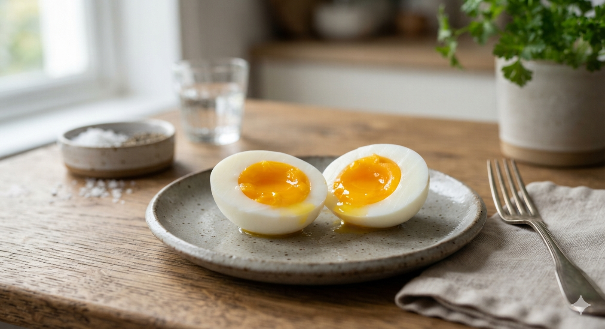

# 계란 노른자 색과 영양: 카로티노이드 색소의 진실**

계란 노른자 색은 영양의 절대적 지표가 아니라 사료 속 카로티노이드와 산란계의 대사 조건이 반영된 결과다. 짙은 주황색 노른자가 더 건강해 보이는 것은 자연스러운 인상일 수 있지만, 색만으로 달걀의 본질적 품질을 판단할 수는 없다. 노른자 색은 무엇을 먹였는지, 어떻게 사육했는지, 어떤 색소가 체내에 축적됐는지에 따라 달라진다. 그래서 계란을 읽으려면 색보다 먼저 생화학과 사육 환경을 봐야 한다.

## 핵심 요약

* **노른자 색은 품질의 절대 기준이 아니다.** 색이 짙다고 해서 단백질이나 필수 아미노산이 더 많아지는 것은 아니다.
* **색의 핵심 원인은 카로티노이드다.** 닭이 섭취한 사료 속 루테인, 지아잔틴 같은 색소가 난황에 축적되면서 색이 달라진다.
* **사료 구성이 가장 큰 변수다.** 메리골드, 알파파, 목초, 옥수수 같은 원료에 따라 노른자 색조가 달라진다.
* **유정란과 무정란의 영양 차이는 과장되기 쉽다.** 수정 여부보다 사육 방식, 사료, 신선도가 더 중요하다.
* **동물복지와 노른자 색은 같은 말이 아니다.** 복지 수준은 사육 환경의 문제이고, 노른자 색은 주로 색소 공급의 문제다.
* **신선도는 색보다 먼저 봐야 한다.** 산란일자, 보관 상태, 난각 표시가 품질 판단의 우선순위다.

## 1. 계란 노른자 색이 사람들에게 강하게 작동하는 이유

계란 노른자 색은 사람들이 품질을 판단할 때 가장 먼저 보는 시각적 단서다. 같은 달걀이라도 노른자가 짙은 주황색이면 더 신선하고 더 좋은 사료를 먹고 자란 것처럼 느껴진다. 과거에는 닭이 풀과 곡물을 비교적 자연스럽게 먹었고, 그 결과 노른자 색이 더 진하게 나타나는 경우가 많았다. 그 기억이 지금까지 이어져 노른자 색이 곧 영양이라는 생각으로 굳어졌다.

하지만 시각적 인상과 실제 영양은 별개의 문제다. 노른자 색은 닭이 먹은 색소의 양과 종류를 반영할 뿐, 달걀의 단백질 품질이나 미량 영양소의 절대량을 직접 증명하지 않는다. 색이 진하다고 해서 달걀이 자동으로 더 우수해지는 것은 아니다.

이 오해는 식품 시장에서도 활용된다. 짙은 노른자는 더 비싸 보이고, 더 자연적이며, 더 건강해 보이는 이미지를 준다. 그래서 일부 생산자는 사료에 색소를 조절해 소비자가 원하는 색을 만들어낸다. 노른자 색은 품질의 힌트는 될 수 있어도, 품질 그 자체는 아니다.

* 색은 **첫인상**을 만든다.
* 영양은 **첫인상만으로 판단할 수 없다.**
* 노른자 색은 사료와 색소의 영향을 크게 받는다.
* 소비자의 선호와 과학적 품질은 분리해서 봐야 한다.

## 2. 카로티노이드와 사료는 어떻게 노른자 색을 바꾸는가

노른자 색을 이해하려면 먼저 카로티노이드를 알아야 한다. 카로티노이드는 식물, 조류, 일부 미생물이 만드는 천연 색소다. 노란색, 주황색, 붉은색 계열의 색을 띠며, 대표적으로 베타카로틴, 루테인, 지아잔틴, 리코펜 같은 성분이 있다.

닭은 이 색소를 스스로 만들지 못한다. 그래서 사료를 통해 외부에서 받아들여야 한다. 닭이 카로티노이드가 풍부한 사료를 먹으면 색소가 체내 대사를 거쳐 난황에 축적되고, 그 정도에 따라 노른자의 색이 연한 노란색에서 짙은 주황색까지 달라진다.

목초를 충분히 먹은 닭, 메리골드 추출물을 섭취한 닭, 옥수수 비중이 높은 사료를 먹은 닭은 서로 다른 색의 노른자를 낳는다. 메리골드 추출물은 가금류 사료에서 노른자 색을 진하게 만드는 대표 성분이다. 알파파와 풀 사료도 같은 역할을 한다. 반대로 옥수수나 밀 중심의 배합 사료는 상대적으로 옅은 색을 만든다.

방목 닭이 낳은 달걀이라고 해서 반드시 진한 색인 것도 아니고, 공장식 사육 달걀이라고 해서 반드시 옅은 색인 것도 아니다. 핵심은 실제 사료의 조성과 색소 함량이다. 그래서 노른자 색은 표준화된 영양 지표로 쓰기 어렵다.

* 카로티노이드는 **식물성 색소**다.
* 닭은 카로티노이드를 **직접 합성하지 못한다.**
* 사료 속 색소가 난황에 축적되면서 노른자 색이 결정된다.
* 방목 여부보다 **실제 사료 성분**이 더 중요하다.
* 색은 표준화된 영양 지표로 보기 어렵다.

## 3. 카로티노이드와 인체 영양은 같은 문제인가

카로티노이드는 노른자 색을 바꾸는 동시에 사람 몸에도 의미가 있다. 다만 닭의 노른자 색과 사람의 영양 효과는 같은 층위의 문제는 아니다. 카로티노이드는 인간에게도 유용한 성분이지만, 달걀의 색이 짙다고 해서 그 안의 카로티노이드가 반드시 더 건강에 좋다고 단정할 수는 없다. 성분의 종류와 양, 흡수 방식, 조리 상태가 달라질 수 있기 때문이다.

인간에게 카로티노이드가 중요한 이유는 이 색소가 체내에서 비타민 A 전구체로 작용하거나 산화 스트레스를 완화하는 데 도움을 주기 때문이다. 달걀 노른자의 경우에도 색의 진하기보다 실제 함량과 조리 방법을 함께 봐야 한다.

노른자 색이 진하면 더 좋은 계란이라고 단정하고, 옅으면 덜 좋은 계란이라고 보는 것은 거친 판단이다. 달걀의 핵심 영양은 단백질, 지방, 비타민, 미네랄 전반의 균형에 있다. 색은 그중 일부 성분이 반영된 외형일 뿐이다.

* 카로티노이드는 **의미 있는 영양소**다.
* 그러나 노른자 색과 인간 영양 효과는 **동일한 판단 기준이 아니다.**
* 달걀의 핵심은 색보다 **전체 성분 균형**이다.
* 조리 방식에 따라 실제 흡수도 달라질 수 있다.

## 4. 루테인과 지아잔틴이 눈 건강에서 강조되는 이유

카로티노이드 가운데 루테인과 지아잔틴은 눈 건강 이야기에서 자주 등장한다. 이 두 성분은 망막 중심부인 황반에 선택적으로 축적되는 특징이 있다. 황반 주변에 이런 색소가 많이 모여 있으면 보호막처럼 작용할 수 있다. 그래서 루테인과 지아잔틴은 시각 기능과 관련된 방어 성분으로 다뤄진다.

이 두 성분은 청색광을 일부 흡수해 눈 내부로 들어오는 광 자극을 완화하고, 광수용체에 누적되는 산화 손상을 줄이는 데 도움을 준다. 다만 이 성분이 들어 있는 음식이나 보충제를 먹는다고 곧바로 시력이 좋아지는 것은 아니다. 이미 손상된 시력을 즉시 되돌리는 물질이라기보다 노화와 산화 부담을 늦추는 쪽에 가깝다.

달걀 노른자는 루테인과 지아잔틴의 비교적 좋은 급원으로 알려져 있다. 다만 이것도 색이 짙다고 자동으로 더 좋은 것은 아니다. 닭이 어떤 사료를 먹었는지와 조리 방식에 따라 실제 섭취 효율은 달라질 수 있다.

* 루테인과 지아잔틴은 **황반에 축적되는 대표 카로티노이드**다.
* 이들은 청색광과 산화 스트레스에 대한 **방어 성분**으로 이해해야 한다.
* 달걀 노른자는 이들 성분의 한 공급원일 수 있다.
* 색이 진하다고 해서 눈 건강 효과가 자동으로 커지는 것은 아니다.

## 5. 베타카로틴은 왜 비타민 A와 연결되는가

베타카로틴은 카로티노이드 가운데 가장 널리 알려진 성분이다. 인체에서 비타민 A로 전환될 수 있기 때문이다. 비타민 A는 시각 기능, 점막 건강, 면역 체계 유지에 중요한 역할을 한다. 그래서 베타카로틴은 비타민 A 전구체로서 의미를 가진다.

흡수율은 조리 상태, 지방 섭취 여부, 장 건강에 따라 달라질 수 있다. 생으로 먹는 것보다 열을 가해 세포벽을 무너뜨리고 기름과 함께 먹는 편이 더 유리한 경우가 많다. 같은 식재료라도 어떻게 먹느냐에 따라 실제 체내 이용 효율이 달라진다.

베타카로틴은 비타민 A와 완전히 같은 것은 아니다. 전환 과정이 필요하고, 개인의 대사 상태에 따라 효율도 다르다. 그래서 베타카로틴이 풍부한 식품은 유용하지만, 그것만으로 모든 비타민 A 수요를 설명할 수는 없다.

* 베타카로틴은 **비타민 A 전구체**다.
* 시각과 점막, 면역 유지에 연결된다.
* 흡수 효율은 조리 방식과 지방 섭취에 따라 달라진다.
* 많이 먹는 것보다 **잘 흡수되게 먹는 것**이 더 중요하다.

## 6. 리코펜은 왜 붉은색 카로티노이드의 대표인가

리코펜은 토마토를 떠올리게 하는 붉은색 카로티노이드다. 구조상 공액 이중결합이 길게 이어져 있어 산화 스트레스를 완화하는 능력이 강한 편으로 알려져 있다. 그래서 리코펜은 항산화 이야기에서 자주 등장한다. 토마토, 수박, 자몽 같은 식품에 많다.

리코펜은 지질과 함께 섭취했을 때 흡수성이 달라질 수 있다. 생토마토보다 토마토소스, 토마토페이스트처럼 열을 가한 형태가 더 유리한 이유도 여기에 있다. 식물 세포 구조가 부드러워지면서 성분이 더 잘 풀려 나오기 때문이다.

다만 리코펜 하나만으로 건강을 설명할 수는 없다. 항산화 성분은 서로 역할이 겹치기도 하고 보완되기도 한다. 중요한 것은 식단 전체가 다양한 색소와 영양소를 골고루 포함하고 있는지다.

* 리코펜은 **붉은색 카로티노이드**다.
* 가열 조리에서 **흡수 효율이 높아지는 경향**이 있다.
* 토마토소스나 페이스트처럼 가공된 형태가 유리할 수 있다.
* 단일 성분보다 **식단 전체의 균형**이 중요하다.

## 7. 카로티노이드를 더 잘 흡수하는 식사 방식

카로티노이드는 지용성 성분이기 때문에 식사 방식이 흡수에 영향을 준다. 올리브유, 아보카도, 견과류처럼 지방이 적절히 포함된 식사와 같이 먹으면 유리하다. 같은 양을 먹더라도 음식 조합에 따라 실제 흡수는 달라질 수 있다.

조리법도 중요하다. 당근, 토마토, 시금치, 호박처럼 세포벽이 단단한 식재료는 가볍게 익히면 내부의 색소가 더 잘 풀린다. 생채소가 무조건 좋은 것은 아니다. 너무 오래 익히면 다른 영양소가 손상될 수 있지만, 적절한 열처리는 카로티노이드 흡수에 도움이 된다.

장 건강도 흡수에 영향을 준다. 소화관이 불안정하면 지용성 성분의 흡수도 흔들릴 수 있다. 카로티노이드는 단일 알약처럼 작동하지 않고 전체 식사 구조 속에서 효율이 달라진다.

* 카로티노이드는 **지용성**이다.
* 지방과 함께 먹을 때 흡수 효율이 올라간다.
* 가벼운 열처리는 색소 방출에 유리하다.
* 장 건강이 흡수 효율에 영향을 준다.

## 8. 달걀의 유정 여부와 동물복지, 신선도를 어떻게 봐야 하나

유정란과 무정란의 차이는 생물학적으로는 분명하지만, 영양학적으로는 생각보다 작다. 유정란은 수정이 이뤄질 가능성이 있는 달걀이지만, 무정란은 수정되지 않은 달걀이다. 중요한 것은 수정 여부보다 달걀 내부의 영양 조성이다.

동물복지 달걀은 또 다른 층위의 이야기다. 이것은 닭이 더 넓고 덜 스트레스받는 환경에서 사육됐다는 뜻이지, 무조건 영양이 월등하다는 뜻은 아니다. 사육 환경이 개선되면 사료의 질, 스트레스 수준, 위생 관리가 나아질 가능성이 높고, 그 결과 맛이나 풍미에서 차이를 느끼는 사람도 있다. 동물복지 달걀은 영양뿐 아니라 윤리적 소비와 감각적 만족의 문제로도 볼 수 있다.

달걀을 고를 때는 유정인지 무정인지, 동물복지 인증이 있는지, 산란일자가 언제인지, 보관이 잘 됐는지를 함께 봐야 한다. 그중에서도 신선도와 보관이 실질적인 기준에 가깝다.

* 유정란과 무정란의 차이는 **부화 가능성**에 가깝다.
* 영양 차이는 대체로 **과장되기 쉽다.**
* 동물복지는 **윤리와 환경의 문제**다.
* 실제 식용 품질은 **신선도와 보관**을 함께 봐야 한다.

## 9. 신선도는 색보다 더 먼저 봐야 한다**

달걀은 겉모습만 보면 단단하고 변하지 않을 것처럼 보이지만, 실제로는 시간이 지나면서 내부 상태가 달라진다. 난각에는 눈에 보이지 않는 미세한 기공이 있고, 시간이 지나면 내부의 이산화탄소와 수분이 조금씩 빠져나간다. 그 결과 난백의 성질이 변하고 기실이 커지며, 난황의 형태도 무너지기 시작한다.

그래서 달걀은 색보다 산란일자와 보관 상태를 먼저 봐야 한다. 냉장 보관이 잘 됐는지, 껍데기에 금이 없는지, 유통 과정에서 온도 변화가 심하지 않았는지도 중요하다. 노른자 색이 아무리 진해도 오래된 달걀이라면 신선한 달걀보다 가치가 낮다. 반대로 색이 다소 옅어도 신선하게 관리된 달걀은 더 나은 선택일 수 있다.

외형은 판단의 시작점일 뿐이다. 안전성과 품질은 눈에 잘 보이지 않는 조건에서도 결정된다. 노른자 색은 참고할 수 있지만, 먹는 기준은 신선도에 더 가깝다.

* 달걀은 **시간이 지나며 내부 상태가 변한다.**
* 신선도는 색보다 **품질 판단의 우선순위**다.
* 냉장 상태와 산란일자가 중요하다.
* 색이 좋아 보여도 오래된 달걀일 수 있다.

## 결론

계란 노른자 색은 분명 의미가 있다. 산란계가 먹은 사료의 구성과 그 안에 들어 있는 카로티노이드의 축적 결과를 보여 준다. 하지만 그 색이 곧바로 영양의 우열을 뜻하는 것은 아니다. **짙은 노른자는 보기에는 더 좋게 느껴질 수 있지만,** 실제 품질 판단에서는 사료, 사육 환경, 신선도, 보관 상태를 함께 봐야 한다.

카로티노이드는 인간에게도 중요한 영양소다. 루테인과 지아잔틴은 눈 건강과 연결되고, 베타카로틴은 비타민 A 전구체로서 의미가 있으며, 리코펜은 항산화 측면에서 자주 거론된다. 이 성분들의 가치는 색 하나만으로 평가되지 않는다. 흡수 방식과 조리법, 장 건강, 식사 구조가 함께 작동한다.

그래서 영양을 읽는다는 것은 색을 보는 일이 아니라, 색을 만든 과정 전체를 보는 일에 가깝다.

달걀을 고를 때는 노른자 색을 참고하되, **신선도를 우선하고 사육 방식을 확인**하는 편이 현실적이다. 영양은 전체 식단 속에서 판단해야 한다. 겉색의 선호와 실제 품질 판단은 분리해서 볼 필요가 있다.

## 자주 묻는 질문(FAQ)

### 노른자 색이 진하면 무조건 좋은 달걀인가?

그렇지 않다. 진한 색은 주로 사료 속 카로티노이드가 많이 축적된 결과일 뿐이다. 영양 우열은 색 하나로 결정되지 않는다.

### 유정란이 무정란보다 더 영양가가 높은가?

대체로 그렇게 보기는 어렵다. 유정 여부는 부화 가능성과 관련이 크고, 실제 영양 성분은 사육 방식과 사료, 신선도에 더 크게 좌우된다.

### 동물복지 달걀은 왜 더 비싼가?

사육 공간, 관리 기준, 생산 방식이 더 엄격하기 때문이다. 가격 차이는 주로 복지 기준과 생산 비용에서 나온다. 영양 차이만으로 설명하면 부족하다.

### 달걀은 어떤 기준으로 고르는 게 가장 좋은가?

산란일자와 보관 상태를 먼저 봐야 한다. 그다음 사육 방식, 난각 상태, 필요하면 노른자 색을 참고하면 된다. 순서를 거꾸로 보면 판단이 흔들린다.

### 노른자 색을 진하게 만들려면 무엇이 중요한가?

카로티노이드가 풍부한 사료를 먹이는 것이 중요하다. 메리골드, 목초, 알파파, 옥수수 구성 등이 색에 영향을 준다. 그러나 그건 색의 문제이지 품질 전체의 보증은 아니다.