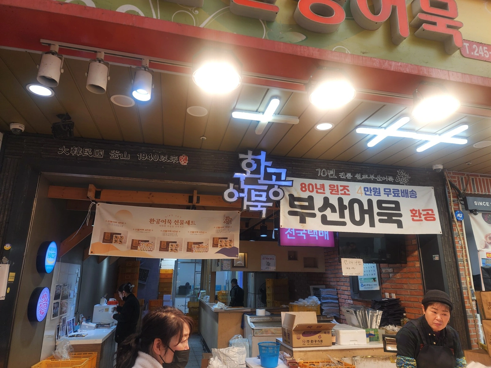
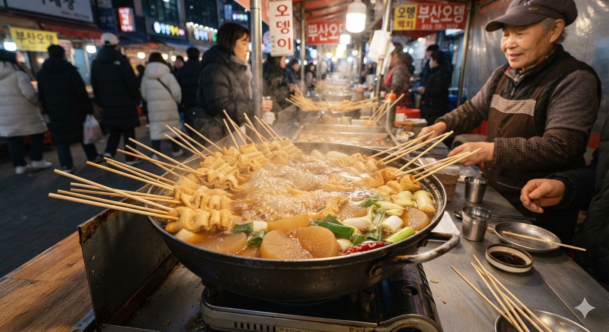

# 진정한 최고의 부산어묵 브랜드 TOP 10 맛과 식감 냉정 비교 분석

매출이나 화려한 토핑을 배제하고 생선살 본연의 감칠맛과 쫄깃한 식감을 기준으로 엄선한 대한민국 최고 사각 및 봉어묵 브랜드 TOP 10의 실질적인 맛을 철저하게 비교한다.

시중에는 화려한 외관을 앞세운 수많은 제품이 넘쳐나지만 밀가루 함량이 높거나 인공 조미료 맛만 강해 실망하는 경우가 많다.  
진짜 전통 부산식 어묵은 높은 연육 배합률 덕분에 오래 끓여도 쉽게 흐물거리지 않고 고유의 탱글한 식감을 유지하는 법이다. 
이 글에서는 대중적인 인지도에 가려진 실질적인 맛의 차이를 분석하여 개개인의 입맛과 요리 목적에 맞는 완벽한 선택 기준을 제시하고자 한다.

## 핵심 요약

오직 생선살 본연의 맛과 식감만을 기준으로 삼아 도출한 중요한 핵심 사실들은 다음과 같다.

* **브랜드 엄선 기준**: 매출 규모나 화려한 토핑을 배제하고 전통 부산식 맛의 강자들을 기준으로 순위를 매겼다.
* **핵심 3사의 식감 차이**: **삼진어묵**은 탱글한 탄력, **미도어묵**은 부드러운 쫄깃함, **환공어묵**은 단단하고 묵직한 씹는 맛이 핵심이다.
* **반전의 실질 맛 평가**: 전국적으로 유명하거나 백화점에 입점한 브랜드라고 해서 모든 조리 상황에서 1위를 차지하는 것은 아니다.
* **조리 상황별 최적화**: 그냥 먹을 때는 삼진어묵, 탕 요리에는 미도어묵, 반찬이나 떡볶이에는 환공어묵이 최고의 성능을 발휘한다.
* **밀가루 배제의 장점**: 고래사어묵과 같이 밀가루를 완전히 넣지 않은 제품은 텁텁함이 없고 깨끗한 풍미를 선사한다.

## 1. 기본 맛 기준 TOP 10 리스트 및 브랜드별 특징

어묵의 진정한 가치는 생선살 배합률과 식감에서 결정된다.  
화려한 토핑을 걷어내고 가장 스탠다드한 사각 및 봉어묵을 기준으로 평가한 상위 10개 브랜드의 특징은 다음과 같다. 

부산 10대 브랜드 사각어묵 비교표
| 순위  | 브랜드 및 제품명 | 핵심 차별화 특징 (공법/성분) | 맛과 식감의 핵심 요약 | 가장 추천하는 조리법 |
|---|---|---|---|---|
| 1 | 삼진어묵 '특천사각' | 매우 높은 연육 함량의 정석 | 씹을수록 올라오는 생선 단맛, 오래가는 탱글함 | 어묵탕 / 전골 |
| 2 | 미도어묵 '고급사각' | 조미료를 줄인 담백한 배합 | 부드러우면서도 찰진 식감, 현지인 추천 맛 | 어묵볶음 (반찬) |
| 3 | 환공어묵 '종합사각' | 부평 깡통시장 원조의 전통 레시피 | 겉면의 고소한 풍미와 짭조름한 속살의 밸런스 | 길거리 꼬치어묵 |
| 4 | 초량본가어묵 '돌절구 사각' | 전통 돌절구 공법 배합 | 이가 튕겨 나갈 듯한 단단하고 쫄깃한 식감 | 식감을 살린 숙회/간식 |
| 5 | 고래사어묵 '밀가루 없는 사각' | 밀가루 0% 전면 배제 | 느끼함과 텁텁함이 없는 깔끔하고 진한 고소함 | 다이어트/건강 간식 |
| 6 | 영진어묵 '전통사각' | 신평동 로컬 공장 생산 | 깊고 묵직한 씹는 맛, 투박한 옛날 시장 맛 | 로컬식 어묵 요리 |
| 7 | 범표어묵 '88% 생선살 사각' | 연육 비율 88% 극한 세팅 | 비린내 없는 맑은 감칠맛, 불지 않는 얇은 탄력 | 오래 끓이는 탕 요리 |
| 8 | 효성어묵 '수제식 사각' | 1960년부터 이어진 전통 배합 | 자극적이지 않고 삼삼하여 질리지 않는 담백함 | 어린이 반찬 / 자극 없는 요리 |
| 9 | 부산초량어묵 '특보사각' | 국물 흡수력이 뛰어난 대중적 세팅 | 분식집에서 먹던 가장 익숙하고 감탄 나오는 맛 | 포장마차 스타일 오뎅탕 |
| 10 | 장우손부산어묵 '순살 사각' | 밀가루·보존료 제로 + 고급 돔 연육 | 생선 고기 결이 느껴지는 쫄깃함과 깔끔한 뒷맛 | 프리미엄 기본 요리 |

## 2. 핵심 3대 브랜드의 맛과 식감 디테일 분석

순수하게 **맛과 식감으로만** 냉정하게 비교하면 백화점에 입점한 전국구 어묵가게들이 오히려 실질적인 맛 평가에서 순위가 밀리는 반전이 일어나기도 한다.  
전통의 자존심을 지키고 있는 상위 3개 업체를 디테일하게 분석해 보면 뚜렷한 차이를 확인할 수 있다.  
**삼진어묵**은 탱글한 탄력, **미도어묵**은 부드러운 감칠맛, **환공어묵**은 진하고 투박한 고소함이 핵심이다.  
세 브랜드 모두 높은 연육 함량을 자랑하지만 추구하는 방향성이 완전히 다르다.

### 삼진어묵의 특징

이빨이 들어갈 때 서걱하면서도 튕겨 나오는 탱글함이 세 곳 중 가장 강하다.  
수분감이 적당히 통제되어 씹는 재미가 아주 뛰어나다.  
비린 맛을 극도로 잡아서 담백하고 깔끔하며 간이 세지 않아 질리지 않는다.  
치즈나 땡초 등 부재료를 섞었을 때 원재료의 맛을 방해하지 않고 조화롭게 살려내는 매력이 있다.  
기름기가 적고 담백해서 데우지 않고 그냥 간식처럼 집어 먹을 때 가장 맛있는 어묵이다.

### 미도어묵의 특징

질기거나 단단하지 않고 부드럽게 씹히면서도 기분 좋은 쫄깃함이 남아 있는 것이 특징이다.  
치아가 약한 사람도 편하게 즐길 수 있는 정석적인 밀도를 가지고 있다.  
씹을수록 생선 살 특유의 단맛과 감칠맛이 진하게 올라오는데 국물 요리에 넣었을 때 국물 맛을 가장 맛있게 우려내는 어묵이기도 하다.  
탕을 끓였을 때 어묵이 쉽게 퍼지지 않으면서도 국물과 어묵 양쪽에 감칠맛이 폭발하는 경험을 선사한다.

### 환공어묵의 특징

옛날 방식으로 튀겨내어 겉 표면이 다소 거칠고 밀도가 아주 높다.  
세 곳 중 가장 단단하고 투박한 식감을 자랑한다.  
첫입부터 짭조름하고 고소한 풍미가 직관적으로 훅 들어오기 때문에 조미가 확실하게 되어 있어 어묵 자체의 개성이 가장 강렬하다.  
양념이 강한 떡볶이에 넣어도 어묵의 존재감이 전혀 죽지 않으며 술안주로 즐기기에 아주 제격이다.  
| 브랜드 | 핵심 식감 | 맛의 지향점 | 추천 용도 |
| --- | --- | --- | --- |
| 삼진어묵 | 탱글탱글하고 짱짱한 탄력 | 담백하고 깔끔한 맛 | 간식용, 어묵 베이커리 |
| 미도어묵 | 부드럽고 쫄깃한 조화 | 생선 고유의 풍부한 감칠맛 | 어묵탕(오뎅나베), 반찬용 |
| 환공어묵 | 단단하고 묵직한 씹는 맛 | 짭조름하고 깊은 전통의 맛 | 떡볶이용, 오래 끓이는 탕 |

## 3. 조리 상황 및 입맛 취향별 맞춤형 추천

세 곳 모두 고급 생선 연육을 80% 이상 사용하는 최고급 어묵이기 때문에 절대적인 순위를 매기는 것은 무의미하다.  
순위보다는 조리 방식과 개인의 입맛 취향에 따라 최고의 만족도를 주는 브랜드가 완전히 달라지기 때문이다.  

### 조리 상황별 최고의 브랜드

첫째, 간식으로 그냥 베어 물 때는 기름기가 적고 표면이 깔끔한 **삼진어묵**이 단연 최고다.  
데우지 않아도 느끼하지 않고 짱짱한 탄력 덕분에 이로 끊어 먹는 식감의 쾌감이 살아난다.  

둘째, 어묵탕이나 전골을 끓일 때는 국물에 들어갔을 때 진가를 발휘하는 **미도어묵**을 추천한다.  
오래 끓여도 흐물흐물하게 퍼지지 않고 쫄깃함을 유지하며 자체에서 배어 나오는 감칠맛이 국물을 깊게 만들어준다.

셋째, 반찬으로 어묵볶음을 하거나 떡볶이에 넣을 때는 자체 간이 짭조름한 **환공어묵**이 정답이다.  
기름진 고소함이 강해 간장이나 고추장 양념에 볶아도 맛이 묻히지 않고 단단한 식감 덕분에 양념이 배어도 씹는 맛이 유지된다.

### 개인 취향별 최고의 브랜드

* **깔끔하고 담백하며 세련된 맛을 원할 때**: 비린내가 전혀 없고 간이 자극적이지 않은 삼진어묵이 만족도 1위다.
* **깊은 풍미와 자연스러운 단맛을 원할 때**: 씹을수록 생선 살 고유의 감칠맛이 진하게 배어 나오는 미도어묵이 가장 좋다.
* **시장식 손맛과 고소하고 짭짤함을 원할 때**: 옛날 시장 어묵 특유의 묵직함과 강렬한 첫맛을 가진 환공어묵이 매력적이다.

## 결론

진정한 최고의 어묵 브랜드를 찾는 여정은 결국 자신의 입맛과 요리 목적을 알아가는 과정과 같다.

단순히 유명세나 백화점 입점 여부만 보고 브랜드를 선택하기보다는 각 브랜드가 가진 고유의 식감과 맛의 지향점을 이해하는 것이 중요하다.

탱글하고 깔끔한 맛을 선호한다면 **삼진어묵**을, 깊은 풍미의 탕 요리를 원한다면 **미도어묵**을, 강한 양념과 투박한 손맛을 원한다면 **환공어묵**을 선택할 때 비로소 완벽한 미식 경험을 완성할 수 있다.

각 제품의 특징을 명확히 파악하여 매 순간 실패 없는 최고의 어묵 요리를 즐기기를 바란다.

## 자주 묻는 질문(FAQ)

### 고급 어묵을 고를 때 가장 중요한 기준은 무엇인가?

가장 중요한 것은 연육(생선살)의 배합률과 밀가루의 유무다.  
연육 함량이 80% 이상으로 높아야 생선 고유의 감칠맛이 나고 끓였을 때 쉽게 흐물거리지 않는다.

### 삼진어묵은 왜 간식용으로 가장 추천하는가?

삼진어묵은 비린 맛을 철저하게 잡고 기름기를 줄여서 깔끔하게 제조되기 때문이다.  
데우지 않고 차가운 상태로 그냥 먹어도 느끼함이 없고 탱글한 식감이 극대화되어 간식으로 먹기 아주 좋다.

### 미도어묵이 탕용으로 독보적인 성능을 내는 이유는 무엇인가?

미도어묵은 자체적으로 풍부한 생선 고유의 단맛과 감칠맛을 품고 있다.  
뜨거운 국물에 끓이면 이 감칠맛이 국물로 자연스럽게 우러나오면서도 조직감이 부드럽고 찰지게 유지되기 때문이다.

### 떡볶이에 넣을 때 환공어묵을 써야 하는 이유는 무엇인가?

떡볶이 양념은 고추장과 설탕 등으로 인해 맛이 매우 강렬하다.  
환공어묵은 자체 간이 짭조름하고 겉면의 고소함이 강하며 식감이 단단해서 강한 양념 속에서도 고유의 맛과 식감을 잃지 않는다.

### 밀가루가 들어가지 않은 어묵의 장점은 무엇인가?

고래사어묵처럼 밀가루를 배제한 제품은 씹을 때 특유의 텁텁함이 전혀 없다.  
소화가 잘 될 뿐만 아니라 생선 살 고유의 순수한 고소함을 진하게 느낄 수 있다는 장점이 있다.