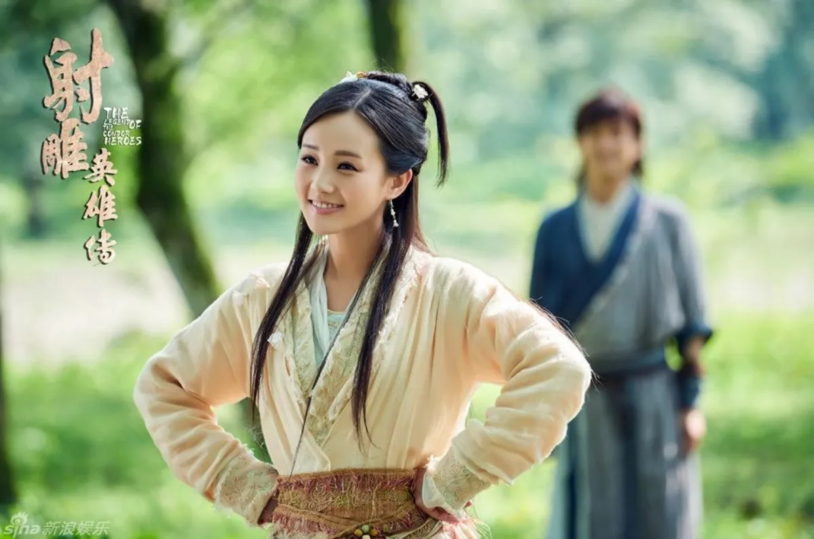

# 장무기 vs 곽정 vs 양과 전투력 비교

구양신공으로 태극권, 건곤대나이까지 마스터 한 장무기가 구음진경을
어느정도 익힌 곽정, 양과보다 강할까?

장무기의 무공 구성(구양신공 + 건곤대나이 + 태극권·태극검)이 김용 소설 속
주인공들 중 가장 화려하고 완벽에 가깝다는 점은 명백한 사실이다. 스펙만
놓고 보면 장무기가 곽정과 양과를 압도하는 것처럼 보이다.

하지만 원작자인 김용 작가는 인터뷰를 통해 공식적으로 "곽정, 양과,
장무기 세 사람의 우열을 가릴 수 없다(곽정=양과=장무기)"라고 작가 피셜을
박았습니다.

화려한 무공을 치트키처럼 마스터한 장무기가 실전에서 곽정이나 양과보다
"훨씬 강하다"고 단정할 수 없는 데에는 세 인물의 결정적인 차이점이
존재합니다.

## 1. 곽정 : 구음진경 100% 마스터 + 실전형 전투 기계

무공의 실체 : 곽정은 구음진경을 '어느 정도' 익힌 것이 아니라, 구음진경
원본 전체와 마지막 총결 편(음양 조화의 비결)까지 100% 완벽하게 마스터한
인물이다.

항룡십팔장의 사기성: 곽정은 천하제일의 강맹한 장법인 '항룡십팔장'에
구음진경의 내공을 융합했습니다. 장무기의 건곤대나이가 힘을 반사하는
기술이라면, 곽정의 장풍은 반사고 나발이고 기술 자체를 정면에서
짓부숴버리는 압도적인 파괴력을 가집니다.

전투 경험의 차이 : 장무기는 성격이 유약해 싸울 때 적을 죽이지 못하고
머뭇거리는 경향이 강합니다. 반면 곽정은 평생을 전쟁터에서 구르며 수만
명의 대군과 싸워온 '실전형 전투 기계'이다. 실전에서 뿜어져 나오는
살기와 전투 센스에서 장무기가 밀릴 가능성이 매우 높습니다.

## 2. 양과 : 독고구패의 파격성 + 암연소혼장

무공의 실체 : 양과 역시 구음진경은 일부만 배웠지만, 검마 독고구패의
유지를 이어받아 '현철중검'을 통한 무거운 내공의 경지를 깨달았습니다.

정신력과 감정의 폭발: 양과에게는 자신의 슬픈 감정이 극대화될 때 발동하는
'암연소혼장'이라는 사기적인 무공이 있습니다. 이 무공은 예측이
불가능하고 기괴하여, 당시 구음진경과 라마교 무공을 극한으로 익혔던 최종
보스 금륜법왕조차 단숨에 격살해 버렸습니다. 황당할 정도로 강력한 한
방(치명타)을 가졌기에 우열을 가리기 힘듭니다.

## 3. 장무기의 치명적인 약점 : 우유부단함

장무기가 이론상 최강임에도 다른 두 사람과 동급으로 묶이는 가장 큰 이유는
그의 성격과 멘탈 때문이다.

소프트웨어의 부재: 장무기는 하드웨어(내공, 무공 기술)는 신의 경지이지만,
성격이 너무 착하고 유약하여 적을 단숨에 제압하려는 투지가 부족합니다.

소설 속에서도 장무기는 자신보다 한참 무공이 떨어지는 적들의 기만책이나
기습에 당해 고전하는 모습을 자주 보여줍니다. 반면 곽정과 양과는 적이
빈틈을 보이면 단 한 번의 기회도 놓치지 않고 숨통을 끊어놓는 결단력이
있습니다.

## 4. 최종 정리

하드웨어: 장무기 ＞ 곽정 ≥ 양과

소프트웨어: 곽정 ＞ 양과 ＞ 장무기

감정폭발: 양과 ＞ 곽정 ＞ 장무기

종합 전투력 (작가 공식 오피셜): 장무기 ＝ 곽정 ＝ 양과

즉, 장무기가 가진 무공이 가장 사기적인 것은 맞지만, 곽정의 완성된
구음진경과 항룡장, 그리고 양과의 독고구패식 중검과 암연소혼장 역시
장무기의 치트키 무공들을 정면에서 받아칠 수 있을 만큼 강력하기 때문에
"훨씬 강하다"고 보기는 어렵습니다.
