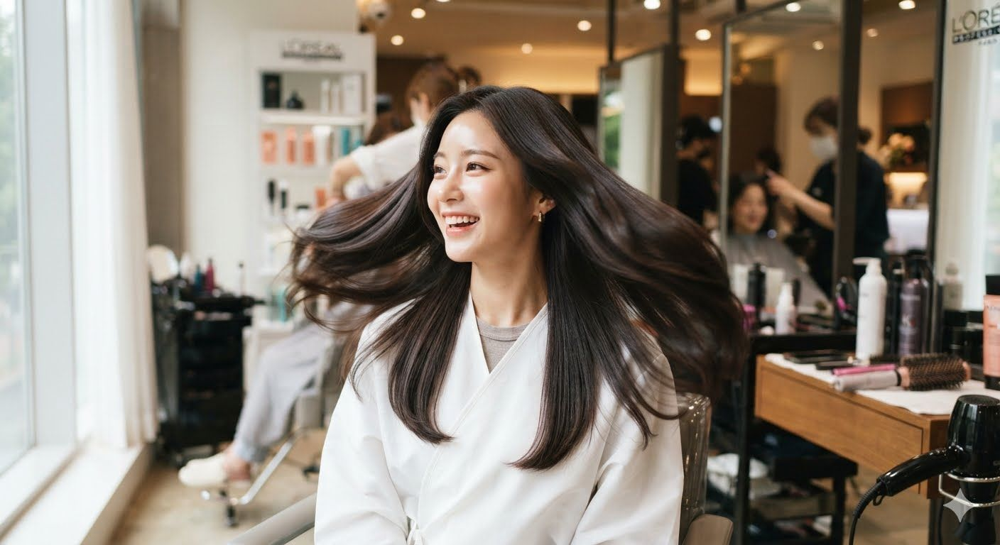

# 트리트먼트와 헤어팩 차이점 완전 비교, 모발 건강에는 무엇이 더 좋을까?

트리트먼트와 헤어팩은 비슷해 보이지만 목적이 다르다. **모발 건강을 꾸준히 관리하려면 트리트먼트가, 윤기와 부드러움을 오래 유지하려면 헤어팩이 적합하다.** 린스는 표면을 보호하는 역할을 담당한다. 이 글에서는 린스와 트리트먼트, 헤어팩의 차이와 작동 원리, 가격 대비 효율을 비교하여 어떤 제품이 자신에게 적합한지 정리한다.

이 글에서는 린스, 트리트먼트, 헤어팩의 작동 원리와 차이점, 가격 대비 효율을 비교하여 어떤 제품이 자신의 관리 방식에 가장 적합한지 정리한다.

## 핵심 요약

* **린스**는 모발 표면을 빠르게 코팅하여 엉킴과 정전기를 줄인다.
* **트리트먼트**는 모발 내부에 수분과 단백질을 공급하는 제품이다.
* **헤어팩**은 고농축 성분으로 모발 표면을 보호하고 보습을 오래 유지한다.
* 린스와 헤어팩은 **외부 코팅**, 트리트먼트는 **내부 케어**를 담당한다.
* 매일 샴푸한다면 **트리트먼트가 가장 효율적인 선택**이다.
* 헤어팩은 **특별한 집중 관리가 필요할 때** 사용하는 것이 적합하다.

## 1. 린스, 트리트먼트, 헤어팩은 무엇이 다를까?

겉으로 보기에는 모두 샴푸 다음에 사용하는 제품처럼 보이지만, 실제로는 **작동 위치 자체가 다르다.**

| 구분    | 린스     | 트리트먼트        | 헤어팩           |
| ----- | ------ | ------------ | ------------- |
| 주요 목적 | 표면 보호  | 내부 영양 공급     | 고농축 집중 케어     |
| 작용 위치 | 큐티클 표면 | 큐티클 내부 및 피질  | 표면 중심 + 일부 침투 |
| 방치 시간 | 즉시~1분  | 2~3분         | 10~20분        |
| 사용 빈도 | 매일     | 매일 또는 주 2~3회 | 주 1~2회        |
| 핵심 역할 | 코팅     | 복구           | 고농축 코팅 및 보습   |

세 제품의 가장 큰 차이는 **모발 어디를 목표로 설계되었는가**이다.

린스는 모발 표면을 빠르게 코팅해 엉킴과 정전기를 줄인다.

트리트먼트는 단백질과 보습 성분을 모발 내부에 공급하도록 설계되며, 헤어팩은 고농축 성분으로 모발 표면을 오래 보호하는 데 초점을 맞춘다.

## 2. 모발은 어떻게 손상되고 왜 제품마다 작동 방식이 다를까?

세 제품을 제대로 이해하려면 먼저 **모발의 구조**를 알아야 한다. 머리카락은 살아있는 조직이 아니라 케라틴 단백질로 이루어진 섬유다. 한번 손상되면 피부처럼 스스로 재생하지 못한다. 시중의 모든 헤어 제품은 새로운 머리카락을 만드는 것이 아니라 **손상된 부분을 얼마나 효과적으로 보완하느냐**가 목적이다.

모발은 크게 세 부분으로 구성된다.

* **큐티클(Cuticle)** : 가장 바깥층. 비늘처럼 겹겹이 쌓여 내부를 보호한다.
* **코텍스(Cortex)** : 모발 대부분을 차지하는 부분으로 단백질과 수분이 존재하며 탄력과 강도를 결정한다.
* **메둘라(Medulla)** : 중심부 조직으로 굵은 모발에서만 존재하는 경우가 많으며 헤어케어에는 큰 영향을 주지 않는다.

건강한 머리카락은 **큐티클이 잘 정돈되고 코텍스의 단백질과 수분이 유지된 상태**를 말한다.

샴푸와 열기구, 염색·탈색, 펌, 자외선은 큐티클을 손상시키고 내부의 수분과 단백질을 감소시킨다. 이 때문에 헤어케어 제품은 **모발 내부를 보완하는 제품**과 **모발 외부를 보호하는 제품**으로 구분된다.

바로 이 지점에서 트리트먼트와 린스·헤어팩의 역할이 나뉜다.

## 3. 트리트먼트는 왜 '복구' 제품이라고 부를까?

트리트먼트의 가장 큰 특징은 **모발 내부를 목표로 설계된 제품**이라는 점이다. 물론 손상된 모발을 원래 상태로 완전히 재생시키는 것은 현재 기술로도 불가능하다. 하지만 손실된 단백질과 보습 성분을 지속적으로 공급하여 **모발의 탄력과 인장 강도를 높이는 것**은 가능하다.

이를 위해 사용되는 대표 성분은 다음과 같다.

* **Hydrolyzed Keratin**
* **Hydrolyzed Collagen**
* **Hydrolyzed Silk**
* **각종 아미노산**
* **판테놀**
* **세라마이드**

여기서 중요한 것은 **가수분해**(Hydrolyzed)라는 표현이다.

가수분해란 큰 단백질을 잘게 쪼개 분자량을 줄인 것을 의미한다. 분자가 작아질수록 손상된 큐티클 사이를 통과하기 쉬워진다. 그래서 트리트먼트는 일반적으로 **2~3분 정도만 방치해도 상당 부분 성능을 발휘하도록 설계**된다.

일상적인 사용이라면 다음 루틴이면 충분하다.

1. 샴푸
2. 물기를 가볍게 제거
3. 트리트먼트 도포
4. 양치질(약 2~3분)
5. 헹굼

대부분의 트리트먼트는 2~3분 정도면 설계된 성능을 충분히 발휘하며, 매일 꾸준히 사용하는 것이 일회성 집중 관리보다 효율적이다.

## 4. 헤어팩은 무엇이 어떻게 다를까?

많은 사람은 **헤어팩이 가장 비싸므로 가장 성능이 좋은 제품**이라고 생각한다. 절반은 맞고 절반은 틀린 이야기다. 헤어팩의 가장 큰 특징은 **많은 영양 성분을 오래 유지시키는 것**이다.

헤어팩은 고농축 단백질과 오일 성분으로 모발 표면에 보호막을 형성해 수분 증발을 줄이고 윤기를 오래 유지하도록 설계된다.

이 때문에 일반적으로 **10~20분 정도 방치**를 권장하며, 핵심은 **침투보다 유지력과 보호력**에 있다.

## 5. 헤어팩의 가격이 비싼 이유는 무엇일까?

일반적인 드럭스토어와 대형마트 판매 제품을 기준으로 하면 같은 용량 대비 평균 가격은 다음과 같은 구조를 가진다.

| 제품    | 평균 가격(100ml 기준) | 특징    |
| ----- | --------------: | ----- |
| 린스    |    약 500~1,200원 | 가장 저렴 |
| 트리트먼트 |  약 2,000~4,500원 | 중간 가격 |
| 헤어팩   |  약 5,000~9,000원 | 가장 비쌈 |

헤어팩은 고농축 오일과 컨디셔닝 성분 사용량이 많아 일반적으로 트리트먼트보다 가격이 높다.

다만 **가격이 높다고 모발 건강 효과까지 비례해서 높아지는 것은 아니다.**

## 6. 헤어팩이 트리트먼트보다 항상 좋은 제품일까?

결론부터 말하면 **아니다.**

많은 사람이 빠지는 오해가 하나 있다.

> 헤어팩 > 트리트먼트 > 린스
라는 서열 구조를 생각하는 것이다.

실제로는 **역할이 다를 뿐**이다.

트리트먼트는 손실된 단백질과 보습 성분을 보완해 **모발 내부를 관리**하는 제품이다.

반면 헤어팩은 **모발 표면을 보호하고 윤기를 유지**하는 데 초점을 맞춘다.

즉 두 제품은 **우열 관계가 아니라 역할이 다른 제품**이다.

## 7. 트리트먼트와 헤어팩를 함께 쓰면 더 좋을까?

많은 사람이 다음과 같은 루틴을 사용한다.

> 샴푸 → 트리트먼트 → 헤어팩

혹은

> 샴푸 → 헤어팩 → 트리트먼트

왠지 영양을 두 번 공급하는 것 같아 더 좋아 보인다.

하지만 **모발 구조와 각 제품의 역할을 생각하면 효율적인 사용법은 아니다.**

트리트먼트와 헤어팩은 역할이 일부 겹치며, 함께 사용한다고 효과가 단순히 더해지는 것은 아니다.

헤어팩의 코팅막이 이후 트리트먼트 성분의 작용을 일부 방해할 가능성이 있으며, 반대로 트리트먼트 후 바로 헤어팩을 사용해도 추가 효과가 크게 증가한다는 근거는 충분하지 않다.

따라서 일반적인 모발 관리에서는 **두 제품을 함께 사용하는 것보다 목적에 맞게 하나를 선택하는 편이 비용 대비 효율이 높다.**

## 8. 매일 사용하는 사람이라면 무엇이 가장 합리적일까?

현대인의 생활을 생각해 보자.

* 대부분 매일 샴푸한다.
* 대부분 샤워 시간은 10~15분이다.
* 양치 시간은 약 2~3분이다.

이 조건에서는 트리트먼트가 가장 잘 맞는다.

샴푸 후 트리트먼트를 바르고 양치질하는 2~3분 동안 기다린 뒤 헹구면 되므로 별도의 시간을 거의 들이지 않는다. 또한 모발은 스스로 복구되지 않기 때문에 한 번의 집중 관리보다 매일 꾸준히 관리하는 방식이 효율적이다. 월 비용도 헤어팩과 큰 차이가 없어, **매일 샴푸하는 사람이라면 트리트먼트의 비용 대비 효율**이 더 높다.

## 9. 헤어팩은 언제 사용하는 것이 가장 좋을까?

헤어팩은 다음과 같은 경우 효과적이다.

* 탈색모 또는 극손상모
* 잦은 염색이나 고데기 사용
* 강한 자외선에 장시간 노출된 경우
* 중요한 일정 전 윤기와 부드러움을 높이고 싶을 때

반면 매일 사용할 필요는 없으며, **특별한 집중 관리용**으로 사용하는 것이 가장 적합하다.

## 결론

수많은 광고를 보다 보면 다음과 같은 착각을 하기 쉽다.

> 린스 → 트리트먼트 → 헤어팩

이 순서대로 점점 상위 제품이며, 모두 사용할수록 머릿결이 좋아진다고 생각하게 된다. 

하지만 제품의 작동 원리를 기준으로 분류하면 전혀 다른 구조가 보인다.

| 구분    | 핵심 역할      | 관리 영역 |
| ----- | ---------- | ----- |
| 린스    | 표면 보호      | 코팅    |
| 헤어팩   | 고농축 보호막 형성 | 코팅    |
| 트리트먼트 | 내부 단백질 보충  | 복구    |

* 데일리 케어: 매일 [샴푸 ➔ 트리트먼트(2~3분 방치 후 헹굼)] 조합만 사용하는 것이 시간, 비용, 모발 건강에 가장 효율적이다.
* 스페셜 케어: 헤어팩은 탈색모, 극손상모, 또는 중요한 일정을 앞두고 부드러움을 극대화해야 하는 집중 관리용으로만 사용한다.
* 트리트먼트와 헤어팩은 역할이 겹치므로 굳이 함께 사용할 필요가 없다. 

***그러니 제조사의 광고에 속지 말자.***

## 자주 묻는 질문(FAQ)

### 린스와 트리트먼트는 무엇이 다른가?

린스는 모발 **겉면을 코팅**하여 정전기를 줄이고 빗질을 쉽게 만드는 제품입니다. 반면 트리트먼트는 **모발 내부에 수분과 단백질을 공급**하여 손상된 머릿결을 관리하는 것이 목적입니다.

### 트리트먼트와 헤어팩를 함께 사용하면 효과가 더 좋아지나?

일반적으로는 권장되지 않습니다. 헤어팩이 형성하는 컨디셔닝막이 이후 트리트먼트 성분의 효율을 떨어뜨릴 수 있으며, 두 제품의 기능도 상당 부분 겹칩니다. 비용 대비 효과를 고려하면 **둘 중 하나를 선택하여 사용하는 것이 더 합리적** 이다.

### 트리트먼트는 몇 분 정도 방치해야 하나?

대부분의 제품은 **2~3분 정도면 충분하다.** 샴푸 후 트리트먼트를 바르고 양치질을 한 뒤 헹구는 정도면 일반적인 사용 환경에서 충분한 성능을 기대할 수 있다.

### 헤어팩은 몇 분 정도 방치하는 것이 좋나?

제품마다 차이가 있지만 일반적으로 **10~20분 정도** 방치하는 것이 권장된다. 헤어캡이나 따뜻한 타월을 함께 사용하면 컨디셔닝 효과를 높이는 데 도움이 될 수 있다.

### 린스는 꼭 사용해야 하나?

필수는 아닙니다. 트리트먼트만으로도 충분한 컨디셔닝 효과를 제공하는 제품이 많다. 다만 모발이 매우 거칠거나 정전기가 심하다면 린스를 추가로 사용하는 것이 도움이 될 수 있다.

### 머릿결 건강을 위해 가장 추천하는 루틴은 무엇인가?

매일 샴푸하는 일반적인 생활이라면 다음 루틴이 가장 효율적이다.

**샴푸 → 트리트먼트 → 양치질(2~3분) → 헹굼**

시간을 거의 추가로 들이지 않으면서도 모발 내부를 꾸준히 관리할 수 있어, 비용과 효율, 모발 건강을 종합적으로 고려했을 때 가장 균형 잡힌 방법이다.
