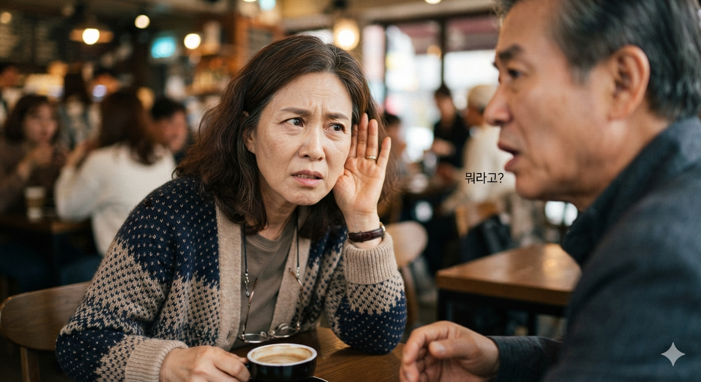

# 노인성 난청 원인, 고주파 청력 손실 이유와 예방 방법

노인성 난청 원인은 달팽이관 노화로 인한 고주파 청력 손실이다. 자음 변별력 저하 증상을 진단하고 조기 예방 관리법을 정리한다. 단순히 소리가 작게 들리는 문제가 아니다. 자음을 구분하거나 빠른 말을 이해하는 능력이 먼저 떨어질 수 있다. 시간이 지나면 인지 기능과 사회 활동에도 영향을 줄 수 있다. 달팽이관의 노화와 뇌의 청각 처리 변화가 함께 작용하기 때문이다.

## 핵심 요약

* **노인성 난청**은 대부분 8,000Hz 부근의 고주파 영역에서 시작해 점차 저주파 영역으로 진행한다.
* 청력 저하는 소리의 크기보다 **자음 변별력**과 어음 이해 능력에 먼저 영향을 줄 수 있다.
* 노화는 귀뿐 아니라 뇌의 **시간 정보 처리 능력**도 떨어뜨려 빠른 말이나 소음 속 대화를 어렵게 만든다.
* 청력 손실 정도보다 **주파수 정보와 시간 정보의 손실**이 실제 의사소통에 더 큰 영향을 줄 수 있다.
* 조기 청력 검사와 보청기, 청각 재활은 난청으로 인한 사회적 고립과 인지 기능 저하를 줄이는 방법이다.

## 1. 인간의 청력은 왜 고주파부터 먼저 사라질까?

사람이 들을 수 있는 소리의 범위는 일반적으로 **20Hz부터 20,000Hz**까지다. 하지만 일상 대화에서는 모든 주파수를 듣는 능력보다 사람의 말을 정확히 구별하는 능력이 더 중요하다. 모음은 저주파 영역에 에너지가 많이 들어 있고, 자음은 고주파 영역에 구별 정보가 많다. 같은 정도로 청력이 떨어져도 어느 주파수가 손상됐는지에 따라 불편함이 달라지는 이유다.

노화가 시작되면 달팽이관의 기저부가 먼저 손상된다. 달팽이관은 위치마다 담당하는 주파수가 다르다. 입구에 가까운 기저부는 **고주파수**를 담당하고, 안쪽으로 갈수록 저주파수를 담당한다. 노화로 기저부의 유모세포가 먼저 퇴화하면서 8,000Hz, 6,000Hz, 4,000Hz 순으로 청력이 떨어지기 시작한다.

노인성 난청은 대체로 다음과 같은 양상으로 진행한다.

| 연령 증가 | 청력 변화 |
| --- | --- |
| 20~30대 | 대부분 정상 청력 유지 |
| 40대 | 8kHz 부근 고주파 감소 시작 |
| 50대 | 6kHz 영역까지 손실 확대 |
| 60대 | 4kHz 이상에서 뚜렷한 저하 |
| 70대 이후 | 점차 중주파 영역까지 확대 |

처음에는 음악이나 생활 소리보다 사람의 말을 이해하는 능력이 먼저 떨어질 수 있다.

## 2. 왜 여성 목소리와 자음부터 잘 들리지 않을까?

많은 사람이 노인성 난청 초기 증상을 "여자 목소리가 잘 안 들린다."고 표현한다. 목소리가 작아서가 아니라 **고주파 성분**이 줄었기 때문이다.

남성의 목소리는 평균 기본 주파수가 약 **85~180Hz**, 여성은 약 **165~255Hz**로 더 높다. 하지만 대화에서 더 중요한 정보는 기본 음높이가 아니라 자음에 들어 있는 수천 Hz 대역의 음향 정보다.

다음 자음은 고주파 정보를 많이 포함한다.

* ㅅ
* ㅆ
* ㅈ
* ㅊ
* ㅍ
* ㅋ
* ㅌ

이런 자음이 잘 들리지 않으면 소리의 존재는 알아도 단어를 정확히 구별하기 어렵다.

예를 들면 다음과 같은 단어를 반복해서 헷갈릴 수 있다.

* 밥 ↔ 밤
* 살 ↔ 달
* 차 ↔ 사
* 팔 ↔ 발

노인성 난청이 있는 사람은 다음처럼 말하기도 한다.

* "소리는 들리는데 무슨 말인지 모르겠다."
* "사람들이 중얼거리는 것 같다."
* "발음이 분명하지 않다."

이는 단순한 청력 저하보다 **어음 분별력(Speech Discrimination)**이 먼저 떨어진 결과일 수 있다.

## 3. 청력은 귀와 뇌의 처리 능력이 함께 변한다

청력 검사는 귀의 기능만 측정한다고 생각하기 쉽다. 실제 대화에서는 소리를 분석하고 단어와 문장의 의미를 해석하는 뇌의 처리 과정도 큰 역할을 한다.

* 소리 수집
* 주파수 분석
* 자음과 모음 분리
* 단어 인식
* 문장 해석
* 의미 추론

이 과정은 수백 밀리초 안에 이루어진다. 노화가 진행되면 귀의 기능뿐 아니라 정보 처리 속도도 떨어진다. 청력이 비슷한 두 사람의 대화 능력이 다른 이유다.

특히 **시간 정보(Temporal Information)** 처리가 중요하다. 사람의 말은 수십에서 수백 밀리초 단위의 빠른 음향 변화로 이어진다. 자음은 지속 시간이 짧아 뇌가 제때 처리하지 못하면 단어 전체를 잘못 이해할 수 있다.

청각학에서는 화자의 말이 빨라졌을 때 청자가 얼마나 이해하는지 확인하기 위해 **시간압축(Time Compression)**이라는 연구 기법을 사용한다. 녹음된 음성을 짧게 압축해 실제보다 빠르게 재생하는 방식이다. 예를 들어 10초 동안 말한 문장을 7초 또는 5초 안에 재생하면 내용은 같지만 시간 정보가 줄어든다.

젊은 사람은 비교적 높은 이해도를 유지하지만, 노인은 시간압축 음성에서 이해도가 크게 떨어지는 경향을 보인다. 주된 이유로는 **정보 처리 속도 감소**와 제한된 시간 안에 자음을 분석하는 능력 저하가 제시된다.

Gordon-Salant 연구에서는 노인이 시간압축 음성을 이해하기 어려운 원인으로 자음의 짧은 시간 정보 손실을 설명했다. 후속 연구에서는 자음 부분의 시간을 늘렸을 때 노인의 문장 이해도가 향상되는 결과도 보고했다.

노인은 천천히 말하는 사람과는 비교적 대화할 수 있지만, 빠르게 말하거나 여러 사람이 동시에 이야기하는 상황에서는 이해도가 크게 떨어질 수 있다.

## 4. 주파수 정보가 줄어들면 의사소통은 어떻게 변할까?

청각학에서는 사람이 말을 얼마나 정확하게 이해하는지 예측하기 위해 **AI(Articulation Index)**와 이후 발전한 **SII(Speech Intelligibility Index)** 같은 지표를 사용한다. 이 지표는 단순히 몇 dB가 들리는지보다, 대화에 필요한 주파수 정보가 얼마나 남아 있는지 계산해 어음 이해도를 예측한다.

대표적인 AI 개념은 음성 스펙트럼을 약 20개의 주파수 대역으로 나누고, 각 대역이 언어 이해에 미치는 영향을 반영해 전체 이해도를 추정한다. 같은 40dB의 청력 손실이라도 손상된 주파수 영역에 따라 실제 대화 능력은 달라질 수 있다.

저주파 영역만 일부 손실되면 모음 에너지가 충분히 전달돼 대화가 비교적 가능하다. 반대로 고주파 영역이 손실되면 자음 정보가 줄어 단어를 구별하기 어려워진다.

주파수 정보가 줄어들수록 다음과 같은 변화가 나타날 수 있다.

| 주파수 정보 손실 | 실제 나타나는 변화 |
| --- | --- |
| 경미 | 여성 목소리 이해 감소 |
| 중등도 | 자음 구별 어려움 |
| 진행 | 단어 혼동 증가 |
| 심함 | 문장 이해도 급격한 감소 |
| 매우 심함 | 의사소통 자체가 어려움 |

청력은 "잘 들린다"와 "안 들린다"로만 나눌 수 없다. 얼마나 정확하게 구별하는지가 대화의 질을 좌우한다.

## 5. 소음이 있는 환경에서는 왜 훨씬 더 듣기 어려울까?

노인성 난청이 있으면 조용한 곳에서는 어느 정도 대화할 수 있어도 식당, 카페, 지하철, 회식 자리에서는 말을 따라가기 어려울 수 있다.

귀가 소리를 크게 듣지 못해서만은 아니다. **주파수 분리 능력**과 **시간 정보 처리 능력**이 함께 떨어지기 때문이다.

정상 청력에서는 뇌가 여러 소리 가운데 필요한 음성만 골라 듣는다. 이를 "칵테일 파티 효과(Cocktail Party Effect)"라고 한다. 여러 사람이 동시에 말해도 관심 있는 사람의 목소리를 비교적 쉽게 구분하는 능력이다.

노화가 진행되면 선택적으로 듣는 능력이 줄어든다. 주파수 정보가 제한될수록 배경 소음 속에서 시간 정보를 활용하기도 어려워진다.

다음과 같은 장소에서 불편함이 커질 수 있다.

* 식당이나 카페
* TV를 켜 놓은 거실
* 회의실
* 가족이 동시에 이야기하는 공간
* 차량 안
* 지하철이나 버스

그래서 "조용한 곳에서는 잘 들리는데 시끄러운 곳에서는 아무 말도 못 알아듣겠다."고 말하는 경우가 많다. 이는 단순한 볼륨 문제가 아니라 **청각 정보 처리 능력**의 변화다.

## 6. 노인성 난청은 어떻게 진단할까?

노인성 난청은 "귀가 잘 안 들리는 것 같다."는 느낌만으로 판단하기 어렵다. 객관적인 청력검사로 어느 주파수에서 얼마나 손실됐는지 확인해야 한다.

대표적인 검사는 **순음청력검사(Pure Tone Audiometry)**다. 여러 주파수의 소리를 들려주고 각 주파수에서 들을 수 있는 가장 작은 소리의 크기, 즉 청력 역치를 측정한다.

검사 결과는 일반적으로 다음과 같이 해석한다.

| 청력 역치(dB HL) | 난청 정도 |
| ---: | --- |
| 0~25 | 정상 |
| 26~40 | 경도 난청 |
| 41~55 | 중등도 난청 |
| 56~70 | 중고도 난청 |
| 71~90 | 고도 난청 |
| 91 이상 | 심도 난청 |

청력검사와 함께 시행하는 **어음청력검사**는 소리를 얼마나 크게 들을 수 있는지가 아니라 단어를 얼마나 정확하게 이해하는지 확인한다.

## 7. 노인성 난청은 어떻게 치료하고 관리할까?

현재까지 **노인성 난청을 완전히 회복시키는 치료법은 확립되어 있지 않다.** 사람의 달팽이관에서 노화로 손상된 유모세포는 자연적으로 재생되지 않기 때문이다. 치료 목표는 청력을 원래 상태로 되돌리는 데 있지 않다. 남아 있는 청력을 활용해 의사소통 능력을 유지하는 데 있다.

난청 정도에 따라 다음과 같은 재활 방법을 적용한다.

| 재활 방법 | 적용 대상 | 목적 |
| --- | --- | --- |
| 정기 청력검사 | 초기 난청 | 진행 여부 확인 |
| 보청기 | 경도~고도 난청 | 잔존 청력 활용 |
| 인공와우 | 고도~심도 난청 | 청신경 직접 자극 |
| 청각 재활훈련 | 보청기 사용자 | 뇌의 적응 촉진 |

보청기를 처음 착용하면 기계음이나 주변 소리가 지나치게 크게 들릴 수 있다. 오랫동안 듣지 못했던 소리에 뇌가 다시 적응하는 과정이다. 초기에는 조용한 환경에서 시작하고, 점차 다양한 환경으로 듣는 범위를 넓혀 가는 방식이 권장된다.

## 8. 난청은 치매와 어떤 관계가 있을까?

최근 청각학과 신경과학에서는 **난청과 인지 기능 저하의 관계**를 활발히 연구하고 있다.

현재까지의 연구는 난청이 치매의 직접적인 원인이라고 단정하지 않는다. 다만 **치매 위험을 높이는 요인**이라는 근거는 쌓이고 있다.

청력이 떨어지면 뇌는 부족한 소리 정보를 해석하는 데 더 많은 인지 자원을 쓴다. 이를 **인지 부하(Cognitive Load)** 증가라고 한다.

말을 알아듣는 데 인지 자원을 많이 쓰면 기억이나 사고에 쓸 자원이 줄어들 수 있다. 그 결과 다음과 같은 변화가 나타날 수 있다.

* 집중력 감소
* 기억력 저하
* 정보 처리 속도 감소
* 정신적 피로 증가

난청이 심해질수록 대화를 피하고 사회 활동을 줄이는 경우도 있다. 이런 사회적 고립 역시 인지 기능 저하와 관련이 있다.

미국 존스홉킨스 연구진의 장기간 추적 연구에서는 난청 정도가 심할수록 치매 발생 위험이 높아지는 경향이 보고됐다. 다만 이는 **연관성**을 보여주는 결과다. 난청만으로 치매가 반드시 발생한다는 뜻은 아니다.

## 9. 생활 속에서 청력을 어떻게 보호할 수 있을까?

노인성 난청은 자연스러운 노화의 영향을 받지만, 생활 습관에 따라 진행 속도가 달라질 수 있다.

대표적인 예방법은 다음과 같다.

* 과도한 소음 노출 줄이기
* 이어폰 음량 낮추기
* 장시간 음향기기 사용 피하기
* 금연
* 절주
* 혈압·당뇨병 관리
* 규칙적인 운동
* 정기적인 청력검사

고혈압, 당뇨병, 고지혈증 같은 혈관 질환은 달팽이관으로 가는 미세혈관에도 영향을 줄 수 있다. 전신 건강 관리가 청력 보호와 연결되는 이유다.

## 결론

**노인성 난청**은 소리가 작게 들리는 문제만이 아니다. 고주파수 손실과 중추 청각 처리 기능의 변화가 함께 나타나는 노화 과정이다. 초기에는 여성이나 아이의 목소리, 자음처럼 고주파 성분이 많은 소리를 구별하기 어렵다. 시간이 지나면 소음 속 대화와 빠른 말도 이해하기 힘들어진다.

난청은 의사소통을 불편하게 만들고 사회적 고립과 인지 기능 저하 위험을 높일 수 있다. 따라서 단순한 노화 현상으로 넘기지 말고 **정기적인 청력 검사**, 적절한 보청기 사용, 청각 재활을 고려해야 한다. 생활 습관을 바꾸는 일도 청력 보존에 도움이 된다.

베라르AIT와 같은 청각 훈련 기법은 일부 연구가 진행되고 있지만, 현재 근거만으로 표준 치료를 대신하기는 어렵다. 청력 관리의 중심은 특정 치료법에 기대기보다 조기에 발견하고 꾸준히 재활해 남은 청각 기능을 유지하는 데 있다.

## 자주 묻는 질문(FAQ)

### 노인성 난청은 몇 살부터 시작될까?

개인차가 있지만 일반적으로 40대부터 고주파 영역의 청력이 서서히 감소하기 시작하며, 50~60대 이후 변화가 더욱 뚜렷해지는 경우가 많다.

### 노인성 난청은 완전히 치료할 수 있을까?

현재까지는 손상된 달팽이관 유모세포를 완전히 회복시키는 치료법이 확립되어 있지 않다. 따라서 보청기와 인공와우, 청각 재활로 의사소통 능력을 유지하는 것이 치료의 중심이다.

### TV 소리만 커지는 것도 난청의 신호일까?

가능성이 있다. 가족들이 TV 소리가 지나치게 크다고 느끼는데 본인은 적당하다고 생각한다면 청력검사를 받아보는 것이 좋다.

### 이어폰을 많이 사용하면 노인성 난청이 빨리 올 수 있을까?

큰 음량에 장기간 노출되면 소음성 난청 위험이 커진다. 노화에 따른 청력 저하와 겹치면 전체적인 청력 손실이 빨라질 수 있다.

### 베라르AIT는 효과가 입증된 치료법일까?

일부 연구와 사례 보고는 있지만, 현재 국제적인 진료지침에서는 노인성 난청의 표준 치료로 인정하지 않는다. 보조적 접근으로 논의할 수는 있어도 효과가 확립된 치료법으로 보기는 어렵다.