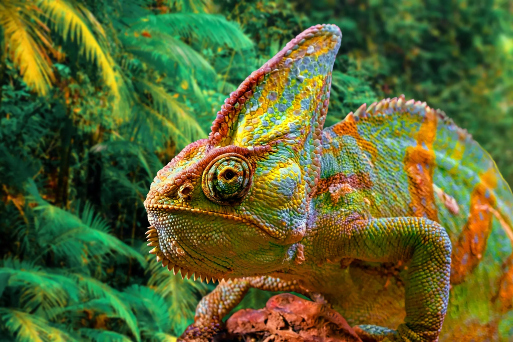
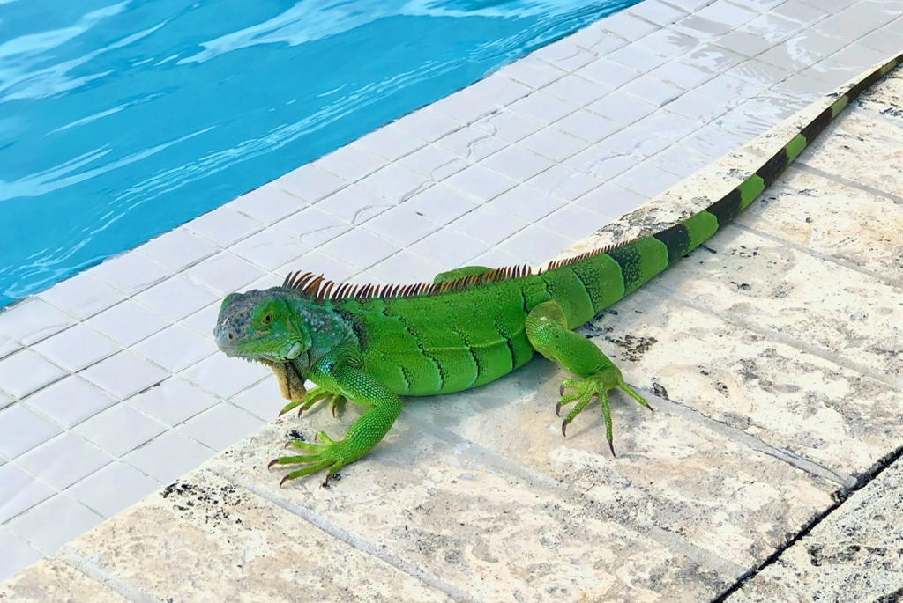

# 카멜레온 색 변화 원리 및 이구아나 제3의 눈 기능 비교

이구아나 제3의 눈과 카멜레온 색 변화 원리를 비교한다. 정수리눈의 빛 감지와 구조색 변색 등 파충류의 신비한 생존 전략을 밝힌다.

두 동물 모두 뱀목에 속하지만, 눈·발·꼬리·피부의 구조와 살아가는 방식은 크게 다르다. 특히 흔히 하나의 이미지로 묶이는 **카멜레온의 변색**과 **이구아나의 정수리눈**은 작동 원리부터 쓰임새까지 다른 생물학적 장치다.

## 핵심 요약

* 카멜레온의 색 변화는 **위장만을 위한 기능이 아니며**, 사회적 신호와 체온 조절에도 쓰인다.
* 카멜레온의 화려한 색 변화에는 **구아닌 나노결정으로 이루어진 구조색**이 관여한다.
* 이구아나의 정수리눈은 물체의 모습을 보는 일반적인 눈이 아니라 **빛의 강도와 변화에 반응하는 감각기관**이다.
* 그린 이구아나는 카멜레온보다 훨씬 크고, 긴 꼬리와 강한 발톱으로 위협에 대응한다.
* 두 동물의 색 변화는 체온이나 행동 상태와 관련되지만 **변화의 폭과 생물학적 메커니즘은 다르다**.
* 이구아나는 꼬리 자르기과 수영으로 도피하는 반면, 카멜레온은 포식과 사회적 상호작용에 맞춰 시각적 신호를 활용한다.

## 1. 카멜레온은 왜 색을 바꾸는가?

카멜레온의 색 변화는 주변 배경을 그대로 복사하는 단순한 위장 장치가 아니다. **위장·의사소통·체온 조절**이 서로 얽혀 있으며, 어느 기능이 중요한지는 종과 상황에 따라 달라진다. 일부 카멜레온은 수컷끼리 경쟁하거나 구애할 때 눈에 띄는 색 변화를 보인다.

편안한 상태에서 보이던 색이 짧은 시간 안에 노랑이나 주황 계열로 바뀌는 현상은 주변 환경과 같은 색을 만드는 과정만으로 설명하기 어렵다. 사회적 신호가 필요한 순간에는 자신을 더 눈에 띄게 만드는 방향으로 색을 바꾸기 때문이다.

**색 자체가 신호가 되는 셈이다.**

체온도 빼놓을 수 없다. 카멜레온은 외부 환경에 따라 체온이 변하는 변온동물이므로, 햇빛을 흡수하거나 반사하는 색 변화가 체온 관리와 연결된다. 어두운 색은 일반적으로 복사에너지를 더 많이 흡수하고 밝은 색은 반사하는 경향이 있다. 따라서 색 변화는 행동과 몸 상태를 함께 조절하는 수단으로 작동한다.

카멜레온의 변색을 단 하나의 목적에 맞춰 설명하기 어려운 이유다. **색 변화는 여러 생존 요구 사이에서 나온 절충에 가깝다.**

## 2. 카멜레온의 화려한 색은 어떻게 만들어지는가?

예전에는 카멜레온의 변색을 피부 속 색소가 움직이는 현상으로 단순하게 설명하는 경우가 많았다. 그러나 팬서카멜레온의 피부를 연구하면서, 화려한 색 변화에 **구아닌 나노결정이 배열된 구조**가 핵심으로 관여한다는 사실이 밝혀졌다.

피부의 특정 세포층에는 매우 작은 구아닌 결정이 규칙적으로 배열되어 있다. 결정 사이의 간격이 달라지면 특정 파장의 빛을 강하게 반사하는 조건도 바뀐다. 같은 피부라도 반사하는 빛의 파장이 달라지면서 눈에 들어오는 색이 달라진다.

쉽게 말하면 페인트 색을 갈아입는 것이 아니다. **피부 안의 미세한 광학 구조를 조절하는 방식**이다.

다만 카멜레온의 피부가 구조색만으로 이루어진 것은 아니다. 색소를 포함한 세포층과 반사층이 함께 작용해 최종적인 색과 밝기, 채도를 결정한다. 실제 카멜레온의 체색은 **구조색과 색소색이 결합한 결과**로 이해하는 편이 정확하다.

## 3. 이구아나도 색을 바꾸는데 왜 카멜레온과 다른가?

그린 이구아나도 체온, 사회적 상태, 건강 상태와 성장 과정에 따라 체색이 달라질 수 있다. 특히 수컷은 번식기나 사회적 경쟁 과정에서 녹색에서 주황색이나 황금색 계열로 바뀌는 모습을 보이기도 한다.

하지만 그 변화는 카멜레온의 급격하고 극적인 색 전환과 성격이 다르다. **이구아나의 체색 변화는 더 완만하고 제한적**이며, 개체의 상태와 환경에 따라 오랜 시간에 걸쳐 나타나는 경우도 많다.

그린 이구아나는 자라면서 색조와 무늬가 달라지기도 한다. 어린 개체와 성체의 외형이 다른 이유도 여기에 있다. 체온이 낮은 아침에는 어두운 색을 띠다가 일광욕을 하면서 상대적으로 밝아지는 현상도 관찰된다.

둘 다 변온동물이지만 변색을 활용하는 방식은 다르다. **카멜레온은 빠른 시각적 신호에 특화된 변색**, 이구아나는 체온과 사회적 상태 등이 반영되는 체색 변화를 보인다고 이해하면 된다.

## 4. 이구아나의 제3의 눈은 실제로 무엇을 하는가?

이구아나의 머리 위를 자세히 보면 두 눈 외에 작은 투명한 부위가 하나 더 보인다. 이것이 흔히 **제3의 눈이라고 부르는 정수리눈**이다.

이 기관은 사람의 눈처럼 사물을 선명하게 보는 눈이 아니다. 구조가 퇴화한 형태의 시각기관으로, 빛의 변화에 민감하게 반응한다. 특히 위쪽에서 들어오는 빛의 변화나 그림자 같은 정보를 감지하는 데 의미가 있다.

정수리눈을 카메라처럼 생각하면 안 된다. 하늘에서 독수리를 보고 "저건 독수리다"라고 판단하는 기관이 아니다.

오히려 **환경의 밝기와 변화에 반응하는 센서**에 가깝다.

정수리눈은 일주기 리듬과 일광 노출, 체온 조절 및 생식과 관련된 생리 체계와도 연결된다. 여러 파충류에서 이 기관은 단순한 시각을 넘어 광환경과 몸속 상태를 연결하는 역할을 한다고 본다.

## 5. 카멜레온의 눈과 이구아나의 제3의 눈은 어떻게 다른가?

카멜레온의 일반적인 두 눈은 매우 독특하다. 양쪽 눈을 서로 독립적으로 움직일 수 있어 **서로 다른 방향을 동시에 관찰**할 수 있다. 먹이를 노릴 때는 두 눈의 시선을 같은 목표에 맞추며 거리 판단에 필요한 정보를 얻는다.

반면 이구아나의 정수리눈은 일반적인 측면의 두 눈을 대신하지 않는다. 형상을 자세히 보는 기능보다 빛의 변화에 반응하는 기능이 중요하다.

이 차이를 보면 두 동물이 어떤 감각을 생존에 활용하는지 알 수 있다.

| 비교 항목       | 카멜레온                  | 그린 이구아나             |
| ----------- | --------------------- | ------------------- |
| 대표적인 시각 특징  | 독립적으로 움직이는 두 눈        | 두 일반 눈 + 정수리눈       |
| 정수리눈        | 뚜렷한 특징이 아님            | 머리 위에 위치한 감각기관      |
| 색 변화        | 빠르고 큰 변화가 가능          | 상대적으로 완만한 변화        |
| 색 변화의 주요 맥락 | 사회적 신호, 체온, 위장        | 체온, 사회적 상태, 성장 등    |
| 꼬리            | 가지를 잡는 데 활용되며 자절하지 않음 | 길고 강하며 자절 가능        |
| 대표적인 방어 전략  | 시각적 신호와 은신            | 도주, 수영, 꼬리 휘두르기, 자절 |

카멜레온과 이구아나를 비교할 때는 "누가 더 특이한가"보다 **어떤 감각과 구조를 생존에 활용하는가**를 살피는 편이 정확하다.

## 6. 크기와 신체 구조에서도 차이가 크다?

대표적인 그린 이구아나는 성체가 전체 길이 약 2m에 이르고, 일반적으로 수 kg에 달하는 대형 도마뱀이다. 반면 카멜레온은 종에 따라 크기 차이가 크지만, 반려동물로 흔히 접하는 종은 이구아나보다 훨씬 작다.

그린 이구아나는 긴 꼬리와 강한 사지를 갖고 있다. 나무를 타는 데 필요한 발톱도 발달했고, 물속으로 빠르게 도망칠 수 있는 몸 구조도 갖췄다. 카멜레온은 다른 방향으로 몸을 특화했다.

카멜레온의 발가락은 나뭇가지를 단단히 잡도록 서로 붙어 **집게 같은 구조**를 이룬다. 꼬리는 가지를 감아 몸을 고정하는 데 쓰인다. 느리게 움직이다가도 먹이를 발견하면 긴 혀를 빠르게 뻗을 수 있다는 점도 대표적인 특징이다.

몸집이 다른 만큼 방어 방식도 다르다. 대형인 이구아나는 힘과 꼬리, 발톱을 활용하지만, 카멜레온은 몸을 크게 보이게 하거나 입을 벌리는 등 시각·행동 신호로 위협을 나타낸다.

## 7. 이구아나의 제3의 눈과 꼬리는 생존에서 어떤 역할을 하는가?

이구아나의 정수리눈, 강한 꼬리, 긴 다리는 서로 다른 일을 맡는다. 정수리눈은 빛의 변화를 감지하고, 꼬리는 포식자를 견제하며, 긴 다리는 나무와 땅을 오가고 물속으로 도망칠 때 쓰인다.

이 능력은 포식자를 알아차리고 달아날 시간을 확보하는 생존 전략과 이어진다.

정수리눈은 위쪽에서 나타나는 환경 변화를 감지하는 데 도움을 준다. 위협을 받으면 이구아나는 얼어붙거나 숨거나 도망친다. 상황에 따라 물속으로 뛰어들기도 한다. 붙잡혔을 때는 꼬리 휘두르기와 자절 같은 방어 행동을 쓸 수 있다.

꼬리를 일부러 떨어뜨리는 자절도 큰 차이다. 떨어진 꼬리는 포식자의 주의를 끌어 이구아나가 달아날 기회를 만든다. 이후 새 꼬리가 자라지만 원래 꼬리와 완전히 같은 구조로 돌아오지는 않는다.

## 8. 이구아나의 제3의 눈은 왜 카멜레온의 변색만큼 유명하지 않은가?

눈에 보이는 정도가 다르기 때문이다.

카멜레온의 변색은 사람이 보는 순간 알아차릴 수 있다. 초록색이 노랑이나 주황 계열로 바뀌는 모습은 극적이고, 짧은 시간 안에 일어나 하나의 이야기처럼 느껴진다.

정수리눈은 정반대다. **작고 조용하게 작동한다.** 눈으로 사물을 보는 장면도 없고 즉각적인 색 변화도 없다. 그래도 작은 기관 하나가 빛과 몸속 상태의 관계에 관여한다는 점은 흥미롭다.

생존에 눈에 띄는 능력만 필요한 것은 아니다.

카멜레온이 시각적 신호를 바깥으로 보내는 동물이라면, 이구아나의 정수리눈은 바깥에서 들어오는 **환경 정보를 받아들이는 센서**에 가깝다. 하나는 표현이고 다른 하나는 감지다.

## 9. 카멜레온과 이구아나는 같은 뱀목인데 왜 이렇게 다른가?

두 동물은 모두 뱀목에 속하지만 서로 다른 과에 속한다. 그린 이구아나는 **이구아나과(Iguanidae)**, 카멜레온은 **카멜레온과(Chamaeleonidae)** 에 속한다.

계통상 가까운 친척이라고 보기 어려운 서로 다른 생물군이 오랜 시간 각자의 환경에 적응하면서 전혀 다른 형태를 발달시켰다. 차이는 단순히 몸집에만 나타나지 않는다.

카멜레온은 나뭇가지 위 생활에 맞춰 발과 꼬리, 독립적으로 움직이는 눈, 긴 혀, 정교한 체색 변화를 발달시켰다. 그린 이구아나는 더 큰 몸집과 강한 꼬리, 발톱, 수영 능력, 자절 같은 방어 체계를 갖췄다.

같은 뱀목이라는 분류만 보고 두 동물을 비슷하게 이해하면 중요한 차이를 놓치기 쉽다. **분류학적 공통점보다 생태적 적응의 차이**가 실제 모습에서는 훨씬 크게 드러난다.

## 10. 생존 전략을 비교하면 무엇이 가장 다른가?

카멜레온과 이구아나는 모두 포식자를 피하고 체온을 관리해야 한다. 다만 그 문제를 해결하는 방식은 다르다.

카멜레온은 몸의 표면을 적극적으로 조절한다. 색을 바꾸고, 눈을 독립적으로 움직이고, 나뭇가지에 몸을 고정한다. 필요할 때는 사회적 신호도 강하게 드러낸다. **몸의 외형과 감각을 정밀하게 제어하는 전략**이다.

그린 이구아나는 더 직접적인 신체 능력에 의존한다. 나무 위에서 생활하면서도 물속으로 도망칠 수 있고, 긴 꼬리와 발톱으로 방어한다. 위급하면 꼬리를 자르고 달아난다. 정수리눈은 이런 생활에서 주변의 빛 변화를 감지하는 보조 감각기관으로 작동한다.

카멜레온은 몸의 표면으로 정보를 표현하는 데 특화됐고, 이구아나는 주변 정보를 감지한 뒤 몸을 움직여 탈출하는 데 특화됐다.

## 결론

카멜레온의 변색과 이구아나의 제3의 눈은 겉으로 전혀 다른 생물학적 특징처럼 보이지만, 둘 다 환경 변화에 대응하는 적응이라는 공통점을 갖는다. 카멜레온은 피부의 나노 구조와 색소층으로 체색을 바꾸고, 그 변화를 의사소통과 체온 조절, 위장에 활용한다. 반면 이구아나의 정수리눈은 사물을 선명하게 보는 눈이 아니라 **빛의 변화와 광환경을 감지하는 감각기관**이다.

두 동물의 신체 구조까지 비교하면 차이는 더 분명해진다. 카멜레온은 나뭇가지에서 움직임을 크게 드러내지 않고도 색과 시각 신호를 바꾸는 생존 전략을 발전시켰다. 그린 이구아나는 큰 몸집과 꼬리, 발톱, 수영, 자절 같은 물리적 탈출 수단을 갖췄다.

카멜레온이 특별한 이유는 단순히 색을 바꾸기 때문이 아니다. **몸의 표면을 하나의 신호 장치처럼 활용한다는 점**이 핵심이다. 이구아나가 흥미로운 이유도 머리에 작은 눈이 하나 더 있어서만은 아니다. 눈으로 사물을 보는 일과 빛을 감지하는 일은 전혀 다르다는 사실을 한 기관으로 보여주기 때문이다.

## 자주 묻는 질문(FAQ)

### 카멜레온은 주변 배경과 똑같은 색으로 변하는가?

그렇게 단순하게 설명할 수 없다. **카멜레온의 색 변화에는 위장 외에도 의사소통과 체온 조절이 관여**한다. 종과 상황에 따라 변화의 목적과 양상이 달라진다.

### 카멜레온의 색은 색소가 움직여서 바뀌는가?

색소만으로 설명할 수 없다. 일부 카멜레온에서는 피부의 구아닌 나노결정 배열과 간격이 변하면서 반사되는 빛의 파장이 달라지고, 이것이 구조색 변화에 중요한 역할을 한다.

### 이구아나의 제3의 눈으로 다른 동물의 모습을 볼 수 있는가?

일반적인 눈처럼 선명한 영상을 보는 기관이 아니다. **빛의 강도와 환경 변화에 민감하게 반응하는 감각기관**으로 이해하는 것이 정확하다.

### 그린 이구아나는 정말 꼬리를 자르고 도망갈 수 있는가?

그렇다. 그린 이구아나는 위급한 상황에서 꼬리 일부를 자절할 수 있으며, 이후 새로운 꼬리가 재생된다. 다만 재생된 꼬리는 원래 꼬리와 완전히 같은 형태가 아니다.