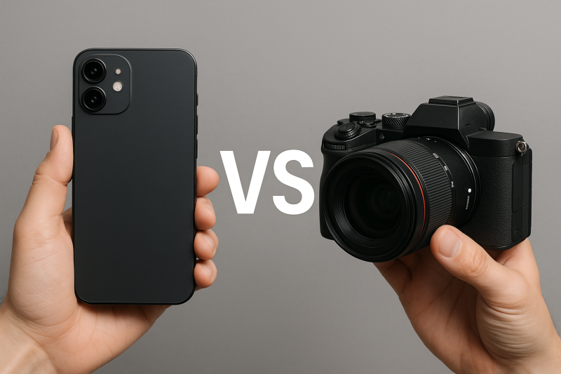
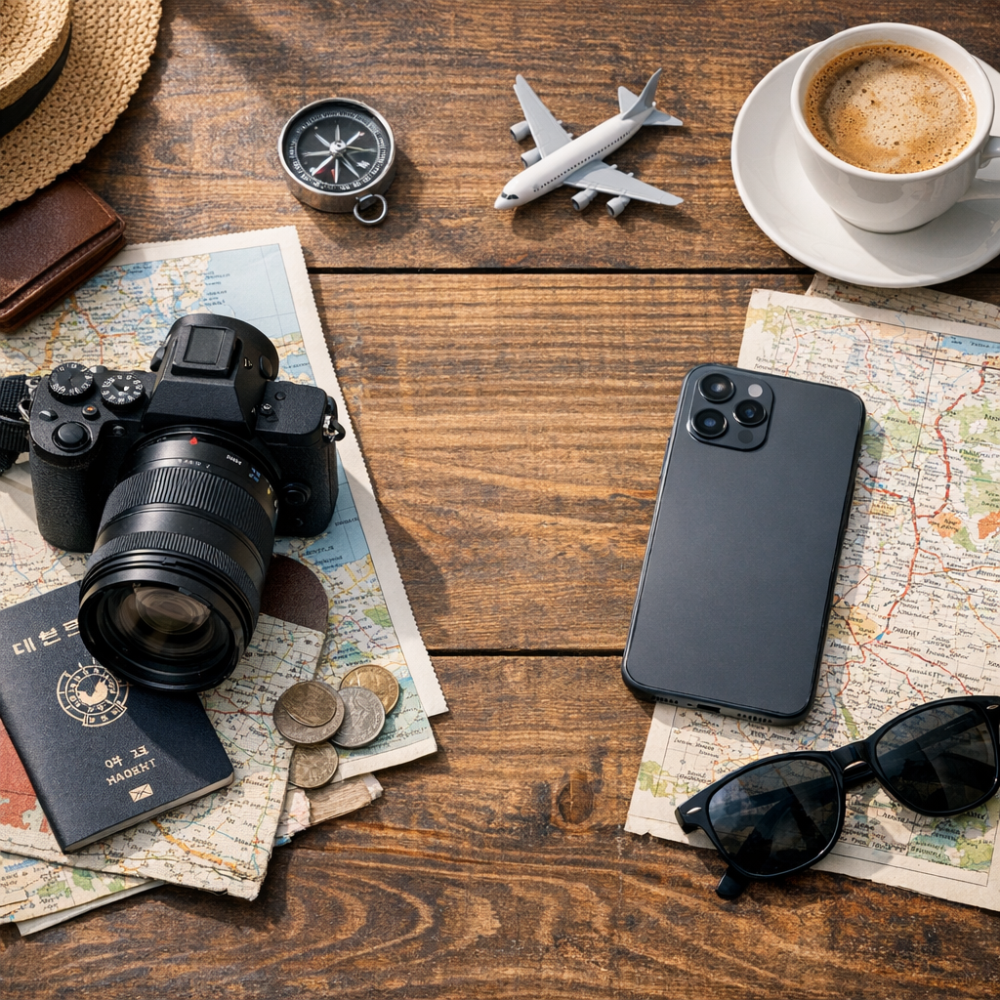

# 여행용 카메라 선택 기준 스마트폰과 미러리스 비교

여행용 카메라는 목적에 따라 선택해야 하며 스마트폰은 기록에, 미러리스는 작품성과 화질에 강점을 가진다. 스마트폰 카메라의 발전으로 누구나 높은 수준의 사진을 쉽게 촬영할 수 있게 되었지만, 물리적인 센서 크기와 광학 시스템의 차이 때문에 미러리스 카메라가 제공하는 표현 영역은 여전히 독립적인 가치를 가진다.

결국 두 장비의 경쟁은 어느 쪽이 더 좋은가의 문제가 아니다. **빠른 기록과 공유를 원하는가**, 아니면 **시간이 지나도 가치가 유지되는 이미지를 만들고 싶은가**에 따라 선택 기준이 달라진다. 여행 촬영에서 중요한 것은 최고 성능의 장비를 소유하는 것이 아니라, 자신의 여행 방식과 촬영 목적에 맞는 도구를 선택하는 것이다.

## 핵심 요약

* **스마트폰 카메라**는 항상 휴대할 수 있고 촬영 즉시 공유할 수 있어 일상 기록과 여행 순간 포착에 적합하다.
* **미러리스 카메라**는 큰 센서, 교환식 렌즈, RAW 촬영을 통해 스마트폰이 구현하기 어려운 화질과 표현력을 제공한다.
* 여행용 장비 선택은 화질보다 촬영 목적, 이동 방식, 장비 운용 부담을 함께 고려해야 한다.
* 스마트폰은 AI 기반 후보정으로 즉각적인 결과물을 제공하지만, 미러리스는 사용자의 의도에 따른 후반 작업에서 강점을 가진다.
* 두 장비는 경쟁 관계보다 역할 분담 관계에 가까우며, 상황에 따라 함께 활용하는 방식이 가장 현실적이다.

## 1. 여행 촬영에서 카메라 선택이 중요한 이유

여행을 준비하면서 카메라를 챙길지 고민하는 문제는 단순한 장비 선택이 아니다. 그것은 여행에서 무엇을 중요하게 기록할 것인지에 대한 선택이다.

과거에는 좋은 사진을 남기기 위해 무거운 DSLR과 여러 개의 렌즈를 휴대하는 것이 자연스러운 일이었다. 사진 품질을 결정하는 핵심 요소가 장비 성능이었고, 전문 카메라를 사용하는 것 자체가 높은 결과물을 보장하는 방법으로 받아들여졌다.

하지만 스마트폰 카메라가 발전하면서 여행 촬영의 기준은 크게 변했다. 이제 대부분의 여행자는 별도의 카메라 없이도 충분히 만족스러운 사진을 촬영할 수 있다. 스마트폰은 촬영부터 보정, 공유까지 하나의 과정으로 연결되어 있으며, 여행 중 발생하는 수많은 순간을 놓치지 않는다는 점에서 기존 카메라보다 강력한 장점을 가진다.

반면 미러리스 카메라는 단순히 더 선명한 사진을 만드는 장비가 아니다. 큰 센서와 다양한 렌즈를 활용해 촬영자가 의도한 방식으로 장면을 해석하고 표현하는 도구다.  

같은 장소를 촬영하더라도 스마트폰과 미러리스는 서로 다른 방식으로 기억을 남긴다.

따라서 여행용 카메라 선택의 핵심은 **최고의 장비가 무엇인가가 아니라 자신의 여행 방식에 어떤 도구가 적합한가**에 있다.

## 2. 스마트폰과 미러리스의 가장 큰 차이는 기록 방식이다

스마트폰과 미러리스의 차이는 단순한 화질 비교로 설명하기 어렵다. 두 장비는 사진을 만드는 과정 자체가 다르다.

스마트폰은 촬영 순간부터 결과물을 완성하는 방향으로 설계되어 있다. 사용자가 셔터를 누르면 이미지 센서가 받은 정보를 기반으로 스마트폰 내부 프로세서가 자동으로 여러 작업을 수행한다.

* 노출 자동 조정
* HDR 합성
* 노이즈 제거
* 색감 보정
* 인물 인식
* 야간 촬영 보정

이러한 연산 사진술(Computational Photography)은 작은 센서가 가진 물리적 한계를 소프트웨어로 보완한다. 사용자는 별도의 편집 과정 없이도 밝고 선명한 결과물을 바로 얻을 수 있다.

특히 여행에서는 이런 장점이 크게 작용한다. 길을 찾다가 발견한 풍경, 식당에서 나온 음식, 가족과 함께하는 순간처럼 준비 없이 발생하는 장면은 스마트폰이 훨씬 빠르게 대응할 수 있다.

반면 미러리스는 촬영자가 결과물 제작 과정에 직접 개입하는 구조다. 센서가 받아들인 빛의 정보를 최대한 보존하고, 이후 사용자가 원하는 방향으로 완성하는 것을 전제로 한다.

대표적인 차이는 RAW 파일 지원이다. RAW 파일은 촬영 당시 센서가 기록한 데이터를 거의 그대로 보존하기 때문에 후보정 과정에서 밝기, 색온도, 명암 등을 폭넓게 조절할 수 있다.

즉 스마트폰은 **촬영 순간에 완성되는 이미지**이고, 미러리스는 **촬영 이후 완성되는 이미지**에 가깝다.

## 3. 센서 크기가 만드는 물리적 화질 차이

스마트폰과 미러리스의 가장 근본적인 차이는 이미지 센서의 크기다.

사진은 결국 빛을 기록하는 과정이다. 센서가 클수록 더 많은 빛 정보를 받아들일 수 있고, 이는 노이즈 감소와 계조 표현력 향상으로 이어진다.

일반적인 스마트폰 카메라는 매우 작은 모바일 센서를 사용한다. 작은 공간에 카메라를 넣어야 하기 때문에 센서 크기와 렌즈 설계에는 물리적인 제한이 존재한다.

반면 미러리스 카메라는 APS-C 또는 풀프레임 같은 대형 센서를 사용한다. 센서 면적 차이는 단순한 숫자 차이가 아니라 사진 표현 방식 전체에 영향을 준다.

| 구분     | 스마트폰        | 미러리스             |
| ------ | ----------- | ---------------- |
| 센서 크기  | 소형 모바일 센서   | APS-C·풀프레임 센서    |
| 빛 수집량  | 제한적         | 상대적으로 우수         |
| 저조도 촬영 | AI 보정 의존    | 물리적 화질 우위        |
| 심도 표현  | 소프트웨어 처리 중심 | 광학적 표현 가능        |
| 후보정 범위 | 제한적         | RAW 기반 폭넓은 조정 가능 |

특히 야간 촬영이나 역광 상황에서 차이가 크게 나타난다. 스마트폰은 여러 장의 이미지를 합성해 밝기를 보정하는 방식으로 결과물을 개선하지만, 미러리스는 더 많은 빛 정보를 기록하기 때문에 자연스러운 계조 표현이 가능하다.

이는 여행지에서 해 질 무렵의 풍경, 어두운 골목, 실내 공간처럼 빛 조건이 어려운 상황에서 중요한 차이를 만든다.

## 4. 여행 목적에 따라 달라지는 최적의 장비

모든 여행자가 미러리스를 필요로 하는 것은 아니다. 여행 목적에 따라 적합한 장비는 달라진다.

가족 여행에서는 스마트폰의 장점이 크게 작용한다. 아이들의 움직임이나 예상하지 못한 순간을 빠르게 기록해야 하기 때문이다. 카메라를 꺼내고 렌즈를 선택하는 과정은 결정적인 순간을 놓치게 만들 수 있다.

스마트폰이 적합한 여행 유형은 다음과 같다.

* 가족 여행
* 맛집 중심 여행
* 도시 관광
* SNS 공유 목적 여행
* 이동이 많은 배낭여행

반면 미러리스는 특정 순간의 완성도를 중요하게 생각하는 여행에서 가치가 높다.

* 자연 풍경 여행
* 여행 사진 촬영 자체가 목적일 때
* 인물 중심 여행
* 대형 인화 목적
* 사진 보관과 기록 가치 중시

예를 들어 같은 유럽 여행이라도 목적에 따라 장비 선택은 달라진다. 관광지를 빠르게 돌아다니며 순간을 기록하는 여행자라면 스마트폰이 효율적이다. 반대로 오래 머물며 빛과 구도를 관찰하고 한 장의 사진을 남기고 싶은 여행자라면 미러리스가 적합하다.

## 5. 미러리스 카메라의 강점은 렌즈와 표현력에 있다

렌즈는 단순히 확대하거나 넓게 찍는 도구가 아니다. 같은 장소라도 어떤 초점거리를 선택하는지에 따라 사진이 전달하는 분위기와 시선이 달라진다.

* 광각 렌즈는 넓은 공간감과 현장감을 강조한다.
* 표준 렌즈는 사람이 바라보는 자연스러운 시야와 비슷한 표현을 제공한다.
* 망원 렌즈는 먼 거리의 피사체를 가까이 당기고 배경을 압축한다.
* 밝은 조리개의 단렌즈는 배경 흐림과 입체적인 인물 표현에 유리하다.

특히 인물 사진에서 차이가 뚜렷하다. 미러리스는 큰 센서와 밝은 렌즈 조합을 통해 실제 광학적으로 배경을 흐리게 만든다. 이 과정에서 피사체와 배경 사이의 거리감이 자연스럽게 표현되며 사진에 공간감이 생긴다.

스마트폰의 인물 모드는 AI가 피사체와 배경을 구분해 흐림 효과를 적용한다. 최근 기술 발전으로 상당히 자연스러워졌지만, 복잡한 머리카락이나 투명한 물체처럼 경계가 불명확한 상황에서는 한계가 나타날 수 있다.

결국 미러리스의 장점은 단순히 더 선명한 사진을 만드는 것이 아니라, **촬영자가 원하는 방식으로 사진의 결과를 조절** 할 수 있다는 점에 있다..

## 6. 후보정 과정에서 결정되는 이미지의 잠재력

스마트폰은 촬영과 동시에 결과물을 완성한다. 사용자가 별도의 편집을 하지 않아도 밝고 선명한 사진을 제공하는 것이 목표다. 이는 대부분의 여행자에게 매우 효율적인 방식이다.

반면 미러리스 카메라는 촬영 당시의 데이터를 최대한 보존하는 방향으로 설계된다. 대표적인 형식이 RAW 파일이다.

이를 통해 다음과 같은 작업이 가능하다.

* 어두운 부분의 디테일 복원
* 밝은 하늘 영역의 정보 보존
* 색온도 조절
* 특정 분위기에 맞는 색감 제작
* 인화 목적에 맞는 세밀한 조정

하지만 RAW 촬영이 항상 좋은 결과를 보장하는 것은 아니다. 후보정 과정이 없다면 미러리스 사진은 오히려 스마트폰 사진보다 평범하게 보일 수 있다.

스마트폰은 이미 AI가 사람이 선호하는 결과물에 맞춰 자동 보정을 적용한다. 반면 미러리스는 촬영자가 직접 완성해야 하는 영역을 남겨둔다.

따라서 두 장비의 차이는 어느 쪽이 더 많은 정보를 저장하는가가 아니라, **완성 과정을 자동화할 것인가 직접 통제할 것인가**에 있다.

## 7. 여행에서 장비 무게가 결과물에 미치는 영향

미러리스의 성능이 뛰어나더라도 여행에서는 항상 최선의 선택이 되는 것은 아니다. 장비의 무게는 촬영 능력뿐 아니라 여행 경험 전체에 영향을 준다.

카메라 본체, 렌즈, 추가 배터리, 충전기, 메모리카드, 가방까지 준비하면 휴대 부담은 빠르게 증가한다. 특히 여러 렌즈를 가져가는 순간 촬영 장비는 여행 도구가 아니라 별도의 짐이 된다.

이러한 부담은 단순한 신체 피로로 끝나지 않는다. 촬영자는 계속해서 다음과 같은 판단을 해야 한다.

* 지금 카메라를 꺼낼 필요가 있는가?
* 어떤 렌즈를 사용해야 하는가?
* 배터리가 충분한가?
* 촬영 후 파일을 어떻게 관리할 것인가?

이 과정이 반복되면 여행 자체보다 촬영 관리에 집중하게 될 수 있다.

반대로 스마트폰은 언제든 꺼내 바로 촬영할 수 있다. 별도의 준비 과정이 거의 없기 때문에 여행의 흐름을 유지하면서 기록할 수 있다.

미러리스의 성능을 제대로 활용하지 못하고 가방 속에 넣어두는 것보다, 항상 휴대하는 스마트폰으로 꾸준히 기록하는 것이 더 가치 있는 경우도 있다.

## 8. 여행 촬영에서 스마트폰과 미러리스의 역할 분담

스마트폰과 미러리스는 서로 대체하는 관계라기보다 역할이 다른 도구에 가깝다.

미러리스는 특별한 순간을 위한 장비로 활용하는 것이 효율적이다.

예를 들면 다음과 같은 방식이다.

| 촬영 상황 | 적합한 장비 | 이유 |
|---|---|---|
| 이동 중 발견한 순간 | 스마트폰 | 즉시 촬영 가능 |
| 음식·일상 기록 | 스마트폰 | 빠른 공유와 편의성 |
| 가족의 자연스러운 모습 | 스마트폰 | 순간 대응력 우수 |
| 풍경 사진 | 미러리스 | 높은 화질과 표현력 |
| 인물 기념사진 | 미러리스 | 자연스러운 배경 표현 |
| 작품 목적 촬영 | 미러리스 | 후보정과 렌즈 활용 가능 |

가장 현실적인 방식은 두 장비의 역할을 명확히 나누는 것이다.

스마트폰을 항상 사용하는 기록 도구로 두고, 미러리스는 여행에서 반드시 남기고 싶은 장면을 위한 전문 도구로 활용하면 장비 부담과 촬영 만족도를 동시에 확보할 수 있다.

## 결론

스마트폰과 미러리스 카메라는 같은 사진 촬영 도구지만, 설계 목적과 사용 방식은 다르다. 스마트폰은 **편리한 기록과 즉각적인 공유**를 중심으로 발전했고, 미러리스는 **광학적 표현과 창작 과정**을 중심으로 발전했다.

스마트폰은 여행자의 일상적인 순간을 놓치지 않게 해주는 가장 현실적인 도구다. 별도의 준비 없이 언제든 촬영할 수 있고, 촬영 후 활용 과정도 단순하다. 대부분의 여행 기록에서는 스마트폰만으로 충분한 결과물을 얻을 수 있다.

그러나 미러리스는 단순한 기록 이상의 가치를 원하는 사용자에게 의미가 있다. 시간이 지나 다시 보았을 때 당시의 공간감과 분위기를 떠올릴 수 있는 사진, 인화하거나 작품으로 활용할 수 있는 사진을 만들고 싶다면 전문 카메라의 역할은 여전히 존재한다.

결국 여행 촬영에서 중요한 것은 장비의 우열이 아니라 **여행자가 무엇을 기억하고 싶은가에 대한 선택**이다. 순간을 빠르게 저장하고 공유하려 한다면 스마트폰이 적합하고, 한 장의 사진에 여행의 의미를 담고 싶다면 미러리스가 더 적합하다.

좋은 여행 사진은 가장 비싼 장비에서 나오는 것이 아니라, 자신의 목적에 맞는 도구를 선택하고 그 도구를 꾸준히 활용할 때 만들어진다.

## 자주 묻는 질문(FAQ)

### 여행에는 스마트폰만 가져가도 충분한가?

대부분의 일반적인 여행 기록 목적이라면 스마트폰만으로 충분하다. 최근 스마트폰은 AI 기반 보정과 고성능 이미지 처리 기술을 통해 일상 사진과 SNS 공유용 사진에서는 높은 완성도를 제공한다. 다만 대형 인화, 전문 후보정, 특별한 풍경 표현을 원한다면 미러리스의 장점이 분명하다.

### 여행용 미러리스는 어떤 기준으로 선택해야 하는가?

여행용 미러리스는 최고 성능보다 휴대성과 사용 편의성을 우선해야 한다. 가벼운 바디, 범용적인 줌 렌즈, 충분한 배터리 성능, 안정적인 자동 초점 기능이 실제 여행 환경에서는 더 중요하다.

### 스마트폰 사진이 미러리스 사진보다 좋아 보이는 이유는 무엇인가?

스마트폰은 촬영 순간 AI가 색감, 밝기, 대비, 선명도를 자동 조정하기 때문이다. 반면 미러리스는 원본 데이터를 보존하는 방향으로 설계되어 촬영 직후에는 상대적으로 평범하게 보일 수 있다. 후보정을 거치면 미러리스가 가진 데이터 활용 범위가 크게 증가한다.

### 미러리스와 스마트폰을 함께 사용하는 것이 좋은가?

두 장비는 역할을 나누어 사용하면 효율적이다. 스마트폰은 빠른 기록과 여행 운영을 담당하고, 미러리스는 중요한 풍경이나 인물 사진을 남기는 용도로 활용하면 장비 부담과 결과물 만족도를 동시에 확보할 수 있다.

### 앞으로 스마트폰이 미러리스를 완전히 대체할 수 있는가?

일반적인 기록 영역에서는 스마트폰의 영향력이 계속 커질 가능성이 높다. 하지만 센서 크기, 렌즈 교환 시스템, 광학적 표현력처럼 물리적 구조에서 발생하는 차이는 쉽게 사라지기 어렵다. 따라서 두 장비는 앞으로도 서로 다른 목적을 가진 도구로 공존할 가능성이 높다.