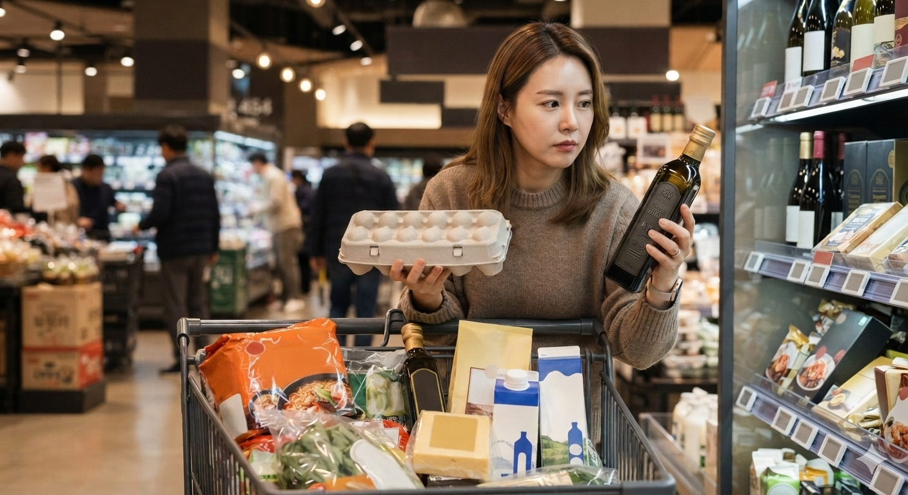

# 불황에도 소비자는 왜 가성비와 프리미엄을 함께 찾을까?

고물가 시대의 소비자는 모든 지출을 줄이지 않고 실속과 건강에는 절약하면서 경험과 취향에는 선택적으로 비용을 쓰는 전략적 소비를 한다. 겉으로 보면 서로 모순되는 소비처럼 보인다. 2,000원대 커피와 저가 뷔페를 찾으면서도 2인 기준 11만~12만원에 이르는 호텔 애프터눈 티에는 지갑을 연다.

문제는 소비자가 갑자기 씀씀이가 커졌다는 데 있지 않다. 오히려 **돈을 어디에 써야 만족도가 높은지 판단하는 기준이 더 세밀해졌다**는 쪽에 가깝다. 먹는 것에서도 가격, 건강, 편의성, 취향, 경험을 따로 계산하기 시작했다.

## 핵심 요약

* **가성비와 프리미엄 소비는 동시에 나타난다.** 소비자는 전체 지출을 줄이는 대신 중요하다고 판단한 영역에 예산을 집중한다.
* **호텔 애프터눈 티와 고급 디저트는 경험형 소비의 대표 사례다.** 맛뿐 아니라 공간, 시각적 연출, 희소성, SNS 공유 가치까지 함께 구매한다.
* **혼웰식은 편의성과 건강을 결합한다.** 즉석 잡곡밥, 덮밥, 샐러드, 곡물빵처럼 혼자 먹기 쉽고 건강을 의식한 메뉴가 성장한다.
* **요노와 앰비슈머 소비는 절약의 기준을 바꾼다.** 무조건 싼 상품보다 품질을 신뢰할 수 있는 실속형 상품을 선택하고, 필요한 영역에는 과감하게 지출한다.
* **오프라인 유통 공간도 상품 자체보다 경험을 팔기 시작했다.** 호텔과 백화점, 팝업스토어는 체류 시간과 기억을 만드는 공간으로 역할을 넓힌다.
* **외식·식품 시장의 경쟁 기준은 가격 하나로 설명되지 않는다.** 기업은 가격 경쟁력과 건강, 편의, 취향, 경험 중 어떤 가치를 조합할지 결정해야 한다.

## 1. 외식 시장에서는 가성비와 프리미엄이 동시에 성장하는가?

고물가가 이어지면서 외식 시장의 기본 방향은 분명히 **절약** 쪽으로 움직였다. 저렴한 뷔페와 2,000원대 커피처럼 한 끼의 부담을 낮추는 소비가 늘었고, 한때 고가 외식의 상징으로 떠올랐던 오마카세의 검색량도 크게 떨어졌다. 네이버 데이터랩 기준으로 '오마카세' 검색량은 파인 다이닝 수요가 정점이었던 2023년 1월을 100으로 놓았을 때 지난달 14까지 내려갔다.

그런데 같은 시기에 고급 호텔의 애프터눈 티 매출은 오히려 증가했다. 조선호텔앤리조트의 레스케이프 '티 살롱'은 올해 1월 ~7월 매출이 전년 동기보다 약 101% 늘었고, 롯데호텔 월드 '더 라운지 앤 바'는 55%, 그랜드 인터컨티넨탈 서울 파르나스의 '로열 하이티'는 약 10% 증가했다. 가격은 2인 기준 11만 ~12만원 수준이다.

여기서 눈여겨볼 점은 **고가 상품 자체가 살아남았다는 사실**이다. 모든 프리미엄 외식이 같은 반응을 얻는 것은 아니다. 소비자는 비싼 상품을 무조건 거부하는 것이 아니라, 높은 가격을 지불할 이유가 분명한 상품과 그렇지 않은 상품을 구분하고 있다.

오마카세가 한동안 대중적인 유행으로 확산하면서 희소성을 잃었다면, 호텔 애프터눈 티는 계절과 협업, 한정 판매를 이용해 새로운 이유를 계속 만들어낸다. 같은 고가 외식이라도 소비자가 체감하는 가치는 달라질 수밖에 없다.

## 2. 호텔 애프터눈 티는 왜 식사가 아니라 경험 상품이 되었는가?

호텔 애프터눈 티의 핵심은 음식만으로 설명되지 않는다. 3단 트레이에 담긴 디저트는 **시각적 콘텐츠**로 기능하고, 호텔의 높은 층고와 전망, 인테리어는 식사와 별개의 경험을 제공한다. 소비자는 차와 디저트를 먹는 동시에 그 공간을 경험하고 사진으로 남긴다.

그래서 1인당 5~6만원이라는 가격을 단순히 음식의 원가와 비교하면 설명이 잘 되지 않는다. 소비자가 지불하는 금액에는 **공간을 점유하는 경험과 시각적 만족**이 함께 포함되어 있기 때문이다.

호텔 업계도 이 구조를 적극적으로 활용한다. 유명 파티시에와 협업하거나 캐릭터 IP를 결합하면서 단순한 디저트 메뉴에 희소성을 넣는다. 조선 팰리스의 프랑수아 페레 협업 상품은 판매 기간인 지난 5월 매출이 전년 동월보다 약 118% 증가했다. 롯데호텔 월드 역시 폼폼푸린과 시나모롤 같은 캐릭터를 활용해 팬덤 소비를 끌어낸다.

이때 상품의 수명은 길지 않아도 된다. **시즌성 자체가 구매 이유**가 되기 때문이다. 지금 판매하는 과일 테마나 협업 상품을 다음 달에도 살 수 있다고 생각하면 방문을 미룰 수 있지만, 한정 판매라면 판단이 달라진다.

이 구조는 고급 디저트를 단순한 먹거리에서 콘텐츠로 바꾼다. 소비자는 맛을 평가하는 데서 끝나지 않고 "이번 시즌에는 무엇이 나왔나", "사진을 찍었을 때 어떤가", "어떤 브랜드와 협업했나"를 함께 본다.

## 3. 2030 세대에게 디저트는 왜 후식에서 목적지가 되었는가?

디저트 소비의 변화는 세대별 식문화 차이에서도 뚜렷하게 나타난다. 과거에는 식사 뒤에 자연스럽게 따라오는 **부수적인 후식**이라는 성격이 강했다면, 지금은 유명한 디저트를 먹기 위해 일부러 이동하는 행동이 자리 잡았다.

엠브레인 트렌드모니터의 '2026 디저트 취식 경험 조사'에서는 20대의 31.0%가 유명 디저트 맛집을 찾아가기 위해 시간을 할애한다고 답했고, 67.5%는 비싸더라도 인기 있는 디저트를 경험해보고 싶다고 응답했다. 가격보다 경험 자체의 가치가 중요해진 셈이다.

이런 소비는 백화점 식품관에도 영향을 준다. 유명 베이커리나 해외 인기 디저트 브랜드를 유치하면 단순히 제품을 판매하는 데 그치지 않고 **사람이 찾아와야 할 이유**를 만들 수 있다. 특정 제품을 먹기 위해 매장을 방문하고, 방문 자체가 또 하나의 경험이 된다.

여기에는 SNS도 빠질 수 없다. 예쁘게 연출된 디저트는 먹고 끝나는 상품이 아니라 사진과 영상으로 다시 소비된다. 상품의 물리적 가치에 디지털 공유 가치가 덧붙는 구조다.

## 4. 혼웰식은 한국인의 일상식을 어떻게 바꾸고 있는가?

프리미엄 디저트가 특별한 경험을 향한 소비라면, 일상식에서는 **편의성과 건강**이 동시에 중요해지고 있다. 문정훈 서울대 농경제사회학부 교수의 '푸드 트렌드 2026' 분석이 제시한 '혼웰식'은 혼자 먹는 웰니스 식문화를 의미한다.

한국인은 하루 평균 약 2.5끼, 연간 약 900끼를 먹는다. 전체 식사 가운데 특정 메뉴 몇 번의 유행보다 매일 반복하는 선택의 변화가 시장에 더 큰 영향을 미친다.

밥류에서는 집밥 소비가 0.4% 증가한 데 비해 즉석밥은 19.3% 성장했다. 특히 간편식 잡곡밥은 47% 증가했다. 흰쌀밥의 성장이 정체되는 동안 **잡곡과 건강이라는 기준**이 즉석식품 선택에 들어오기 시작한 것이다.

덮밥 역시 혼밥에 적합한 구조 덕분에 성장했다. 최근 3년간 외식 시장에서 9.2%, 간편식 시장에서 5.6% 증가했고, 오피스 상권의 혼밥 비중은 2년 전보다 14.9% 늘었다. 2030세대에서는 계육 덮밥이 81.8% 성장했고, 4050세대는 마파두부와 수산물 덮밥에 대한 선호가 두드러졌다.

메뉴의 형태도 중요하다. 한 그릇에 식사가 완결되면 반찬을 여러 개 준비할 필요가 없고, 조리와 설거지도 줄어든다. **혼자 먹는 생활 방식에 맞는 구조**가 메뉴 선택 자체를 바꾸고 있다.

샐러드는 최근 3년간 섭취 빈도가 36.8% 늘어 전체 메뉴 가운데 가장 높은 성장세를 기록했다. 과거처럼 닭가슴살만 올리는 방식에서 벗어나 연어, 견과류, 구운 호박 등 토핑이 다양해졌고 구매 방식도 온라인 주문과 창고형 할인점으로 넓어졌다.

흥미로운 부분은 세대별 소비 경로다. 4050 여성은 가정 내 소비 비중이 높고, 2030 여성은 외식과 배달 의존도가 높다. 같은 샐러드라도 **어디에서 소비하는가**가 세대별 생활 방식의 차이를 보여준다.

빵에서도 비슷한 변화가 나타났다. 식빵, 베이글, 모닝빵의 섭취가 줄어드는 반면 소금빵, 바게트, 치아바타, 곡물빵은 증가했다. 특히 곡물빵은 69.2%라는 높은 증가율을 기록했다.

이는 밥에서 잡곡을 선택하는 흐름과 닮았다. 빵을 단순한 간식으로 보기보다 식사 대용으로 받아들이면서 **영양 성분과 건강 가치**를 함께 따지는 소비가 강해진 것이다. 맛이 좋다는 이유만으로 충분하지 않고, 무엇으로 만들었는지를 확인하는 체크슈머 성향이 주식 영역까지 들어왔다.

소비자들은 편리함을 단순히 시간을 아끼는 문제로 보지 않는다. 조리 과정 자체에 피로를 느끼기 시작했다는 점이 중요하다.

생선구이가 대표적이다. 가정에서 직접 조리하기 번거로운 탓에 간편식 생선구이는 3.8% 감소했지만 외식과 배달을 통한 소비는 20% 이상 증가했다. 생선 자체를 싫어해서가 아니라 **조리하지 않고 먹는 방식**을 선호하는 것이다.

젊은 세대의 식사 중 스마트폰 사용도 메뉴 구조에 영향을 준다. 한 손으로 먹기 쉽고 도구 사용이 적은 덮밥류가 주목받는 이유가 여기에 있다. 식사는 점점 복잡한 행위에서 벗어나고 있다.

마라탕 사례에서도 비슷한 현상을 확인할 수 있다. 10대를 중심으로 한 마라탕의 유행은 정점을 지났지만 마라 맛은 버거와 피자 같은 다른 메뉴에 들어가면서 일상적인 맛으로 자리 잡았다. **유행은 사라져도 맛의 경험은 남는다.**

## 5. 요노와 앰비슈머는 불황기의 소비를 어떻게 설명하는가?

불황이 길어지면 소비가 전부 위축될 것이라고 생각하기 쉽다. 실제 모습은 조금 다르다. 소비자는 한정된 예산을 여러 영역에 나누지 않고 **필요한 곳과 포기할 곳을 구분**한다.

요노(YONO, You Only Need One)는 이런 변화를 상징하는 개념이다. 과거 YOLO식 소비가 순간의 만족과 소비 자체를 강조했다면, 요노는 꼭 필요한 하나를 선택하고 나머지는 아끼는 방향으로 움직인다.

여기에 앰비슈머라는 개념이 겹친다. 생필품에서는 초저가 PB 상품을 고르면서도 취향이나 만족감이 중요한 분야에는 비용을 아끼지 않는 **분절적 소비**다. 따라서 같은 사람이 저가 커피와 호텔 애프터눈 티를 동시에 소비하는 것이 이상하지 않다.

대형마트 PB 매출 비중이 성장한 것도 이런 흐름과 연결된다. 이마트 노브랜드처럼 가격 경쟁력을 전면에 내세운 상품이 있는가 하면, 롯데마트 오늘좋은처럼 기능성과 품질을 강조하는 PB도 등장한다. 편의점의 1+1 행사 역시 식비를 방어하려는 실속 소비의 거점이 되고 있다.

중요한 것은 소비자가 모든 상품에서 최저가만 요구하지 않는다는 점이다. **신뢰할 수 있는 품질을 전제로 한 합리적 가격**도 중요한 가치가 됐다.

## 6. 오프라인 매장은 왜 상품보다 체류 경험을 팔고 있는가?

온라인 쇼핑이 일상화되면서 오프라인 매장은 상품을 보여주는 기능만으로 경쟁하기 어려워졌다. 가격과 상품 정보는 온라인에서 더 빠르게 비교할 수 있기 때문이다.

그 결과 매장의 경쟁 기준은 **체류 시간과 경험**으로 이동한다. 백화점 식품관은 단순히 식료품을 진열하지 않고 유명 베이커리와 해외 디저트 브랜드를 유치한다. 소비자는 제품 때문에 공간을 방문하고, 그 공간에서 또 다른 소비를 이어간다.

팝업스토어도 같은 구조다. 강한 시각·청각·촉각 경험을 제공하고 브랜드를 기억하게 만든다. 일반 매장보다 팝업스토어 방문객의 객당 결제 금액이 약 1.2배 높게 나타났다는 분석도 이런 전략의 경제적 효과를 보여준다.

CJ올리브영은 성수 매장에서 피부·두피 진단 같은 체험 요소를 제공하고, 신세계백화점 강남점은 골프 레슨과 장비 제작을 결합한 팝업을 선보였다. 무신사 역시 오프라인 공간을 확대하고 있다. **매장은 판매 장소에서 브랜드를 경험하는 장소로 바뀌고 있다.**

## 7. 온라인은 경험 대신 개인화로 소비를 압축하는가?

오프라인이 경험을 확대하는 동안 온라인은 정반대 방향으로 움직인다. 상품을 많이 보여주는 대신 소비자가 선택해야 할 정보를 줄여준다.

과거 온라인 쇼핑은 거대한 상품 데이터베이스를 펼쳐놓는 방식에 가까웠다. 이제는 구매 이력, 검색 성향, 체류 시간 등을 분석해 개인에게 맞는 상품을 먼저 보여준다. 에이블리와 같은 패션 플랫폼이 AI 기반 추천 시스템을 고도화하는 이유도 여기에 있다.

이 구조는 요노와도 연결된다. 소비자가 원하는 것은 선택지 자체가 아니라 **내가 원하는 것을 빠르게 찾는 것**이다. 불필요한 탐색에 시간과 에너지를 쓰지 않고 취향에 맞는 상품에 집중하려는 것이다.

따라서 온·오프라인의 방향은 서로 반대이면서도 같은 목표를 가진다. 오프라인은 기억에 남는 경험을 만들고, 온라인은 선택에 필요한 비용을 줄인다. 둘 다 소비자가 한정된 시간과 돈을 어디에 사용할지 최적화하는 과정이다.

## 8. 앞으로 식품과 외식 기업은 무엇을 팔아야 하는가?

지금까지의 흐름을 보면 상품 기획의 기준은 단순한 메뉴 개발에서 벗어나고 있다. 혼자 먹기 편한가, 건강한가, 조리가 쉬운가, 희소성이 있는가, 나의 취향과 맞는가가 동시에 작용한다.

일상식에서는 한 그릇의 완결성이 중요하다. 덮밥과 비빔밥처럼 조리와 설거지 부담을 줄이는 형태가 혼밥 환경에 잘 맞고, 잡곡과 곡물빵, 다양한 샐러드 토핑처럼 건강한 대체재가 선택 기준으로 들어온다.

반대로 프리미엄 시장에서는 **경험을 설계하는 능력**이 중요하다. 계절감과 스토리를 넣고, 유명 파티시에나 캐릭터 IP와 협업해 희소성을 높이며, 소비자가 사진으로 남기고 싶은 공간을 만든다.

스마트폰을 사용하면서 먹기 편한 메뉴처럼 식사 행동 자체를 고려한 상품 설계도 필요하다. 소비자의 생활 방식이 변하면 메뉴의 형태도 달라져야 한다.

식품과 생필품에서는 생산 원가와 유통 비용을 낮춰 실속형 상품을 만들고, 패션·뷰티와 일부 외식 분야에서는 플래그십 공간과 협업, 팝업 같은 경험형 콘텐츠를 강화한다.

기업 입장에서 중요한 것은 모든 소비자를 하나의 집단으로 보는 일이 아니다. 같은 사람이 일상에서는 절약하고 특별한 순간에는 과감하게 소비한다는 전제를 받아들여야 한다.

## 결론

최근의 소비 변화는 단순한 **가성비 열풍**이나 소비 양극화로 설명하기 어렵다. 더 정확히 말하면 소비자는 줄어든 자원을 모든 영역에 똑같이 배분하지 않고, 자신에게 중요한 가치에 집중하고 있다. 한 끼의 가격은 낮추면서도 건강에는 투자하고, 생필품은 PB로 구매하면서도 취향과 경험을 위해 호텔 애프터눈 티를 선택한다.

식품과 외식 시장에서 나타나는 변화도 같은 방향을 가리킨다. 혼웰식은 일상에서 편의성과 건강을 결합하고, 고급 디저트는 특별한 순간에 경험과 희소성을 제공한다. 오프라인 유통 공간은 체류 경험을 만들고 온라인 플랫폼은 AI로 선택 비용을 줄인다. 시장은 소비자를 더 많이 쓰게 만드는 방향보다 **한정된 소비 여력을 어디에 배치할 것인지 설계하는 방향**으로 움직이고 있다.

## 자주 묻는 질문(FAQ)

### 불황인데 왜 호텔 애프터눈 티처럼 비싼 상품의 매출이 증가하는가?

호텔 애프터눈 티는 음식만 판매하지 않는다. **디저트, 공간, 시각적 연출, 희소성**을 묶어 하나의 경험으로 제공하기 때문에 소비자가 가격을 음식의 양만으로 평가하지 않는다.

### 오마카세와 애프터눈 티의 소비 흐름이 다른 이유는 무엇인가?

오마카세 검색량은 크게 감소했지만 애프터눈 티는 시즌 메뉴와 협업 상품을 통해 새로운 희소성을 계속 만든다. 같은 고가 외식이라도 **차별화 방식과 경험의 구성**에 따라 소비 반응이 달라진다.

### 혼웰식의 대표적인 메뉴는 무엇인가?

즉석 잡곡밥, 덮밥, 샐러드, 곡물빵처럼 **혼자 먹기 편하고 건강을 고려한 메뉴**가 대표적인 흐름이다. 편의성과 기능성을 동시에 만족시키는 형태가 강하다.

### 요노와 앰비슈머 소비는 같은 개념인가?

완전히 같은 개념은 아니다. 요노는 필요한 소비에 집중하고 불필요한 지출을 줄이는 실속 소비를 가리키며, 앰비슈머는 절약과 프리미엄 지출이 한 사람 안에서 동시에 나타나는 **양면적 소비 행동**을 설명한다.

### 식품·외식업체가 앞으로 가장 중요하게 봐야 할 소비 기준은 무엇인가?

가격 하나만으로 소비자를 판단하기 어렵다. **편의성, 건강, 취향, 경험, 희소성** 가운데 어떤 가치를 어떤 가격 구조로 제공할 것인지가 상품 경쟁력을 결정하는 핵심 기준이 된다.