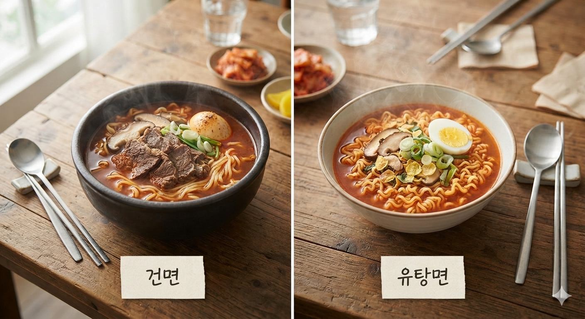

# 라면 건면 유탕면 차이 비교 제조 공정 조리과학 완전 분석

라면 건면 유탕면 차이 완전 분석! 건조 공정이 결정하는 면발의 치밀한 식감과 칼로리, 국물 맛과 조리 과학의 깊은 비밀. 두 제품 다 전분을 알파화(호화)해서 만들지만, 그다음 수분을 어떤 방식으로 빼느냐에 따라 식감과 조리 시간, 국물 맛, 보관 기간까지 달라진다. 라면은 단순한 인스턴트 식품이 아니다. 전분 과학과 열전달, 수분 제어, 식품공학이 모두 녹아든 결과물이다. 이 원리를 알면 같은 라면이라도 왜 맛과 식감이 다른지 자연스레 이해가 된다.

## 핵심 요약

* **라면의 핵심 기술은 전분의 알파화(호화)를 건조 상태로 붙잡아 두는 데 있다.**
* **유탕면은 뜨거운 기름으로 순간 건조해 다공성 구조를 만들고 빠르게 복원된다.**
* **건면은 열풍으로 천천히 말려 조직을 치밀하게 유지하며 생면에 가까운 식감을 낸다.**
* **면 조직의 차이가 조리 시간과 국물 풍미, 식감, 붇는 속도를 모두 갈라놓는다.**
* **최근 라면 기술은 맛뿐 아니라 건강성과 저장성까지 함께 살피는 방향으로 나아가고 있다.**

## 1. 라면의 핵심은 전분의 알파화(호화)에 있다

라면을 만드는 출발점은 밀가루 반죽이 아니다. 전분을 어떻게 다루느냐에 달렸다.

밀가루의 주성분은 전분이다. 생밀가루 상태에서는 전분 입자가 단단한 결정 구조를 그대로 유지한다. 이 상태를 흔히 **β(베타) 전분**이라 부르는데, 물에 잘 녹지 않고 소화도 잘 안 된다.

반죽을 스팀이나 끓는 물로 가열하면 전분 입자가 수분을 빨아들이며 부풀어 오른다. 결정 구조가 무너지고 내부까지 물이 스며들면서 부드러운 **α(알파) 전분**, 즉 **호화(Gelatinization)** 상태로 바뀐다.

이 과정에서 일어나는 변화는 다음과 같다.

* 전분 결정 구조 붕괴
* 수분 흡수
* 점도 증가
* 소화율 증가
* 탄력 형성
* 면 조직 안정화

이게 바로 우리가 먹는, 다 익은 면의 상태다.

하지만 호화된 면은 그대로 두면 오래 못 간다. 시간이 지나면 수분이 옮겨 다니면서 전분 분자끼리 다시 뭉치는데, 이 현상을 **전분의 노화(Retrogradation)** 라 부른다.

전분 노화가 시작되면

* 면이 단단해진다
* 탄력이 떨어진다
* 빨리 붇는다
* 식감이 거칠어진다

그래서 라면 회사는 호화된 상태를 최대한 붙잡아 두면서 수분만 빼는 쪽으로 제조 공정을 설계한다.

## 2. 유탕면과 건면, 조직부터 다르다

건면과 유탕면이 아예 다른 재료로 시작한다고 생각하기 쉽지만, 실제 제조 과정은 대부분 같다.

일반적인 제조 공정은 다음과 같다.

1. 소맥분과 배합수 혼합
2. 반죽
3. 압연
4. 면 절출
5. 꼬불면 성형
6. 증숙(스팀)
7. 전분 호화
8. 건조

차이는 마지막 건조 공정에서 갈린다.

### 유탕면

유탕면은 다 쪄낸 면을 약 **140~150℃의 팜유**에 수십 초간 튀긴다.

* 내부 수분이 순식간에 끓는다
* 수증기가 밖으로 빠져나간다
* 빠져나간 자리에 미세한 기공이 잔뜩 생긴다
* 남은 수분은 약 4~6% 수준까지 떨어진다

그 결과 면 전체가 스펀지처럼 구멍 숭숭한 **다공성 구조**를 갖는다.

### 건면

건면은 기름을 쓰지 않는다.

다 쪄낸 면을 약 **80~90℃**의 열풍으로 30분에서 1시간 넘게 천천히 말린다.

* 수분이 천천히 빠져나간다
* 조직이 크게 무너지지 않는다
* 면 속이 치밀하게 남는다
* 최종 수분은 약 10~12% 수준이다

같은 반죽이라도 말리는 방식에 따라 속 구조는 완전히 달라진다.

건조는 그냥 물기를 없애는 작업이 아니다. 수분이 빠지는 속도 자체가 조직 구조를 가른다. 유탕면 쪽 기공은 조리할 때 아주 중요한 역할을 한다. 물이 빠르게 스며들고, 국물이 쉽게 배어들고, 조리 시간이 짧고, 복원도 아주 빠르다. 반면 건면은 내부 밀도가 높고 기공이 적다. 물도 천천히 스며들어서 탄력이 오래간다.

| 비교 항목 | 유탕면 | 건면 |
|---|---|---|
| 조직 | 다공성 | 치밀함 |
| 기공 | 매우 많음 | 매우 적음 |
| 밀도 | 낮음 | 높음 |
| 수분 이동 | 빠름 | 느림 |
| 복원 속도 | 매우 빠름 | 상대적으로 느림 |

이 구조 차이가 앞으로 살펴볼 조리 특성과 식감을 가르는 가장 큰 요인이다.

## 3. 유탕면은 왜 3~4분이면 완성될까

유탕면이 금방 익는 건 면이 얇아서가 아니다. 다공성 구조(Porous Structure) 덕분이다. 이 기공들이 조리 과정에서 **모세관 현상(Capillary Action)**을 일으켜 끓는 물을 순식간에 빨아들인다.

복원 과정은 다음 순서로 진행된다.

1. 끓는 물이 기공 속으로 스며든다.
2. 수분이 호화된 전분 조직 전체로 빠르게 퍼진다.
3. 말라 있던 전분이 다시 물을 머금으며 먹을 수 있는 상태로 돌아온다.

그러니까 라면을 끓이는 일은 생면을 새로 익히는 게 아니다. 공장에서 이미 만들어 둔 면을 다시 살려내는 과정이다.

이 복원력 덕분에 유탕면은 대개 3~4분이면 익고, 컵라면처럼 뜨거운 물만 부어도 충분히 조리된다.

## 4. 건면은 왜 오래 끓여야 할까

건면도 제조 과정에서 전분이 이미 호화된 상태다. 다만 열풍으로 천천히 말리는 탓에 조직이 치밀해서, 물이 속까지 스며드는 속도가 느리다.

그러니까 건면은 전분을 다시 익히는 게 아니라, 치밀한 조직 속으로 물이 퍼지는 데 시간이 걸리는 것뿐이다.

* 조리 시간이 길다
* 중심까지 물이 닿아야 한다
* 설익으면 딱딱한 심이 남는다
* 너무 오래 끓이면 겉면 전분부터 풀어진다

그래서 건면은 회사가 권장하는 조리 시간을 지키는 게 중요하다. 너무 짧으면 중심이 덜 익고, 너무 오래 끓이면 국물까지 탁해지면서 탄력도 떨어진다.

그래서 건면은 유탕면보다 조리 시간이 더 중요한 제품군이다.

## 5. 식감은 전분보다 조직 구조가 결정한다

유탕면과 건면의 가장 큰 차이는 식감이다.

흔히 원재료가 달라서라고 생각하지만, 실은 건조 방식이 만든 조직 차이가 더 크게 작용한다. 유탕면은 다공성 조직 덕분에 부드럽고 국물이 잘 밴다. 건면은 치밀한 조직을 유지해서 씹을수록 탄력이 느껴지고, 생면에 가까운 질감을 낸다.

| 항목 | 유탕면 | 건면 |
|---|---|---|
| 조직 | 다공성 | 치밀한 구조 |
| 씹는 느낌 | 부드러움 | 탄력이 강함 |
| 국물 흡수 | 매우 빠름 | 천천히 흡수 |
| 생면 유사성 | 비교적 낮음 | 높음 |
| 탄력 유지 | 보통 | 우수 |

건면이 프리미엄 제품에 자주 쓰이는 이유도 이 생면 같은 식감 때문이다.

## 6. 국물 맛도 제조 공정에 따라 달라진다

달라지는 건 면만이 아니다. 국물도 제조 방식에 따라 크게 달라진다.

유탕면은 튀기는 과정에서 식용유가 면 속에 조금 남는다. 끓이면 이 기름이 국물로 배어 나오면서 이런 효과를 낸다.

* 고소한 향이 짙어진다
* 지방 풍미가 살아난다
* 감칠맛이 강해진다
* 국물이 묵직해진다

그래서 같은 스프를 써도 유탕면 쪽 국물이 더 진하고 묵직하게 느껴질 때가 많다.

반면 건면은 튀김유가 거의 없다. 국물에 전분과 수용성 성분만 살짝 녹아 나오다 보니 맛이 담백하다. 요즘 프리미엄 건면이 재료 본연의 국물 맛을 내세우는 이유도 여기 있다.

## 7. 전분 노화가 '면이 붇는 현상'을 만든다

라면을 오래 두면 면이 불어 맛이 없어지는 현상은 단순히 물을 많이 먹어서가 아니다.

수분을 먹으면서 조직이 물러지는 현상과 전분의 노화(Retrogradation)가 함께 작용한다. 다 끓인 뒤에도 면 속에서는 수분이 계속 움직인다. 시간이 지나면 전분 분자끼리 다시 뭉치기 시작한다.

* 면이 점점 물러진다
* 탄력이 빠진다
* 표면이 퍼진다
* 씹는 맛이 없어진다

유탕면은 다공성 구조라 수분 이동이 빨라서 이 변화도 금방 온다.

건면은 조직이 치밀해서 수분 이동이 느리다. 그래서 다 끓인 뒤에도 탄력이 비교적 오래간다. 많은 사람이 건면을 "쉽게 불지 않는다"고 느끼는 이유다.

## 8. 생면과 구운면은 어떤 기술로 만들어질까

건면과 유탕면 말고도 요즘은 **생면**과 **구운면**을 쓴 제품이 늘고 있다. 다 같은 밀가루를 쓰지만, 수분을 다루는 방식과 열처리 공정이 달라서 식감과 보관 기간도 서로 다르다.

생면은 유탕이나 열풍 건조를 거의 안 거치거나 아주 살짝만 거친 면이다.

수분 함량이 높은 만큼 다음과 같은 특징을 가진다.

* 생면 특유의 탄력
* 매끄러운 표면
* 높은 수분 활성도
* 짧은 유통기한
* 대개 냉장 유통

수분이 많으면 식감은 좋아지지만, 미생물이 번식하기도 쉬워진다. 그래서 생면은 만드는 공정만큼이나 냉장 유통과 위생 관리가 중요하다.

구운면은 기름에 튀기지 않고 오븐에서 고온으로 말린다. 보통 **150~190℃** 열풍이나 오븐으로 짧은 시간에 건조를 끝낸다.

이 방식은

* 지방이 줄어든다
* 고소한 구운 향이 생긴다
* 조직이 비교적 단단하다
* 유탕면보다 담백하다

등의 특징을 가진다.

구운면은 건면과 유탕면 중간쯤 되는 성격을 가진다. 건강과 풍미를 함께 노리는 제품에서 점점 더 많이 쓰인다.

## 9. 분말수프도 건조 기술이 맛을 결정한다

라면의 맛은 면뿐 아니라 분말수프를 만드는 기술에도 크게 좌우된다.

과거에는 대부분 **열풍 건조**를 이용했다.

열풍 건조는 생산성이 높지만

* 향 성분이 날아간다
* 휘발성 물질이 줄어든다
* 풍미가 일부 떨어진다

같은 한계가 있다.

이 한계를 메우려고 요즘은 **진공건조**나 **동결건조** 기술도 많이 쓴다.

압력이 낮으면 물의 끓는점도 낮아져서, 비교적 낮은 온도에서도 수분을 뺄 수 있다.

그 결과

* 향이 살아있다
* 색이 그대로다
* 조직이 보존된다
* 재료 본연의 풍미가 남는다

이런 효과를 얻는다.

프리미엄 라면의 건더기 품질이 좋아진 데도 이 건조 기술 발전이 한몫했다.

## 10. 식품공학은 저장성과 안전성까지 설계한다

라면은 상온에서 수개월 이상 보관되는 대표적인 가공식품이다. 이 저장성은 **수분 활성도(Water Activity)**를 낮추는 기술 덕분에 가능하다. 미생물은 수분 활성도가 일정 수준 이상일 때 활발하게 증식한다.

유탕면은 수분을 4~6%까지, 건면은 10~12%까지 낮춘 상태를 유지한다.

수분 활성도가 낮아지면

* 곰팡이가 잘 안 핀다
* 세균 번식이 억제된다
* 저장성이 좋아진다
* 상온 유통이 가능해진다

생면은 수분 활성도가 높아서 냉장 유통이나 살균 공정이 꼭 필요하다.

면을 만드는 방식은 식감만 가르지 않는다. 유통 체계와 보존 기술까지 함께 결정한다.

## 11. 건면은 건강식일까

건면은 기름에 튀기지 않아서 지방과 열량이 낮아지는 장점이 있다.

하지만 이게 곧 **건강식**이라는 뜻은 아니다.

실제 영양 성분은 제품마다 차이가 있지만

* 지방은 줄어들 수 있다
* 열량도 다소 낮아질 수 있다
* 나트륨은 큰 차이가 없을 수도 있다
* 탄수화물 비중은 여전히 높다

실제로 같은 브랜드의 유탕면과 건면인데 나트륨 함량이 거의 비슷한 제품도 있다. '건면=건강식'이라는 공식은 그래서 성립하지 않는다.

건강을 챙기고 싶다면, 포장 앞면 문구보다 **영양성분표를 직접 들여다보는 습관**이 더 중요하다.

## 결론

유탕면과 건면의 차이는 기름을 썼느냐의 문제가 아니다.

전분 과학과 건조 공정이 만들어낸 조직 구조의 차이, 그것이 진짜 답이다.

유탕면은 다공성 구조로 빠른 복원과 진한 풍미를 낸다. 건면은 치밀한 조직을 지키면서 생면에 가까운 식감과 비교적 안정된 탄력을 준다. 요즘은 구운면과 생면, 다양한 건조 기술까지 더해지면서 라면이 단순한 인스턴트 식품을 넘어섰다.

건강을 생각하는 소비가 늘면서 건면 비중도 꾸준히 커지고 있다. 다만 제품의 건강성은 제조 방식 하나로만 판단할 수 없다. **지방, 열량, 나트륨, 원재료 구성까지 함께 살펴보는 것**이 합리적인 선택의 기준이다.

라면 한 봉지에는 전분의 호화와 노화, 열전달, 수분 제어, 건조 기술, 저장성, 풍미 설계까지 다양한 식품과학이 담겨 있다. 이 원리를 알수록 자기 취향과 목적에 맞는 제품을 더 잘 고를 수 있다.

## 자주 묻는 질문(FAQ)

### 건면은 모두 칼로리가 낮은가?

대체로 유탕면보다 열량이 낮은 편이지만, 제품마다 원재료와 배합이 달라 차이가 있다. 영양성분표를 확인하는 게 가장 정확하다.

### 유탕면은 왜 빨리 익는가?

튀기는 과정에서 생긴 다공성 구조가 모세관 현상으로 뜨거운 물을 빠르게 빨아들이기 때문이다.

### 건면이 잘 불지 않는 이유는 무엇인가?

치밀한 조직 때문에 수분 이동과 전분 노화가 느리게 진행돼서 탄력이 비교적 오래간다.

### 컵라면과 봉지라면의 면은 같은가?

기본 원리는 같지만 조리 방식이 다르다 보니, 면의 두께나 조직, 전분 배합을 제품 목적에 맞게 다르게 설계하는 경우가 많다.

### 라면을 건강하게 먹으려면 어떻게 해야 하는가?

스프 양을 줄이고 채소나 단백질 식품을 함께 먹으면 영양 균형을 잡는 데 도움이 된다. 다만 특정 조리법의 효과는 제품과 조리 조건에 따라 달라질 수 있다.
