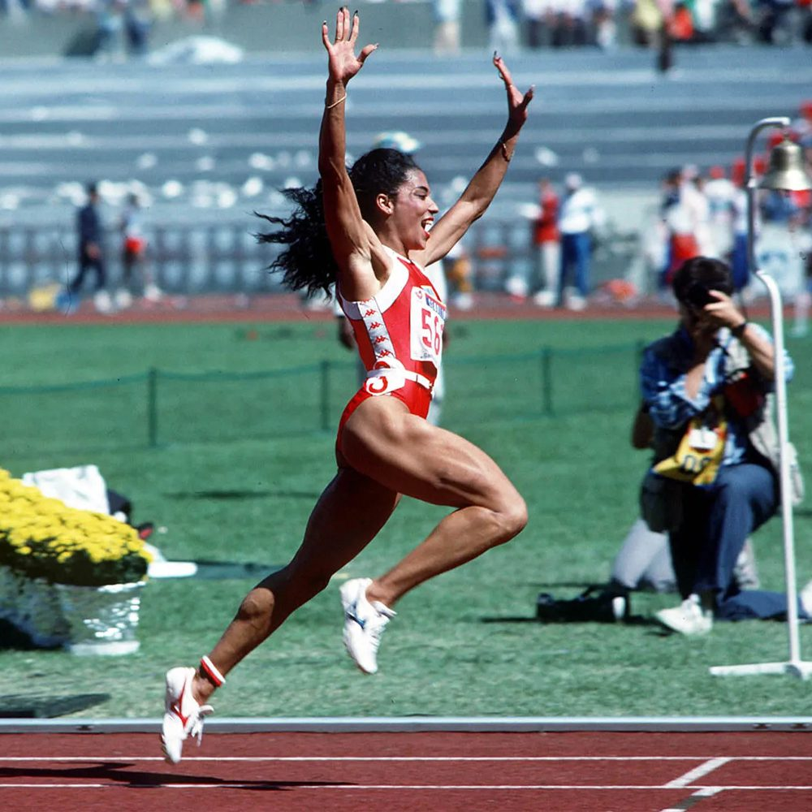

# 샤캐리 리처드슨 플로조 100m 기록 비교 패션 평행이론

플로렌스 그리피스 조이너와 샤캐리 리처드슨은 **여자 단거리 육상을 대표하는 가장 강렬한 스타**라는 공통점을 가진다. 두 선수는 모두 세계 정상급 100m·200m 스프린터였으며, 경기력뿐 아니라 패션과 개성으로도 시대를 대표하는 아이콘이 되었다. 물론 커리어의 규모와 기록에서는 플로조가 훨씬 앞서 있지만, 두 사람이 만들어낸 문화적 영향력과 대중적 존재감은 여러 측면에서 비교 대상이 된다.

이 문서는 두 선수의 성장 과정과 선수 생활, 기록, 스타일, 대중적 영향력을 중심으로 공통점과 차이점을 비교한다.

## 핵심 요약

* **플로조와 샤캐리는 모두 100m·200m를 주력으로 한 미국 여자 단거리 스타다.**
* **두 선수 모두 화려한 패션과 네일아트로 기존 육상 선수의 이미지를 바꾸었다.**
* **세계 최고 수준의 경기력과 함께 대중문화에서도 높은 영향력을 보였다.**
* **올림픽을 전후하여 경기 외적인 논란을 경험했다는 공통점이 있다.**
* **플로조는 역사상 가장 위대한 기록을 남겼고, 샤캐리는 현대 여자 단거리의 대표 스타로 자리 잡았다.**

## 1. 시대는 다르지만 같은 종목을 지배한 미국 여자 스프린터

플로렌스 그리피스 조이너와 샤캐리 리처드슨은 모두 미국을 대표하는 **100m와 200m 전문 단거리 선수**다. 두 사람 모두 어린 시절부터 뛰어난 재능을 인정받았으며 미국 대학 육상 시스템을 거쳐 세계 정상급 선수로 성장했다.

플로조는 1980년대를 대표하는 선수였다. 1984년 LA 올림픽에서 가능성을 보여준 뒤 1988년 서울 올림픽에서 폭발적인 기량을 선보이며 세계 육상사를 새롭게 썼다.

샤캐리는 약 35년 뒤 등장한 선수다. NCAA에서 미국 대학 기록을 세운 뒤 프로로 전향했고, 2023년 세계선수권과 2024년 파리 올림픽을 통해 세계 정상급 선수임을 다시 증명했다.

두 선수는 모두 **미국 여자 단거리의 얼굴**이라는 공통점을 가진다. 시대는 다르지만 미국 여자 스프린트의 상징이라는 위치는 매우 비슷하다.

| 비교 항목 | 플로렌스 그리피스 조이너 | 샤캐리 리처드슨 |
| --- | --- | --- |
| 출생 | 1959년 | 2000년 |
| 국적 | 미국 | 미국 |
| 주력 종목 | 100m, 200m | 100m, 200m |
| 대표 전성기 | 1988년 | 2023~현재 |

## 2. 성장 과정과 정상에 오르기까지의 과정

두 선수 모두 어린 시절부터 육상 재능을 인정받았지만 성장 과정은 상당히 달랐다.

플로조는 경제적으로 어려운 환경에서 성장했다. 대학을 중퇴하고 은행원으로 일해야 할 정도로 생활이 쉽지 않았으며, 육상을 계속하기 어려운 시기도 있었다. 이후 밥 커시의 도움으로 UCLA에 편입하며 선수 생활을 이어갔고, NCAA 정상급 선수로 성장했다.

반면 샤캐리는 어린 시절 생모와 떨어져 외할머니의 손에서 자랐다. 경제적 어려움보다는 가족 환경의 변화가 성장 과정에 큰 영향을 주었다. 고등학교 시절부터 미국 최고의 유망주로 평가받았고 LSU에서도 곧바로 NCAA 최고 기록을 세우며 프로에 진출했다.

공통점은 **어린 시절 어려움을 극복했다는 점**이며, 차이점은 플로조는 경제적 문제를, 샤캐리는 가족 환경의 변화를 극복했다는 점이다.

## 3. 두 선수 모두 한 시즌에 세계 최고 선수로 올라섰다

두 선수는 모두 짧은 기간 동안 경기력이 급격히 상승하며 세계 정상에 올랐다.

플로조는 1987년까지 세계 정상급 선수였지만 절대적인 최강자는 아니었다. 그러나 1988년 미국 올림픽 대표 선발전에서 100m **10.49초**라는 충격적인 세계 기록을 세웠고, 서울 올림픽에서는 100m·200m·400m 계주 금메달을 차지하며 단숨에 육상 역사상 가장 위대한 단거리 선수 가운데 한 명으로 자리 잡았다.

샤캐리는 2021년 도쿄 올림픽 출전이 무산되면서 커리어 최대 위기를 맞았다. 그러나 2023년 부다페스트 세계선수권에서 개인 최고 기록인 **10.65초**를 세우며 세계 정상에 복귀했고, 2024년 파리 올림픽에서도 100m 은메달과 400m 계주 금메달을 획득했다.

두 선수 모두 **한 시즌 동안 세계 최고의 스프린터라는 평가를 받을 정도의 경기력을 보여주었다**는 공통점을 가진다.

## 4. 패션으로 육상의 이미지를 바꾼 두 아이콘

두 선수를 가장 쉽게 연결하는 요소는 **패션과 개성**이다.

1980년대 이전 여자 육상 선수들은 기능성과 기록을 중심으로 한 복장을 착용하는 것이 일반적이었다. 그러나 플로조는 긴 네일아트, 화려한 메이크업, 귀걸이, 한쪽 다리만 덮는 원렉 경기복 등 기존 육상에서는 보기 어려운 스타일을 선보였다. 그녀는 단순한 육상 선수를 넘어 패션 아이콘으로 자리 잡았으며, 경기장 자체를 하나의 무대로 만들었다.

샤캐리 역시 기존 틀을 따르지 않았다. 강렬한 색상의 헤어스타일, 긴 네일아트, 화려한 속눈썹, 다양한 장신구를 적극 활용했고, 경기 직전 가발을 벗어 던지는 퍼포먼스는 세계적인 화제가 되었다.

두 선수 모두 **빠른 선수**이기 이전에 **기억되는 선수**였다.

| 비교 항목 | 플로조 | 샤캐리 |
| --- | --- | --- |
| 긴 네일아트 | O | O |
| 화려한 헤어스타일 | O | O |
| 개성 있는 경기복 | O | △ |
| 경기 전 퍼포먼스 | O | O |
| 패션 아이콘 | O | O |

플로조가 1980년대 여성 선수의 이미지를 바꾸었다면, 샤캐리는 SNS 시대에 맞는 새로운 스포츠 스타의 이미지를 만들어냈다고 볼 수 있다.

## 5. 경기력과 대중성을 동시에 가진 드문 선수들

세계적인 기록을 보유한 선수는 많지만 **대중문화 아이콘**이 된 선수는 많지 않다.

플로조는 은퇴 이후에도 패션 디자이너, 아동 도서 작가, 배우, 스포츠 행정가 등 다양한 분야에서 활동했다. 육상 선수 가운데 가장 높은 대중적 인지도를 가진 인물 중 한 명으로 평가된다.

샤캐리 역시 경기력뿐 아니라 인터뷰, SNS, 광고, 패션 등을 통해 현대 스포츠 스타의 새로운 모습을 보여주고 있다. 경기 결과와 별개로 항상 화제가 되는 선수이며, 젊은 세대에게는 육상보다 먼저 스타일로 알려지는 경우도 적지 않다.

두 선수 모두 **기록만으로 설명되지 않는 스타성**을 가진 대표적인 사례라고 할 수 있다.

## 6. 논란을 안고 살아간 세계 정상의 스프린터

플로조와 샤캐리는 경기력만큼이나 **경기 외적인 논란**으로도 꾸준히 언급된 선수들이다. 다만 논란의 성격은 서로 다르며, 이를 동일한 문제로 해석해서는 안 된다.

플로조는 1988년 서울 올림픽에서 세계 기록을 연이어 수립한 직후부터 도핑 의혹이 제기됐다. 급격한 근육량 증가와 기록 향상, 그리고 1989년 무작위 약물 검사 제도 강화 직전에 은퇴했다는 점 때문에 의심을 받았다. 또한 100m 세계 기록인 10초 49는 당시 풍속계가 0.0m/s를 기록했음에도 같은 경기장 다른 종목에서는 강한 순풍이 측정되어 **풍속계 오작동 가능성**이 오랫동안 논의되고 있다.

그러나 중요한 사실도 있다.

* **플로조는 선수 생활 동안 실시된 공식 도핑 검사에서 단 한 번도 양성 반응이 나온 적이 없다.**
* **100m와 200m 세계 기록 역시 현재까지 공식 세계 기록으로 유지되고 있다.**
* **1998년 사망 후 실시된 부검에서도 경기력 향상 약물의 흔적은 발견되지 않았다.**

반면 샤캐리 리처드슨은 논란의 성격이 훨씬 명확하다.

2021년 미국 올림픽 대표 선발전에서 우승한 직후 실시된 검사에서 **THC(대마초 성분)**가 검출되어 미국반도핑기구(USADA)로부터 1개월 자격 정지 처분을 받았다. 이에 따라 도쿄 올림픽 개인전 출전권이 취소되었고, 계주 대표팀에서도 제외되면서 올림픽 출전 자체가 무산되었다.

다만 THC는 **근육 강화제나 경기력 향상 스테로이드와는 성격이 다른 금지 약물**이다. 리처드슨은 생모의 사망 소식을 접한 뒤 심리적 충격 속에서 사용했다고 인정했으며, 이후 징계를 모두 마친 뒤 복귀했다.

두 선수 모두 커리어에서 논란을 경험했지만, **플로조는 의혹이 제기된 사례**, **샤캐리는 실제 규정 위반으로 징계를 받은 사례**라는 점은 명확히 구분해야 한다.

## 7. 플로조의 세계 기록은 왜 아직도 깨지지 않을까?

플로조를 설명할 때 가장 먼저 언급되는 것은 **1988년에 세운 세계 기록**이다.

| 종목 | 플로조 기록 | 역대 2위 | 차이 |
| --- | ---: | ---: | ---: |
| 100m | **10.49초** | 10.54초 | **0.05초** |
| 200m | **21.34초** | 21.41초 | **0.07초** |

0.05초와 0.07초는 숫자로 보면 매우 작아 보이지만, 세계 최고 수준의 단거리에서는 엄청난 차이다. 특히 현대 육상은 트랙 재질, 스파이크, 스포츠 과학, 훈련 시스템이 모두 발전했음에도 누구도 이 기록을 넘지 못했다.

1988년 당시 플로조는 기존 100m 세계 기록인 **10.76초를 한 번에 0.27초 단축**했다. 이는 정상급 선수들의 기록이 보통 0.01~0.03초 단위로 개선되는 단거리 종목에서는 매우 이례적인 향상 폭이었다.

2026년 현재 플로조의 기록은 약 **38년 동안 유지**되고 있으며, 여자 단거리 역사에서 가장 오래 지속되는 세계 기록으로 남아 있다.

반면 샤캐리의 개인 최고 기록은 100m **10.65초**, 200m **21.92초**다. 두 기록 모두 세계 최고 수준이지만, 플로조의 세계 기록과는 아직 상당한 차이가 존재한다.

역대 순위를 보면 이러한 차이는 더욱 분명해진다.

* **100m:** 샤캐리 공동 5위
* **200m:** 샤캐리 공동 21위

즉, 샤캐리는 현대 최고의 단거리 선수 가운데 한 명이지만, 기록 자체에서는 아직 플로조의 영역에 도달했다고 보기는 어렵다.

## 8. 두 선수를 연결하는 가장 큰 공통점은 무엇일까?

플로조와 샤캐리를 단순히 기록으로만 비교하면 차이가 크다. 플로조는 올림픽 3관왕과 두 개의 세계 기록을 보유한 역사적인 선수이며, 샤캐리는 아직 커리어가 진행 중인 현역 선수다.

그럼에도 불구하고 두 사람이 자주 함께 언급되는 이유는 **육상의 이미지를 바꾸었다는 공통점** 때문이다.

두 선수 모두 긴 네일아트와 화려한 헤어스타일을 적극적으로 활용했고, 경기복과 퍼포먼스를 자신의 개성을 표현하는 수단으로 만들었다. 경기력이 최고 수준이었기 때문에 이러한 스타일은 단순한 패션이 아니라 **강한 자신감과 정체성의 표현**으로 받아들여졌다.

또한 두 선수 모두 경기장 밖에서도 높은 화제성을 유지했다. 언론은 샤캐리가 등장한 이후 꾸준히 그녀를 **'현대의 플로조(Modern Flo-Jo)'**라고 표현해 왔다. 이는 기록을 의미하기보다 경기 스타일과 스타성, 대중문화적 영향력을 함께 평가한 표현에 가깝다.

다만 차이점도 분명하다.

* 플로조는 **육상 역사상 가장 위대한 기록**을 남긴 선수다.
* 샤캐리는 **현대 여자 단거리의 대표 스타**로 평가받는다.
* 플로조는 은퇴 후에도 기록이 전설로 남았고, 샤캐리는 아직 기록을 새롭게 써 내려가는 현역 선수다.

## 결론

플로렌스 그리피스 조이너와 샤캐리 리처드슨은 서로 다른 시대를 대표하지만, **경기력과 개성, 대중적 영향력**이라는 측면에서 매우 흥미로운 평행이론을 보여준다.

플로조는 지금까지도 깨지지 않은 100m와 200m 세계 기록을 보유한 전설이며, 여자 단거리의 기준을 새롭게 만든 선수다. 샤캐리는 아직 그 기록에 도달하지는 못했지만, 세계선수권 우승과 올림픽 메달, 그리고 독보적인 스타일을 통해 현대 여자 육상의 얼굴로 자리 잡았다.

결국 두 선수를 연결하는 핵심은 단순히 빠른 기록이 아니다. **최고 수준의 경기력과 자신만의 개성을 결합하여 육상을 하나의 문화로 확장시켰다는 점**이 가장 큰 공통점이다. 기록의 규모에는 차이가 있지만, 두 사람 모두 시대를 대표하는 여성 스프린터라는 사실에는 큰 이견이 없다.

## 자주 묻는 질문(FAQ)

### 플로조와 샤캐리는 모두 100m와 200m 전문 선수인가?

그렇다. 두 선수 모두 개인전에서는 100m와 200m를 주력 종목으로 삼았으며, 국가대표로는 400m 계주에도 꾸준히 출전했다.

### 플로조의 세계 기록은 아직도 공식 기록인가?

그렇다. 풍속계 오류와 도핑 의혹은 오랫동안 제기되었지만, 국제육상경기연맹은 현재까지 100m 10.49초와 200m 21.34초를 모두 공식 세계 기록으로 인정하고 있다.

### 샤캐리 리처드슨은 왜 도쿄 올림픽에 출전하지 못했나?

미국 대표 선발전 이후 실시된 도핑 검사에서 THC가 검출되어 1개월 자격 정지 처분을 받았고, 그 결과 개인전과 계주 모두 출전이 무산되었다.

### 샤캐리가 '현대의 플로조'라고 불리는 이유는 무엇인가?

세계 최고 수준의 스프린트 능력과 함께 긴 네일아트, 화려한 헤어스타일, 강한 개성을 앞세운 경기 스타일이 플로조를 연상시키기 때문이다. 이는 기록보다는 스타일과 문화적 영향력을 중심으로 한 비교다.

### 플로조와 샤캐리의 가장 큰 차이는 무엇인가?

가장 큰 차이는 **기록과 커리어의 규모**다. 플로조는 현재까지도 유지되는 두 개의 세계 기록과 올림픽 3관왕을 달성했으며, 샤캐리는 세계 정상급 선수이지만 아직 플로조의 기록적 업적에는 이르지 않았다.