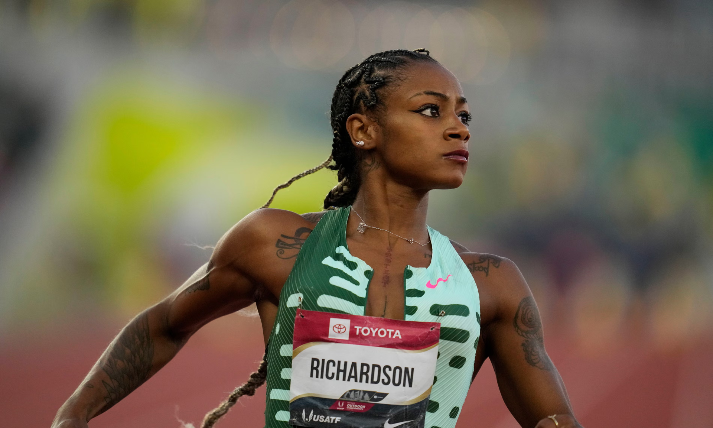

# 샤캐리 리처드슨 플로조 100m 기록 비교 패션 평행이론
 
플로렌스 그리피스 조이너와 샤캐리 리처드슨은 **여자 단거리 육상을 대표하는 가장 강렬한 스타**라는 공통점을 가진다. 두 선수는 모두 세계 정상급 100m·200m 스프린터였으며, 경기력뿐 아니라 패션과 개성으로도 시대를 대표하는 아이콘이 되었다. 커리어의 규모와 기록에서는 플로조가 앞서지만, 두 사람이 만든 문화적 영향력과 대중적 존재감은 여러 면에서 비교할 만하다.

이 문서는 두 선수의 성장 과정과 선수 생활, 기록, 스타일, 대중적 영향력을 중심으로 공통점과 차이점을 비교한다.

## 핵심 요약

* **플로조와 샤캐리는 모두 100m·200m를 주력으로 한 미국 여자 단거리 스타다.**
* **두 선수 모두 화려한 패션과 네일아트로 육상 선수의 이미지를 바꾸었다.**
* **세계 최고 수준의 경기력과 대중적 인지도를 함께 갖췄다.**
* **올림픽을 전후해 경기 외적인 논란을 겪었다.**
* **플로조는 세계 기록과 올림픽 3관왕을 남겼고, 샤캐리는 현대 여자 단거리의 대표 스타로 활동하고 있다.**

## 1. 시대는 다르지만 같은 종목을 지배한 미국 여자 스프린터

플로렌스 그리피스 조이너와 샤캐리 리처드슨은 모두 미국을 대표하는 **100m와 200m 전문 단거리 선수**다. 두 사람은 어린 시절부터 재능을 인정받았고, 미국 대학 육상 시스템을 거쳐 세계 정상급 선수로 성장했다.

플로조는 1980년대를 대표하는 선수였다. 1984년 LA 올림픽에서 가능성을 보인 뒤, 1988년 서울 올림픽에서 뛰어난 기량을 펼치며 세계 육상사에 이름을 남겼다.

샤캐리는 약 35년 뒤 등장했다. NCAA에서 미국 대학 기록을 세운 뒤 프로로 전향했고, 2023년 세계선수권과 2024년 파리 올림픽에서 세계 정상급 기량을 증명했다.

두 선수는 모두 **미국 여자 단거리의 얼굴**이었다. 활동한 시대는 다르지만 미국 여자 스프린트의 상징이라는 위치는 닮았다.

| 비교 항목 | 플로렌스 그리피스 조이너 | 샤캐리 리처드슨 |
| --- | --- | --- |
| 출생 | 1959년 | 2000년 |
| 국적 | 미국 | 미국 |
| 주력 종목 | 100m, 200m | 100m, 200m |
| 대표 전성기 | 1988년 | 2023~현재 |

## 2. 성장 과정과 정상에 오르기까지

두 선수 모두 어린 시절부터 육상 재능을 인정받았지만, 성장 과정은 달랐다.

플로조는 경제적으로 어려운 환경에서 성장했다. 대학을 중퇴하고 은행원으로 일해야 할 만큼 생활이 어려웠고, 육상을 계속하기 힘든 시기도 있었다. 이후 밥 커시의 도움으로 UCLA에 편입하면서 선수 생활을 이어 갔다. 그는 UCLA에서 NCAA 정상급 선수로 성장했다.

샤캐리는 어린 시절 생모와 떨어져 외할머니의 손에서 자랐다. 경제적 어려움보다 가족 환경의 변화가 성장 과정에 큰 영향을 미쳤다. 고등학교 때부터 미국 최고의 유망주로 평가받았고, LSU에서도 곧바로 NCAA 최고 기록을 세우며 프로에 진출했다.

두 선수는 각자 다른 어려움을 지나 세계 정상에 올랐다. 플로조에게는 경제적 문제가, 샤캐리에게는 가족 환경의 변화가 큰 과제였다.

## 3. 한 시즌에 세계 정상으로 올라선 과정

두 선수는 짧은 기간에 경기력이 크게 상승하며 세계 정상에 올랐다.

플로조는 1987년까지도 세계 정상급 선수였지만, 절대적인 최강자로 꼽히지는 않았다. 1988년 미국 올림픽 대표 선발전에서 100m **10.49초**를 기록한 뒤 흐름이 바뀌었다. 서울 올림픽에서는 100m·200m·400m 계주 금메달을 따며 역사적인 시즌을 완성했다.

샤캐리는 2021년 도쿄 올림픽 출전이 무산되면서 커리어의 큰 위기를 맞았다. 2023년 부다페스트 세계선수권에서 개인 최고 기록인 **10.65초**를 세우며 세계 정상에 복귀했다. 2024년 파리 올림픽에서는 100m 은메달과 400m 계주 금메달을 획득했다.

두 선수는 각자의 시대에 한 시즌 동안 세계 최고의 스프린터로 주목받았다.

## 4. 패션으로 육상의 이미지를 바꾼 두 아이콘

두 선수를 가장 쉽게 연결하는 요소는 **패션과 개성**이다.

1980년대 이전 여자 육상 선수들은 기능성과 기록을 중심으로 경기복을 입는 경우가 많았다. 플로조는 긴 네일아트, 화려한 메이크업, 귀걸이, 한쪽 다리만 덮는 원렉 경기복을 선보였다. 그는 육상 선수를 넘어 패션 아이콘이 되었고, 경기장을 자신의 무대로 만들었다.

샤캐리도 기존 틀을 따르지 않았다. 강렬한 색상의 헤어스타일, 긴 네일아트, 화려한 속눈썹과 장신구를 활용했다. 경기 직전 가발을 벗어 던지는 퍼포먼스는 세계적인 화제가 되었다.

두 선수는 빠른 기록과 독특한 모습으로 관중의 기억에 남았다.

| 비교 항목 | 플로조 | 샤캐리 |
| --- | --- | --- |
| 긴 네일아트 | O | O |
| 화려한 헤어스타일 | O | O |
| 개성 있는 경기복 | O | △ |
| 경기 전 퍼포먼스 | O | O |
| 패션 아이콘 | O | O |

플로조가 1980년대 여성 선수의 이미지를 바꾸었다면, 샤캐리는 SNS 시대에 맞는 스포츠 스타의 모습을 만들었다.

## 5. 경기력과 대중성을 함께 가진 선수들

세계 기록을 보유한 선수는 많지만 **대중문화 아이콘**이 된 선수는 많지 않다.

플로조는 은퇴 뒤 패션 디자이너, 아동 도서 작가, 배우, 스포츠 행정가로 활동했다. 육상 선수 가운데 대중적 인지도가 높은 인물로 오래 기억되고 있다.

샤캐리도 경기력뿐 아니라 인터뷰, SNS, 광고, 패션으로 자신을 알리고 있다. 경기 결과와 관계없이 화제를 모으며, 젊은 세대에는 경기 기록보다 스타일로 먼저 알려지기도 한다.

두 선수의 이름은 기록만으로 설명하기 어렵다. 경기장 안의 성과와 경기장 밖의 존재감이 함께 주목받았다.

## 6. 논란을 안고 살아간 세계 정상의 스프린터

플로조와 샤캐리는 경기력과 함께 **경기 외적인 논란**으로도 언급됐다. 다만 논란의 성격은 서로 다르다.

플로조는 1988년 서울 올림픽에서 세계 기록을 잇달아 세운 직후 도핑 의혹을 받았다. 급격한 근육량 증가와 기록 향상, 1989년 무작위 약물 검사 제도 강화 직전의 은퇴가 의심의 근거로 거론됐다. 100m 세계 기록인 10초 49는 당시 풍속계가 0.0m/s를 기록했지만, 같은 경기장에서 다른 종목에 강한 순풍이 측정되면서 **풍속계 오작동 가능성**도 오랫동안 논의됐다.

플로조에게 공식 도핑 양성 판정이 나온 적은 없다. 100m와 200m 세계 기록은 현재까지 공식 기록으로 남아 있다. 1998년 사망 뒤 실시한 부검에서도 경기력 향상 약물의 흔적은 발견되지 않았다.

샤캐리 리처드슨의 논란은 규정 위반으로 이어졌다.

2021년 미국 올림픽 대표 선발전에서 우승한 뒤 실시한 검사에서 **THC(대마초 성분)**가 검출됐다. 미국반도핑기구(USADA)는 1개월 자격 정지 처분을 내렸다. 그 결과 도쿄 올림픽 개인전 출전권이 취소됐고, 계주 대표팀에서도 제외됐다.

THC는 **근육 강화제나 경기력 향상 스테로이드와는 성격이 다른 금지 약물**이다. 리처드슨은 생모의 사망 소식을 들은 뒤 심리적 충격 속에서 사용했다고 인정했다. 이후 징계를 마치고 선수로 복귀했다.

두 선수 모두 논란을 겪었지만, **플로조는 의혹이 제기된 사례**, **샤캐리는 실제 규정 위반으로 징계를 받은 사례**다.

## 7. 플로조의 세계 기록은 왜 아직도 깨지지 않을까?

플로조를 설명할 때 빠지지 않는 기록은 **1988년에 세운 세계 기록**이다.

| 종목 | 플로조 기록 | 역대 2위 | 차이 |
| --- | ---: | ---: | ---: |
| 100m | **10.49초** | 10.54초 | **0.05초** |
| 200m | **21.34초** | 21.41초 | **0.07초** |

0.05초와 0.07초는 작아 보이지만, 세계 최고 수준의 단거리에서는 큰 차이다. 트랙 재질, 스파이크, 스포츠 과학과 훈련 시스템이 발전한 뒤에도 이 기록을 넘은 선수는 없다.

플로조는 1988년 기존 100m 세계 기록인 **10.76초를 한 번에 0.27초 단축**했다. 정상급 선수의 기록이 보통 0.01~0.03초씩 줄어드는 단거리에서 보기 드문 향상이었다.

2026년 현재 플로조의 기록은 약 **38년 동안 유지**되고 있다. 여자 단거리에서 가장 오래 이어진 세계 기록으로 남아 있다.

샤캐리의 개인 최고 기록은 100m **10.65초**, 200m **21.92초**다. 두 기록 모두 세계 최고 수준이지만, 플로조의 세계 기록과는 차이가 있다.

역대 순위에서도 차이가 드러난다.

* **100m:** 샤캐리 공동 5위
* **200m:** 샤캐리 공동 21위

샤캐리는 현대 최고의 단거리 선수 가운데 한 명이다. 다만 기록만 놓고 보면 아직 플로조의 영역에는 도달하지 않았다.

## 8. 두 선수를 연결하는 가장 큰 공통점

플로조와 샤캐리는 기록만으로 비교하기 어렵다. 플로조는 올림픽 3관왕과 두 개의 세계 기록을 보유했고, 샤캐리는 아직 커리어를 이어 가는 현역 선수다.

두 사람이 자주 함께 언급되는 까닭은 **육상의 이미지를 바꾸었다는 공통점**에 있다.

두 선수는 긴 네일아트와 화려한 헤어스타일을 개성의 일부로 활용했다. 경기복과 퍼포먼스도 자신을 표현하는 수단으로 삼았다. 최고 수준의 경기력이 뒷받침되면서 스타일은 단순한 패션을 넘어 **자신감과 정체성의 표현**으로 받아들여졌다.

두 사람은 경기장 밖에서도 화제를 모았다. 언론은 샤캐리가 등장한 뒤 그녀를 **"현대의 플로조(Modern Flo-Jo)"**라고 표현해 왔다. 이 말은 기록보다 경기 스타일과 스타성, 대중문화적 영향력을 가리킨다.

플로조는 **육상 역사상 가장 위대한 기록**을 남겼다. 샤캐리는 **현대 여자 단거리의 대표 스타**로 평가받으며 아직 자신의 기록을 이어 가고 있다.

플로렌스 그리피스 조이너와 샤캐리 리처드슨은 서로 다른 시대를 대표한다. 두 선수는 **경기력과 개성, 대중적 영향력**을 함께 갖춘 여성 스프린터라는 점에서 닮았다.

플로조는 지금도 깨지지 않은 100m와 200m 세계 기록을 보유하고 있다. 샤캐리는 그 기록에는 닿지 않았지만, 세계선수권 우승과 올림픽 메달, 독특한 스타일로 현대 여자 육상의 얼굴이 되었다.

기록의 규모에는 차이가 있다. 그래도 두 선수 모두 자신의 방식으로 육상을 경기장 밖의 문화와 연결했다.

## 자주 묻는 질문(FAQ)

### 플로조와 샤캐리는 모두 100m와 200m 전문 선수인가?

그렇다. 두 선수 모두 개인전에서는 100m와 200m를 주력 종목으로 삼았으며, 국가대표로는 400m 계주에도 출전했다.

### 플로조의 세계 기록은 아직도 공식 기록인가?

그렇다. 풍속계 오류와 도핑 의혹이 제기됐지만, 국제육상경기연맹은 현재까지 100m 10.49초와 200m 21.34초를 모두 공식 세계 기록으로 인정하고 있다.

### 샤캐리 리처드슨은 왜 도쿄 올림픽에 출전하지 못했나?

미국 대표 선발전 뒤 실시한 도핑 검사에서 THC가 검출됐다. 1개월 자격 정지 처분을 받으면서 개인전과 계주 출전이 모두 무산됐다.

### 샤캐리가 "현대의 플로조"라고 불리는 이유는 무엇인가?

세계 최고 수준의 스프린트 능력과 긴 네일아트, 화려한 헤어스타일, 강한 개성이 플로조를 연상시키기 때문이다. 이 표현은 기록보다 스타일과 문화적 영향력을 중심으로 한 비교다.

### 플로조와 샤캐리의 가장 큰 차이는 무엇인가?

가장 큰 차이는 **기록과 커리어의 규모**다. 플로조는 현재까지 유지되는 두 개의 세계 기록과 올림픽 3관왕을 달성했다. 샤캐리는 세계 정상급 선수지만 아직 플로조의 기록적 업적에는 이르지 않았다.