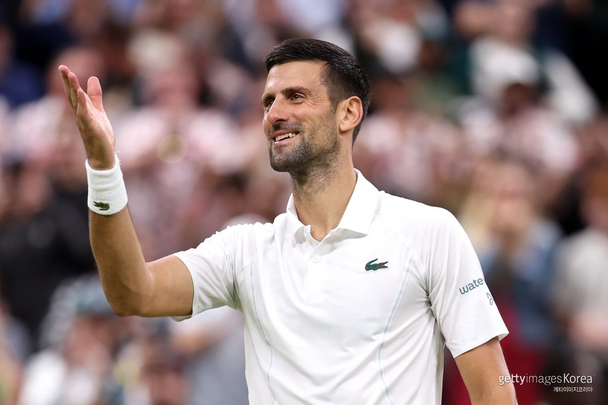
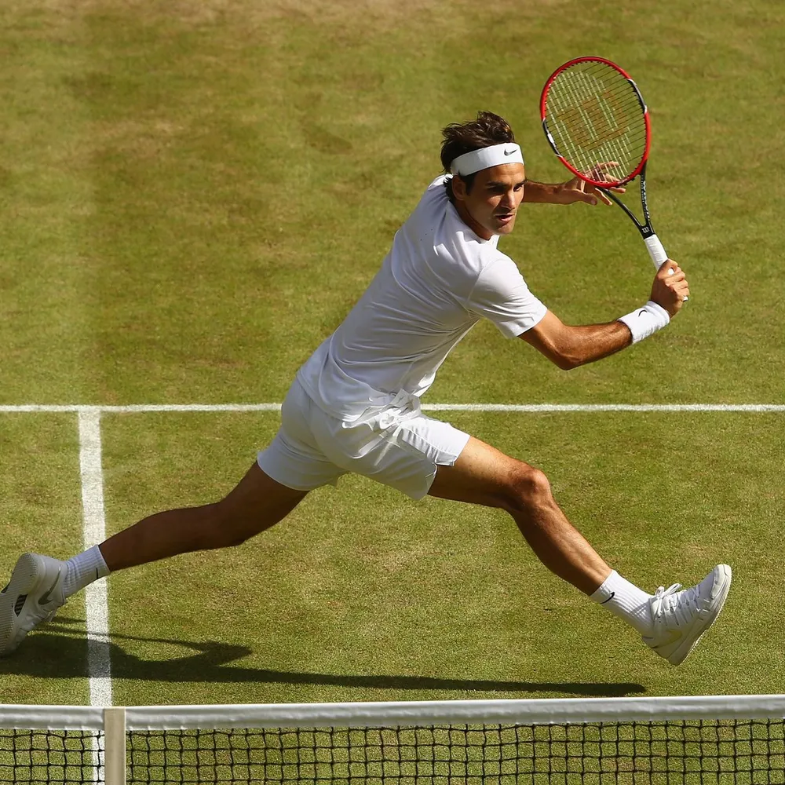
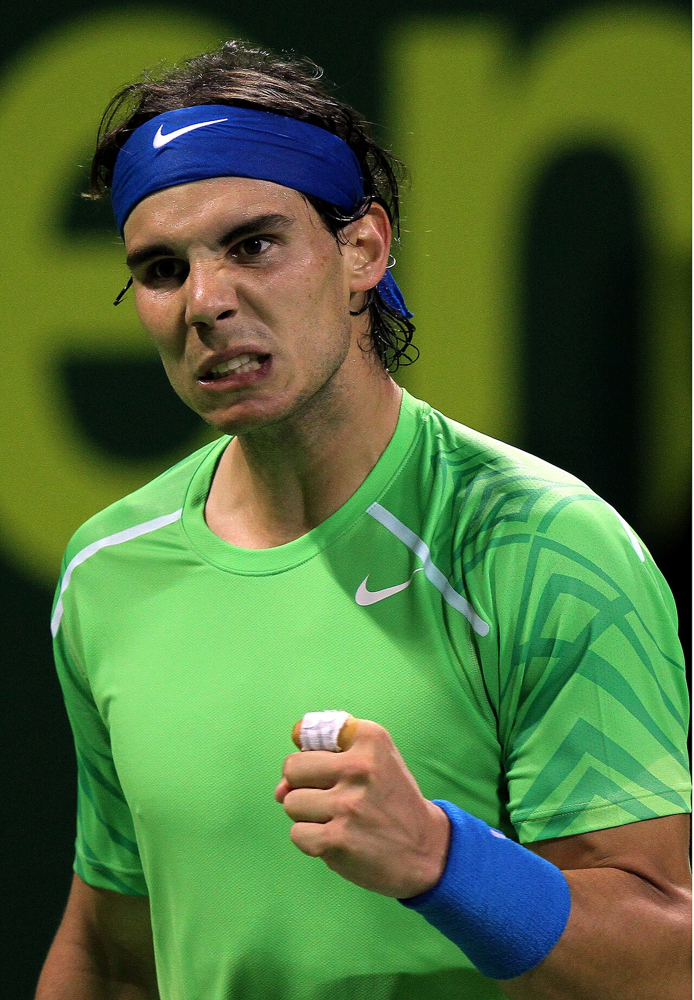

# 노박 조코비치·라파엘 나달·로저 페더러, 3대 테니스 황제와 GOAT 완전 분석

3대 테니스 황제는 **로저 페더러**, **라파엘 나달**, **노박 조코비치**이며, 기록과 업적을 종합한 **올타임 GOAT**는 현재 노박 조코비치라는 평가가 가장 우세하다. 세 선수는 20여 년 동안 남자 테니스를 지배하며 메이저 우승, 세계 랭킹, 상대 전적, 각종 최다 기록을 새로 작성했고, 이전 세대와 이후 세대를 모두 압도하는 독보적인 시대를 만들었다. 따라서 현대 남자 테니스 역사는 빅3 이전과 이후로 구분된다고 해도 과언이 아니다. 이 문서는 빅3가 왜 역사상 최고의 세 선수로 평가받는지, 그리고 조코비치가 GOAT로 인정받는 이유를 기록과 객관적인 근거를 중심으로 정리한다.

## 핵심 요약

* **빅3**는 로저 페더러, 라파엘 나달, 노박 조코비치를 의미하며 남자 테니스 역사상 최고의 세 선수로 폭넓게 인정받는다.
* **노박 조코비치**는 메이저 단식 24회 우승으로 역대 1위를 기록하며 대부분의 핵심 기록에서 선두를 차지하고 있다.
* **로저 페더러**는 잔디 코트와 윔블던의 상징이며, 현대 테니스의 세계적인 인기 확대에 가장 큰 영향을 준 선수로 평가된다.
* **라파엘 나달**은 프랑스 오픈 14회 우승이라는 단일 메이저 역사상 가장 위대한 기록을 보유한 클레이 코트의 절대자다.
* 세 선수 모두 **커리어 그랜드 슬램**을 달성했지만, 한 해에 4대 메이저를 모두 우승하는 **캘린더 그랜드 슬램**은 누구도 달성하지 못했다.
* 기록과 업적에서는 조코비치가 GOAT 평가를 받고 있지만, 영향력과 상징성에서는 페더러, 특정 코트의 절대성에서는 나달 역시 독보적인 위치를 차지한다.

## 1. 왜 세 선수를 3대 테니스 황제라고 부를까?

남자 테니스 역사에는 비욘 보리, 존 매켄로, 이반 렌들, 피트 샘프라스 등 수많은 전설이 존재한다. 그러나 **빅3**는 단순히 메이저 우승 횟수가 많은 선수들이 아니라, 약 20년에 걸쳐 남자 테니스를 사실상 독점했다는 점에서 이전 세대와 차별화된다. 특히 서로가 서로의 가장 강력한 경쟁자였음에도 모두 20회 이상의 메이저 우승을 달성했다는 사실은 스포츠 역사에서도 매우 보기 어려운 사례다.

세 선수는 서로 다른 플레이 스타일을 통해 각자의 시대를 만든 것이 아니라, **동일한 시대에서 서로를 넘어서는 경쟁**을 이어 갔다. 그 결과 메이저 우승 기록, 세계 랭킹 기록, 마스터스 우승 기록, 상금 기록 등 거의 모든 핵심 지표가 이전 세대보다 크게 향상되었고, 남자 테니스의 기준 자체가 새롭게 정의되었다.

| 선수      | 메이저 우승 | 대표 상징              |
| ------- | -----: | ------------------ |
| 노박 조코비치 |    24회 | 가장 완성도 높은 기록과 GOAT |
| 라파엘 나달  |    22회 | 클레이 코트의 절대자        |
| 로저 페더러  |    20회 | 잔디의 황제와 현대 테니스의 상징 |

이처럼 세 선수는 서로 다른 강점을 가졌지만, 모두가 테니스 역사 전체를 대표하는 **올타임 레전드**라는 점에서는 큰 이견이 없다. 다음으로는 이들의 업적을 평가하는 가장 중요한 기준인 **4대 메이저 대회**를 살펴본다.

## 2. 4대 메이저 대회는 왜 가장 중요한 기준일까?

남자 테니스 선수의 위대함을 평가할 때 가장 먼저 비교하는 지표는 **4대 메이저 대회(그랜드 슬램)** 우승 횟수다. ATP 투어에는 수많은 대회가 존재하지만, 선수와 전문가들은 호주 오픈, 프랑스 오픈, 윔블던, US 오픈을 가장 높은 권위를 가진 무대로 평가한다. 세계 랭킹 포인트 역시 메이저 대회가 가장 높으며, 선수 대부분이 시즌 목표를 메이저 우승에 맞춘다.

특히 네 대회는 개최 시기뿐 아니라 **코트 종류**가 서로 다르다. 하드 코트와 클레이 코트, 잔디 코트는 공의 바운드와 스피드, 선수의 움직임이 모두 달라 동일한 기량만으로는 우승하기 어렵다. 따라서 특정 코트에 강한 선수는 많지만, 모든 코트에서 꾸준히 우승하는 선수는 극히 드물다.

| 대회            | 개최 시기 | 코트  | 대표 특징            |
| ------------- | ----- | --- | ---------------- |
| 호주 오픈         | 1월    | 하드  | 시즌 첫 메이저         |
| 프랑스 오픈(롤랑가로스) | 5~6월  | 클레이 | 가장 강한 체력과 인내심 요구 |
| 윔블던           | 6~7월  | 잔디  | 가장 오래되고 권위 있는 대회 |
| US 오픈         | 8~9월  | 하드  | 시즌 마지막 메이저       |

이처럼 서로 다른 환경을 모두 정복해야 진정한 챔피언으로 인정받기 때문에 메이저 우승 횟수는 선수의 위대함을 가장 객관적으로 보여주는 기준이 된다.

### 커리어 그랜드 슬램과 캘린더 그랜드 슬램은 무엇이 다를까?

테니스에는 '그랜드 슬램'이라는 용어가 여러 의미로 사용된다.

* **커리어 그랜드 슬램** : 선수 생활 동안 4대 메이저를 모두 한 번 이상 우승
* **캘린더 그랜드 슬램** : 한 해에 4대 메이저를 모두 우승
* **넌캘린더 그랜드 슬램** : 연도는 달라도 메이저 4개를 연속 우승
* **골든 슬램** : 메이저 4개와 올림픽 금메달까지 획득

이 가운데 가장 어려운 기록은 단연 **캘린더 그랜드 슬램**이다. 시즌 내내 부상 없이 최고의 컨디션을 유지해야 하며, 서로 다른 세 종류의 코트에서 모두 우승해야 하기 때문이다.

남자 단식 역사상 캘린더 그랜드 슬램을 달성한 선수는 단 두 명뿐이다.

| 선수     |      달성 연도 | 횟수 |
| ------ | ---------: | -: |
| 돈 버지   |       1938 | 1회 |
| 로드 레이버 | 1962, 1969 | 2회 |

흥미로운 사실은 **페더러, 나달, 조코비치 모두 커리어 그랜드 슬램은 달성했지만 캘린더 그랜드 슬램은 끝내 이루지 못했다는 점**이다. 특히 조코비치는 2021년 US 오픈 결승까지 진출하며 역사적인 기록에 가장 가까이 다가갔지만 준우승에 머물렀다.

이처럼 메이저 대회는 단순한 우승 숫자를 넘어 선수의 완성도를 평가하는 가장 중요한 척도이며, 다음으로 살펴볼 **메이저 통산 우승 기록**은 빅3가 왜 역사상 최고의 세 선수로 평가받는지를 가장 명확하게 보여준다.

## 3. 메이저 우승 기록으로 본 빅3의 위상은 어떨까?

빅3가 이전 시대의 모든 레전드를 넘어섰다는 가장 강력한 근거는 **4대 메이저 단식 우승 기록**이다. 과거에는 피트 샘프라스의 14회 우승이 오랫동안 깨지지 않을 난공불락의 기록으로 여겨졌다. 그러나 페더러가 최초로 20회 고지를 돌파했고, 이어 나달이 이를 넘어섰으며, 마지막으로 조코비치가 24회까지 기록을 늘리면서 남자 테니스의 기준 자체를 새롭게 만들었다.

현재 메이저 단식 통산 우승 순위는 다음과 같다.

| 순위 | 선수      | 호주 오픈 | 프랑스 오픈 | 윔블던 | US 오픈 |     합계 |
| -: | ------- | ----: | -----: | --: | ----: | -----: |
|  1 | 노박 조코비치 |    10 |      3 |   7 |     4 | **24** |
|  2 | 라파엘 나달  |     2 |     14 |   2 |     4 | **22** |
|  3 | 로저 페더러  |     6 |      1 |   8 |     5 | **20** |
|  4 | 피트 샘프라스 |     2 |      0 |   7 |     5 |     14 |
|  5 | 로이 에머슨  |     6 |      2 |   2 |     2 |     12 |
|  6 | 비욘 보리   |     0 |      6 |   5 |     0 |     11 |
|  7 | 빌 틸던    |     0 |      0 |   3 |     7 |     10 |

이 표만 보더라도 **빅3와 나머지 선수들 사이에는 뚜렷한 단절**이 존재한다. 샘프라스가 14회 우승으로 수십 년 동안 최고의 선수로 평가받았지만, 빅3는 모두 이를 크게 뛰어넘었다. 특히 세 선수가 동시에 같은 시대에 활동하며 서로의 우승 기회를 끊임없이 빼앗았다는 점을 고려하면 이 기록의 가치는 더욱 높아진다.

### 각 선수는 서로 다른 메이저를 지배했다

흥미로운 점은 세 선수 모두 자신의 상징과도 같은 메이저 대회를 가지고 있다는 것이다. 이는 각자의 플레이 스타일과 코트 적응력이 얼마나 뛰어났는지를 보여준다.

| 선수      | 대표 메이저 |   우승 횟수 | 의미               |
| ------- | ------ | ------: | ---------------- |
| 노박 조코비치 | 호주 오픈  | **10회** | 대회 역대 최다 우승      |
| 라파엘 나달  | 프랑스 오픈 | **14회** | 단일 메이저 역사상 최다 우승 |
| 로저 페더러  | 윔블던    |  **8회** | 윔블던 역대 최다 우승     |

나달의 프랑스 오픈 14회 우승은 단순히 해당 대회 최다 우승이 아니라, **모든 메이저 대회를 통틀어 가장 압도적인 단일 대회 지배 기록**으로 평가된다. 클레이 코트 특유의 긴 랠리와 높은 체력 소모를 고려하면 앞으로도 쉽게 깨질 가능성이 낮은 기록 가운데 하나다.

반면 페더러는 잔디 코트에서 가장 아름답고 효율적인 공격 테니스를 완성하며 윔블던의 상징이 되었고, 조코비치는 호주 오픈에서 전성기를 반복적으로 증명하며 현대 하드 코트 최강자의 위치를 확립했다.

### 조코비치가 가장 높은 평가를 받는 이유

세 선수 모두 특정 메이저에서 절대적인 모습을 보여주었지만, **조코비치는 특정 코트에만 의존하지 않았다**는 점에서 차별화된다. 그는 하드 코트, 클레이 코트, 잔디 코트에서 모두 꾸준히 메이저 우승을 기록하며 가장 균형 잡힌 커리어를 완성했다.

또한 메이저 우승 숫자만 앞서는 것이 아니다.

* **메이저 단식 최다 우승(24회)**
* **세계 랭킹 1위 최장 기간(428주)**
* **ATP 파이널스 다수 우승**
* **마스터스 1000 전 대회 우승(커리어 골든 마스터스)**
* **페더러·나달과의 상대 전적 우세**
* **커리어 골든 슬램 달성**

이처럼 대부분의 핵심 지표에서 선두를 차지하고 있다는 점이 현재 **노박 조코비치가 올타임 GOAT로 가장 많이 거론되는 결정적인 이유**다. 그러나 기록만으로는 빅3의 차이를 모두 설명할 수는 없다. 다음에서는 **페더러, 나달, 조코비치가 각각 어떤 방식으로 테니스 역사에 독보적인 흔적을 남겼는지**를 비교한다.

## 4. 빅3는 각각 어떤 전설로 기억될까?

빅3는 모두 역사상 최고의 선수들이지만, 최고의 자리에 오른 과정과 플레이 스타일은 완전히 달랐다. 세 선수는 서로 다른 장점을 극한까지 발전시켰고, 그 결과 각자의 이름 앞에는 자연스럽게 하나의 상징이 붙게 되었다. **페더러는 우아함**, **나달은 투지**, **조코비치는 완성도**를 대표하는 선수로 기억된다.

### 로저 페더러, 현대 테니스의 상징

페더러는 단순히 메이저를 많이 우승한 선수가 아니다. 2000년대 중반 남자 테니스를 세계적인 스포츠로 끌어올린 중심 인물이었으며, 가장 아름다운 플레이 스타일을 가진 선수로 평가받는다.

그의 장점은 공격과 수비의 균형, 부드러운 풋워크, 정확한 서브, 그리고 한 손 백핸드에서 나오는 예술적인 타구였다. 경기 운영 자체가 자연스럽고 효율적이어서 많은 선수들이 이상적인 테니스의 교과서로 페더러를 꼽는다.

주요 업적은 다음과 같다.

* 메이저 단식 20회 우승
* 윔블던 역대 최다 우승(8회)
* 세계 랭킹 1위 연속 237주
* ATP 세계 랭킹 1위 통산 310주
* 현대 테니스의 세계적 인기 확대에 가장 큰 영향을 준 선수 가운데 한 명

페더러는 기록 일부가 조코비치에게 넘어간 이후에도 여전히 **'테니스의 황제'**라는 상징성을 유지하고 있다. 이는 단순한 우승 횟수가 아니라 플레이 스타일과 스포츠 문화에 남긴 영향력이 매우 컸기 때문이다.

### 라파엘 나달, 클레이 코트의 절대자

나달은 역사상 가장 강한 정신력과 투지를 가진 선수 가운데 한 명으로 평가된다. 그는 끈질긴 수비와 강력한 톱스핀 포핸드를 앞세워 상대를 끊임없이 압박했고, 특히 클레이 코트에서는 사실상 공략법이 존재하지 않는 선수였다.

프랑스 오픈은 체력과 인내심을 가장 많이 요구하는 메이저 대회다. 그럼에도 나달은 무려 **14회 우승**이라는 믿기 어려운 기록을 남겼다. 이는 특정 메이저 대회뿐 아니라 스포츠 역사 전체를 통틀어도 보기 어려운 독점 수준의 기록이다.

주요 업적은 다음과 같다.

* 메이저 단식 22회 우승
* 프랑스 오픈 14회 우승
* 커리어 그랜드 슬램 달성
* 올림픽 단식 금메달
* 데이비스컵 우승의 핵심 멤버

나달은 하드 코트와 잔디에서도 메이저 우승을 기록했지만, 그의 이름을 가장 강하게 각인시킨 무대는 단연 롤랑가로스였다. 그래서 그는 지금도 **'흙신(King of Clay)'**이라는 별명으로 불린다.

### 노박 조코비치, 가장 완성된 선수

조코비치는 특정 코트나 특정 기술이 아니라 **모든 영역에서 빈틈이 없는 선수**라는 평가를 받는다. 리턴 능력, 수비, 공격 전환, 체력, 멘털, 경기 운영 등 거의 모든 요소가 최고 수준이며, 하드·클레이·잔디 어느 코트에서도 꾸준히 우승을 거둘 수 있는 유일한 유형의 선수였다.

특히 상대의 강점을 무력화하는 능력이 뛰어났다. 페더러의 공격적인 테니스와 나달의 강력한 톱스핀을 모두 극복하며 가장 많은 메이저 우승과 대부분의 핵심 기록을 자신의 것으로 만들었다.

주요 업적은 다음과 같다.

* 메이저 단식 24회 우승(역대 1위)
* 호주 오픈 10회 우승
* 세계 랭킹 1위 통산 428주(역대 1위)
* ATP 마스터스 1000 전 대회 우승(커리어 골든 마스터스)
* 커리어 그랜드 슬램 달성
* 커리어 골든 슬램 달성
* ATP 파이널스 최다 우승 공동 기록
* 페더러와 나달 모두에게 상대 전적 우세

이러한 기록은 특정 분야가 아니라 **테니스를 구성하는 거의 모든 핵심 지표에서 최고 수준**임을 의미한다. 그래서 현재 전문가들이 GOAT를 논할 때 가장 먼저 조코비치를 언급하는 가장 큰 이유가 된다.

### 기록 이상의 라이벌 관계가 만든 황금기

빅3의 가장 위대한 업적은 개인 기록만이 아니다. 세 선수는 약 20년 동안 메이저 결승과 준결승에서 끊임없이 맞붙으며 서로의 한계를 계속 끌어올렸다. 만약 이들이 서로 다른 시대에 활동했다면 지금보다 훨씬 많은 메이저 우승을 기록했을 가능성이 높다.

세 선수의 경쟁은 남자 테니스의 수준 자체를 높였고, 팬들에게는 스포츠 역사상 가장 치열했던 라이벌 시대 가운데 하나를 선물했다. 이러한 시대적 가치까지 고려하면 빅3는 단순한 역대 최고의 선수들이 아니라 **남자 테니스 역사상 가장 위대한 경쟁 관계**를 만든 세 명의 황제로 평가받는다.

## 결론

**빅3 시대**는 남자 테니스 역사에서 가장 경쟁 수준이 높았던 황금기로 평가된다. 이전에도 수많은 전설이 존재했지만, 한 시대에 메이저 20회 이상 우승한 선수가 세 명이나 동시에 활동한 사례는 없었다. 서로가 서로의 가장 강력한 경쟁자였음에도 역대 메이저 우승 순위 1~3위를 모두 차지했다는 사실만으로도 이 시대의 특별함을 확인할 수 있다.

기록을 기준으로 평가하면 현재 **노박 조코비치**가 올타임 GOAT라는 평가를 가장 많이 받고 있다. 메이저 단식 최다 우승, 세계 랭킹 1위 최장 기간, 커리어 골든 슬램, 커리어 골든 마스터스, 대부분의 핵심 기록과 상대 전적까지 종합하면 객관적인 지표에서 가장 완성된 커리어를 구축했기 때문이다.

그렇다고 페더러와 나달의 위상이 낮아지는 것은 아니다. **로저 페더러**는 현대 테니스를 대표하는 상징성과 가장 아름다운 플레이 스타일을 남긴 선수이며, **라파엘 나달**은 프랑스 오픈 14회 우승이라는 스포츠 역사에서도 손꼽히는 독보적인 기록을 세운 클레이 코트의 절대자다. 세 선수는 서로 다른 방식으로 최고의 자리에 올랐으며, 누구도 다른 두 선수의 존재를 제외하고는 설명될 수 없는 라이벌이었다.

결국 빅3는 우열을 가리기 위한 경쟁을 넘어 **남자 테니스의 기준 자체를 바꾼 세 명의 황제**로 기억될 것이다. 그리고 현재까지 축적된 기록과 업적을 기준으로 하면, 그 정점에는 **노박 조코비치**가 서 있다고 보는 것이 가장 객관적인 결론이다.

## 자주 묻는 질문(FAQ)

### 빅3는 누구를 말하는가?

빅3는 **노박 조코비치, 라파엘 나달, 로저 페더러**를 의미한다. 이들은 남자 테니스 역사상 가장 많은 메이저 우승과 최고의 경쟁 구도를 만든 세 선수다.

### 조코비치가 GOAT로 평가받는 가장 큰 이유는 무엇인가?

메이저 단식 **24회 우승**, 세계 랭킹 1위 **428주**, 커리어 골든 슬램, 커리어 골든 마스터스, 그리고 페더러·나달과의 상대 전적 우세 등 대부분의 핵심 기록에서 역대 1위를 차지하고 있기 때문이다.

### 페더러가 여전히 '테니스의 황제'라고 불리는 이유는 무엇인가?

페더러는 기록뿐 아니라 **현대 테니스의 인기와 브랜드 가치를 크게 높인 상징적인 선수**다. 우아한 플레이 스타일과 스포츠맨십 덕분에 은퇴 이후에도 테니스를 대표하는 얼굴로 평가받고 있다.

### 나달의 프랑스 오픈 14회 우승은 얼마나 대단한 기록인가?

단일 메이저 대회에서 **14회 우승**은 남녀를 통틀어도 유례를 찾기 어려운 기록이다. 특정 대회를 한 선수가 이 정도로 지배한 사례는 스포츠 역사 전체에서도 매우 드물다.

### 앞으로 빅3를 뛰어넘는 선수가 나올 가능성은 있을까?

가능성을 완전히 배제할 수는 없지만 매우 어려운 과제다. 메이저 우승 수뿐 아니라 세계 랭킹, 상대 전적, 장기간의 지배력, 서로 경쟁하며 쌓은 기록까지 모두 넘어야 하기 때문이다. 현재의 기준에서는 **빅3가 남자 테니스 역사상 가장 위대한 세 선수**라는 평가가 가장 널리 받아들여지고 있다.

