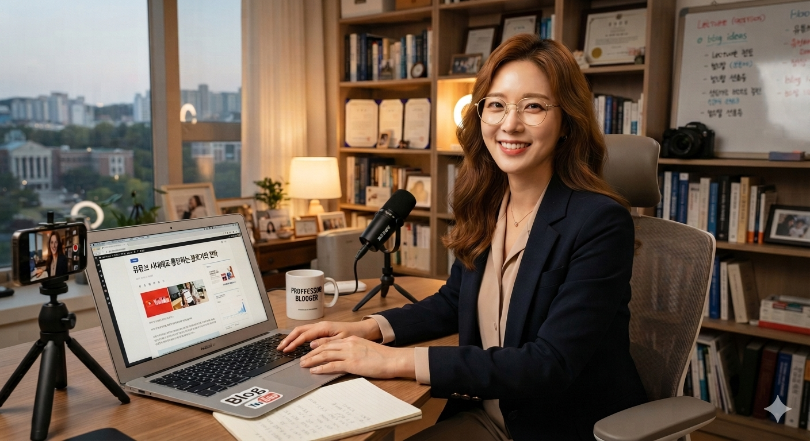

# 유튜브 시대에 텍스트 글쓰기와 블로그가 강력한 이유

유튜브 시대에 텍스트 블로깅이 지식 자산으로 의미를 갖는 이유는 휘발되지 않는 구조적 통제감과 장기적인 노출 가능성에 있다. 자극적인 영상과 달리 정갈하게 축적한 활자는 시간이 흐른 뒤에도 검색을 통해 다시 발견될 수 있다.

## 핵심 요약

* **핵심 결론:** 대중성과 상업성의 유혹에 흔들리지 말고, 유행을 타지 않는 자신만의 텍스트 영토를 구축해야 한다.

* **이유와 근거:** 영상 플랫폼은 외적인 포장과 사생활 전시를 요구하고, 불특정 다수의 조회수와 반응에 노출되면서 감정적 피로를 키울 수 있다. 반면 구글 SEO에 맞춰 구조화한 텍스트는 생각을 정리하고 축적하는 생산적인 도구가 될 수 있다.

* **상세 맥락:** 트래픽만 좇는 방식은 지속적인 콘텐츠 생산과 경쟁을 요구한다. 글로벌 테크 기업 아마존이 PPT 대신 6페이지의 줄글 서술형 문서인 Narrative를 활용해 의사결정을 한다는 사례처럼, 핵심을 정리하고 판단하기 위한 문서에서는 활자의 깊이가 중요하다.

## 1. 영상과 텍스트의 차이와 구조적 가치

디지털 난독증 시대에 영상 플랫폼이 수백, 수천 배의 트래픽과 낮은 진입장벽을 갖는 것은 상업적으로 분명한 장점이다. 그러나 대중성에 매몰된 유튜브 브이로그나 숏폼 콘텐츠는 외적인 모습을 포장하고 과시해야 하는 또 다른 감정 노동으로 이어질 수 있다. 불특정 다수의 조회수와 피드백에 노출되면 정신적 피로가 커지고 장기적인 지속도 어려워진다.

반면 글쓰기는 단순히 생각을 배출하는 일이 아니다. 머릿속에 흩어진 생각을 정리하고 기록으로 남기는 생산 도구다. 텍스트는 영상처럼 순간의 자극으로 소비되는 데 그치지 않고, 생각의 깊이와 사유의 과정을 문장과 구조로 남길 수 있다.

트래픽을 좇아 광장에 나를 던지기보다, 구글 SEO라는 시스템 안에서 나만의 지식 공간을 쌓아가는 과정 자체가 생각을 정리하는 훈련이 된다.

| 분석 및 비교 기준 항목 | 영상의 한계                                              | 텍스트의 본질적 가치                                  |
| ------------- | --------------------------------------------------- | -------------------------------------------- |
| 핵심 속성 비교      | 단기적이고 피상적인 소비로 흐르기 쉬우며, 영상 조회수 중심의 감정 노동이 발생할 수 있다. | 장기적인 기록과 구조화에 적합하며, SEO를 기반으로 텍스트를 축적할 수 있다. |
| 정보의 영속성       | 알고리즘의 선택과 플랫폼 흐름에 따라 노출이 크게 달라질 수 있다.               | 시간이 지난 뒤에도 검색을 통해 다시 발견될 가능성이 있다.            |
| 생산 과정         | 사생활 전시와 불특정 다수의 시선을 의식해야 하는 부담이 있다.                 | 비교적 통제된 환경에서 생각을 정리하고 기록할 수 있다.              |
| 예상되는 결과       | 지속적인 생산과 경쟁이 필요해 피로와 번아웃으로 이어질 수 있다.                | 장기간 축적할수록 개인의 지식과 생각을 모아 독립적인 아카이브를 만들 수 있다. |

## 2. AI 시대 블로그와 글쓰기의 가치

예전의 블로그는 끝나가고 있다. 하지만 블로그 자체가 끝나는 것은 아니다. 존재 이유가 달라지고 있다.

예전, 2005~2022년 정도에는 흐름이 이랬다.

SEO: 내 사이트로 사람을 데려온다.
검색 → 블로그 클릭 → 글 읽기 → 댓글 → 이웃 추가 → 재방문

현재 AEO에서는 AI가 정보를 참고하고 신뢰할 만한 출처를 찾는 과정이 중요해지고 있다.

블로그는 단순한 방문 목적지가 아니라, AI가 참고할 수 있는 데이터베이스가 되어 가고 있다.

### “권위(authority)”

나는 아래 내용만으로도 권위라는 단어를 쓸 수 있다고 생각한다.

1. 자신의 기록을 남기는 사람
2. 자신의 브랜드를 만드는 사람
3. 창작 자체와 글쓰기를 좋아하는 사람

그래서 앞으로의 블로그는 ‘검색’보다 ‘출처’에 가까워질 수 있다. 사람이 내 글을 직접 읽는 것에서 끝나는 것이 아니라, 내 글이 신뢰할 만한 원본으로 남는 것이 중요해진다.

글을 오래 쓰는 사람들은 점점 외부 보상보다 창작 자체의 만족을 더 중요하게 여길 가능성이 크다.

## 3. 글을 쓰는 사람들이 가져야 할 덕목

1. ‘조회수’와 ‘대중성’이라는 자본주의적 지표에만 매달리지 말아야 한다. 블로그는 보여주기 위한 공간이 아니라, 자신의 생각을 구조화하고 축적하는 독립적인 영토가 될 수 있다.

2. 단편적인 메모나 휘발성 일기에 그치지 말고, 마크다운 계층 구조와 정갈한 데이터를 활용해 글을 쌓는 습관을 들여야 한다.

3. 트렌드 변화에 흔들리지 않는 자신만의 가치 기준을 세우고, 정기적으로 생각을 글로 남겨 장기적인 아카이브로 관리해야 한다.

## 결론

본질적인 가치는 눈앞의 트래픽만으로 결정되지 않는다. 대중성과 상업성을 좇는 방식은 계속해서 새로운 플랫폼과 유행에 대응해야 한다. 반면 자신만의 생각을 꾸준히 기록하는 방식은 시간의 영향을 덜 받으면서 개인의 지식과 경험을 축적할 수 있다.

겉핥기식 접근보다 중요한 것은 활자의 깊이를 믿고 내 생각의 영토를 꾸준히 만드는 일이다. 유행에 흔들리지 않는 기록을 쌓으면 시간이 지난 뒤에도 그 글은 개인의 지식과 경험을 담은 아카이브로 남는다.

인터넷은 다시 개인의 개성을 찾는 방향으로 움직일 수도 있다. 1990~2000년대 초 개인 홈페이지나 블로그에는 사람마다 말투와 관점이 뚜렷했다. 이후 SEO 시대에는 검색을 의식한 비슷한 정보 글이 넘쳐났다.

AI는 평균적인 정보를 만드는 데 강하다. 그래서 앞으로는 평균적인 정보와 구별되는 개인의 경험과 시각이 더 중요해질 수 있다.

그렇기에 앞으로는 수익, 검색 순위, 팔로워 숫자보다 쓰는 것 자체를 목적으로 하는 사람들이 남을 수 있다. 자기 생각을 정제하고 싶은 사람, 언젠가 누군가 한 사람이라도 읽어주길 바라는 사람이다. 그 모습이 블로그의 원래 형태에 더 가까울 수도 있다.

**자본주의적 트렌드가 변하더라도 구조화된 텍스트를 꾸준히 쌓는 사람의 기록은 지식과 경험을 축적하는 개인의 자산으로 남을 수 있다.**

## 자주 묻는 질문(FAQ)

### 가장 흔하게 발생하는 오해나 실수는 무엇인가?

영상이 텍스트보다 무조건 생산적이라고 생각해 본질을 놓치는 것이다. 영상 소비는 유행과 플랫폼 흐름에 따라 빠르게 소비될 수 있지만, 구조화한 활자는 시간이 흐른 뒤에도 다시 찾아볼 수 있는 아카이브가 될 수 있다.

### 텍스트를 읽지 않는 디지털 난독증 시대에 블로그가 실질적 명분을 가질 수 있는가?

대중이 글을 덜 읽더라도, 지식을 정리하고 공유하는 여러 기술 생태계에서는 구조화된 텍스트가 여전히 중요한 역할을 한다. GitHub와 전문 기술 블로그가 텍스트를 기반으로 지식을 공유하는 것도 같은 맥락에서 볼 수 있다.