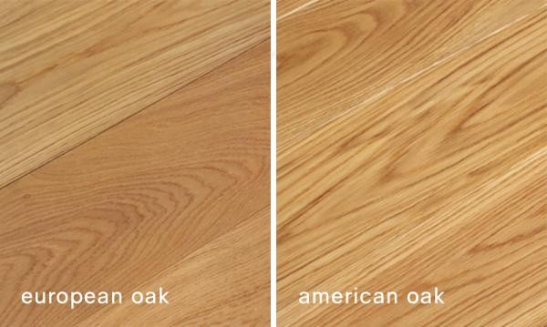
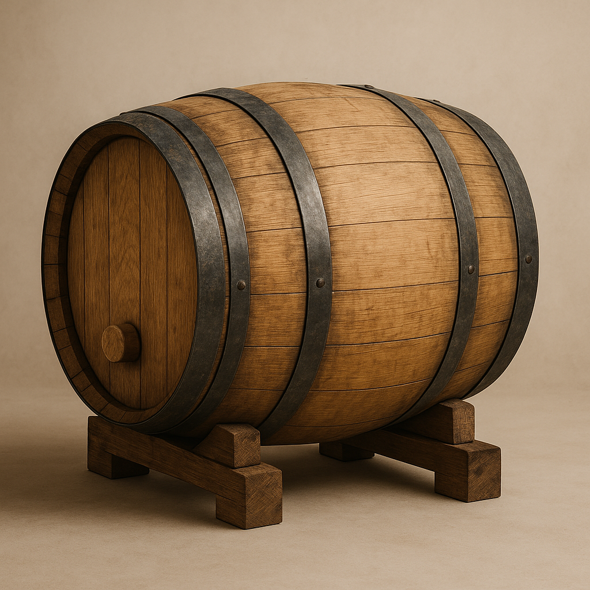

# 프렌치 아메리칸 오크통 비교 와인 숙성 원리와 향의 차이

오크통 숙성은 **미세 산소화**와 참나무 성분의 추출을 통해 와인의 질감과 향을 변화시키며, 프렌치 오크와 아메리칸 오크는 서로 다른 숙성 특성과 풍미를 만든다. 와인의 향과 바디감은 단순히 포도 품종만으로 결정되지 않는다. 발효 이후 어떤 오크통에서 얼마 동안 숙성했는지에 따라 전혀 다른 성격의 와인이 탄생한다. 오늘날 오크통은 단순한 저장 용기가 아니라 와인의 구조와 향을 재설계하는 양조 공정의 핵심 요소이며, 이를 이해하면 와인 라벨에 적힌 숙성 정보를 통해 와인의 스타일을 어느 정도 예측할 수 있다.

## 핵심 요약

* **오크통 숙성의 핵심은 미세 산소화**다. 극소량의 산소가 지속적으로 유입되면서 거친 타닌이 부드럽게 변하고 와인의 질감이 안정된다.
* **참나무는 향을 공급하는 재료**이기도 하다. 리그닌과 오크 락톤 등이 분해되면서 바닐라, 정향, 토스트, 코코넛 등의 향을 형성한다.
* **프렌치 오크**는 결이 촘촘하여 향과 타닌이 천천히 방출되므로 섬세한 와인에 적합하다.
* **아메리칸 오크**는 향 성분 방출이 빠르며 바닐라와 코코넛 향이 강하게 나타나는 것이 특징이다.
* 오크통 선택은 우열의 문제가 아니라 **양조 목표**에 따라 달라지는 설계 요소다.
* 오크통은 포도의 향을 덮는 것이 아니라, 숙성 과정에서 새로운 향과 질감을 추가하는 역할을 수행한다.

## 1. 오크통 숙성은 왜 와인의 품질을 크게 바꾸는가?

포도즙이 효모에 의해 발효를 마치면 알코올은 생성되지만, 와인은 아직 완성된 상태가 아니다. 이 시기의 와인은 **강한 산미**, 거친 타닌, 분리된 향이 그대로 남아 있으며 입안에서 거칠고 날카로운 인상을 준다. 따라서 대부분의 고급 와인은 발효가 끝난 이후에도 일정 기간 숙성 과정을 거치며, 그중 가장 대표적인 방식이 오크통 숙성이다.

과거에는 오크통이 단순히 저장과 운반을 위한 목재 용기로 사용되었다. 그러나 현대 양조학은 오크통 내부에서 다양한 물리·화학적 변화가 발생한다는 사실을 밝혀냈다. 현재의 오크통은 저장 용기가 아니라 와인의 구조를 변화시키는 **숙성 장치**로 이해된다.

오크통은 크게 두 가지 기능을 수행한다.

* 외부 산소를 아주 천천히 공급한다.
* 참나무 내부의 향기 성분을 와인에 전달한다.

이 두 과정이 동시에 진행되면서 와인은 시간이 지날수록 더욱 안정적이고 복합적인 풍미를 갖게 된다.

## 2. 미세 산소화는 타닌을 어떻게 부드럽게 만드는가?

오크통 숙성에서 가장 중요한 생화학적 현상은 **미세 산소화** (Micro-oxygenation)다.

참나무는 완전히 밀폐된 재료가 아니다. 육안으로는 보이지 않는 매우 작은 기공이 존재하며, 이 틈을 통해 외부의 산소가 극소량씩 지속적으로 와인 내부로 들어간다. 이처럼 천천히 공급되는 산소는 급격한 산화를 일으키지 않으면서 와인의 화학 구조를 안정적으로 변화시킨다.

특히 산소는 포도 껍질과 씨에서 유래한 안토시아닌과 모노머 형태의 타닌 사이에서 **타닌 중합 반응(Tannin Polymerization)**을 촉진한다. 초기의 타닌은 분자 크기가 작아 혀의 단백질과 쉽게 결합하므로 떫은맛이 강하게 느껴진다. 그러나 시간이 지나면서 여러 개의 타닌 분자가 서로 연결되어 긴 사슬 형태의 고분자로 성장하면 혀에서 느껴지는 수렴성이 크게 감소한다.

그 결과 와인은 다음과 같은 변화를 겪는다.

* 거친 떫은맛 감소
* 질감의 부드러움 증가
* 바디감 향상
* 색 안정성 증가
* 장기 숙성 능력 향상

이러한 변화는 고급 레드 와인에서 특히 중요하다. 어린 와인이 날카롭고 공격적인 인상을 주는 반면, 충분히 숙성된 와인이 둥글고 매끄럽게 느껴지는 가장 큰 이유도 여기에 있다.

## 3. 오크통은 새로운 향을 만드는 생화학적 공급원이다

오크통은 산소만 공급하는 장치가 아니다. 참나무 자체도 다양한 향기 성분을 함유하고 있으며, 숙성 과정에서 이 성분들이 와인 속으로 천천히 녹아든다.

대표적으로 참나무를 구성하는 주요 성분은 다음과 같다.

| 성분 | 숙성 과정에서의 역할 |
| --- | --- |
| 셀룰로오스 | 구조 유지 |
| 헤미셀룰로오스 | 가열 과정에서 당류와 토스트 향 생성 |
| 리그닌 | 바닐린 등 향기 성분 생성 |
| 오크 락톤 | 코코넛, 나무 향 생성 |
| 엘라지타닌 | 구조감과 숙성 안정성 향상 |

특히 **리그닌**은 오크통 제작 과정에서 불로 가열되는 토스팅 과정을 거치면서 분해된다. 이 과정에서 생성되는 대표적인 향기 성분이 바닐린이며, 우리가 와인에서 느끼는 바닐라 향의 상당 부분은 포도가 아니라 오크통에서 비롯된다.

또한 오크 락톤은 코코넛, 신선한 목재, 달콤한 향신료 향을 만들어낸다. 여기에 토스팅 강도에 따라 커피, 카카오, 캐러멜, 훈연 향까지 더해질 수 있다.

즉, 오크통은 단순히 기존 향을 보존하는 것이 아니라 포도만으로는 만들 수 없는 **제3의 아로마**를 와인에 추가하는 역할을 수행한다.

## 4. 프렌치 오크는 왜 고급 와인에서 높은 평가를 받는가?

프렌치 오크(French Oak)는 프랑스의 대표적인 참나무 숲인 알리에(Allier), 리무쟁(Limousin), 보주(Vosges), 느베르(Nevers) 등에서 자란 참나무를 이용해 제작된다. 주로 **Quercus robur**와 **Quercus petraea**가 사용되며, 국가 차원의 산림 관리 아래 오랜 기간 육성된다.

프랑스는 비교적 서늘한 기후를 갖고 있어 참나무의 성장 속도가 느리다. 성장 속도가 느릴수록 나이테 간격이 좁아지고 목질 조직이 치밀해진다. 이러한 **촘촘한 결(Grain)**은 프렌치 오크의 가장 큰 특징이다.

결이 치밀하면 와인 속으로 향기 성분이 급격하게 용출되지 않는다. 대신 오랜 시간에 걸쳐 조금씩 향과 타닌이 전달되므로 포도 품종 본연의 과실 향과 테루아가 비교적 잘 유지된다.

프렌치 오크에서 자주 나타나는 향은 다음과 같다.

* 정향
* 육두구
* 삼나무
* 가죽
* 다크 초콜릿
* 에스프레소
* 은은한 토스트 향

또한 프렌치 오크에는 **엘라지타닌**이 풍부하게 포함되어 있어 와인에 단단한 구조감을 형성한다. 이는 장기 숙성 과정에서 산화 안정성을 높이고 시간이 지나도 균형 잡힌 구조를 유지하는 데 중요한 역할을 한다.

이러한 특성 때문에 프렌치 오크는 다음과 같은 품종에서 자주 사용된다.

* 피노 누아
* 샤르도네
* 네비올로
* 고급 보르도 블렌드

이들 품종은 과실 향이 매우 섬세하기 때문에 강한 오크 향보다 천천히 스며드는 숙성 방식이 더욱 적합하다.

## 5. 아메리칸 오크는 왜 강렬한 풍미와 높은 경제성을 동시에 갖는가?

아메리칸 오크(American Oak)는 주로 미국 백참나무(**Quercus alba**)를 원료로 사용하며, 오자크 산맥과 애팔래치아 산맥 등 북미 지역에서 생산된다. 미국의 대륙성 기후는 프랑스보다 성장 기간이 길고 기온이 높아 참나무의 성장 속도가 빠르다. 그 결과 나이테 간격이 넓고 목질 조직이 비교적 성글게 형성된다.

이처럼 **넓은 결**(Grain)은 향기 성분이 와인으로 이동하는 속도를 크게 높인다. 대표적인 성분이 **메틸 오크 락톤**(Methyl-octalactone)이며, 프렌치 오크보다 훨씬 높은 농도로 존재한다. 이 성분은 와인에서 쉽게 인지되는 코코넛 향과 달콤한 나무 향을 만들어낸다.

또한 리그닌이 분해되면서 생성되는 바닐린 역시 비교적 풍부하게 추출되어 다음과 같은 향이 강하게 나타난다.

* 바닐라
* 코코넛
* 스위트 스파이스
* 토스트
* 캐러멜
* 구운 빵

이러한 향은 소비자가 병을 개봉한 직후에도 비교적 쉽게 느낄 수 있다.

질감에서도 차이가 나타난다. 프렌치 오크가 구조감과 긴장감을 강화하는 방향이라면, 아메리칸 오크는 보다 **둥글고 풍부한 바디감**을 형성하는 경향이 있다. 기존 타닌이 충분한 품종에서는 추가적인 구조보다 향과 질감을 풍성하게 만드는 효과가 더 크게 나타난다.

대표적으로 다음 품종과 높은 궁합을 보인다.

* 카베르네 소비뇽
* 시라
* 템프라니요
* 진판델

경제성 역시 중요한 장점이다. 미국 백참나무에는 **타일로시스**(Tyloses)라는 조직이 잘 발달해 있어 액체가 쉽게 새어나오지 않는다. 따라서 프렌치 오크처럼 나무결을 따라 도끼로 쪼갤 필요 없이 톱으로 절단해도 오크통 제작이 가능하다.

그 결과 생산 효율은 크게 높아진다.

| 항목 | 프렌치 오크 | 아메리칸 오크 |
| --- | --- | --- |
| 대표 수종 | Quercus robur, Q. petraea | Quercus alba |
| 성장 속도 | 느림 | 빠름 |
| 나무 결 | 매우 촘촘 | 비교적 넓음 |
| 향의 방출 | 완만 | 빠름 |
| 대표 향 | 정향, 가죽, 초콜릿 | 바닐라, 코코넛, 토스트 |
| 제작 방식 | 결 방향으로 쪼갬(Fendage) | 톱 절단(Sciage) |
| 원목 수율 | 약 20% | 50% 이상 |
| 가격 | 높음 | 상대적으로 저렴 |

따라서 아메리칸 오크는 대규모 상업 양조에서도 널리 활용되며, 강한 품종과 결합했을 때 높은 비용 대비 효과를 제공한다.

## 6. 현대 양조가는 오크통을 어떻게 조합하는가?

프렌치 오크와 아메리칸 오크 가운데 어느 하나가 절대적으로 우수한 것은 아니다. 현대 양조학에서는 오크통 자체보다 **숙성 전략**이 훨씬 중요하게 평가된다.

실제 와이너리는 여러 종류의 숙성 용기를 함께 사용한다.

* 새 프렌치 오크
* 새 아메리칸 오크
* 여러 차례 사용한 오크통
* 스테인리스 스틸 탱크
* 콘크리트 탱크

이후 각각 숙성된 와인을 최종 블렌딩하여 원하는 스타일을 만든다.

새 오크통(New Oak)은 향과 타닌을 적극적으로 공급하지만, 여러 번 사용한 오크통은 목재 성분이 대부분 소모되어 향은 거의 전달하지 않는다. 대신 **미세 산소화 기능**은 그대로 유지되므로 보다 절제된 숙성이 가능하다.

또 하나 중요한 요소는 **토스팅**(Toasting Level)이다. 오크통을 제작할 때 내부를 불로 가열하는 정도에 따라 생성되는 향기 성분이 달라진다.

* Light Toast : 신선한 목재 향과 강한 타닌
* Medium Toast : 바닐라와 향신료의 균형
* Heavy Toast : 커피, 초콜릿, 훈연, 캐러멜 향 강화

결국 오크통 선택은 하나의 재료를 고르는 과정이 아니라, 양조가가 원하는 와인의 성격을 설계하는 과정이라고 볼 수 있다.

## 7. 와인 라벨과 숙성 정보를 읽으면 무엇을 알 수 있는가?

최근에는 많은 와인이 뒷라벨이나 기술 자료(Technical Sheet)에 숙성 정보를 표시한다.

대표적인 예는 다음과 같다.

* Aged for 18 months in French oak barrels
* Aged in French & American oak
* 30% New French Oak
* Matured in American Oak

이러한 정보만으로도 어느 정도 스타일을 예상할 수 있다.

일반적으로 다음과 같은 경향을 보인다.

* 프렌치 오크 비율이 높으면 과실 향을 유지하면서 장기 숙성을 고려한 스타일일 가능성이 높다.
* 아메리칸 오크 비율이 높으면 바닐라와 코코넛 향이 풍부하고 비교적 마시기 쉬운 스타일인 경우가 많다.
* New Oak 비율이 높을수록 오크 향이 강하게 나타난다.
* Neutral Oak나 Used Oak는 오크 향보다 질감 개선에 초점을 둔다.

물론 품종, 빈티지, 토스팅 강도, 숙성 기간 등 다양한 요소가 함께 작용하므로 오크 정보 하나만으로 모든 특성을 단정할 수는 없다. 그러나 숙성 정보를 읽을 수 있다면 와인을 선택하는 데 상당한 도움이 된다.

## 8. 오크 숙성 와인은 어떻게 보관하고 디캔딩해야 하는가?

오크통에서 완성된 와인이라도 병입 이후의 관리가 잘못되면 숙성 과정에서 얻은 풍미를 충분히 유지하기 어렵다.

보관에서 가장 중요한 요소는 다음 세 가지다.

* 일정한 온도
* 적절한 습도
* 진동 최소화

보관 온도는 일반적으로 **12~15℃** 정도가 권장된다. 높은 온도에서는 산화가 빨라지고 과실 향이 손실될 가능성이 커진다.

습도는 약 **70%** 수준이 적절하다. 습도가 지나치게 낮으면 코르크가 건조해져 수축할 수 있으며, 외부 공기가 병 안으로 유입될 위험이 증가한다.

와인을 수평으로 보관하는 이유 역시 코르크를 지속적으로 적셔 건조를 방지하기 위해서다.

진동도 숙성에 영향을 준다. 지속적인 진동은 병 내부의 안정된 상태를 방해하여 숙성 속도에 영향을 줄 수 있으므로 장기 보관에서는 가능한 한 피하는 것이 바람직하다.

시음 직전에는 **디캔딩**(Decanting)을 통해 풍미를 더욱 끌어낼 수 있다.

디캔딩의 목적은 크게 두 가지다.

첫째는 **침전물 분리**다. 장기 숙성된 레드 와인에서는 타닌과 색소가 결합한 침전물이 병 바닥에 쌓일 수 있다. 천천히 디캔터로 옮기면 이러한 침전물을 남기고 맑은 와인만 따를 수 있다.

둘째는 **에어레이션(Aeration)**이다. 좁은 병 안에 오래 머물던 와인을 넓은 디캔터로 옮기면 공기와 접촉하는 면적이 크게 증가한다. 이 과정에서 환원 향이 줄어들고 오크 숙성을 통해 형성된 바닐린, 락톤, 향신료 계열의 향이 더욱 풍부하게 발현된다. 또한 일부 타닌은 공기와 접촉하면서 보다 부드러운 질감으로 변화한다.

## 결론

**오크통 숙성**은 단순히 와인을 오래 보관하는 과정이 아니라, 산소와 참나무 성분을 이용해 와인의 구조를 재설계하는 숙성 기술이다. 미세 산소화는 거친 타닌을 안정화하고, 참나무에서 유래한 다양한 화합물은 포도만으로는 얻을 수 없는 복합적인 향을 형성한다.

**프렌치 오크**와 **아메리칸 오크**는 서로 경쟁 관계가 아니라 각기 다른 목적을 가진 도구다. 프렌치 오크는 섬세한 향과 긴 숙성 잠재력을 강조하고, 아메리칸 오크는 풍부한 바닐라와 코코넛 향, 뛰어난 경제성을 바탕으로 강렬한 스타일을 만든다. 어느 쪽이 더 우수한지가 아니라 어떤 품종과 어떤 와인을 만들 것인지가 선택의 기준이 된다.

소비자 역시 오크 숙성의 원리를 이해하면 **라벨 정보**, 숙성 기간, 오크 종류를 통해 와인의 성격을 보다 정확하게 예측할 수 있다. 여기에 적절한 보관 환경과 디캔딩까지 더해진다면 양조 과정에서 의도한 향과 질감을 더욱 온전히 경험할 수 있다.

## 자주 묻는 질문(FAQ)

### 프렌치 오크가 항상 더 좋은 오크통인가?

아니다. 프렌치 오크는 섬세한 향과 구조감을 만드는 데 강점이 있지만, 강렬한 바닐라 향이나 풍부한 질감을 원하는 경우에는 아메리칸 오크가 더 적합할 수 있다.

### 오크 숙성을 하면 모든 와인에서 바닐라 향이 나는가?

그렇지는 않다. 오크 종류, 토스팅 강도, 숙성 기간, 포도 품종에 따라 바닐라 향의 강도는 크게 달라진다.

### 새 오크통과 사용한 오크통의 차이는 무엇인가?

새 오크통은 향과 타닌을 적극적으로 공급하지만, 여러 번 사용한 오크통은 향의 영향이 적고 미세 산소화를 중심으로 숙성을 진행한다.

### 디캔딩은 오래된 와인만 필요한가?

아니다. 오래된 와인은 침전물 제거가 목적이지만, 젊은 레드 와인은 공기와 접촉시켜 향을 빠르게 열기 위해 디캔딩을 활용하기도 한다.

### 오크 숙성을 하지 않은 와인도 좋은 와인이 될 수 있는가?

가능하다. 소비뇽 블랑처럼 신선한 과실 향을 강조하는 품종은 스테인리스 탱크 숙성을 선택하는 경우도 많으며, 이는 품질이 낮아서가 아니라 스타일의 차이다.