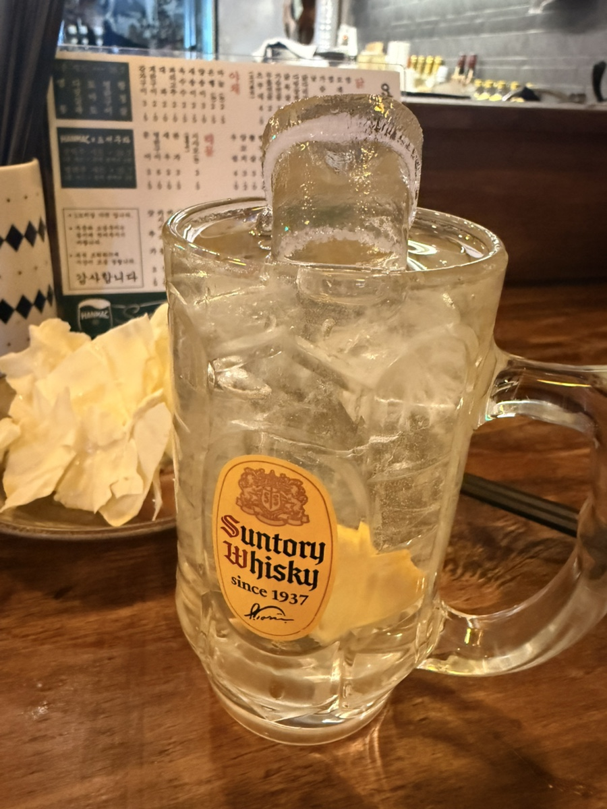

# 위스키 하이볼 열풍과 국내 위스키 시장 구조적 양극화 분석

한국 위스키 시장은 하이볼 열풍을 계기로 수입 구조와 소비 문화가 크게 변화했으며, 대중화와 싱글몰트 프리미엄화가 동시에 진행되는 시장으로 재편되었다. 과거 접대용 술이라는 이미지에서 벗어나 일상적으로 즐기는 술로 자리 잡았지만, 동시에 하이볼과 위스키 문화는 서로 다른 방향으로 발전하고 있다는 점도 함께 이해할 필요가 있다. 이러한 변화가 왜 발생했는지 살펴보면 현재의 위스키 시장뿐 아니라 앞으로의 소비 흐름까지 자연스럽게 이해할 수 있다.

## 핵심 요약

* **한국 위스키 시장**은 2000년대 유흥업소 중심 구조에서 2020년 이후 개인 소비 중심 시장으로 완전히 전환되었다.
* 코로나19와 **하이볼 열풍**은 위스키를 일상적인 술로 바꾸며 역대 최대 수입량을 기록하게 만들었다.
* 수입량은 크게 증가했지만 평균 수입 단가는 오히려 낮아지면서 중저가 위스키 중심 시장으로 재편되었다.
* 미국 버번, 일본 위스키, 대만 위스키 등으로 수입국이 다양해졌으며 소비자의 선택 폭도 크게 넓어졌다.
* 현재 시장은 하이볼용 가성비 위스키와 프리미엄 싱글몰트 시장으로 뚜렷하게 양극화되고 있다.
* **하이볼은 위스키 입문 문화에는 큰 역할을 했지만, 위스키 자체를 깊이 즐기는 문화와는 성격이 다르다.**

## 1. 한국 위스키 시장은 어떻게 변화했을까?

한국에서 위스키는 오랫동안 일반 소비자가 즐기는 술이라기보다 **접대 문화**와 함께 성장한 술이었다. 1990년대부터 2000년대 중반까지 국내 위스키 시장은 룸살롱과 유흥주점이 사실상 시장 대부분을 차지했다. 위스키는 니트나 스트레이트보다 얼음과 물을 섞거나 폭탄주 형태로 소비되는 경우가 많았고, 브랜드 역시 접대용 고급 스카치 위스키가 중심이었다.

그러나 2008년 글로벌 금융위기 이후 기업 접대 문화가 점차 축소되기 시작했고, 주 52시간 근무제와 2016년 시행된 **김영란법**은 이러한 변화를 더욱 가속했다. 여기에 건강을 중시하는 웰빙 문화와 독주를 기피하는 소비 성향까지 겹치면서 국내 위스키 시장은 약 10년 이상 지속적인 하락세를 기록하게 된다.

당시 업계는 이러한 감소세를 막기 위해 36.5도의 저도수 위스키를 출시하는 등 다양한 전략을 시도했지만 시장 전체의 흐름을 바꾸기에는 한계가 있었다. 이 시기 위스키는 점점 '아저씨 술'이라는 이미지를 갖게 되었고, 젊은 세대와는 거리가 먼 주종으로 인식되었다.

이처럼 장기간 침체를 겪던 시장은 예상하지 못했던 계기를 통해 완전히 다른 국면으로 접어들게 된다.

## 2. 팬데믹과 하이볼이 시장을 뒤집다

2020년 코로나19는 유흥업소에는 큰 타격을 주었지만, 역설적으로 **위스키 시장**에는 새로운 기회를 만들어 주었다. 외부 모임이 줄어든 대신 집에서 술을 즐기는 홈술과 혼술 문화가 빠르게 자리 잡았고, 사람들은 새로운 술을 경험하기 시작했다.

여기에 결정적인 역할을 한 것이 **하이볼**이었다. 위스키를 탄산수나 토닉워터와 섞어 마시는 하이볼은 기존 위스키보다 훨씬 낮은 도수와 높은 청량감을 제공했다. 독한 술이라는 기존 이미지가 크게 희석되면서 위스키를 처음 접하는 소비자들의 진입장벽도 함께 낮아졌다.

특히 MZ세대는 단순히 술을 마시는 것보다 자신의 취향을 찾는 소비를 선호했다. SNS에서는 다양한 하이볼 레시피가 공유되었고, 편의점과 대형마트에서는 하이볼용 위스키가 빠르게 품절되는 현상이 반복되었다. 일본 **산토리 가쿠빈**을 비롯한 여러 제품은 오픈런 현상까지 발생할 정도로 높은 인기를 누렸다.

이 시기 위스키는 더 이상 특별한 날에만 마시는 술이 아니라 편의점에서도 쉽게 구매할 수 있는 일상적인 술로 자리 잡기 시작했다. 동시에 소비자의 관심은 스카치 위스키에만 머물지 않고 버번, 일본 위스키, 대만 위스키 등 다양한 국가의 제품으로 확대되었다.

이러한 소비 변화는 결국 국내 수입 통계에도 그대로 반영된다.

## 3. 역대 최대 수입량은 무엇을 의미할까?

국내 위스키 시장 변화는 **관세청 수입 통계**에서 가장 명확하게 확인된다.

| 연도 | 수입량 | 특징 |
|---|---:|---|
| 2021년 | 15,662톤 | 팬데믹 이후 회복 시작 |
| 2022년 | 27,038톤 | 하이볼 대중화 |
| 2023년 | 30,586톤 | 역대 최고치 기록 |
| 2024년 | 27,441톤 | 과열 이후 안정화 |

2023년 국내 위스키 수입량은 **30,586톤**으로 관련 통계 작성 이후 가장 높은 수준을 기록했다. 불과 2년 만에 수입량이 거의 두 배 가까이 증가한 셈이다.

하지만 더욱 흥미로운 점은 수입량과 수입액이 서로 다른 방향으로 움직였다는 사실이다. 일반적으로 물량이 증가하면 수입액도 함께 증가하는 것이 자연스럽지만, 2023년에는 수입량이 13.1% 증가했음에도 수입액은 오히려 2.7% 감소했다.

이는 위스키 소비의 중심이 고가 제품에서 **하이볼용 중저가 위스키**로 이동했기 때문이다. 과거에는 12년산, 15년산, 17년산 등 숙성연수를 중시하는 프리미엄 스카치가 시장을 이끌었다면, 하이볼 시대에는 1만~3만 원대 블렌디드 위스키와 버번 위스키가 대량으로 소비되기 시작했다.

즉, 한국 위스키 시장은 같은 '위스키'라는 이름 아래에서도 소비 목적 자체가 크게 달라졌다고 볼 수 있다. 이러한 변화는 수입 국가의 구성에도 직접적인 영향을 미치게 된다.

## 4. 스카치 일변도에서 다양한 국가의 위스키 시대로

과거 한국 위스키 시장은 사실상 **스카치 위스키**가 시장 대부분을 차지했다. 국내에서 위스키라고 하면 곧 스코틀랜드산 블렌디드 위스키를 의미하는 경우가 많았고, 수입 역시 영국에 크게 의존하는 구조였다. 지금도 영국은 국내 위스키 수입량의 약 80% 이상을 차지하는 최대 공급국이지만, 최근 몇 년 사이 성장률만 놓고 보면 다른 국가들의 약진이 더욱 두드러진다.

가장 큰 변화는 **미국 버번 위스키**의 성장이다. 버번은 옥수수를 주원료로 사용하기 때문에 바닐라와 캐러멜 계열의 단맛이 비교적 강하며, 탄산수와 섞었을 때 풍미가 쉽게 무너지지 않는다. 이러한 특성 덕분에 하이볼 베이스로 활용하기 좋다는 평가를 받으며 수입량과 수입액 모두 큰 폭으로 증가했다.

일본 위스키 역시 하이볼 문화 확산과 함께 가장 큰 수혜를 입은 국가 가운데 하나다. 일본은 이미 수십 년 전부터 하이볼을 일상적인 음주 문화로 정착시킨 나라였고, **산토리 가쿠빈**은 국내 하이볼 열풍을 상징하는 대표 제품이 되었다. 여기에 야마자키, 하쿠슈, 치타 등 다양한 일본 위스키가 알려지면서 일본 위스키 자체에 대한 관심도 크게 높아졌다.

대만 역시 예외는 아니다. **카발란(Kavalan)** 은 세계적인 품평회에서 연이어 좋은 평가를 받으며 빠르게 인지도를 높였고, 국내에서도 프리미엄 위스키 시장에서 확실한 입지를 구축하기 시작했다. 소비자들은 이제 단순히 스카치라는 이유만으로 위스키를 선택하지 않고, 국가와 증류소의 개성까지 비교하며 선택하는 단계로 이동하고 있다.

이러한 변화는 한국 소비자들의 수준이 높아졌다는 의미이기도 하지만, 동시에 시장 내부에서는 또 다른 변화가 진행되고 있었다.

## 5. 하이볼은 위스키 시장을 어떻게 바꾸었을까?

하이볼은 단순히 새로운 칵테일 하나가 유행한 것이 아니라 **위스키 소비 구조 자체를 바꾸었다.**

과거 위스키는 한 병을 오래 보관하며 특별한 날 마시는 술이라는 이미지가 강했다. 반면 하이볼은 부담 없이 한두 잔 즐기는 일상적인 음료에 가까웠다. 이러한 접근성 덕분에 위스키는 편의점과 기업형 슈퍼마켓(SSM), 일반 음식점까지 빠르게 유통망을 확대할 수 있었다.

유통업체들도 이러한 흐름에 맞춰 판매 전략을 크게 변경했다.

* 위스키와 탄산수를 함께 진열하는 크로스 머천다이징 확대
* RTD(Ready To Drink) 하이볼 캔 제품 출시
* 소용량 위스키 제품 증가
* 탄산수·토닉워터·레몬 농축액 판매 증가
* 편의점 중심의 접근성 강화

외식업계 역시 빠르게 변화했다.

* 하이볼 전문 이자카야 증가
* 위스키 바 확대
* 하이볼 페어링 메뉴 개발
* 호텔 프로모션 활성화
* 업장별 시그니처 하이볼 출시

이러한 변화는 단순히 술 판매량만 늘린 것이 아니다. 얼음, 전용 잔, 탄산수, 토닉워터, 제빙기, 바 용품 등 **연관 산업 전체를 성장시키는 파급효과**를 만들어 냈다.

특히 하이볼은 여성 소비자와 2030세대까지 자연스럽게 시장에 유입시키면서 위스키 소비층 자체를 크게 넓히는 역할을 수행했다. 과거에는 위스키를 전혀 마시지 않던 소비자가 하이볼을 계기로 위스키에 관심을 갖게 되는 사례도 적지 않았다.

하지만 이러한 긍정적인 효과와 별개로, 하이볼과 위스키 문화는 본질적으로 같은 영역이라고 보기는 어렵다.

## 6. 하이볼과 위스키는 같은 문화일까?

하이볼의 대중화는 **위스키 산업 전체에는 매우 긍정적인 변화**였다. 위스키를 어렵고 비싼 술에서 누구나 쉽게 접근할 수 있는 술로 바꾸었고, 젊은 세대를 시장으로 끌어들인 결정적인 계기가 되었기 때문이다.

그러나 이것이 곧 **위스키 자체를 즐기는 문화가 확대되었다는 의미는 아니다.**

위스키는 본래 증류소의 개성과 원료, 발효 방식, 증류 방식, 숙성 연수, 오크통 종류, 숙성 환경까지 모두 향과 맛에 반영되는 술이다. 특히 싱글몰트 위스키는 증류소마다 전혀 다른 향미를 가지며, 니트(Neat), 스트레이트, 온더록(On the Rocks)과 같은 방식으로 마실 때 이러한 특징을 가장 잘 느낄 수 있다.

반면 하이볼은 **탄산수와 얼음을 이용해 청량감과 마시기 편한 맛을 만드는 칵테일**이다. 위스키의 개성을 어느 정도 희석하는 대신 접근성과 음용성을 크게 높이는 것이 목적이다. 따라서 숙성에서 만들어지는 섬세한 향과 복합적인 풍미를 온전히 감상하는 음용법이라고 보기는 어렵다.

이 때문에 애호가들은 오히려 하이볼 전용으로 적합한 위스키와, 니트나 스트레이트로 즐길 위스키를 명확히 구분하는 경우가 많다.

대표적으로 하이볼에는 다음과 같은 특징의 제품이 잘 어울린다.

* **블렌디드 위스키**
* 버번 위스키
* 비교적 가격 부담이 적은 NAS 위스키
* 탄산과 섞어도 개성이 유지되는 제품

반대로 오래 숙성된 고가 싱글몰트나 희귀 한정판은 향과 질감 자체가 중요한 가치이므로 하이볼보다는 원액 그대로 마시는 경우가 일반적이다.

즉, **하이볼은 위스키를 쉽게 즐기는 문화**이고, **위스키는 위스키 자체를 음미하는 문화**라고 보는 편이 더 정확하다. 두 문화는 서로 우열의 관계가 아니라 목적 자체가 다르며, 실제 애호가들도 상황에 따라 서로 다른 위스키를 선택한다.

이처럼 하이볼은 위스키 시장을 크게 성장시켰지만, 시장은 이제 또 다른 변화의 단계로 들어가기 시작한다.

## 7. 하이볼 열풍 이후 시장은 왜 양극화되고 있을까?

2024년 이후 국내 위스키 시장은 폭발적인 성장 국면을 지나 **안정화 단계**에 들어섰다. 2023년 3만 586톤으로 정점을 기록했던 수입량은 2024년 2만 7,441톤으로 다소 감소했지만, 이는 시장이 위축되었다기보다 과열되었던 수요가 정상 수준으로 돌아온 결과에 가깝다.

오픈런과 품귀 현상도 대부분 사라졌다. 코로나19 시기에는 공급 부족과 희소성 때문에 유명 위스키를 구매하기 위해 새벽부터 줄을 서는 일이 흔했지만, 현재는 공급이 안정되면서 이러한 현상은 크게 줄어들었다. 소비자 역시 단순히 유행을 따라 구매하기보다 자신의 취향에 맞는 제품을 선택하는 방향으로 변화하고 있다.

현재 시장은 크게 두 축으로 나뉘는 모습이다.

| 시장 구분 | 주요 특징 | 대표 소비층 |
|---|---|---|
| **가성비 시장** | 하이볼용 블렌디드·버번 위스키 중심 | 입문자, 일반 소비자 |
| **프리미엄 시장** | 싱글몰트·장기숙성·한정판 중심 | 애호가, 컬렉터 |

중간 가격대 제품도 존재하지만, 성장세는 상대적으로 완만하다. 반면 하이볼용 제품은 꾸준한 일상 소비를 유지하고 있으며, 프리미엄 시장에서는 증류소별 개성과 희소성을 중시하는 소비가 이어지고 있다.

소비 방식 역시 다양해졌다.

* 하이볼을 즐기는 일상 소비
* 니트와 스트레이트를 중심으로 한 시음 문화
* 증류소 투어와 브랜드 행사 참여
* 위스키 페어링 및 바 문화 확대
* 희귀 제품 수집과 컬렉션 문화

이는 한국 위스키 시장이 단순한 유행을 넘어 하나의 **취향 산업**으로 성장하고 있음을 보여준다.

## 결론

한국 위스키 시장의 가장 큰 변화는 **유흥 중심 시장에서 개인 취향 중심 시장으로 이동했다는 점**이다. 과거에는 접대와 폭탄주 문화가 시장을 이끌었다면, 지금은 개인이 자신의 취향에 맞는 위스키를 선택하고 즐기는 문화가 중심이 되었다. 이러한 변화의 결정적인 계기는 코로나19 이후 확산된 하이볼 열풍이었다.

하이볼은 위스키를 대중에게 소개한 가장 성공적인 입문 문화 가운데 하나라고 평가할 수 있다. 낮은 도수와 부담 없는 음용 방식은 기존 소비층이 아닌 2030세대와 여성 소비자까지 시장으로 유입시켰고, 편의점과 외식업계, RTD 시장까지 성장시키며 국내 위스키 산업의 저변을 크게 넓혔다.

하지만 **하이볼과 위스키 문화는 목적이 서로 다르다.** 하이볼은 위스키를 탄산수나 토닉워터와 조합해 부담 없이 즐기는 칵테일 문화이며, 위스키 자체의 향과 질감, 증류소의 개성, 숙성과 오크통이 만들어 내는 복합적인 풍미를 온전히 감상하기 위한 음용법과는 성격이 다르다. 실제로 애호가들은 하이볼에는 블렌디드 위스키나 버번처럼 희석해도 개성이 유지되는 제품을 사용하는 경우가 많으며, 오래 숙성된 싱글몰트나 고급 위스키는 니트나 스트레이트로 즐기는 경우가 일반적이다.

결국 **하이볼은 위스키를 대체하는 문화가 아니라 위스키를 가장 쉽게 접할 수 있는 입문 문화**라고 볼 수 있다. 반면 니트나 스트레이트는 증류소와 숙성이 만들어 낸 향과 풍미를 보다 직접적으로 감상하기 위한 대표적인 음용법이다. 따라서 하이볼과 위스키 문화는 우열을 가리는 관계가 아니라, 각각 다른 목적과 매력을 가진 두 가지 즐기는 방식으로 이해하는 것이 가장 적절하다. 오늘날 한국 위스키 시장은 이러한 두 문화가 함께 성장하면서 소비층과 제품군 모두 더욱 다양해지고 있으며, 앞으로도 양적 성장보다 취향 중심의 질적 성장이 이어질 가능성이 높다.

## 자주 묻는 질문(FAQ)

### 하이볼에는 어떤 위스키가 가장 잘 어울릴까?

일반적으로 블렌디드 위스키와 버번 위스키가 많이 사용된다. 탄산수와 섞어도 향이 쉽게 사라지지 않고 가격 부담도 적기 때문이다. 대표적으로 산토리 가쿠빈, 짐빔, 조니워커 블랙, 듀어스 화이트라벨 등이 자주 활용된다.

### 비싼 싱글몰트로 하이볼을 만들어도 될까?

개인의 취향이 가장 중요하므로 반드시 안 된다고 할 수는 없다. 다만 오래 숙성된 싱글몰트는 섬세한 향과 복합적인 풍미 자체가 가치이므로, 탄산수와 섞으면 이러한 특징을 충분히 느끼기 어려워 일반적으로는 니트나 스트레이트를 권하는 경우가 많다.

### 하이볼 열풍은 끝난 것일까?

초기의 과열 현상은 상당 부분 진정되었지만 하이볼 자체는 이미 하나의 음주 문화로 자리 잡았다. 시장은 폭발적인 성장 단계에서 안정적인 소비 단계로 전환된 것으로 보는 것이 더 적절하다.

### 앞으로 국내 위스키 시장은 계속 성장할까?

시장조사기관들은 국내 위스키 시장이 앞으로도 연평균 약 3% 수준의 완만한 성장세를 이어갈 것으로 전망하고 있다. 폭발적인 물량 증가보다는 프리미엄 제품과 다양한 소비 문화가 함께 성장하는 질적 성장이 중심이 될 가능성이 높다.

### 하이볼을 마시면 자연스럽게 위스키 애호가가 될까?

반드시 그렇지는 않다. 하이볼만 꾸준히 즐기는 소비자도 많다. 다만 하이볼을 계기로 위스키 자체에 관심을 갖게 되어 니트, 스트레이트, 싱글몰트 등으로 취향을 넓혀 가는 사례도 적지 않으며, 실제로 하이볼은 많은 입문자에게 위스키 세계를 소개하는 첫 관문 역할을 하고 있다.