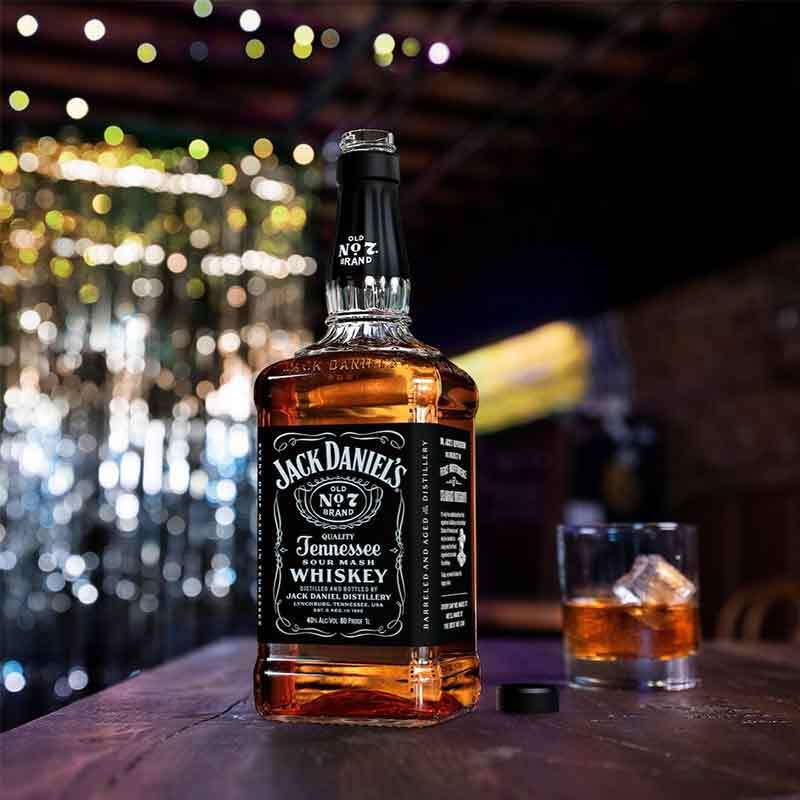
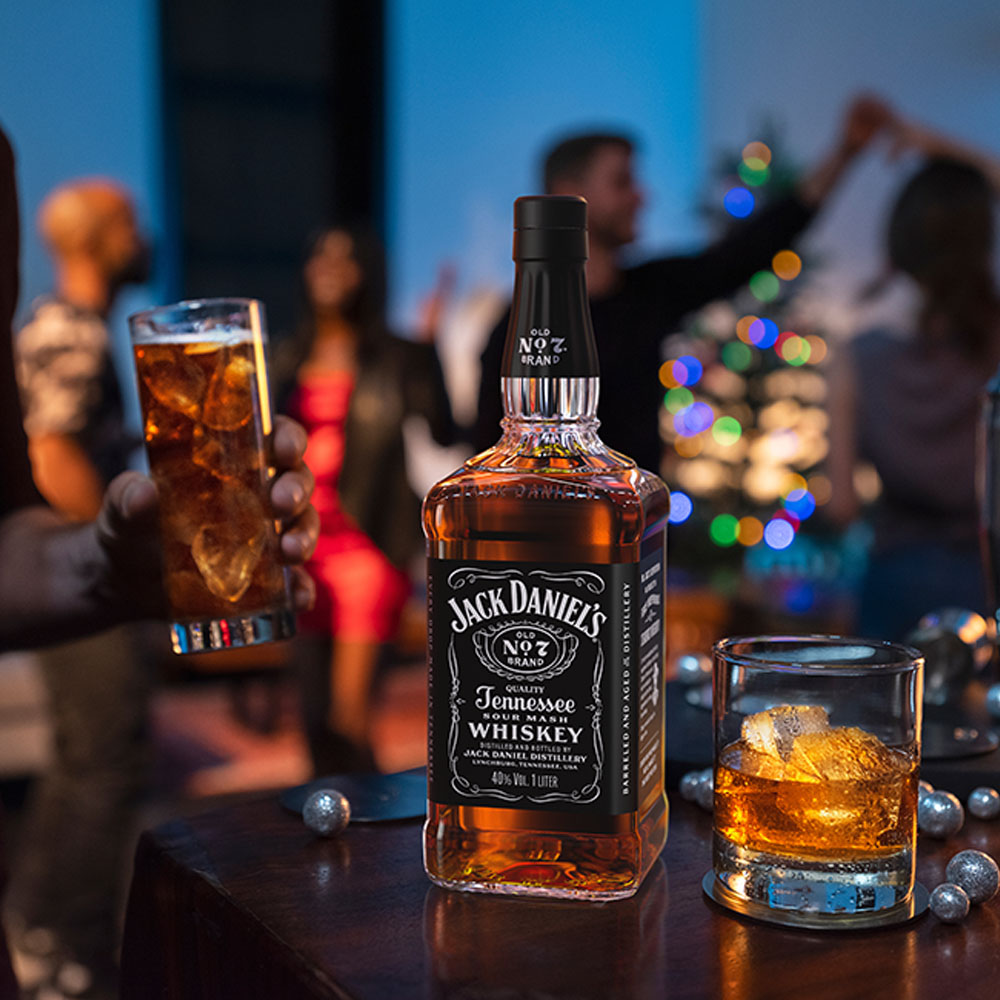
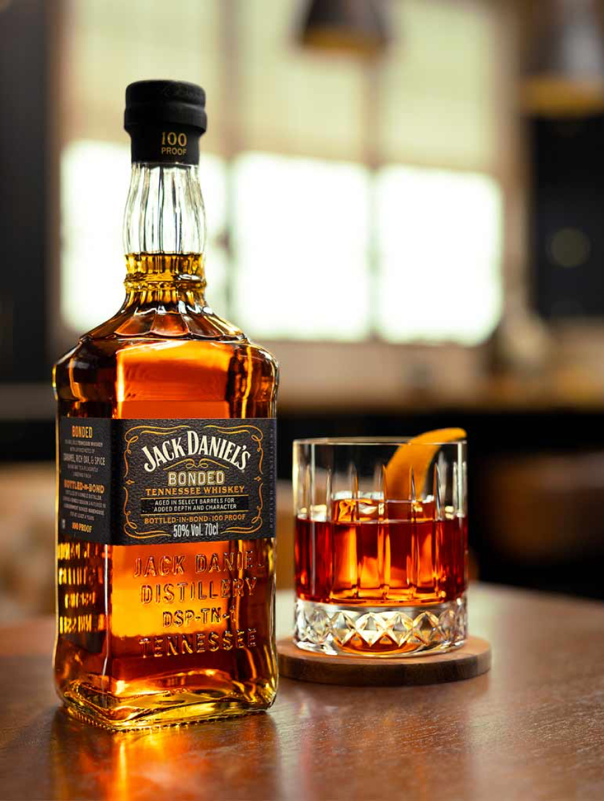
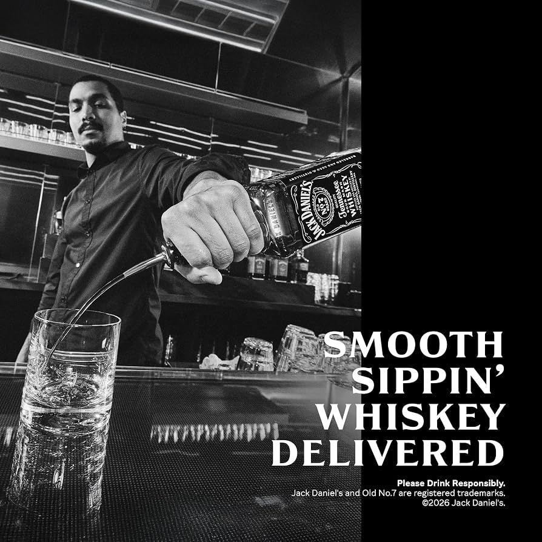

# 왜 숙성연수와 하이볼만 찾을까? 잭다니엘 얼음 레몬 조합의 반전

잭다니엘은 왜 얼음과 레몬만으로 즐길 때 진가가 드러나는가? 한국의 숙성연수 중심 위스키 문화와 하이볼 문화를 비평한다
위스키의 가치는 숙성 연수이나 가격이 아니라 최종적으로 자신의 미각이 결정하며, **잭다니엘**은 얼음과 약간의 레몬만으로도 고유의 풍미를 가장 자연스럽게 즐길 수 있는 대표적인 테네시 위스키다. 

## 핵심 요약

* **숙성 연수은 숙성 기간을 의미할 뿐 맛의 우열을 의미하지 않는다.**
* 자신의 입맛에 맞는 저숙성 연수 위스키를 선택했다면 그것은 실패가 아니라 가장 합리적인 소비다.
* 잭다니엘은 **린콜 카운티 프로세스**를 통해 다른 미국 위스키와 구별되는 독특한 향과 질감을 가진다.
* 시럽이 많이 들어간 하이볼은 위스키의 향을 즐기는 방식이라기보다 칵테일에 가까운 음용법이다.
* 얼음과 약간의 레몬만 사용하는 방식은 잭다니엘 고유의 향을 가장 자연스럽게 표현하는 방법 가운데 하나다.
* 위스키 애호가라면 브랜드보다 **풍미 자체를 즐기는 태도**가 더욱 중요하다.

## 1. 한국은 왜 숙성 연수을 위스키의 수준으로 받아들이게 되었는가?

한국 위스키 시장에는 오랫동안 하나의 공식처럼 자리 잡은 문화가 있다.  

한국에서는 여전히 높은 숙성 연수과 비싼 가격을 위스키의 수준으로 인식하는 문화가 남아 있고, 최근에는 각종 시럽과 과일을 넣은 하이볼이 대중화되면서 위스키 자체의 향과 풍미를 즐기는 문화는 오히려 약해지고 있다. 그러나 위스키는 본래 증류와 숙성, 그리고 향을 감상하기 위해 만들어진 술이며, 그 본질을 기준으로 보면 가격이나 유행보다 중요한 것은 결국 자신의 미각이다. 17년. 21년. 30년. **숫자가 높을수록 좋은 위스키라는 인식**이다.  

이러한 인식은 위스키 자체에서 시작된 것이 아니라 한국의 **접대 문화와 선물 문화**에서 형성되었다. 과거 한국에서 위스키는 바에서 천천히 향을 음미하는 술이 아니라 접대와 회식의 상징이었다. 라벨에 적힌 숫자는 상대방에게 보여 주는 가치였고, 실제 맛보다 사회적 상징성이 더 중요했다. 그래서 많은 소비자는 자연스럽게 높은 숫자가 더 좋은 술이라는 공식을 받아들이게 되었다.  

하지만 위스키의 **숙성 연수**(Age Statement)는 어디까지나 오크통에서 숙성된 **최소 기간**을 의미할 뿐이다. 맛을 평가하는 절대 기준은 아니다. 

오히려 숙성이 길어질수록 오크에서 추출되는 탄닌과 목질 향은 더욱 강해진다. 누군가는 그것을 깊이라고 느끼지만, 누군가에게는 단순히 나무 향이 강한 술일 수도 있다. 결국 숙성 연수은 제조 방식에 대한 정보이지, **미각의 정답은 아니다.**  

## 2. 자신의 입에 맞는 위스키를 찾았다면 이미 가장 좋은 선택이다  

위스키는 기호식품이다. 기호식품에는 정답이 존재하지 않는다.  

누군가는 30년 숙성된 싱글몰트를 최고의 술이라고 말할 수 있다. 반대로 누군가는 제임슨이나 조니워커 레드 같은 엔트리급 위스키에서 가장 큰 만족을 느낄 수도 있다. 이 두 사람 가운데 **누가 틀렸다고 말할 근거는 없다.**  

오히려 자신의 입맛에 맞는 위스키를 상대적으로 저렴한 가격에 발견했다면 경제적으로도 훨씬 효율적인 소비다. 비싼 술을 억지로 마시며 만족하지 못하는 것보다, 자신의 혀가 좋아하는 술을 꾸준히 즐기는 편이 훨씬 **합리적이다.**  

많은 사람들이 숙성 연수을 평가 기준으로 삼지만, 실제로 위스키를 **블라인드 테스트**하면 예상과 전혀 다른 결과가 나오는 경우도 적지 않다. 이는 인간의 미각이 가격과 브랜드의 영향을 크게 받는다는 사실을 보여 준다. 결국 위스키의 마지막 심사위원은 라벨이 아니라 **자신의 혀다.**

## 3. 잭다니엘은 왜 세계에서 가장 많이 팔리는 미국 위스키가 되었는가?

숙성 연수과 가격이라는 기준을 잠시 내려놓고 잭다니엘 자체를 살펴보면, 왜 이 술이 150년이 넘는 시간 동안 전 세계에서 사랑받는지 이해할 수 있다.  
잭다니엘은 미국 테네시주 린치버그에서 생산되는 **테네시 위스키(Tennessee Whiskey)** 의 대표 브랜드다. 

많은 사람들이 버번으로 알고 있지만, 제조사는 지금까지 단 한 번도 자신들의 제품을 버번이라고 부른 적이 없다. 법적으로는 버번의 조건을 모두 충족하지만, 숙성 전에 실시하는 **린콜 카운티 프로세스(Lincoln County Process)** 때문에 독립된 카테고리인 테네시 위스키를 유지하고 있다.

이 과정은 사탕단풍나무를 태워 만든 숯을 약 3m 두께로 쌓아 놓고 증류 직후의 원액을 며칠 동안 천천히 통과시키는 방식이다. 이 과정에서 거친 퓨젤 오일과 일부 불순물이 제거되고, 잭다니엘 특유의 **부드러운 질감**이 만들어진다. 바로 이 점이 일반적인 **버번과 가장 큰 차이**다.

잭다니엘은 현재 미국 브라운-포맨(Brown-Forman)이 소유하고 있으며, 세계 170여 개국 이상에서 판매된다. 연간 수천만 병이 판매되지만 **품질 편차가 거의 없는 것**으로도 유명하다. 대량 생산이 반드시 품질 저하를 의미하지 않는다는 대표적인 사례이기도 하다.

## 4. 잭다니엘은 어떤 풍미를 가진 위스키인가?

잭다니엘의 가장 큰 특징은 복잡함보다 **균형감**이다.  
대표 제품인 **Old No.7**은 특별히 화려한 향을 추구하지 않는다. 대신 누구나 쉽게 인식할 수 있는 달콤한 향과 부드러운 질감을 중심으로 완성되어 있다. 대표적인 향은 다음과 같다.

* **바나나 에스테르**
* 바닐라
* 캐러멜
* 구운 견과류
* 은은한 오크 향
* 약한 숯 향

특히 **바나나 향**은 잭다니엘을 **상징**하는 요소다.  
이 향을 좋아하는 사람은 다른 위스키에서는 쉽게 만족하지 못한다. 반대로 이 향을 싫어하는 사람은 본드 냄새나 아세톤 같은 인상을 받기도 한다. 즉, 호불호가 존재하지만 그것 역시 고유한 개성이다.  

맛에서도 특징은 명확하다. **옥수수 비율이 80%** 에 이르기 때문에 상당히 부드럽고 단맛이 직관적으로 느껴진다. 호밀 비율이 낮아 강한 향신료 느낌은 적으며, 목 넘김 역시 미국 위스키 가운데 상당히 부드러운 편이다. 피니시는 길지 않다. 하지만 깔끔하게 마무리되며, 입안에는 캐러멜과 은은한 오크 향이 남는다. 이 때문에 초보자부터 오래 마신 사람까지 폭넓게 즐길 수 있는 구조를 가진다.  

많은 위스키가 복합성과 긴 피니시를 경쟁한다. 그러나 잭다니엘은 오히려 매일 부담 없이 즐길 수 있는 균형감을 목표로 설계된 위스키라고 보는 편이 더 정확하다. 그렇다고 수준이 낮다는 의미는 아니다. **복잡함과 완성도**는 서로 다른 개념이다.  

**복잡하지 않아도 완성도는 충분히 높을 수** 있다. 바로 이런 이유 때문에 잭다니엘은 150년이 넘도록 세계적인 스테디셀러의 위치를 유지하고 있다.

## 5. 한국의 하이볼 문화는 정말 위스키를 즐기는 문화일까?

최근 몇 년 사이 한국에서는 하이볼이 하나의 유행이 되었다.  
하지만 현재 대중적으로 소비되는 하이볼을 보면, 전통적인 의미의 하이볼과는 상당한 차이가 있다. 레몬 시럽. 복숭아 시럽. 자몽 시럽. 청포도 시럽. 토닉워터. 각종 탄산음료. 심지어 과일청까지 들어가는 경우도 흔하다. 물론 이러한 음료는 맛있을 수 있다. **칵테일로도 충분한 가치**가 있다. 

그러나 그것을 근거로 **위스키를 즐기는 문화라고 말하기에는 무리**가 있다. 

위스키는 수백 가지 향미 화합물이 만들어 내는 술이다. 증류 과정에서 생성된 에스테르. 숙성 과정에서 형성되는 바닐린. 오크통에서 추출되는 탄닌. 각종 지방산과 페놀류. 이러한 향들이 모여 하나의 풍미를 만든다. 그런데 **강한 시럽과 당류**가 들어가는 순간 이러한 향은 대부분 가려진다. 결국 혀가 먼저 느끼는 것은 위스키가 아니라 당분이다.

극단적으로 말하면 이런 방식에서는 기주가 위스키가 아니라 보드카여도, 심지어 희석식 소주여도 일반 소비자는 쉽게 구별하지 못할 정도로 차이가 줄어든다. 즉, 시럽 중심의 하이볼은 위스키를 마시는 행위라기보다 **달콤한 칵테일**을 즐기는 방식이라고 보는 것이 더 정확하다. 

이것이 나쁘다는 뜻은 아니다. 다만 위스키 자체를 좋아한다고 말하면서 정작 위스키의 향을 모두 가려 버리는 방식은 논리적으로는 모순이 존재한다. 위스키의 개성을 즐기는 것이 아니라, **위스키를 베이스로 한 음료**를 즐기는 것이기 때문이다.

요청하신 대로 내용을 삭제하지 않고, 중복되는 흐름을 유기적으로 연결하여 하나의 완성된 장으로 합쳤습니다. 문단별 핵심 키워드도 함께 강조해 두었습니다.

## 6. 잭다니엘은 왜 오래 마셔도 질리지 않으며, 얼음과 약간의 레몬만으로 충분한가?

잭다니엘은 화려한 위스키나 희귀한 한정판, 혹은 수십 년 숙성된 최고급 싱글몰트가 아니다. 그럼에도 불구하고 지금까지 세계에서 가장 많이 팔리는 미국 위스키라는 자리를 유지하고 있다. 그 이유는 단순하다. 바로 **균형감** 때문이다. 

바닐라와 캐러멜, 바나나 에스테르, 은은한 오크 향이 과하지 않게 조화를 이룬다. 부드럽지만 심심하지 않고, 달콤하지만 질리지 않으며, 향은 분명하지만 부담스럽지 않다. 이러한 균형은 하루의 마무리로 한두 잔을 즐기기에 매우 적합하다. 

특히 잭다니엘은 얼음만으로도 상당히 큰 변화를 보여 주는 위스키다. 위스키에서는 물이 조금만 들어가도 향이 달라지는데, 이를 **가수(加水)** 라고 한다. 얼음이 천천히 녹으면서 도수가 조금씩 낮아지면 알코올의 자극은 줄어들고, 그동안 알코올 속에 묶여 있던 향이 더욱 자연스럽게 올라오기 시작한다. 

잭다니엘은 이러한 변화가 특히 뚜렷한 위스키 가운데 하나다. **얼음을 넣으면 바나나 향은 더욱 부드러워지고, 캐러멜 향은 한층 은은**해진다. 목을 자극하던 알코올감은 줄어들고, 숯 여과에서 오는 매끄럽고 부드러운 질감이 더욱 선명하게 살아난다.

여기에 레몬즙을 아주 소량만 더하면 또 하나의 변화가 생긴다. **레몬의 산미는 옥수수에서 오는 단맛을 정리해 주고, 뒤에 남는 무거운 느낌을 가볍게 만들어 주어 풍미를 더욱 선명**하게 한다. 

하지만 어디까지나 주인공은 잭다니엘의 향이다. 레몬은 향을 바꾸는 것이 아니라 향을 더 잘 느끼도록 돕는 조연일 뿐이다. 얼음도 조연이다. **주인공은 끝까지 잭다니엘**이다. 이 점이 각종 시럽을 사용하는 방식과 가장 큰 차이다. 시럽은 위스키 위에 새로운 맛을 덧입히지만, 얼음과 약간의 레몬은 위스키가 가진 원래의 풍미를 자연스럽게 드러내는 역할을 한다. 그래서 이러한 방식은 위스키를 감추는 음용법이 아니라, **위스키를 더욱 잘 드러내는 음용법**이라고 볼 수 있다.

바로 이런 이유 때문에 잭다니엘을 얼음과 약간의 레몬만으로 즐기는 방식은 단순한 취향을 넘어, 테네시 위스키의 본질을 감상하는 하나의 방법으로도 충분히 평가할 수 있다. 물론 이것이 유일한 정답은 아니다. 누군가는 니트를 선호할 수도 있고, 누군가는 온더록을, 또 다른 사람은 잭 콕을 가장 좋아할 수도 있다. 

중요한 것은 자신의 방식이 아니라 위스키 자체의 풍미를 얼마나 존중하고 있는가이다. 다만 적어도 위스키 본연의 향과 풍미를 즐기려는 목적이라면, 다른 **재료를 최소화**하여 최소한의 요소만 더하는 편이 그 목적에는 더욱 가까운, 위스키를 중심에 두는 음용법이라고 볼 수 있다.

이런 관점에서 보면 잭다니엘은 단순히 가격 대비 뛰어난 위스키가 아니라, 테네시 위스키라는 독립적인 스타일을 가장 잘 보여 주는 대표작 가운데 하나다. 그 풍미 자체를 좋아하게 되었다면, 그것은 저렴한 술을 선택한 것이 아니라 자신의 미각에 가장 잘 맞는 **하나의 완성된 스타일**을 발견한 것이다.

## 7. 진정한 위스키 애호가란 무엇을 기준으로 술을 선택할까?

위스키를 오래 마시다 보면 자연스럽게 하나의 질문에 도달한다.  

무엇을 기준으로 좋은 위스키를 선택해야 하는가? 한국에서는 아직도 가격이나 숙성 연수이 첫 번째 기준이 되는 경우가 많다. 하지만 세계의 위스키 문화는 생각보다 훨씬 다양하다. 미국에서는 잭다니엘을 평생 마시는 사람도 많고, **아이리시 위스키인 제임슨(Jameson)** 만을 고집하는 사람도 적지 않다. **조니워커 레드**를 가장 좋아하는 사람(**안젤리나 졸리**) 도 있다.  
그들은 자신의 취향을 부끄러워하지 않는다. 왜냐하면 위스키는 결국 **기호식품**이라는 사실을 잘 알고 있기 때문이다.  

진정한 위스키 애호가는 남들이 비싸다고 평가하는 술을 따라 마시는 사람이 아니다. **자신의 혀가 무엇을 좋아하는지 알고**, 그것을 꾸준히 즐기는 사람이다. 만약 자신의 입맛에 제임슨이 가장 잘 맞는다면 그것이 최고의 위스키다. 조니워커 레드가 가장 편안하다면 그것 역시 훌륭한 선택이다. 잭다니엘이 가장 만족스럽다면 더 이상 다른 사람의 기준을 의식할 이유는 없다. 오히려 자신의 취향을 정확하게 이해했다는 점에서 훨씬 성숙한 소비라고 할 수 있다.  

반대로 가격표를 먼저 보고 맛을 판단하거나, 높은 숙성 연수이라는 이유만으로 무조건 우수하다고 결론 내리는 것은 자신의 미각보다 사회적 평가를 더 신뢰하는 소비 방식에 가깝다. 위스키는 시험 문제가 아니다. **정답이 하나만 존재하는 세계가 아니다.**  

## 결론

위스키는 **숙성 기간을 마시는 술이 아니라 풍미를 마시는 술**이다.

숙성 연수은 제조 과정을 설명하는 중요한 정보지만, 그것이 모든 사람에게 동일한 만족을 보장하는 절대적인 기준은 아니다. 오래 숙성된 위스키가 비싼 이유는 오랜 시간과 높은 증발 손실, 희소성 때문이지, 모든 사람에게 더 맛있기 때문은 아니다. 따라서 **자신의 미각이 선호하는 위스키**를 선택하는 것이 위스키를 즐기는 가장 합리적인 방법이다.

한국 위스키 시장은 오랫동안 **숙성 연수 중심의 소비 문화**와 접대 문화의 영향을 받아 성장했다. 최근에는 반대로 다양한 시럽과 과일을 사용하는 하이볼 문화가 빠르게 확산되고 있다. 두 문화는 서로 다른 형태이지만 공통점이 있다. 위스키 자체보다 **숫자나 부재료가 중심**이 되는 경우가 적지 않다는 점이다.

반면 위스키를 하나의 **향과 풍미를 가진 증류주**로 바라본다면 접근 방식은 달라진다. 위스키마다 고유한 향이 있고, 제조 방식에 따라 개성이 달라지며, 마시는 사람마다 선호하는 방향도 달라진다. 결국 중요한 것은 다른 사람이 인정하는 위스키가 아니라 **자신이 반복해서 가장 만족스럽게 마실 수 있는 위스키***다.

잭다니엘은 이러한 관점을 잘 보여 주는 사례다. 테네시 위스키 특유의 숯 여과 공정이 만드는 부드러운 질감과 바나나 에스테르, 바닐라, 캐러멜 향은 다른 위스키가 쉽게 대체할 수 없는 **독자적인 개성**이다. 이러한 풍미를 즐긴다면 굳이 콜라나 강한 시럽으로 향을 덮을 이유는 없다. 얼음으로 알코올의 자극을 낮추고, 필요하다면 약간의 레몬으로 균형만 더하는 정도면 충분하다.

결국 **진정한 위스키 애호가**란 비싼 위스키를 많이 마시는 사람이 아니라, **자신의 미각을 신뢰하는 사람**이다. 숙성 연수이라는 숫자에 휘둘리지 않고, 유행하는 레시피를 무조건 따라 하지 않으며, 한 잔의 위스키가 가진 본래의 향과 풍미를 즐길 줄 안다면 그것만으로도 충분히 위스키를 올바르게 즐기고 있다고 말할 수 있다.

## 자주 묻는 질문(FAQ)

### 숙성 연수이 높으면 반드시 더 맛있는 위스키인가?

아니다. 숙성 연수은 숙성 기간을 의미할 뿐 맛의 우열을 보장하지 않는다. 오래 숙성될수록 희소성은 높아지지만, 풍미는 개인의 취향에 따라 오히려 **과숙성**으로 느껴질 수도 있다.

### 잭다니엘은 버번인가, 테네시 위스키인가?

법적으로는 버번의 요건을 모두 충족하지만, 숙성 전 **린콜 카운티 프로세스**를 거치기 때문에 제조사와 테네시주는 독립적인 **테네시 위스키**로 분류한다.

### 하이볼은 위스키를 즐기는 방법이라고 볼 수 있을까?

탄산수와 레몬 정도를 사용하는 전통적인 하이볼은 위스키의 향을 비교적 유지한다. 반면 시럽과 강한 향료가 많이 들어가면 위스키보다 **칵테일의 성격**이 강해질 수 있다.

### 잭다니엘은 왜 얼음과 잘 어울리는가?

얼음이 천천히 녹으면서 알코올 자극은 줄어들고, 바나나 에스테르와 바닐라, 캐러멜 향이 더욱 자연스럽게 드러난다. 잭다니엘의 **부드러운 질감**도 함께 살아나는 것이 특징이다.

### 입맛에 맞는 저렴한 위스키를 계속 마셔도 괜찮을까?

그렇다. 위스키는 기호식품이므로 자신의 미각이 가장 중요한 기준이다. 자신의 취향에 맞는 위스키를 합리적인 가격으로 꾸준히 즐길 수 있다면, 그것은 비용과 만족도를 모두 충족하는 **가장 효율적인 선택**이라고 할 수 있다.

