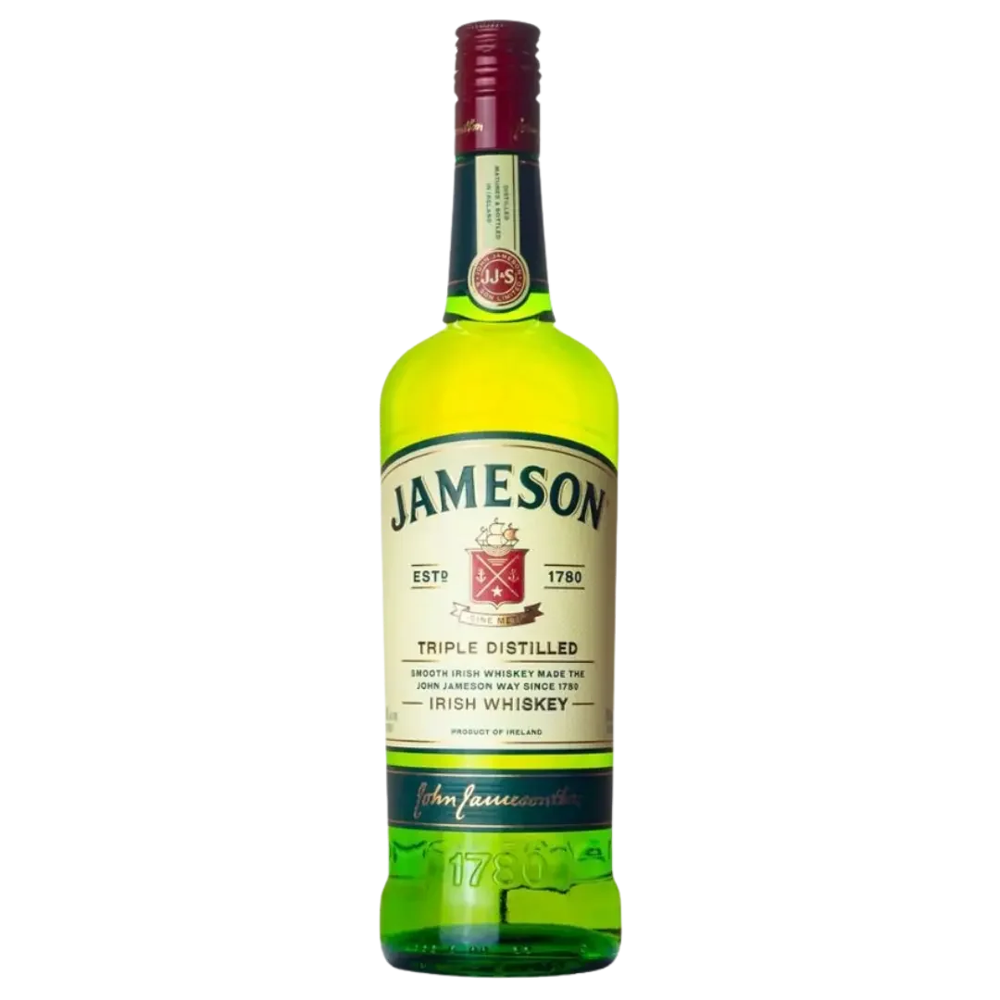
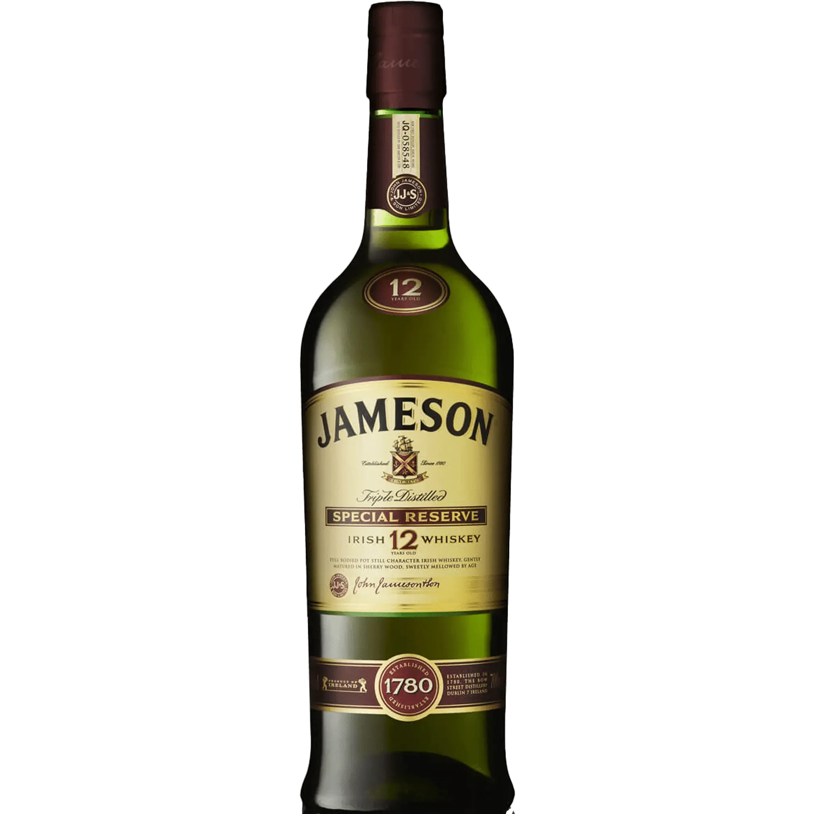

# 제임슨(Jameson) 위스키 숙성 연수 라인업 완전 분석

제임슨 오리지널의 최소 4년 숙성과 3회 증류부터 블랙 배럴과 캐스크메이츠의 차이까지 제조법과 제품 체계를 정리한다. 제임슨은 스카치나 버번이 아니라 **아이리시 위스키**다. 생산지는 현재 코크주 미들턴이다. 1780년 더블린 보우 스트리트에서 시작한 브랜드는 생산 거점을 옮긴 뒤에도 세 번 증류와 블렌딩 중심의 스타일은 그대로 지켰다.

제임슨을 둘러싼 이야기는 숙성 연수에서 자주 꼬인다. 기본 제품에 연수가 적혀 있지 않다는 이유로 "6년산"이라는 말이 나오는가 하면, 반대로 12년산과 비교하며 지나치게 낮게 평가하는 경우도 있다. 실제 기준은 더 단순하다. **제임슨 오리지널은 NAS 제품이며 최소 4년 숙성한 원액을 사용한다.**

## 핵심 요약

* **제임슨 오리지널은 아이리시 위스키**다. 스코틀랜드산 스카치나 미국산 버번이 아니다.
* 기본 제품은 **팟 스틸 위스키와 그레인 위스키를 블렌딩**해 세 번 증류하는 방식으로 만든다.
* 오리지널은 병에 숙성 연수를 적지 않는 **NAS(No Age Statement)** 제품이며, 원액은 오크 캐스크에서 최소 4년 숙성한다.
* 12년산과 비교해 풍미가 약하다는 평가는 제품 체급 차이를 말해주는 것이지, 오리지널의 품질 기준 자체가 잘못됐다는 뜻은 아니다.
* **블랙 배럴**은 이중 탄화 배럴을 써서 오크와 바닐라, 캐러멜 계열 풍미를 끌어올린 상위 라인이다.
* **캐스크메이츠**는 맥주를 담았던 캐스크에서 추가 숙성해 초콜릿, 커피, 홉 같은 별도의 향미를 더한 제품군이다.

  
***3회 증류를 뜻하는 'TRIPLE DISTILLED' 문구를 확인할 수 있는 가장 대중적인 기본형 제품***

## 1. 제임슨은 어떤 위스키인가?

제임슨의 출발점은 1780년, 존 제임슨이 더블린 보우 스트리트에서 증류 사업을 시작하면서다. 이후 가족 중심으로 증류소가 몸집을 키웠고, 보우 스트리트는 대형 증류소로 자랐다. 제임슨이라는 이름도 점차 아이리시 위스키를 대표하는 브랜드로 굳었다.

초기부터 보리 사용법과 증류법을 다듬었고, 세대를 거치며 생산 체계도 넓혀갔다. 20세기에는 전쟁과 원료 부족, 미국 금주법 같은 외부 변수가 사업을 직접 흔들었다. 그럼에도 브랜드는 버텼고, 1966년에는 다른 증류소들과 합병해 Irish Distillers Limited를 세웠다.

오늘날 마시는 제임슨의 생산지는 더블린이 아니다. 보우 스트리트는 역사적 본거지로 남고, 실제 생산은 코크주 미들턴 증류소가 맡는다. 1970년 보우 스트리트에서 마지막 포트 스틸 원액을 뽑았고, 1975년 미들턴으로 생산 거점을 옮기며 대량생산 체계를 갖췄다. 이후 보우 스트리트는 생산 시설이 아니라 **역사를 상징하는 공간**으로 성격이 바뀌었다.

단순한 장소 이동은 아니었다. 아이리시 위스키 시장이 커지면서 더 큰 생산 시설이 필요해졌고, 미들턴은 그 수요를 받아낼 중심지가 됐다. 지금의 생산 체계도 이곳을 기반으로 돌아간다. 규모는 커졌지만 세 번 증류와 블렌딩 중심의 스타일만은 바뀌지 않았다.

제임슨이 세계 시장에서 차지하는 위치도 뚜렷하다. **세계에서 가장 많이 팔리는 아이리시 위스키 브랜드**라는 자리를 내세우며, 대량 판매를 전제로 한 제품 설계가 브랜드 성격에도 고스란히 드러난다. 오래된 증류소를 그대로 박제해 둔 이야기가 아니라, 오래된 방식을 지금의 생산 시스템에 맞춰 이어온 역사에 가깝다.

## 2. 제임슨의 부드러움은 왜 만들어지는가?

제임슨을 설명할 때 가장 먼저 나오는 단어는 **3회 증류**다. 구리 증류기로 원액을 세 차례 증류하며, 브랜드는 이 과정을 특유의 부드러움을 만드는 핵심으로 꼽는다.

세 번 증류한다고 모든 위스키가 무조건 좋아지진 않는다. 증류 횟수가 늘수록 원액에서 특정 성분을 더 선택적으로 걸러내고, 그만큼 최종 술의 성격도 달라진다. 제임슨은 이 방법을 자신들이 원하는 스타일에 맞는 선택으로 본다.

과거 네 번 증류 가능성도 검토했다는 대목은 흥미롭다. 하지만 네 번이 더 낫다는 결론에는 이르지 않았고, **세 번**이라는 기준을 계속 지켰다. 중요한 건 횟수 자체가 아니다. 그 횟수로 어떤 풍미와 질감을 만드느냐다.

여기에 팟 스틸 위스키와 그레인 위스키를 함께 쓴다. 하나의 원액만으로 성격이 정해지는 싱글 몰트와 달리, 서로 다른 원액의 특성을 섞어 일관된 맛을 낸다.

* **팟 스틸 위스키**는 맥아 보리와 일반 보리로 풍미의 중심을 잡는다.
* **그레인 위스키**는 더 부드럽고 가벼운 성격을 얹는다.
* **블렌딩**은 두 원액의 장점을 묶어 제임슨 특유의 균형을 만든다.

그렇게 완성된 제임슨 오리지널의 강점은 강렬한 개성보다 **부드러운 균형**에 있다.

## 3. 제임슨 오리지널은 몇 년 숙성한 위스키인가?

여기서 가장 큰 오해가 생긴다. 제임슨 오리지널은 병에 숙성 연수를 적지 않는다. **NAS 위스키**다.

그렇다고 숙성 기간이 비공개인 건 아니다. 제임슨은 오리지널에 쓰는 원액을 오크 캐스크에서 **최소 4년 이상** 숙성한다고 밝힌다. 아이리시 위스키라는 법적 명칭을 쓰기 위한 최소 숙성 기간과도 맞닿지만, 제임슨이 오리지널에 적용하는 자체 기준은 그보다 긴 4년이다.

"제임슨은 몇 년산인가?"라는 질문에 제대로 답하려면 "6년산"이나 "12년산"이라 부를 이유가 없다.

**제임슨 오리지널은 NAS이며 최소 4년 숙성이다.**

"6년산 정도 된다"는 표현이 나오는 건 블렌디드 위스키의 구조와 제품 체급을 혼동해서다. 블렌딩에는 여러 숙성 원액이 들어갈 수 있지만, 평균 숙성 연수를 근거로 제품에 임의의 연수를 붙일 순 없다. 병에 6년이라고 적혀 있지 않다면, 공식적으로 6년산이라 부를 근거도 없는 셈이다.

이 지점은 뜻밖에 중요하다. **NAS는 저숙성이라는 뜻이 아니다.** 숙성 연수를 병에 적지 않는다는 뜻일 뿐이다.

***제임슨 12년산 스페셜 리저브(Jameson 12 Year Old Special Reserve)' 구형 보틀***

## 4. 제임슨 오리지널이 12년산보다 밋밋하게 느껴지는 이유는 무엇인가?

"제임슨은 12년급도 안 된다"는 말은 제품 체급을 비교한다는 뜻에서는 크게 이상하지 않다. 다만 이 말을 **품질 자체의 부정**으로 받아들이면 곤란하다.

12년 숙성 제품은 오랜 시간 오크와 닿으며 원액의 성격이 달라진다. 시간이 길어질수록 나무에서 우러나는 풍미가 쌓이고, 대체로 더 복합적인 향과 깊이를 기대하게 된다.

제임슨 오리지널은 애초에 그런 목적의 제품이 아니다. **4년 이상 숙성한 원액으로 부드러운 블렌디드 위스키를 만드는 것**이 핵심이다. 가격대도 누구나 부담 없이 마실 수 있도록 잡았다.

그래서 오리지널과 12년산을 견주며 "왜 깊이가 부족하지?"라고 묻는 건, 어느 정도 답이 정해진 질문이다. 숙성 기간과 제품 포지션 자체가 다르기 때문이다.

이 차이는 오히려 제임슨의 장점을 보여준다. 오리지널은 강한 오크와 긴 여운 대신 **부담 없이 마실 수 있는 균형과 부드러움**을 택했다.

## 5. 제임슨의 숙성에서 캐스크는 어떤 역할을 하는가?

숙성 기간만큼 중요한 요소가 **캐스크**다. 같은 위스키라도 어떤 오크통을 썼는지에 따라 향과 맛의 방향이 크게 갈린다.

제임슨은 버번과 셰리 계열 캐스크 등을 쓰고, 숙성 과정에서 오크는 바닐라와 단 향, 나무 향 같은 특성을 원액에 넘긴다. 단순히 술을 오래 담아두는 일이 아니다. 증류 직후 투명한 원액에 캐스크가 색과 향, 맛을 더하며 최종 위스키의 성격을 빚는다.

숙성 중 원액 일부가 증발하는 현상도 피할 수 없다. 흔히 **천사의 몫**이라 부른다. 제임슨은 매년 일정량의 위스키가 증발한다고 설명하는데, 시간이 지날수록 원액 양이 줄어드는 자연스러운 과정이다.

숙성은 시간만의 문제는 아니다. **시간과 캐스크가 함께 작용하는 과정**이다. 같은 4년 숙성이라도 어떤 배럴을 거쳤는지에 따라 결과는 달라진다.

## 6. 제임슨 오리지널과 블랙 배럴은 무엇이 다른가?

제임슨 오리지널의 상위 제품으로 가장 먼저 견줄 대상이 **블랙 배럴**이다. 두 제품 모두 제임슨 특유의 부드러운 스타일을 공유하지만, 캐스크 운용에서는 차이가 뚜렷하다.

블랙 배럴은 특히 **이중 탄화한 오크 배럴**을 쓴다. 이 과정이 오크에서 오는 토스트와 바닐라, 캐러멜 계열 풍미를 끌어올리는 쪽으로 작용한다.

| 구분     | 제임슨 오리지널           | 제임슨 블랙 배럴          |
| ------ | ------------------ | ------------------ |
| 기본 성격  | 대중적인 스탠다드 제품       | 보다 진한 풍미의 프리미엄 라인  |
| 숙성 표기  | NAS                | NAS                |
| 증류     | 3회 증류              | 3회 증류              |
| 블렌딩    | 팟 스틸 + 그레인         | 팟 스틸 + 그레인         |
| 캐스크 특징 | 다양한 오크 캐스크         | 이중 탄화 오크 중심        |
| 풍미 방향  | 부드러움, 바닐라, 견과류, 과일 | 오크, 바닐라, 캐러멜, 스파이스 |
| 음용 성격  | 하이볼·칵테일·니트         | 니트·온더락·진한 칵테일      |

블랙 배럴이 오리지널보다 무조건 "두 배 좋은 위스키"라는 해석은 맞지 않는다. 제품이 겨냥하는 **풍미의 밀도와 방향이 다를 뿐**이다.

오리지널이 가볍게 손이 가는 술이라면, 블랙 배럴은 캐스크의 존재감을 더 또렷이 느끼는 제품에 가깝다.

## 7. 캐스크메이츠는 왜 맛이 전혀 다르게 느껴지는가?

캐스크메이츠는 제임슨의 또 다른 방향을 보여준다. 대표작인 스타우트 에디션은 **맥주를 숙성했던 캐스크**를 써서 추가 숙성을 거친다.

아이디어는 단순하다. 제임슨 캐스크로 맥주를 숙성시킨 뒤, 그 배럴을 다시 위스키 숙성에 써서 맥주의 풍미를 위스키에 옮기는 방식이다. 이렇게 만든 제품은 일반 제임슨 오리지널과 견주면 향미가 확연히 다르다.

스타우트 에디션에서는 **초콜릿, 코코아, 커피, 버터스카치, 홉** 같은 표현이 자연스럽게 따라붙는다. 기본 제임슨의 부드러운 단맛 위에 맥주 캐스크에서 온 로스팅과 초콜릿 계열 인상이 겹치기 때문이다.

이 제품이 갖는 의미는 숙성 연수를 늘리는 데 그치지 않는다. 제임슨은 캐스크를 활용해 **새로운 풍미를 설계하는 방식**도 적극적으로 쓴다.

## 8. 제임슨의 라인업은 숙성 연수보다 캐스크 차이가 중요하다?

제임슨을 고를 때 숙성 연수만 보는 건 절반만 보는 셈이다. 오리지널과 블랙 배럴, 캐스크메이츠를 나란히 놓으면 오히려 **원액 구성과 캐스크 운용의 차이**가 제품 성격을 더 크게 가른다.

오리지널이 낮은 숙성 연수를 감추려 NAS를 쓴다고 단정할 근거는 없다. NAS는 일관된 블렌딩과 브랜드 전략을 위한 방식으로 보는 편이 정확하다.

제임슨에도 고숙성 제품은 실제로 있다. 대표적으로 18년급 제품이 있고, 과거에는 12년 제품도 있었다. "제임슨에는 년산 위스키가 없다"는 말도 틀렸다. **오리지널이 NAS일 뿐, 브랜드 전체가 NAS인 건 아니다.**

| 제품          | 핵심 특징                 | 맛의 방향             | 제품 성격 |
| ----------- | --------------------- | ----------------- | ----- |
| 제임슨 오리지널    | 최소 4년 숙성, 3회 증류, 블렌디드 | 부드러움, 바닐라, 견과류    | 스탠다드  |
| 제임슨 블랙 배럴   | 이중 탄화 캐스크 활용          | 오크, 바닐라, 캐러멜      | 프리미엄  |
| 캐스크메이츠 스타우트 | 스타우트 캐스크 피니시          | 초콜릿, 커피, 홉        | 실험적   |
| 제임슨 18년     | 장기 숙성 원액 사용           | 깊은 오크와 복합적인 숙성 풍미 | 고숙성   |

표만 봐도 제품군의 방향은 뚜렷하다. **오리지널은 가성비와 접근성**, 블랙 배럴은 캐스크 풍미, 캐스크메이츠는 실험성, 18년은 장기 숙성이 중심이다.

## 9. 제임슨은 어떻게 마시는 것이 좋은가?

제임슨의 음용법은 한 가지로 고정돼 있지 않다. 오리지널은 니트로 마셔도 되고 얼음을 넣어도 되며, 칵테일 베이스로도 잘 어울린다.

특히 널리 알려진 방식이 **진저에일 하이볼**이다. 얼음을 충분히 채운 잔에 제임슨과 진저에일을 섞고 레몬이나 라임을 곁들이면 된다. 위스키 향을 세게 밀어붙이지 않고, 탄산과 생강 향으로 부드럽게 넘긴다는 점이 장점이다.

아이리시 커피 같은 따뜻한 음료와도 잘 맞는다. 제임슨 특유의 바닐라와 단맛이 커피의 쓴맛과 만나면서 전혀 다른 인상을 낸다.

위스키 자체의 성격을 확인하고 싶다면 **니트 또는 온더락**이 가장 단순하다. 물이나 탄산을 더하지 않고 원액의 향을 그대로 느낄 수 있어서다.

제임슨의 쓰임새는 제품 성격과 잘 맞아떨어진다. 강렬한 개성을 뽐내는 술이라기보다, 다른 재료와 섞여도 기본 부드러움을 잃지 않는 **범용성 높은 위스키**에 가깝다.

## 결론

제임슨 오리지널을 이해할 때 가장 먼저 버려야 할 오해는 "NAS니까 숙성 기간이 짧고 정확한 연수도 모른다"는 생각이다. 공식적으로는 **최소 4년 숙성한 원액**을 쓰며, 세 번 증류한 팟 스틸과 그레인 위스키를 블렌딩해 특유의 부드러운 스타일을 만든다.

"6년산 정도다"라는 표현은 공식 숙성 연수를 뜻하지 않는다. 반대로 12년산보다 깊이가 부족하다는 평가도 제품의 실패를 뜻하지 않는다. 제임슨 오리지널은 애초부터 장기 숙성의 복잡함을 겨냥한 제품이 아니다. **접근성, 부드러움, 범용성**을 중심에 둔 스탠다드 위스키다.

블랙 배럴로 가면 이중 탄화 캐스크가 풍미의 밀도를 높이고, 캐스크메이츠로 가면 맥주 캐스크로 초콜릿과 커피 같은 전혀 다른 결을 더한다. 숙성 연수만으로 제임슨 라인업을 줄 세우기보다 **증류 방식과 블렌딩, 캐스크, 제품 포지션을 함께 보는 편이 훨씬 정확하다.**

제임슨 오리지널의 가치는 12년산과 같은 잣대로 잴 이유가 없다. 오래 숙성한 술이 아니라서 가볍고, 그 가벼움 덕분에 하이볼부터 니트까지 폭넓게 쓸 수 있다. 제임슨이 오랫동안 대중적인 아이리시 위스키 브랜드로 남은 이유도 바로 여기에 있다.

## 자주 묻는 질문(FAQ)

### 제임슨 오리지널은 몇 년산인가?

제임슨 오리지널은 **NAS 제품**이라 병에 숙성 연수를 표시하지 않는다. 제임슨은 오리지널에 사용하는 원액을 오크 캐스크에서 최소 4년 숙성한다고 설명한다.

### 제임슨은 6년산 위스키인가?

공식적인 의미에서 6년산이라고 부를 수 없다. 여러 숙성 원액을 블렌딩할 수 있지만 제품 자체의 공식 숙성 연수가 6년으로 표시되는 것은 아니다.

### 제임슨은 12년산보다 품질이 낮은가?

두 제품의 체급과 목적이 다르다. 12년산은 장기 숙성에서 나오는 복합성을 강조하고, 제임슨 오리지널은 부드러움과 접근성, 범용성을 강조한다. 단순한 우열보다 **제품 포지션의 차이**로 보는 편이 정확하다.

### 제임슨은 스카치 위스키나 버번 위스키인가?

아니다. 제임슨은 아일랜드에서 생산·증류·숙성하는 **아이리시 위스키**다. 다만 일부 제품은 버번 캐스크를 숙성에 사용한다.

### 제임슨을 가장 쉽게 마시는 방법은 무엇인가?

제임슨 오리지널은 진저에일과 섞는 하이볼이 대표적이며, 니트나 온더락으로도 즐길 수 있다. 칵테일 베이스로 활용하는 방식도 잘 어울린다.