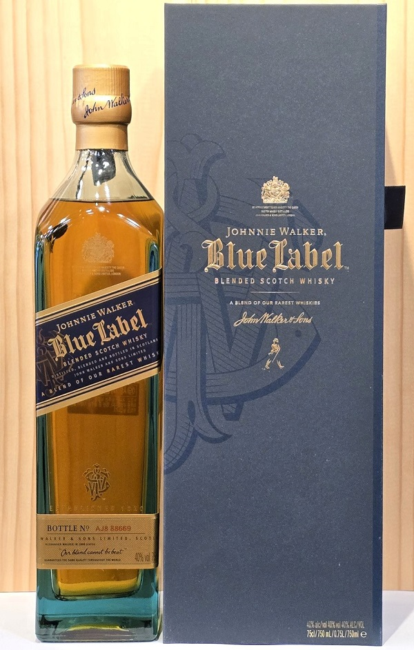

# NAS 위스키란? 숙성 연도가 없는 위스키를 의미할까?

NAS 위스키는 숙성을 하지 않은 술이 아니라 숙성 연도를 표기하지 않은 위스키를 의미한다. NAS가 등장한 이유와 장단점, 대표 제품까지 쉽게 정리한다. 위스키 시장을 보면 12년이나 18년 같은 숙성 연도가 적힌 제품 외에 아무런 숫자가 없는 제품도 자주 발견된다. 이러한 제품이 바로 NAS 위스키에 해당하며, 최근 많은 증류소에서 주력으로 선보이는 추세다. 연산 표시가 없다는 이유로 품질이 낮다고 오해하기 쉽지만, 이는 위스키의 맛과 생산 방식의 변화를 반영한 결과다. 이번 글을 통해 NAS 위스키의 핵심적인 개념과 시장에서의 가치를 명확히 파악할 수 있다.

---

## 핵심 요약

- NAS는 숙성 연도를 표시하지 않은 위스키를 뜻한다.
- 숙성을 하지 않은 위스키라는 의미는 아니다.
- 3년부터 수십 년 숙성 원액까지 함께 블렌딩될 수도 있다.
- 최근 프리미엄 위스키에도 NAS 제품이 많아졌다.
- 숙성 연도보다 맛의 일관성과 브랜드 스타일을 우선하는 경우가 많다.
- NAS라고 해서 품질이 낮다는 뜻은 아니다.

---

## 1. NAS는 무엇을 의미할까?

NAS는 Non Age Statement의 약자로, 우리말로는 숙성 연도 미표기 위스키라고 이해하면 된다. 스카치 위스키에서 숙성 연도를 표시하는 경우에는 가장 어린 원액의 숙성 기간을 기준으로 적는다. 예를 들어 12년 위스키라면 12년 원액과 18년, 21년 원액을 함께 사용해도 괜찮지만, 11년 원액이 단 1%라도 들어가면 12년이라고 표시할 수 없다. 반면 NAS는 이러한 숙성 연도 자체를 라벨에 표시하지 않는다.

---

## 2. 숙성을 하지 않았다는 뜻은 아니다

가장 흔한 오해가 바로 이것이다. NAS는 숙성하지 않은 위스키가 아니다. 스카치 위스키는 법적으로 최소 3년 이상 오크통에서 숙성해야만 위스키라고 부를 수 있다. 즉 NAS 역시 최소 3년 이상 숙성된 원액으로 만들어진다. 여기에 5년, 8년, 12년, 18년, 25년 등 다양한 숙성 원액이 함께 사용될 수도 있다. 라벨에 숫자가 없을 뿐이지 숙성 자체가 없는 술은 아니다.

---

## 3. NAS 위스키가 늘어난 이유

가장 큰 이유는 전 세계적인 위스키 수요 증가 때문이다. 2000년대 이후 싱글몰트 위스키의 인기가 크게 높아지면서 오래 숙성된 원액이 부족해지기 시작했다. 하지만 소비자의 수요는 계속 증가했다. 증류소 입장에서는 숙성 원액을 더 오래 기다릴 수도 없었고 기존 제품의 품질도 유지해야 했다. 이때 선택한 방법이 NAS였다. 숙성 연도를 표기하지 않으면 블렌더는 훨씬 다양한 연령의 원액을 자유롭게 사용할 수 있다. 결과적으로 브랜드가 원하는 맛을 꾸준히 유지하기가 쉬워진다.

---

## 4. NAS의 장점

숙성 연도가 없다는 이유만으로 단점이라고 생각할 필요는 없다. 오히려 여러 장점도 존재한다.

### 맛의 일관성을 유지하기 쉽다

숙성 연도에 제한을 받지 않기 때문에 블렌더가 원하는 풍미를 만들기가 훨씬 자유롭다.

### 다양한 캐스크를 활용할 수 있다

셰리 캐스크, 버번 캐스크, 와인 캐스크 등 여러 오크통 원액을 적절하게 조합할 수 있다.

### 새로운 스타일을 만들기 쉽다

최근 출시되는 실험적인 위스키 대부분도 NAS 제품인 경우가 많다.

---

## 5. NAS의 단점

반대로 단점도 존재한다.

### 소비자가 품질을 판단하기 어렵다

12년이나 18년처럼 숙성 기간이 표시되지 않기 때문에 구매 기준이 모호해질 수 있다.

### 브랜드마다 품질 차이가 크다

NAS라는 이름 아래에서도 사용하는 원액 구성은 증류소마다 매우 다르다. 같은 NAS라도 만족도 차이가 큰 이유다.

---

## 6. 대표적인 NAS 위스키

다음 제품들은 NAS 위스키 가운데 특히 인지도가 높은 편이다.

| 제품 | 특징 |
| --- | --- |
| 맥캘란 더블 캐스크 | 부드러운 셰리 스타일 |
| 맥캘란 클래식 컷 | 캐스크 스트렝스에 가까운 풍미 |
| 아드벡 우거다일 | 강한 피트와 셰리 향 |
| 라가불린 8년 제외 대부분 한정판 | NAS 제품 다수 출시 |
| 탈리스커 스카이 | 입문용 피트 위스키 |

브랜드마다 출시 전략이 다르므로 같은 증류소에서도 연산 제품과 NAS 제품이 함께 판매되는 경우가 많다.

---

## 7. 숙성 연도가 높을수록 좋은 위스키일까?

반드시 그렇지는 않다. 숙성이 길어질수록 향과 풍미는 복합적으로 변하지만, 모든 사람이 오래 숙성된 위스키를 더 좋아하는 것은 아니다. 오히려 산뜻한 과일 향, 강한 피트 향, 캐스크 개성을 선호하는 사람은 NAS 제품을 더 만족스럽게 느끼기도 한다. 좋은 위스키는 숙성 연도보다 **균형과 완성도**가 더 중요하다.

---

## 결론

NAS는 숙성을 하지 않은 위스키가 아니라 **숙성 연도를 표시하지 않은 위스키**를 의미한다. 최근에는 오래 숙성된 원액 부족과 소비자 취향의 다양화로 인해 NAS 제품이 크게 늘어나고 있다. 숙성 연도는 위스키를 이해하는 하나의 기준일 뿐 절대적인 품질을 의미하지는 않는다. 결국 가장 중요한 것은 숫자가 아니라 증류소가 의도한 맛과 그것을 즐기는 사람의 취향이라고 할 수 있다.

---

## 자주 묻는 질문(FAQ)

### NAS는 저가형 위스키인가?

아니다. 수십만 원에서 수백만 원에 판매되는 프리미엄 NAS 위스키도 많다.

### NAS는 최소 몇 년 숙성해야 하나?

스카치 위스키라면 최소 3년 이상 숙성해야 한다.

### NAS에는 오래 숙성된 원액도 들어갈 수 있나?

가능하다. 20년 이상 숙성 원액이 일부 포함되는 경우도 있다.

### NAS가 더 맛있는 경우도 있나?

충분히 있다. 브랜드가 의도한 풍미를 가장 잘 표현하기 위해 NAS를 선택하는 경우도 많다.

### 초보자는 NAS보다 연산 위스키가 좋을까?

처음에는 12년 제품처럼 기준이 명확한 위스키를 경험한 뒤 NAS를 비교해서 마셔보는 것이 이해하기 쉽다.

### NAS는 앞으로 더 늘어날까?

세계적인 위스키 수요가 유지된다면 앞으로도 NAS 제품은 계속 증가할 가능성이 높다.