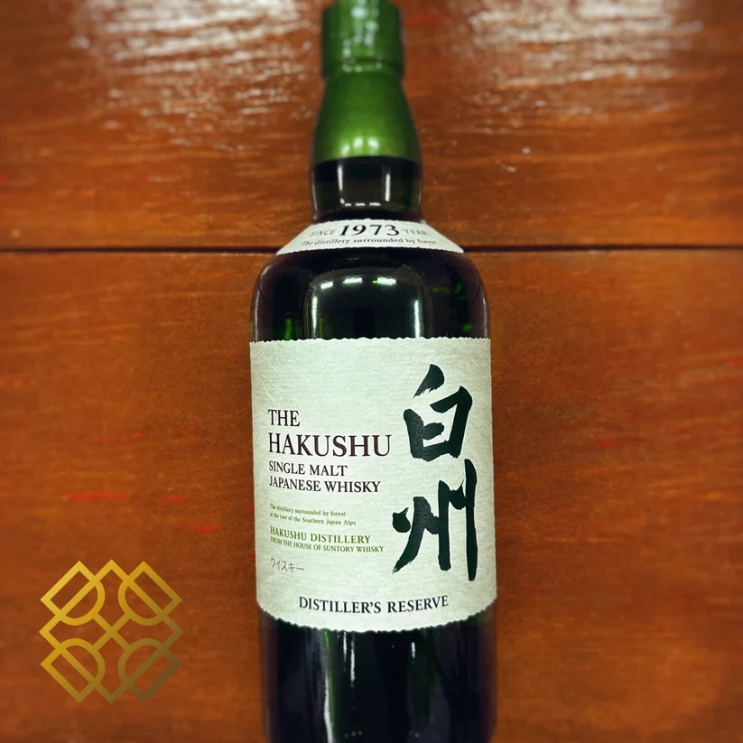
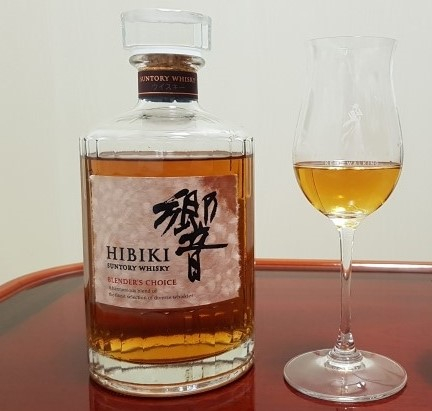
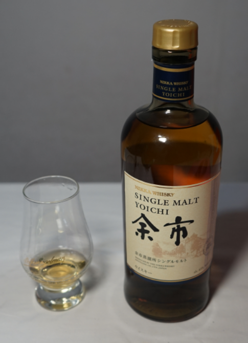

# NAS 위스키 뜻과 장단점, 숙성 연도 미표시의 진실

NAS 위스키 뜻은 숙성 연도 미표시다. **고숙성 원액** 부족 배경과 다채로운 블렌딩 기술, 완성도 높은 풍미의 특징을 총정리한다. 많은 사람은 병에 적힌 '12년', '18년' 같은 숫자를 위스키 품질의 절대적인 기준으로 받아들이지만, 최근 위스키 시장은 숫자보다 **완성된 풍미와 블렌딩 기술**을 중시하는 방향으로 빠르게 변화하고 있다. 그 중심에 있는 개념이 바로 NAS(Non Age Statement)다. NAS는 단순히 숫자를 생략한 마케팅 기법이 아니라 위스키 산업의 공급 구조, 숙성 원액 관리, 소비자 취향 변화가 함께 만들어낸 새로운 생산 전략이다. 따라서 NAS를 이해하려면 숙성 연도 표시 제도와 위스키 숙성의 원리부터 함께 살펴볼 필요가 있다.

## 핵심 요약

* **NAS는 Non Age Statement의 약자로, 숙성 연도를 표시하지 않은 위스키를 의미한다.**
* NAS는 숙성을 하지 않은 술이 아니며, 스카치 위스키라면 법적으로 최소 3년 이상 숙성해야 한다.
* 숙성 연도 대신 다양한 연령의 원액을 자유롭게 블렌딩하여 브랜드가 원하는 풍미를 구현하는 것이 핵심 목적이다.
* NAS의 증가는 고숙성 원액 부족과 세계적인 위스키 수요 증가라는 산업 구조 변화와 밀접하게 연결되어 있다.
* 숙성 연수는 위스키를 이해하는 하나의 기준일 뿐이며, 풍미와 완성도를 절대적으로 보장하는 기준은 아니다.
* 최근에는 엔트리 제품뿐 아니라 최고급 프리미엄 위스키에서도 NAS를 적극적으로 채택하고 있다.

## 1. NAS 위스키의 정의는 무엇일까?

**NAS**는 **Non Age Statement**의 약자로, 우리말로는 **숙성 연도 미표기 위스키**를 의미한다. 여기서 중요한 점은 숙성 기간이 존재하지 않는다는 뜻이 아니라, 병 라벨에 숙성 연수를 적지 않았다는 의미라는 점이다. 따라서 NAS라는 단어만 보고 숙성을 거의 하지 않은 위스키라고 이해하는 것은 잘못된 해석이다.

위스키를 처음 접하는 사람들은 병에 적힌 숫자가 위스키 자체를 의미한다고 생각하는 경우가 많다. 하지만 실제로 숫자는 위스키의 이름이 아니라 숙성 기간을 표시하는 하나의 정보에 불과하다. 즉 숫자가 없는 NAS 역시 일반적인 위스키와 동일한 제조 과정을 거쳐 생산되며, 단지 숙성 연도를 공개하지 않을 뿐이다.

스카치 위스키 규정은 **가장 어린 원액의 숙성 기간**을 기준으로 숙성 연도를 표기하도록 정한다. 예를 들어 다음과 같은 블렌딩이 이루어졌다고 가정해 보자.

| 블렌딩 구성 | 표기 가능한 숙성 연도 |
| --- | --- |
| 12년 + 18년 + 21년 | 12년 |
| 15년 + 18년 + 25년 | 15년 |
| 3년 + 18년 + 30년 | 3년 |
| 11년 + 18년 + 30년 | 11년 |

즉 아무리 오래 숙성된 원액이 대부분을 차지하더라도 가장 어린 원액이 전체 숙성 연도를 결정한다. 이러한 제도 때문에 많은 증류소들은 특정 숫자를 표기하는 대신 **NAS**를 선택한다.

## 2. NAS는 숙성을 하지 않은 위스키일까?

가장 흔한 오해는 NAS가 숙성을 하지 않은 술이라는 생각이다. 그러나 이는 위스키 관련 법규를 살펴보면 쉽게 반박된다.

스카치 위스키는 법적으로 최소 **3년 이상 오크통에서 숙성**되어야만 위스키라는 명칭을 사용할 수 있다. 숙성 기간을 채우지 못하면 스카치 위스키가 아니라 단순한 증류주(Spirit Drink)로 분류된다.

즉 NAS 위스키 역시 다음 조건을 반드시 만족한다.

* 최소 3년 이상 숙성
* 오크통 숙성 완료
* 스카치 위스키 제조 규정 충족
* 일반 연산 위스키와 동일한 법적 기준 적용

NAS는 숙성을 생략한 제품이 아니라 **숙성 연수를 표시하지 않은 제품**일 뿐이다.

또한 실제 NAS 위스키 안에는 다양한 숙성 연도의 원액이 함께 사용된다.

* 3년 원액
* 5년 원액
* 8년 원액
* 12년 원액
* 18년 원액
* 25년 이상 원액

이처럼 매우 폭넓은 연령의 원액을 자유롭게 사용할 수 있다는 점이 NAS의 가장 큰 특징이다.

## 3. 숙성 연수 표기 제도에는 어떤 한계가 있을까?

숙성 연수 표기는 소비자가 제품을 이해하기 쉽게 만든 제도이지만, 실제 위스키의 품질을 그대로 반영한다고 보기는 어렵다.

대표적인 이유는 **가장 어린 원액 기준**이라는 규칙 때문이다.

예를 들어 다음과 같은 블렌딩을 생각해 볼 수 있다.

* 30년 숙성 원액 40%
* 25년 숙성 원액 35%
* 18년 숙성 원액 24%
* 3년 숙성 원액 1%

직관적으로 보면 대부분이 고숙성 원액이지만, 법적으로는 **3년 위스키**가 된다. 극단적으로는 고숙성 원액이 99% 이상이고 어린 원액이 극히 소량 포함되어도 표시 가능한 숫자는 가장 어린 원액의 숙성 기간뿐이다. 이러한 방식은 소비자가 실제 구성과 품질을 정확히 이해하는 데 한계를 만든다.

반대로 숙성 연도가 높다고 반드시 더 뛰어난 위스키가 되는 것도 아니다. 숙성은 시간이 길수록 무조건 좋아지는 선형적인 과정이 아니라, 같은 기간 숙성했더라도 환경에 따라 결과가 크게 달라지는 과정이다. 여기에는 다음과 같은 요소들이 함께 작용한다.

* 증류 방식과 증류기의 구조
* 발효 조건
* 오크통 종류와 크기, 재사용 횟수
* 창고 환경 — 평균 기온, 일교차, 습도, 통풍
* 지역 기후
* 블렌딩 기술

예를 들어 기온이 높은 지역에서는 오크통과 원액의 상호작용이 활발해 숙성이 빠르게 진행되지만, 서늘한 지역에서는 변화 속도는 느려도 섬세한 풍미를 만들어내는 경우가 많다. 같은 증류소 안에서도 창고의 위층과 아래층은 온도와 습도가 달라 숙성 속도가 달라지기도 한다.

12년이라는 숫자는 숙성 시간만 나타낼 뿐, 위스키가 어떤 환경에서 어떤 변화를 거쳤는지는 설명하지 못한다. 이 때문에 최근 위스키 업계에서는 숙성 연수보다 캐스크 품질, 블렌딩 완성도, 풍미의 균형, 브랜드 스타일, 전체적인 마감(Finish)을 더 중요하게 평가하는 경향이 강해지고 있다.

## 4. NAS가 등장한 가장 큰 이유는 무엇일까?

NAS의 등장은 단순한 마케팅 전략이 아니라 **세계 위스키 산업의 구조적 변화**와 직접 연결되어 있다.

1990년대 후반부터 싱글몰트 위스키 시장은 꾸준히 성장하기 시작했고, 2000년대 이후에는 아시아를 중심으로 폭발적인 수요 증가가 이어졌다. 하지만 위스키는 오늘 생산한다고 내일 판매할 수 있는 술이 아니다.

12년 제품을 판매하려면 최소 12년 전에 증류를 시작해야 하고, 18년 제품이라면 거의 20년에 가까운 장기 계획이 필요하다.

문제는 과거의 증류소들이 현재와 같은 수요를 예상하지 못했다는 점이다.

그 결과 나타난 현상은 다음과 같았다.

* 고숙성 원액 부족
* 재고 감소
* 생산량 제한
* 가격 상승
* 인기 제품 품절 증가

이 상황에서 증류소들은 두 가지 선택지 중 하나를 골라야 했다.

첫 번째는 기존 연산 제품의 생산량을 줄이는 방법이다.

두 번째는 다양한 숙성 연도의 원액을 적극 활용할 수 있는 **NAS 체계**를 확대하는 방법이다.

대부분의 증류소는 두 번째 방식을 선택했다. 숙성 연도를 표기하지 않으면 블렌더는 훨씬 넓은 범위의 원액을 활용할 수 있고, 브랜드가 오랫동안 유지해 온 고유한 스타일도 안정적으로 유지할 수 있기 때문이다.

이러한 변화는 NAS가 단순히 숫자를 지운 제품이 아니라, **공급 안정성과 브랜드 품질을 동시에 유지하기 위한 산업적 해법**이라는 점을 보여준다.

## 5. NAS 생산은 어떻게 이루어질까?

NAS 위스키의 핵심은 단순히 숙성 연수를 숨기는 것이 아니라 **블렌딩의 자유를 확보하는 것**이다. 연산 위스키에서는 가장 어린 원액이 전체 숙성 연도를 결정하기 때문에 블렌더가 사용할 수 있는 원액의 범위가 제한된다. 반면 NAS는 이러한 제약이 없어 풍미를 중심으로 원액을 선택할 수 있다.

예를 들어 하나의 NAS 위스키를 만든다고 가정하면 블렌더는 다음과 같은 요소를 동시에 고려한다.

* 숙성 연도
* 캐스크 종류
* 증류소 특성
* 알코올 도수
* 향의 강도
* 질감
* 피니시의 길이

즉 숫자를 맞추는 것이 아니라 **브랜드가 의도한 맛을 재현하는 것**이 최우선 목표가 된다.

오늘날 대형 증류소들은 수천에서 수만 개의 캐스크를 관리하며 각각의 상태를 데이터베이스화한다. 숙성 연도뿐 아니라 오크통 종류, 숙성 위치, 향미 특성까지 지속적으로 기록하고 분석한다. 블렌더는 이러한 데이터를 기반으로 원하는 풍미 프로필에 가장 적합한 원액을 선택한다.

과거에는 오랜 경험과 감각이 중심이었다면, 현대의 NAS 생산은 **감각과 데이터 분석이 결합된 정밀한 블렌딩 기술**로 발전하고 있다.

## 6. 오크통이 숙성보다 더 중요한 이유도 있을까?

많은 사람들이 위스키는 오래 숙성할수록 무조건 좋아진다고 생각하지만, 실제 숙성 과정은 단순히 시간을 기다리는 과정이 아니다. **오크통과의 화학적 상호작용**이 위스키의 풍미를 만든다.

숙성 과정에서는 다양한 변화가 동시에 일어난다.

* 산소와의 산화 반응
* 알코올과 향 성분의 에스테르화
* 목재 성분 추출
* 수분과 알코올 증발
* 향미의 농축

특히 오크통 내부에는 리그닌(Lignin), 헤미셀룰로오스(Hemicellulose), 탄닌(Tannin)과 같은 성분이 존재하는데, 숙성 과정에서 이들이 분해되며 위스키 특유의 향을 만들어 낸다.

대표적인 변화는 다음과 같다.

| 오크통 성분 | 숙성 과정에서 나타나는 특징 |
| --- | --- |
| 리그닌 | 바닐라 향의 주요 성분인 바닐린 생성 |
| 헤미셀룰로오스 | 캐러멜·토피 계열의 단맛 형성 |
| 탄닌 | 구조감과 드라이한 질감 형성 |
| 오크 락톤 | 코코넛·우디 향 생성 |

또한 어떤 오크통을 사용했는지도 매우 중요하다.

| 캐스크 종류 | 대표적인 풍미 |
| --- | --- |
| 버번 캐스크 | 바닐라, 캐러멜, 꿀 |
| 셰리 캐스크 | 건과일, 초콜릿, 향신료 |
| 와인 캐스크 | 붉은 과일, 탄닌 |
| 포트 캐스크 | 베리류, 달콤한 과일 |

NAS 위스키는 숙성 연도보다 이러한 캐스크 조합을 더욱 적극적으로 활용한다. 동일한 8년 숙성 원액이라도 어떤 캐스크를 사용했느냐에 따라 15년 숙성 원액보다 더욱 풍부한 인상을 줄 수도 있다.

최근에는 증류소들이 피니시(Finishing) 공법도 적극 활용한다. 일정 기간 버번 캐스크에서 숙성한 뒤 마지막 수개월에서 수년 동안 셰리 캐스크나 와인 캐스크로 옮겨 숙성하는 방식이다. 이러한 기술은 NAS 위스키가 연수 대신 풍미를 강조하는 대표적인 방법 가운데 하나다.

## 7. 왜 증류소들은 NAS를 적극적으로 선택할까?

오늘날 NAS를 선택하는 이유는 단순히 숙성 원액 부족 때문만은 아니다. 여러 경영적·기술적 이유가 함께 존재한다.

첫 번째는 **블렌딩 자유도**다. 브랜드가 오랫동안 지켜온 스타일을 안정적으로 유지하는 데 도움이 된다.

두 번째는 **수요 대응 능력**이다. NAS는 다양한 숙성 원액을 폭넓게 활용할 수 있어 시장 변화에 비교적 유연하게 대응한다.

세 번째는 **재고 관리 효율성**이다.

대형 증류소는 방대한 수의 캐스크를 운영한다. 연산 제품만 생산하면 특정 숙성 연도의 원액이 부족할 경우 전체 생산 계획이 흔들릴 수 있다. NAS는 다양한 원액을 조합할 수 있으므로 재고 운용이 훨씬 효율적이다.

네 번째는 **가격 경쟁력**이다.

숙성 기간이 길어질수록 천사의 몫(Angel's Share)이라 불리는 자연 증발량이 증가하고 보관 비용도 크게 상승한다. NAS는 이러한 원가 부담을 보다 유연하게 관리할 수 있다.

| NAS를 선택하는 이유 | 기대 효과 |
| --- | --- |
| 블렌딩 자유 확보 | 브랜드 스타일 유지 |
| 다양한 원액 활용 | 공급 안정성 향상 |
| 재고 관리 최적화 | 생산 효율 증가 |
| 가격 경쟁력 확보 | 소비자 선택 폭 확대 |
| 새로운 제품 개발 | 실험적 스타일 구현 |

NAS는 단순히 숫자를 감춘 제품이 아니라, 현대 위스키 산업 구조에 최적화된 생산 방식이라고 볼 수 있다.

## 8. 숫자가 사라지면서 위스키 시장은 어떻게 바뀌었을까?

오랫동안 위스키 시장은 '숙성 연수가 높을수록 좋은 위스키'라는 인식이 지배했다. 12년보다 18년, 18년보다 21년이 더 높은 평가를 받는 구조가 자연스럽게 자리 잡았다.

하지만 NAS의 확산은 이러한 기준 자체를 흔들기 시작했다. 예전에는 소비자가 가장 먼저 확인하는 것이 병에 적힌 숫자였다면, 최근에는 다음과 같은 질문을 먼저 던지는 경우가 많다.

* 어떤 캐스크를 사용했는가
* 어떤 향과 풍미를 목표로 했는가
* 브랜드의 철학은 무엇인가
* 블렌더가 어떤 스타일을 의도했는가
* 어떤 한정 배치(Batch)인가

평가의 축이 시간에서 풍미로 옮겨가고 있는 셈이다. 특히 젊은 소비자들은 숫자보다 시음 경험과 브랜드 스토리를 더 중시하는 경향을 보인다.

증류소들도 이러한 흐름에 맞추어 제품을 소개하는 방식을 바꾸고 있다. 과거에는 12년, 18년, 21년 같은 숫자가 가장 중요한 판매 요소였다면, 최근에는 셰리 캐스크, 버번 캐스크, 피니시 방식, 캐스크 스트렝스, 테이스팅 노트 등을 더욱 적극적으로 강조한다.

이는 단순한 광고 방식의 변화가 아니라, 위스키를 바라보는 문화 자체가 바뀌고 있다는 뜻이다.

## 9. NAS는 마케팅 전략일까, 품질 혁신일까?

NAS를 둘러싼 논쟁은 크게 두 가지 시각으로 나뉜다. 한쪽에서는 숙성 연수를 감추기 위한 **마케팅 전략**이라고 평가하고, 다른 한쪽에서는 블렌딩 기술을 극대화하기 위한 **품질 중심의 생산 방식**이라고 본다. 실제 시장에서는 두 가지 측면이 모두 존재한다.

분명 일부 제품은 화려한 병 디자인과 한정판이라는 희소성을 강조하면서도 원액 구성이나 생산 철학에 대한 정보는 충분히 제공하지 않는 경우가 있다. 소비자는 숙성 연수를 확인할 수 없기 때문에 브랜드 이미지와 마케팅에 더 크게 영향을 받을 가능성이 있다.

반대로 NAS를 적극적으로 활용하는 증류소 가운데는 숫자보다 **풍미 자체를 평가받겠다**는 철학을 분명히 내세우는 곳도 적지 않다. 다양한 캐스크와 숙성 원액을 활용해 특정 스타일을 구현하고, 매년 비슷한 품질을 유지하기 위해 NAS를 선택하는 것이다.

NAS라는 형식만으로 제품의 수준을 판단하기는 어렵다. 중요한 것은 숙성 연수를 공개했는가가 아니라 **어떤 원액을 어떤 의도로 블렌딩했는가**이다.

대표적인 사례로는 다음과 같은 브랜드들이 자주 언급된다.

| 브랜드 | 대표 NAS 제품 | 특징 |
| --- | --- | --- |
| 조니워커 | 블루 라벨, 더블 블랙, 골드 라벨 | 브랜드 스타일 중심의 블렌딩 |
| 맥캘란 | 레어 캐스크, 이니그마 | 셰리 캐스크 풍미 강조 |
| 아드벡 | 우거다일, 코리브레칸 | 강한 피트와 캐스크 개성 |
| 히비키 | 하모니 | 균형감 있는 일본식 블렌딩 |
| 컴퍼스 박스 | 피트 몬스터, 헤도니즘 | NAS 철학을 대표하는 독립 병입 브랜드 |

특히 **컴퍼스 박스(Compass Box)**는 숙성 연수 중심의 평가 문화에 비판적인 입장을 꾸준히 보여온 대표적인 브랜드다. 이들은 숫자가 아니라 블렌딩과 풍미 자체를 중심으로 위스키를 평가해야 한다는 철학을 강조하며 대부분의 제품을 NAS 형태로 출시하고 있다.

## 결론

**NAS 위스키**는 숙성을 하지 않은 술이 아니라, 숙성 연도를 표시하지 않은 위스키를 의미한다. 따라서 NAS라는 이유만으로 품질이 낮다고 판단하는 것은 사실과 다르다. 스카치 위스키는 법적으로 최소 3년 이상의 숙성을 거쳐야 하며, NAS 역시 동일한 제조 기준을 충족한다.

숙성 연수 표기 제도는 소비자에게 이해하기 쉬운 기준을 제공하지만, 가장 어린 원액을 기준으로 표시한다는 특성 때문에 실제 블렌딩 구성과 완성도를 충분히 설명하지 못하는 한계도 가지고 있다. 이러한 구조 속에서 NAS는 **블렌딩의 자유**, **공급 안정성**, **브랜드 스타일 유지**라는 산업적 요구를 해결하는 현실적인 대안으로 발전했다.

오늘날 위스키를 평가하는 기준은 점차 숫자에서 풍미로 이동하고 있다. 캐스크의 종류, 블렌딩 기술, 증류소의 철학, 그리고 전체적인 균형감이 이전보다 훨씬 중요한 요소로 인식된다. 좋은 위스키를 결정하는 것은 병에 적힌 숫자가 아니라, **잔 안에 담긴 완성도와 그것을 만들어낸 기술**이다. NAS의 확산은 단순히 숫자가 사라진 현상이 아니라, 위스키를 바라보는 기준 자체가 변화하고 있음을 보여주는 대표적인 사례라고 할 수 있다.

## 자주 묻는 질문(FAQ)

### NAS 위스키는 법적으로 숙성을 하지 않아도 되나?

아니다. 스카치 위스키라면 최소 3년 이상 오크통에서 숙성해야만 위스키라는 명칭을 사용할 수 있다. NAS는 숙성 연도를 표시하지 않을 뿐 숙성 의무는 동일하다.

### NAS에는 오래 숙성된 원액도 들어갈 수 있나?

가능하다. 제품에 따라 20년 이상 숙성된 원액이나 그 이상의 고숙성 원액이 일부 포함되기도 한다. 다만 숙성 연수를 공개하지 않을 뿐이다.

### 숙성 연수가 높으면 항상 더 좋은 위스키인가?

반드시 그렇지는 않다. 숙성 환경, 오크통의 종류, 블렌딩 기술, 풍미의 균형 등 다양한 요소가 함께 작용하기 때문에 숙성 연수만으로 품질을 단정할 수는 없다.

### 프리미엄 위스키에도 NAS 제품이 많은 이유는 무엇인가?

브랜드가 원하는 풍미를 안정적으로 구현하고 다양한 캐스크를 자유롭게 활용하기 위해서다. 최근에는 최고급 제품에서도 전략적으로 NAS를 채택하는 사례가 꾸준히 증가하고 있다.

### NAS는 앞으로도 계속 늘어날까?

세계적인 위스키 수요가 유지되고 고숙성 원액의 확보가 계속 어려운 상황이라면 NAS 제품은 앞으로도 중요한 시장 축으로 남을 가능성이 높다. 동시에 소비자 역시 숙성 연수보다 브랜드 철학과 풍미를 중시하는 방향으로 변화하고 있어 이러한 흐름은 당분간 이어질 가능성이 크다.