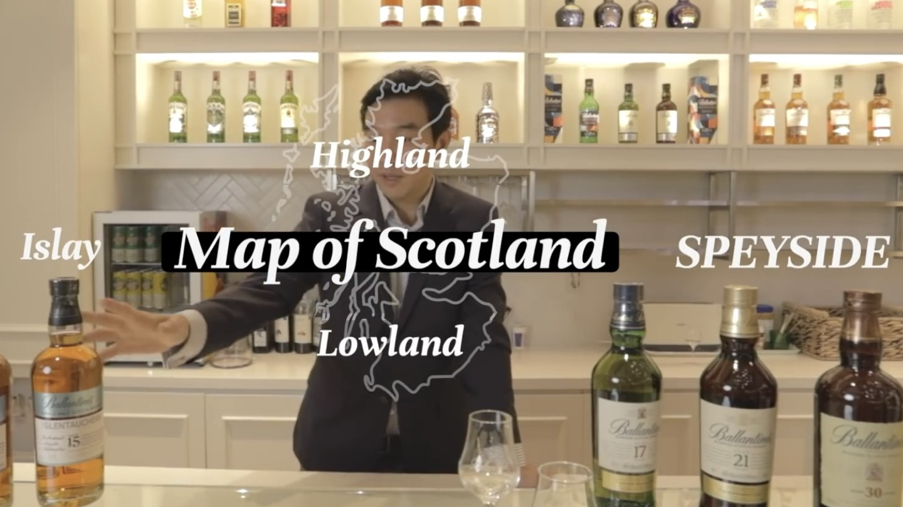
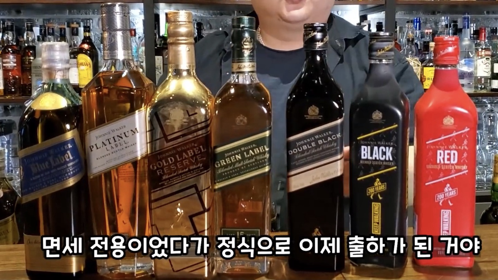
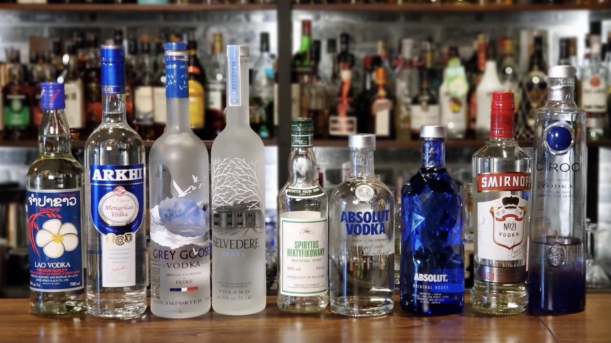

# 위스키 종류 총정리 스카치 버번 아이리시 재패니스

위스키의 기초 지식부터 스카치 위스키의 종류, 주요 생산 지역, 대표 브랜드, 버번·아이리시·재패니스 위스키와 다양한 증류주의 차이까지 한 번에 이해할 수 있도록 체계적으로 정리했어. 처음 위스키를 접하는 사람이라도 술의 기본 개념부터 차근차근 이해할 수 있도록 구성했으며, 단순히 브랜드만 소개하는 것이 아니라 왜 서로 다른 맛과 향을 가지게 되는지까지 함께 설명할게. 위스키는 단순한 술이 아니라 원재료와 증류 기술, 숙성 환경, 그리고 시간이 만들어 내는 결과물이기 때문에 기본 원리를 이해하면 훨씬 재미있게 즐길 수 있어.

## 핵심 요약

* 위스키는 곡물을 발효한 뒤 증류하여 오크통에서 숙성시키는 대표적인 증류주야.
* 스카치 위스키는 법적으로 다섯 가지 종류로 구분되며 제조 방식에 따라 이름이 달라져.
* 싱글몰트가 반드시 최고라는 뜻은 아니며 블렌디드 위스키도 뛰어난 제품이 많아.
* 숙성 연수가 길다고 항상 더 좋은 위스키는 아니야. 원액과 캐스크의 품질도 매우 중요해.
* 스카치 외에도 미국, 아일랜드, 일본 등은 서로 다른 제조 방식과 개성을 발전시켜 왔어.
* 버번은 옥수수를 51% 이상 사용해야 하며 새 오크통에서 숙성해야 해.
* 아이리시 위스키는 일반적으로 3회 증류를 많이 사용해 부드러운 맛으로 알려져 있어.
* 피트 향은 맥아를 이탄(Peat)으로 건조하는 과정에서 만들어지는 독특한 향이야.
* 위스키의 풍미는 원재료보다 숙성에 사용한 오크통의 영향을 크게 받기도 해.
* 위스키를 이해하면 브랜디, 럼, 진, 보드카 등 다른 증류주의 차이도 쉽게 이해할 수 있어.

## 1. 술과 위스키의 기초 지식

술은 크게 **양조주**와 **증류주**로 나눌 수 있어. 인류는 먼저 곡물이나 과일을 발효시켜 술을 만들었고, 이후 발효된 술을 다시 끓여 알코올 농도를 높이는 증류 기술을 개발하면서 다양한 증류주가 탄생했어. 위스키 역시 이러한 증류 기술의 발전 속에서 만들어진 대표적인 술 가운데 하나야.

### 양조주와 증류주의 차이

양조주는 효모가 당분을 발효하면서 자연스럽게 알코올을 만드는 술이야.

대표적인 양조주에는 다음과 같은 종류가 있어.

* 맥주
* 와인
* 막걸리
* 청주
* 사케

반면 증류주는 이미 만들어진 양조주를 증류기로 다시 끓여 알코올만 분리한 술이야.

대표적인 증류주로는 다음이 있어.

* 위스키
* 브랜디
* 럼
* 진
* 보드카
* 테킬라

증류 과정을 거치면 알코올 도수가 높아질 뿐 아니라 불순물이 줄어들고 풍미가 더욱 농축돼.

### 효모란 무엇일까?

효모(酵母)는 술과 빵을 만드는 데 사용되는 미생물이야.

곡물이나 과일 속 당분을 먹고 알코올과 이산화탄소를 만들어 내는데, 술을 만드는 가장 핵심적인 생물이라고 볼 수 있어.

순우리말로는 **뜸팡이**라고 부르기도 해.

### 바(Bar)에서 사용하는 기본 용어

* **1온스(Ounce)** : 약 29.57ml(실무에서는 보통 30ml로 사용)
* **더블(Double)** : 약 60ml
* **하프(Half)** : 약 15ml

위스키를 시음할 때 가장 많이 사용하는 잔은 **글렌캐런(Glencairn)** 잔이야.

입구가 좁고 아래가 넓은 형태라 향을 모아 주기 때문에 세계적으로 가장 많이 사용되는 위스키 전용 잔으로 자리 잡았어.

### 위스키의 어원

오늘날 위스키(Whisky 또는 Whiskey)의 어원은 게일어인 **우스게 바하(Uisge Beatha)**에서 시작됐어.

뜻은 **생명의 물(Water of Life)**이며, 이 표현은 라틴어 **Aqua Vitae**를 게일어로 번역한 것이야.

이후 발음이 점차 변하면서 오늘날의 Whisky라는 이름으로 자리 잡게 되었어.

### 위스키는 어떻게 만들어질까?

많은 사람들이 "위스키는 맥주를 증류한 술"이라고 알고 있지만 엄밀히 말하면 조금 달라.

위스키는 맥주와 매우 비슷한 **워시(Wash)**를 증류해서 만들어.

워시는 맥주와 제조 과정은 거의 같지만 홉(Hop)을 넣지 않기 때문에 맥주와는 구별되는 발효액이야.

위스키는 일반적으로 다음과 같은 과정을 거쳐 만들어져.

1. 맥아 제조(Malting)
2. 당화(Mashing)
3. 발효(Fermentation)
4. 증류(Distillation)
5. 숙성(Maturation)
6. 병입(Bottling)

이 여섯 단계가 위스키의 기본 제조 과정이라고 생각하면 이해하기 쉬워.

### 맥아(Malt)란 무엇일까?

맥아(麥芽)는 보리에 물을 주어 싹을 틔운 발아 보리를 말해.

보리를 그냥 발효시키면 전분을 효모가 사용할 수 없지만, 발아 과정에서 전분을 당으로 바꾸는 효소가 만들어져 위스키 제조가 가능해지는 거야.

그래서 맥아는 싱글몰트 위스키를 만드는 가장 핵심적인 원료라고 할 수 있어.

***

## 2. 위스키 제조 과정

위스키의 풍미는 단순히 오래 숙성했다고 만들어지는 것이 아니야. 원료 선택부터 증류 방식, 숙성 환경까지 모든 과정이 최종 맛에 영향을 준다.

### ① 맥아 제조(Malting)

보리를 물에 담가 싹을 틔운 뒤 건조하는 과정이야. 일부 스카치 위스키는 이때 이탄(Peat)을 태워 맥아를 건조하는데, 이것이 특유의 스모키한 피트 향을 만들어.

### ② 당화(Mashing)

분쇄한 맥아에 뜨거운 물을 넣어 전분을 당으로 바꾸는 과정이야.

### ③ 발효(Fermentation)

효모를 넣어 수십 시간에서 수일 동안 발효시키면 알코올이 생성되고 워시(Wash)가 만들어져.

### ④ 증류(Distillation)

단식 증류기(Pot Still) 또는 연속 증류기(Column Still)를 이용해 알코올을 농축해.

싱글몰트는 대부분 단식 증류기를 사용하며, 그레인 위스키는 연속 증류기를 사용하는 경우가 많아.

### ⑤ 숙성(Maturation)

증류 직후의 위스키는 무색투명하지만 오크통에서 숙성하면서 색과 향을 얻게 돼.

바닐라 향, 카라멜 향, 견과류 향, 스파이스 향 등 대부분은 오크통에서 비롯되는 경우가 많아.

### ⑥ 병입(Bottling)

숙성이 끝난 원액은 희석과 여과를 거친 뒤 병입돼 우리가 마시는 위스키가 되는 거야.  

***

## 3. 스카치 위스키(Scotch Whisky)의 5대 분류

스카치 위스키는 단순히 "스코틀랜드에서 만든 위스키"를 의미하는 것이 아니야. 스코틀랜드 위스키 규정(Scotch Whisky Regulations)에 따라 원료와 제조 방법, 숙성 기간 등을 모두 충족해야만 스카치 위스키라는 이름을 사용할 수 있어. 또한 완성된 제품은 원액의 구성 방식에 따라 다섯 가지로 구분돼.

### ① 싱글 몰트 스카치 위스키 (Single Malt Scotch Whisky)

가장 유명한 스카치 위스키의 종류야.  
'싱글(Single)'은 한 종류의 원료가 아니라 **하나의 증류소**를 의미하고, '몰트(Malt)'는 맥아(발아 보리)만 사용했다는 뜻이야.

* 하나의 증류소에서 생산
* 100% 맥아만 사용
* 단식 증류기(Pot Still) 사용
* 최소 3년 이상 오크통 숙성

증류소의 개성과 철학이 가장 잘 드러나는 종류라 위스키 애호가들에게 특히 인기가 많아.

대표 브랜드

* 더 맥캘란(The Macallan)
* 글렌피딕(Glenfiddich)
* 더 글렌리벳(The Glenlivet)
* 더 발베니(The Balvenie)
* 라프로익(Laphroaig)
* 아드벡(Ardbeg)

### ② 싱글 그레인 스카치 위스키 (Single Grain Scotch Whisky)

이름 때문에 하나의 곡물만 사용한다고 오해하기 쉽지만, 실제 의미는 하나의 증류소에서 생산했다는 뜻이야.

맥아 외에도 옥수수, 밀, 호밀 등 다양한 곡물을 사용할 수 있으며 대부분 연속 증류기(Column Still)를 이용해 생산해.

연속 증류기는 생산 효율이 높고 부드러운 술을 만들기 쉬워 대량 생산에 적합해. 그래서 싱글 그레인 위스키는 단독으로 판매되기보다 블렌디드 위스키의 베이스 원액으로 많이 사용돼.

### ③ 블렌디드 몰트 스카치 위스키 (Blended Malt Scotch Whisky)

둘 이상의 증류소에서 생산한 싱글몰트만 혼합한 위스키야.

그레인 위스키는 전혀 들어가지 않아.

예전에는 **퓨어 몰트(Pure Malt)** 또는 **베티드 몰트(Vatted Malt)**라는 명칭을 사용했지만 현재는 법적으로 **Blended Malt Scotch Whisky**라는 명칭을 사용하고 있어.

대표 브랜드

* 몽키숄더(Monkey Shoulder)
* 조니워커 그린 라벨

### ④ 블렌디드 그레인 스카치 위스키 (Blended Grain Scotch Whisky)

둘 이상의 증류소에서 생산한 그레인 위스키만 혼합한 제품이야.

시장 규모는 매우 작은 편이며 싱글몰트나 블렌디드 스카치보다 접하기 어려워.

### ⑤ 블렌디드 스카치 위스키 (Blended Scotch Whisky)

가장 많이 판매되는 스카치 위스키야.

몰트 위스키와 그레인 위스키를 블렌딩하여 일정한 맛과 향을 유지하는 것이 가장 큰 특징이야.

세계에서 판매되는 스카치 위스키의 대부분은 블렌디드 스카치에 속하며, 균형 잡힌 풍미와 합리적인 가격 덕분에 입문자부터 애호가까지 폭넓게 사랑받고 있어.

대표 브랜드

* 조니워커
* 발렌타인
* 시바스 리갈
* J&B
* 듀어스
* 로얄 살루트

## 4. 스카치 위스키의 주요 생산 지역

스코틀랜드는 지역마다 기후와 물, 전통이 달라 위스키의 개성도 크게 달라져. 물론 최근에는 지역만으로 맛을 단정하기 어려운 경우도 많지만, 입문자라면 아래 특징을 알고 있으면 위스키를 선택하는 데 도움이 돼.

### 스페이사이드(Speyside)

스코틀랜드에서 가장 많은 증류소가 모여 있는 지역이야.

일반적으로

* 사과
* 배
* 꿀
* 바닐라
* 꽃향기

같은 부드럽고 화사한 풍미가 특징이야.

대표 증류소

* 더 맥캘란(The Macallan)
* 글렌피딕(Glenfiddich)
* 더 글렌리벳(The Glenlivet)
* 더 발베니(The Balvenie)
* 글렌그랜트(Glen Grant)
* 글렌버기(Glenburgie)

### 하일랜드(Highlands)

가장 넓은 생산 지역이야.

지역이 넓은 만큼 증류소마다 개성이 매우 다양하지만, 일반적으로 균형 잡힌 바디감과 과일향, 스파이시한 풍미를 갖는 경우가 많아.

대표 증류소

* 글렌모렌지(Glenmorangie)
* 로열 로크나가(Royal Lochnagar)
* 달모어(The Dalmore)
* 오반(Oban)

### 아일레이(Islay)

피트(Peat) 향으로 가장 유명한 지역이야.

맥아를 건조할 때 이탄을 태워 말리기 때문에 강렬한 스모키 향과 해풍의 짠 느낌, 요오드 향이 특징으로 알려져 있어.

처음 마시는 사람에게는 병원 소독약 같은 향으로 느껴질 수도 있지만, 익숙해지면 다른 지역에서는 쉽게 경험할 수 없는 독특한 매력을 느낄 수 있어.

대표 증류소

* 라프로익(Laphroaig)
* 아드벡(Ardbeg)
* 라가불린(Lagavulin)
* 보모어(Bowmore)
* 브룩라디(Bruichladdich)

### 로우랜드(Lowlands)

가볍고 부드러운 스타일이 많아 입문자에게 추천되는 지역 가운데 하나야.

대표 증류소

* 오켄토션(Auchentoshan)
* 글렌킨치(Glenkinchie)

### 캠벨타운(Campbeltown)

과거에는 '세계 위스키의 수도'라고 불릴 정도로 번성했지만 현재는 소수의 증류소만 남아 있어.

생산량은 적지만 독특한 개성 덕분에 애호가들의 인기가 높아.

대표 증류소

* 스프링뱅크(Springbank)
* 글렌스코샤(Glen Scotia)
* 글렌가일(Glengyle)

***

## 5. 주요 블렌디드 위스키 브랜드 라인업

블렌디드 위스키는 여러 원액을 조합해 브랜드가 추구하는 일정한 맛을 만드는 것이 가장 큰 특징이야. 그래서 숙성 연도보다 블렌더의 기술이 더욱 중요하게 평가되기도 해.

### 조니워커 (Johnnie Walker)

세계에서 가장 유명한 블렌디드 위스키 브랜드 가운데 하나야.

* **화이트 라벨** : 과거 생산되다가 단종된 제품이야.
* **레드 라벨** : 현재의 대표적인 NAS(숙성 연도 미표기) 입문 제품이야.
* **블랙 라벨** : 최소 12년 이상 숙성한 원액을 사용한 대표 제품이야.
* **더블 블랙** : 블랙 라벨보다 스모키한 풍미를 강화한 NAS 제품이야.
* **그린 라벨** : 15년 숙성의 블렌디드 몰트 위스키야.
* **골드 라벨 리저브** : 부드럽고 달콤한 스타일의 NAS 제품이야.
* **조니워커 18년** : 과거 Ultimate 18이라는 이름으로도 판매됐어.
* **블루 라벨** : 최고급 원액을 블렌딩한 프리미엄 라인업으로, 숙성 연도는 공개되지 않아.

### 발렌타인 (Ballantine's)

국내에서 가장 인지도가 높은 블렌디드 위스키 가운데 하나야.

'Ballantine's'는 창립자인 조지 발렌타인의 성에서 유래했으며 밸런타인데이와는 관련이 없어.

* 파이니스트
* 12년
* 17년
* 21년
* 23년
* 30년
* 40년

17년은 특히 균형 잡힌 풍미 덕분에 오랫동안 높은 평가를 받아왔으며, 30년 이상 제품은 프리미엄 블렌디드 위스키 시장을 대표하는 라인업으로 꼽혀.

### J&B (Justerini & Brooks)

가볍고 부드러운 스타일이 특징인 블렌디드 위스키야.

* J&B Rare
* J&B Jet
* J&B Reserve

특히 J&B Rare는 세계적으로도 오랫동안 높은 판매량을 유지한 스탠다드 제품으로 유명해.

### 시바스 리갈(Chivas Regal)

부드럽고 달콤한 스타일의 블렌디드 위스키를 대표하는 브랜드야.

대표 라인업은

* 12년
* 15년
* 18년
* 25년

등이 있으며, 입문자도 부담 없이 즐기기 좋은 스타일로 평가받아.

### 로얄 살루트(Royal Salute)

1953년 영국 여왕 엘리자베스 2세의 대관식을 기념하기 위해 탄생한 프리미엄 블렌디드 위스키 브랜드야.

대표 제품은

* 21년
* 38년
* 62건 살루트

등이 있으며 블렌디드 위스키의 최고급 라인업 가운데 하나로 평가받고 있어.  

***

## 미국, 아일랜드, 일본 위스키의 특징

위스키는 스코틀랜드에서 시작해 세계 여러 나라로 퍼져 나가며 각 지역의 문화와 법규에 맞춰 독자적인 발전을 이루었어. 특히 미국, 아일랜드, 일본은 스카치와는 다른 개성을 가진 위스키를 생산하는 대표적인 국가야.

### 버번 위스키(Bourbon Whiskey)

버번은 미국을 대표하는 위스키야.

많은 사람이 켄터키에서 생산해야만 버번이라고 생각하지만, 실제로는 미국 어디에서든 법적 기준을 충족하면 버번이라 부를 수 있어. 다만 켄터키가 가장 큰 생산지이기 때문에 버번의 고향처럼 알려져 있어.

버번의 주요 기준은 다음과 같아.

* 미국에서 생산
* 옥수수(Corn) 51% 이상 사용
* 새롭게 제작한 불에 그을린 오크통(New Charred Oak Barrel)에서 숙성
* 증류 및 병입 기준을 충족해야 함

대표 브랜드

* 짐 빔(Jim Beam)
* 메이커스 마크(Maker's Mark)
* 와일드 터키(Wild Turkey)
* 에반 윌리엄스(Evan Williams)
* 우드포드 리저브(Woodford Reserve)

버번은 바닐라, 캐러멜, 꿀, 오크 향이 강한 편이며 달콤한 풍미가 특징이야.

### 테네시 위스키(Tennessee Whiskey)

테네시 위스키는 제조 과정이 버번과 거의 같지만 중요한 차이가 하나 있어.

증류 후 숙성하기 전에 사탕단풍나무(Charcoal) 숯을 이용해 여과하는 **링컨 카운티 프로세스(Lincoln County Process)**를 거쳐.

이 과정 덕분에 버번보다 부드럽고 깔끔한 맛을 가지는 경우가 많아.

대표 브랜드

* 잭 다니엘스(Jack Daniel's)
* 조지 디켈(George Dickel)

### 아이리시 위스키(Irish Whiskey)

아일랜드는 스코틀랜드와 함께 위스키의 기원을 이야기할 때 빠지지 않는 나라야.

일반적으로 3회 증류를 하는 경우가 많아 부드럽고 깔끔한 맛을 가진 것으로 알려져 있지만, 모든 아이리시 위스키가 반드시 3회 증류를 하는 것은 아니야.

대표 브랜드

* 제임슨(Jameson)
* 레드브레스트(Redbreast)
* 부시밀스(Bushmills)
* 틸링(Teeling)

입문자가 마시기에도 부담이 적은 스타일이라 처음 위스키를 접하는 사람에게 자주 추천돼.

### 재패니스 위스키(Japanese Whisky)

일본은 스코틀랜드의 제조 기술을 적극적으로 연구해 독자적인 위스키 문화를 발전시켰어.

특히 산토리와 니카가 일본 위스키를 세계적인 수준으로 성장시키는 데 큰 역할을 했어.

대표 브랜드

* 야마자키(Yamazaki)
* 하쿠슈(Hakushu)
* 히비키(Hibiki)
* 가쿠빈(Kakubin)
* 요이치(Yoichi)
* 미야기쿄(Miyagikyo)

최근에는 생산량보다 수요가 훨씬 많아져 일부 고숙성 제품은 세계적으로 높은 프리미엄이 형성되고 있어.

***

## 6. 위스키 숙성과 캐스크의 역할

많은 사람들이 위스키의 맛은 증류 기술에서 결정된다고 생각하지만 실제로는 숙성이 차지하는 비중도 매우 커.

무색투명한 증류 원액은 오크통 안에서 수년 동안 숙성되면서 색과 향, 질감이 모두 달라져.

### 버번 캐스크

가장 많이 사용하는 오크통이야.

바닐라, 카라멜, 꿀, 코코넛, 같은 달콤한 풍미를 만들어 주는 경우가 많아.

### 셰리 캐스크

스페인 셰리 와인을 담았던 오크통이야.  
건포도, 무화과, 다크초콜릿, 견과류 같은 진한 풍미를 만들어. 맥캘란이 대표적으로 셰리 캐스크를 적극 활용하는 증류소야.

### 와인 캐스크

레드와인이나 포트와인 등을 숙성했던 오크통을 사용하는 방식이야.  
과일향과 달콤함을 더해 주며 최근 다양한 증류소에서 적극적으로 활용하고 있어.

## 7. 숙성 연수와 NAS는 무엇이 다를까?

위스키 병에는 12년, 18년처럼 숙성 연도가 적혀 있는 경우가 있고 아무런 숫자가 없는 경우도 있어.

### 숙성 연수가 표시된 위스키

12년이라고 적혀 있다면 병 안에 들어 있는 원액 가운데 가장 어린 원액이 최소 12년 이상 숙성되었다는 의미야.

20년이나 30년 원액이 함께 들어 있을 수도 있지만 가장 어린 원액이 기준이 돼.

### NAS(No Age Statement)

NAS는 숙성 연도를 표시하지 않는 위스키를 말해.

숙성 기간이 짧아서가 아니라 블렌더가 원하는 맛을 만들기 위해 여러 연령의 원액을 자유롭게 사용하기 위해 선택하는 경우도 많아.

대표적인 NAS 제품

* 조니워커 레드 라벨
* 조니워커 더블 블랙
* 골드 라벨 리저브
* 맥캘란 클래식 컷
* 아드벡 우거다일

최근에는 숙성 연도보다 브랜드가 추구하는 맛을 중시하는 흐름이 강해지면서 NAS 제품도 꾸준히 늘어나고 있어.

## 8. 위스키는 어떻게 마시는 것이 좋을까?

위스키를 즐기는 방법에는 정답이 없어.  
같은 위스키라도 마시는 방법에 따라 향과 맛이 크게 달라질 수 있어.

### 스트레이트

가장 기본적인 방법이야. 위스키 본연의 향과 질감을 그대로 느낄 수 있어.

### 니트(Neat)

얼음이나 물을 넣지 않은 순수한 위스키를 의미해. 국내에서는 스트레이트와 거의 같은 의미로 사용하는 경우가 많아.

### 온 더 록(On the Rocks)

얼음을 넣어 천천히 마시는 방식이야. 시간이 지나면서 물이 조금씩 섞여 향이 부드럽게 열리는 장점이 있어.

### 트와이스 업(Twice Up)

위스키와 물을 1:1 정도로 섞는 방법이야. 향을 더욱 쉽게 느낄 수 있어 시음회에서도 자주 사용돼.

### 하이볼(Highball)

위스키에 탄산수를 섞어 마시는 방식이야. 최근 가장 대중적인 음용법 가운데 하나이며 음식과 함께 즐기기에도 좋아.

## 9. 기타 세계의 대표적인 증류주

위스키 외에도 세계에는 다양한 증류주가 존재해. 원재료와 제조 방식에 따라 전혀 다른 향과 맛을 만들어 내며 각 나라를 대표하는 술로 자리 잡고 있어.

### 브랜디와 코냑(Cognac)

브랜디는 과실주를 증류해서 만든 술이야. 대부분 포도주를 사용하지만 사과나 배 등 다른 과일로 만드는 브랜디도 있어. '코냑(Cognac)'은 프랑스 코냑 지역에서 규정을 충족해 생산한 브랜디만 사용할 수 있는 명칭이야.

대표적인 숙성 등급

* VS
* VSOP
* XO
* Hors d'Age

### 보드카(Vodka)

곡물이나 감자를 증류한 뒤 여러 차례 여과해 만드는 술이야.

맑고 깨끗한 맛이 특징이며 칵테일의 베이스로 가장 많이 사용돼.

대표 브랜드

* 앱솔루트
* 그레이 구스
* 벨베디어

### 진(Gin)

중성 증류주에 주니퍼베리와 여러 식물을 넣어 향을 입힌 술이야.  
칵테일 문화에서 가장 중요한 증류주 가운데 하나야.

### 럼(Rum)

사탕수수 즙이나 당밀을 발효하고 증류해서 만드는 술이야.  
카리브해 지역을 대표하는 증류주이며 달콤하고 묵직한 풍미를 가진 제품이 많아.

### 테킬라(Tequila)

멕시코 지정 지역에서 블루 아가베를 원료로 생산한 증류주만 테킬라라는 이름을 사용할 수 있어.  
최근에는 프리미엄 테킬라도 꾸준히 증가하고 있어.

### 샴페인(Champagne)

샴페인은 증류주가 아니라 스파클링 와인이야.  
프랑스 상파뉴 지방에서 엄격한 규정을 지켜 생산한 제품만 샴페인이라는 이름을 사용할 수 있어.  

***

## 10.글로벌 위스키 판매 규모

위스키 시장은 프리미엄 제품만 성장하는 것이 아니라 대중적인 제품도 매우 큰 규모를 형성하고 있어. 특히 미국 버번과 일본 블렌디드 위스키는 자국 시장의 소비량이 매우 크며, 스카치 위스키는 세계 수출 시장에서 가장 높은 영향력을 유지하고 있어.

아래 판매량은 대표적인 글로벌 브랜드의 연간 판매 규모를 기준으로 정리한 것으로, 시기에 따라 수치는 달라질 수 있어.

| 브랜드 | 국가 및 종류 | 연간 판매 규모(대략) |
| *** | *** | ***: |
| 메이커스 마크 | 미국 버번 | 220만 상자 |
| 산토리 토리스 | 일본 블렌디드 | 230만 상자 |
| 에반 윌리엄스 | 미국 버번 | 260만 상자 |
| 시그램즈7 | 캐나다 블렌디드 | 270만 상자 |
| 블랙 닛카 | 일본 블렌디드 | 320만 상자 |
| 산토리 가쿠빈 | 일본 블렌디드 | 500만 상자 |
| 크라운 로열 | 캐나다 블렌디드 | 730만 상자 |
| 제임슨 | 아이리시 위스키 | 750만 상자 |
| 짐 빔 | 미국 버번 | 970만 상자 |
| 잭 다니엘스 | 테네시 위스키 | 1,330만 상자 |

판매량이 많다고 반드시 최고의 품질을 의미하는 것은 아니야. 가격, 접근성, 국가별 소비 문화가 모두 판매량에 영향을 미치기 때문이야. 반대로 생산량이 적은 싱글몰트 가운데 세계적으로 높은 평가를 받는 제품도 매우 많아.

## 11. 위스키를 처음 시작한다면 어떤 종류부터 마시면 좋을까?

처음부터 피트 향이 강한 위스키를 선택하면 부담스럽게 느껴질 수 있어. 입문 단계에서는 비교적 부드럽고 균형 잡힌 스타일부터 경험하는 것이 좋아.

추천 순서는 다음과 같아.

1. 글렌피딕 12년
2. 글렌리벳 12년
3. 발렌타인 12년
4. 조니워커 블랙 라벨
5. 제임슨
6. 버팔로 트레이스 또는 메이커스 마크
7. 아드벡 10년이나 라프로익 10년(피트 입문)

다양한 스타일을 경험해 보면 자신이 과일향을 좋아하는지, 스모키한 풍미를 좋아하는지 자연스럽게 알게 돼.

## 결론

위스키는 단순히 도수가 높은 술이 아니라 곡물과 효모, 증류 기술, 오크통, 그리고 시간이 함께 만들어 내는 문화이자 결과물이야.

스카치, 버번, 아이리시, 재패니스 위스키는 모두 같은 출발점에서 시작했지만 각 나라의 역사와 환경, 제조 방식에 따라 서로 다른 개성을 발전시켜 왔어.

또한 위스키를 이해하면 브랜디, 럼, 진, 보드카, 테킬라처럼 다른 증류주의 차이도 자연스럽게 이해할 수 있게 돼.

원재료의 특성과 증류의 깔끔함, 오크통 숙성이 더해져 만들어지는 깊은 풍미는 위스키만의 가장 큰 매력이야. 그래서 위스키는 지금도 전 세계에서 가장 사랑받는 증류주 가운데 하나이며, 마실수록 새로운 향과 맛을 발견할 수 있는 가장 탐구할 가치가 있는 술이라고 할 수 있어.  

## 자주 묻는 질문(FAQ)

### 위스키와 브랜디는 무엇이 다를까?

위스키는 곡물을 발효해 증류한 술이고, 브랜디는 과실주를 증류한 술이야. 가장 큰 차이는 원재료이며, 이 차이가 향과 맛에도 큰 영향을 줘.

### 스카치 위스키는 왜 세계적으로 유명할까?

수백 년 동안 이어진 제조 전통과 엄격한 법적 기준, 다양한 생산 지역이 만들어 내는 풍미 덕분이야. 오늘날에도 세계 위스키 시장에서 가장 큰 영향력을 가진 분야 가운데 하나야.

### 싱글몰트가 블렌디드보다 항상 좋은 위스키일까?

아니야. 싱글몰트는 하나의 증류소 개성을 보여 주는 스타일이고, 블렌디드는 여러 원액을 조화롭게 섞어 균형을 추구하는 스타일이야. 어느 쪽이 더 뛰어나다기보다 취향의 차이에 가까워.

### 숙성 연수가 길수록 무조건 좋은 위스키일까?

반드시 그렇지는 않아. 원액의 품질과 오크통 관리, 숙성 환경도 매우 중요해. 12년 위스키가 어떤 21년 위스키보다 좋은 평가를 받는 사례도 많아.

### NAS 위스키는 품질이 낮은 제품일까?

아니야. NAS(No Age Statement)는 숙성 연도를 표시하지 않는다는 뜻일 뿐이야. 원하는 맛을 만들기 위해 여러 연령의 원액을 사용하는 경우도 많아.

### 피트(Peat) 향은 왜 생기는 걸까?

맥아를 건조할 때 이탄(Peat)을 태우면서 발생한 연기가 맥아에 스며들기 때문이야. 아일레이 지역 위스키에서 특히 강하게 느낄 수 있어.

### 위스키는 개봉하면 오래 보관할 수 있을까?

밀봉 상태에서는 매우 오래 보관할 수 있어. 다만 개봉 후에는 공기와 접촉하면서 향이 조금씩 변하기 때문에 직사광선을 피하고 세워서 보관하는 것이 좋아.

### 위스키는 냉장 보관해야 할까?

아니야. 일반적으로 상온 보관이 가장 적합해. 너무 낮은 온도에서는 향을 충분히 느끼기 어려울 수도 있어.

### 위스키는 얼음을 넣어 마시면 안 될까?

전혀 아니야. 스트레이트, 니트, 온더록, 하이볼 모두 올바른 음용 방법이야. 자신의 취향에 맞게 즐기는 것이 가장 중요해.

### 위스키의 색은 모두 숙성에서 생기는 걸까?

대부분은 오크통 숙성 과정에서 만들어지지만, 일부 제품은 법적으로 허용된 카라멜 색소(E150a)를 사용해 색을 일정하게 유지하기도 해.

### 스카치와 버번은 가장 큰 차이가 무엇일까?

스카치는 주로 맥아를 중심으로 생산되고, 버번은 옥수수를 51% 이상 사용해야 해. 또한 버번은 새 오크통을 사용해야 한다는 점도 큰 차이야.

### 위스키 가격은 왜 이렇게 차이가 클까?

숙성 기간, 생산량, 희소성, 캐스크 종류, 브랜드 가치, 한정판 여부 등이 모두 가격에 영향을 줘. 오래 숙성한 제품일수록 증발량이 늘어나 생산 비용도 크게 증가해.