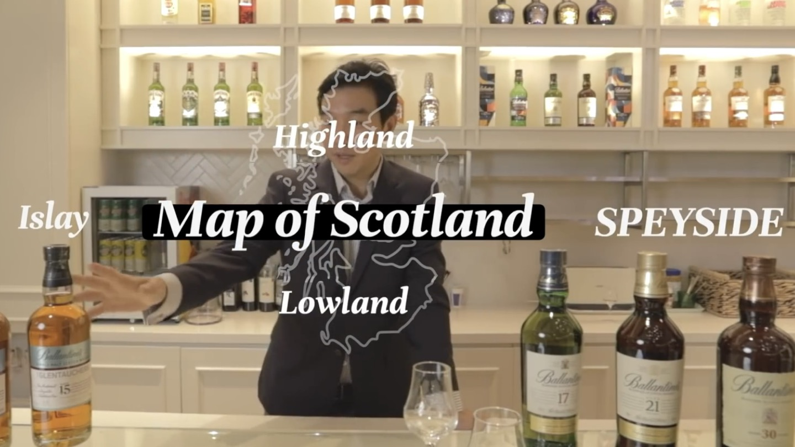
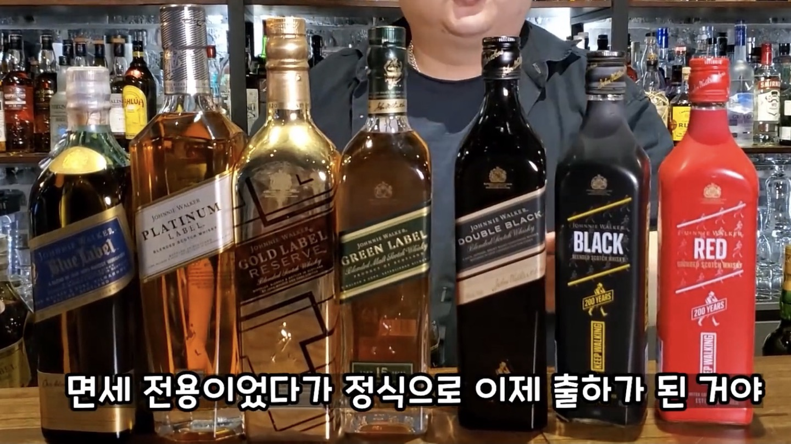
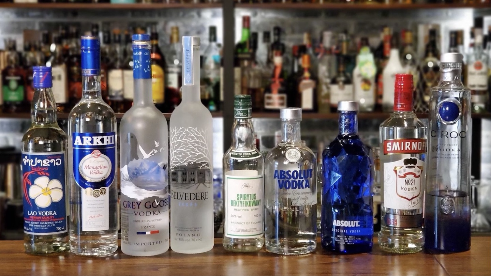

# 위스키와 증류주의 세계: 인류가 빚어낸 근본(根本)의 미학

인류의 역사와 함께해 온 술은 발효를 통해 만드는 **양조주**에서 시작하여, 이를 다시 끓여 순도를 높인 **증류주**에 이르러 그 정점을 맞이해. 그중에서도 위스키(Whisky)는 보리와 곡물, 그리고 오크통 숙성이라는 시간의 예술이 결합한 가장 근본적인 증류주로 손꼽혀. 이 문서는 위스키의 기초 지식부터 세계 각국의 위스키, 그리고 다양한 증류주의 종류를 체계적으로 분류해서 설명할게.

---

## 1. 술과 위스키의 기초 지식

### 양조주와 효모

* **양조주**: 효모가 원재료(과일, 곡물 등)에 포함된 당분을 발효시켜 만든 술이야. 대표적으로 와인, 막걸리, 맥주 등이 있어.
* **효모(酵母)**: 술이나 빵을 만들 때 발효를 담당하는 미생물인데, 순우리말로 **뜸팡이**라고도 불러.

### 바(Bar)에서 쓰이는 단위 및 기물

* **1온스(Ounce)**: 약 **30ml**(정확히는 29.57353ml)를 의미해. (39ml 표기는 오류야).
* **더블(Double)**: 60ml.
* **하프(Half)**: 15ml.
* **글렌캐런(Glencairn)**: 위스키의 향을 모아주기 위해 고안된 대표적인 위스키 전용 시음 잔이야.

### 위스키의 어원과 기원

* 로마, 그리스, 프랑스 등 남유럽과 지중해 연안은 **와인**이 발달했고, 독일과 이집트 등지는 **맥주**가 발달했어.
* 스코틀랜드와 아일랜드 지역의 켈트족은 게일어로 '생명의 물'을 뜻하는 우스게 바하(Uisge Beatha)라고 불렀으며, 이 단어가 오늘날의 위스키(Whisky)가 되었어.
* **맥아(麥芽, Malt)**: 보리에 물을 주어 싹을 틔운 것(발아 보리)을 말하며, 위스키 제조의 핵심 원료야.

---

## 2. 스카치 위스키(Scotch Whisky)의 5대 분류

스코틀랜드 규정에 따른 스카치 위스키는 5가지 종류로 나뉘어. 모든 몰트 위스키는 보리로 만든 양조주(워시)를 단식 증류기에서 2번 이상 증류하여 원액을 만든 뒤, 오크통에서 숙성하며 고유의 색과 풍미를 갖추게 돼.

### ① 싱글 몰트 스카치 위스키 (Single Malt Scotch Whisky)
* **정의**: 단 **한 곳의 증류소**에서 100% 맥아(발아 보리)만 써서 단식 증류기로 증류한 위스키야.

### ② 싱글 그레인 스카치 위스키 (Single Grain Scotch Whisky)

* **정의**: 단 한 곳의 증류소에서 맥아 외의 곡물(옥수수, 밀, 호밀 등)을 주원료로 연속 증류기(코페이 증류기 등)를 써서 증류한 위스키야.
* 연속 증류기는 대량 생산이 가능하지만 개성이 부족해서, 주로 블렌디드 위스키의 베이스로 쓰여. (보리를 연속 증류해도 몰트가 아닌 그레인 위스키로 분류돼).

### ③ 블렌디드 몰트 스카치 위스키 (Blended Malt Scotch Whisky)

* **정의**: 서로 다른 증류소의 싱글 몰트 위스키들만 섞은 위스키야. 그레인 위스키는 들어가지 않아.
* **과거 명칭**: 예전에는 **퓨어 몰트(Pure Malt)** 또는 베티드 몰트(Vatted Malt)라고 불렀어.

### ④ 블렌디드 그레인 스카치 위스키 (Blended Grain Scotch Whisky)

* **정의**: 서로 다른 증류소에서 생산된 그레인 위스키들만 혼합한 위스키야.

### ⑤ 블렌디드 스카치 위스키 (Blended Scotch Whisky)

* **정의**: 몰트 위스키 원액(40~50%)과 그레인 위스키 원액(50~60%)을 혼합한 위스키야.
* 우리가 마시는 스카치 위스키 대부분(약 90%)이 이 타입이지. 조니워커, 발렌타인, J&B, 시바스 리갈, 로얄 살루트가 대표적이야.

---

## 3. 스카치 위스키 주요 생산 지역 및 브랜드 특징

### 스페이사이드(Speyside) 지역 (과일향, 플로랄한 특징)

* **더 맥캘란(The Macallan)**: 12년 셰리오크가 대표적이며 바닐라 향과 오크 스파이시함이 특징이야.
* **글렌피딕(Glenfiddich)**: 12년, 15년(솔레라 시스템 숙성)이 유명해.
* **더 발베니(The Balvenie)**: '더블우드 12년', '포트우드 21년', 면세점 전용 '마데이라 캐스크 21년' 등이 있어.
* **더 글렌리벳(The Glenlivet)**: 꽃향기가 특징이고, 시바스 리갈과 로얄 살루트의 핵심 원액으로 쓰여.
* **기타**: 글렌그랜트, 글렌모렌지, 글렌버기 등이 있어.

### 아일레이(Islay) 지역 (피트향)

* 이탄(Peat)으로 맥아를 건조해 병원 소독약 같은 스모키함과 강렬한 피트향이 나는 지역이야.

### 기타 주요 증류소

* **로열 로크나가(Royal Lochnagar)**: 윈저의 핵심 원액을 공급하는 하일랜드 증류소야.

---

## 4. 주요 블렌디드 위스키 브랜드 라인업

### 4-1. 조니워커 (Johnnie Walker)

* **화이트 라벨**: 1차 세계대전 당시 단종됐어.
* **레드 라벨**: 과거 10년 숙성 표기였지만 현재는 NAS(숙성 연도 미표기) 제품이야.
* **블랙 라벨**: 12년 숙성의 스탠다드 제품이야.
* **더블 블랙**: 블랙 라벨보다 스모키함을 강조한 NAS 제품이야.
* **그린 라벨**: 15년 숙성이고 조니워커 중 유일한 블렌디드 몰트 위스키야.
* **골드 라벨**: 과거 VIP 전용에서 현재는 NAS인 '골드 라벨 리저브'가 됐어.
* **18년**: 현재 '조니워커 18년(Ultimate 18)'으로 이름이 정리됐어.
* **블루 라벨**: 15년에서 60년 숙성된 원액을 블렌딩한 프리미엄 NAS 위스키야.

### 4-2. 발렌타인 (Ballantine's)

창립자 성에서 유래한 이름으로 밸런타인데이와는 관련이 없어.  

* **파이니스트**: NAS(6년 추정) 제품이야.
* **12년**: 바에서 자주 쓰이는 부드러운 스탠다드 제품이야.
* **15년 싱글몰트**: 핵심 원액을 싱글몰트로 독립 출시한 제품이야.
* **17년**: 한국에서 가장 인지도가 높은 제품이야.
* **21년**: 17년보다 더 부드럽고 원숙한 풍미가 특징이야.
* **리미티드**: NAS(20년 추정) 제품이야.
* **23년**: 면세점 전용 라인업이야.
* **30년**: 최고급 블렌디드 위스키로 면세점 구매를 추천해.
* **40년**: 연간 100병만 한정 생산되는 마스터피스야.

### 4-3. J&B (Justerini & Brooks)

* **J&B RARE**: 세계적으로 판매량이 높은 스탠다드 제품이야.
* **상위 라인업**: J&B JET(12년), J&B RESERVE(15년)가 있어.

### 4-4. 시바스 브라더스 제품군

* **시바스 리갈**: 12, 18, 25년 라인업이 있고 온더락으로 마시기 좋아.
* **로얄 살루트**: 21, 38년 등 프리미엄 라인인데, 애호가들은 싱글몰트를 더 추천하기도 해.

---

## 5. 아메리칸, 아이리시, 재패니스 위스키

* **버번 위스키**: 미국 켄터키 중심. 옥수수 51% 이상, 불로 태운 새 오크통에서 숙성해. 짐빔이 유명해.
* **테네시 위스키**: 버번 공정에 사탕단풍나무 숯 여과를 거친 술이야. 잭 다니엘스가 대표적이고 더 부드러워.
* **아이리시 위스키**: 3회 증류하여 깔끔해. 제임슨이 유명해.
* **재패니스 위스키**: 산토리(야마자키, 하쿠슈, 히비키, 가쿠빈 등)와 니카 등이 있고 고숙성 라인업은 인기가 엄청나.

---

## 6. 기타 세계의 증류주

* **브랜디와 꼬냑**: 포도주를 증류한 거야. 프랑스 꼬냑 지방산만 '꼬냑'이라 불러. 등급은 VS(2년), VSOP(4년), 나폴레옹, XO(10년 이상), 오다쥬 순으로 나뉘어.
* **테킬라**: 멕시코 지정 지역에서 블루 아가베로 만든 것만 인정해.
* **보드카**: 숯 필터로 여과해 무색, 무취, 무미한 술이야. 그레이 구스, 벨베디어, 앱솔루트 등이 있어.
* **진**: 증류주에 주니퍼 베리 등 보태니컬 향을 입힌 거야.
* **럼**: 사탕수수 즙이나 당밀을 발효해 만든 술이야.
* **샴페인**: 프랑스 상파뉴 지방에서 규정을 지켜 만든 스파클링 와인만 이렇게 불러.

---

## 7. 글로벌 위스키 판매 규모

| 브랜드명 | 국가 및 종류 | 판매 규모 특이사항 |
| --- | --- | --- |
| 메이커즈 마크 | 미국 버번 | 220만 상자 |
| 산토리 토리스 | 일본 블렌디드 | 230만 상자 |
| 에반 윌리엄즈 | 미국 버번 | 260만 상자 |
| 시그램즈 7 | 캐나다 블렌디드 | 270만 상자 |
| 블랙 닛카 | 일본 블렌디드 | 320만 상자 |
| 산토리 가쿠빈 | 일본 블렌디드 | 500만 상자 |
| 크라운 로열 | 캐나다 블렌디드 | 730만 상자 |
| 제임슨 | 아일랜드 아이리시 | 750만 상자 |
| 짐 빔 | 미국 버번 | 970만 상자 |
| 잭 다니엘스 | 미국 테네시 | 1,330만 상자 |

---

## 결론: 위스키, 증류 기술의 근본

인류가 발견한 양조주를 거쳐 증류주가 탄생했고, 그중 위스키는 맥주를 증류해 오크통 안에서 시간의 흐름만으로 완성된 술이야.  
***원재료인 곡물의 고소함과 증류의 깔끔함, 나무의 풍미가 어우러져 위스키는 인류 역사상 가장 고유한 개성과 근본을 지닌 술로 자리 잡았어.***